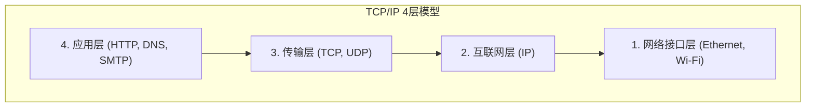

## 1. 跨越巴别塔：计算机之间的对话

1970年代的计算机世界，是巨大的大型机（大型计算机）争夺霸权的时代。IBM、DEC、富士通等各家制造商都各自开发了独特的通信规则（协议）来连接自家的计算机。

然而，这种状况就像是“IBM的计算机只会说英语，而DEC的计算机只会说法语”一样。将不同制造商的计算机连接起来并进行数据交换在技术上极其困难。就像因语言不通而崩塌的“巴别塔”一样，计算机网络被制造商之间的壁垒所割裂。

为了打破这层壁垒，让全世界所有的计算机都能用共通的语言进行对话，作为“世界标准的翻译规则”应运而生的正是 **TCP/IP (Transmission Control Protocol / Internet Protocol)** 。

## 2. ARPANET与冷战时代的思想

TCP/IP的起源可以追溯到美国国防部高级研究计划局（ARPA）构建的 “ **ARPANET** ” 。
当时正值冷战的最高潮。作为军事上的要求，需要一种“即使遭受核打击导致通信网的一部分被破坏，整个网络也不会瘫痪，能够迂回继续进行通信的网络”。

对此的回答就是 “ **分组交换技术** ” 。
它不再像传统的电话网（电路交换技术）那样，用一条专用线独占A点到B点，而是将数据分割成被称为“数据包”的细小包裹，在每个包裹上写明目的地并将其投入网络的网状结构中。即使途中的路由器（交叉路口）损坏，数据包也会自动寻找其他道路奔向终点。

在这个分组交换网络上，为了确保数据能够切实送达而作为软件层面的规则，由文顿·瑟夫和罗伯特·卡恩设计的正是 TCP 和 IP。

## 3. TCP/IP的层次模型：分割复杂性

TCP/IP的精妙之处在于，它将“通信”这个极其复杂的处理过程分割为了 “ **4个层次（Layer）** ” ，并让各自的作用完全独立。这被称为TCP/IP层次模型。

上层不需要知道下层“具体是如何开展工作的”。

1. **网络接口层** ：使用物理线缆或 Wi-Fi 电波，总之就是负责将“0和1的电信号”传递给相邻设备的层。
2. **互联网层 (IP)** ：负责查看 IP 地址（住址），从全世界的网络中找出通往最终目的地的路线（路径）并运送数据包的层。
3. **传输层 (TCP)** ：负责对收到的数据包重新排序，或者要求重新发送丢失的数据包，从而保证数据的“准确性”的层。
4. **应用层** ：负责决定适合具体用途的数据格式，如 Web 浏览器 (HTTP) 和电子邮件 (SMTP) 等。

得益于这种层次结构，即使底层的技术从“有线LAN”进化到“光纤”或是“5G智能手机”，上层的软件（浏览器或应用）也完全不需要重写代码即可照常运行。

## 4. 为什么OSI参考模型失败了？

事实上在1980年代，一个名为国际标准化组织 (ISO) 的官方国际机构，正试图在国家层面上推进一套与 TCP/IP 不同的通信协议标准的制定，这是一套极其严谨而优美的 “ **OSI参考模型（7层模型）** ” 。

然而，直接说结论，OSI 协议并未在市场上普及，TCP/IP 赢得了最终的胜利。
原因很明确。因为 OSI 是一套“由学者在会议室里创造出来的，由于过于完美而显得复杂繁重的规范”；相对地，TCP/IP 则是 “ **已经被一线的工程师们实际运行，并在实用性上得到证明，简单而轻量的规范** ” 。

TCP/IP 被作为标准内置于加州大学伯克利分校开发的 UNIX OS（BSD UNIX）中，并免费分发给全世界的大学和研究机构。借此，它一口气确立了“总之要连接的话 TCP/IP 最简单能用”这一事实标准（De facto standard）的地位。

## 5. 端到端原则：网络仅仅是“水管”

在 TCP/IP 的设计思想根基中，有着一种强大的哲学，那就是 “ **端到端原则 (End-to-End Principle)** ” 。

这种思想认为，“网络路径上的路由器等设备，只应执行转发数据包这一简单的工作，而错误纠正或加密等复杂的处理过程，应全部交由网络末端（端）的计算机之间去完成”。

日本旧式的电话网（NTT）等，就是由中央电话局的交换机承担所有功能（计费、控制、错误处理）的“聪明的网络”。
与此相对，互联网只是单纯用于传输数据的“水管”，真正聪明的是连接在这根水管两端的我们的电脑和智能手机。

正因为采用了这种“网络侧只是一个水管”的极简设计，互联网才没有受到特定管理者的束缚，任何人都可以自由地只要在终端上开发新的应用（Web、视频流、P2P、区块链等），就能将其部署到全世界，从而成长为了“创新的基础设施”。

## 6. 总结

最初只是一项为了连接不同制造商计算机的实验性项目，如今的 TCP/IP 已经成为了覆盖人类社会的数字化神经网络的基本规则。

其成功的理由，无非是优先考虑“简单且能运行”而非一味追求完美，并将复杂的处理交给终端，从而保持网络自身的轻量——这也是先驱者们优美的架构设计所取得的胜利。
我们每天所享受的自由且开放的互联网，正是建立在 TCP/IP 的这套哲学之上。
