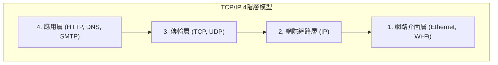

## 1. 跨越巴別塔：電腦之間的對話

1970 年代的電腦世界，是巨大的主機（大型電腦）掌握霸權的時代。IBM、DEC、富士通等各製造商，都各自開發了獨自的通訊規則（協定）來連結自家的電腦。

然而，這就如同「IBM 的電腦只會說英文，而 DEC 的電腦只會說法文」的情況。要將不同製造商的電腦連結起來並進行資料交換，在技術上是極度困難的。宛如因為語言不通而崩潰的「巴別塔」一般，電腦網路被製造商的障礙所阻斷。

為了打破這道高牆，讓全世界所有的電腦都能以共通的語言進行對話，作為「世界標準的翻譯規則」而誕生出來的，正是 **TCP/IP (Transmission Control Protocol / Internet Protocol)** 。

## 2. ARPANET 與冷戰時期的思想

TCP/IP 的起源可以追溯到美國國防部高等研究計劃署（ARPA）所建構的「 **ARPANET** 」。
當時正值冷戰的最高峰。作為軍事上的需求，他們需要一個「即使受到核武攻擊導致部分通訊網被破壞，整體也不會癱瘓，能夠繞道並持續進行通訊的網路」。

對此的解答便是「 **封包交換技術** 」。
與傳統電話網（電路交換方式）那樣由 A 點和 B 點佔用一條專線不同，這種手法是將資料分割成稱為「封包」的細小包裹，分別寫上目的地並投入網路的網格中。即使途中的路由器（十字路口）損壞，封包也會自動尋找其他的道路前往終點。

在這個封包交換網路上，為了確保能將資料確實送達，作為軟體層面的規則，由文頓·瑟夫（Vinton Cerf）和羅伯特·卡恩（Robert Kahn）所設計的，正是 TCP 與 IP。

## 3. TCP/IP 的階層模型：分割複雜性

TCP/IP 最棒的一點，在於將通訊這個極度複雜的處理分割成了「 **4 個階層 (Layer)** 」，並讓各自的職責完全獨立。這被稱為 TCP/IP 階層模型。

上層的階層不需要知道下層的階層「具體是如何運作的」。

1. **網路介面層**: 使用實體的纜線或 Wi-Fi 電波，總之就是負責將「0 與 1 的電子訊號」傳送到相鄰設備的角色。
2. **網際網路層 (IP)**: 負責查看 IP 位址（地址），從全世界的網路中找出通往最終目的地的路徑（路由），並運送封包的角色。
3. **傳輸層 (TCP)**: 負責重新排列抵達封包的順序，或者要求重新傳送遺失的封包，以此來確保資料的「正確性」的角色。
4. **應用層**: 負責決定符合像是網頁瀏覽器（HTTP）或電子郵件（SMTP）等各種用途的具體資料格式的角色。

歸功於這個階層架構，即使下層從「有線區域網路」進化到「光纖」或「5G 智慧型手機」，上層的軟體（瀏覽器或應用程式）完全不需要改寫，就能夠直接運作。

## 4. 為什麼 OSI 參考模型失敗了？

事實上在 1980 年代，名為國際標準化組織（ISO）的官方國際機構，曾經在國家規模上推動標準化一套與 TCP/IP 不同的「 **OSI 參考模型（7 階層模型）** 」，那是一組非常嚴密且優美的通訊協定群。

然而，結論來說 OSI 協定並沒有在市場上普及，而是由 TCP/IP 獲得了勝利。
理由很明確。相對於 OSI 是「學者們在會議室裡所制定，因為太過完美而導致複雜且沉重的規格」，TCP/IP 則是「 **已經由現場工程師們實際運作過，並被證明具備實用性，既簡單又輕量的規格** 」。

TCP/IP 被標準內建於加州大學柏克萊分校所開發的 UNIX OS（BSD UNIX）中，並免費發佈給全世界的大學與研究所。這使得它一口氣確立了「總之要連線的話，TCP/IP 是最簡單而且能動的」這種事實上的標準（De facto standard）地位。

## 5. 端到端原則：網路就是「水管」

在 TCP/IP 設計思想的根基中，存在著一種被稱為「 **端到端原則 (End-to-End Principle)** 」的強大哲學。

這種思想認為：「在網路路徑上的路由器等設備，應該只執行轉送封包這種單純的工作，而像是錯誤修正或加密等複雜的處理，則應該全部交給位在網路末端（端點）的電腦彼此來負責」。

日本過去的電話網（NTT）等，是由中央電話局的交換機掌握所有功能（計費、控制、錯誤處理）的「聰明網路」。
另一方面，網際網路則只是一條單純用來運送資料的「水管」，聰明的是連接著其兩端的我們的個人電腦或智慧型手機。

正因為這種「網路端只是一條水管」的簡單設計，網際網路才不會被特定的管理者所束縛，任何人只要自由地在末端的設備上開發新的應用程式（網頁、影片串流、P2P、[區塊鏈](/zh-tw/p/blockchain-technology-smart-contract-distributed-ledger/)等），就能夠推展到全世界，從而成長為「創新的基礎設施」。

## 6. 總結

為了連結不同製造商的電腦而從實驗性專案起步的 TCP/IP，如今已成為覆蓋人類社會的數位神經網路的預設規則。

它成功的理由，無非是優先考量「簡單且能動」勝過完美，並將複雜的處理交給終端設備，使網路本身保持輕盈，這是先人們優美的架構設計所帶來的勝利。
我們每天所享受的自由且開放的網際網路，正是建立在這個 TCP/IP 的哲學之上。
