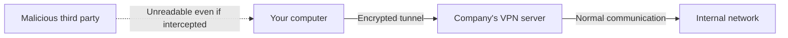

## 1. Cafe Wi-Fi is a "Heard by Everyone" Public Square

The internet we use every day is a massive public network connecting computers worldwide.
Especially when using public connections like free Wi-Fi in cafes or airports, the data you send and receive (passwords, browsing history, company confidential information, etc.) is constantly exposed to the risk of being "intercepted (eavesdropped)" by malicious third parties connected to the same Wi-Fi.

To give an analogy, the internet is a "**giant public square where people are talking loudly**".
In this square where anyone can hear your voice, the mechanism for having a secret conversation with a distant party (such as a company server) without anyone ever hearing is "**VPN (Virtual Private Network)**".

## 2. Three Magics That Make VPN Possible

A VPN literally builds a "virtual, private network in the public space of the internet". To achieve this, the following three main technologies are used.

### ① Tunneling (Securing the Path)
It virtually creates a "**dedicated tunnel**" within the public square of the internet that is invisible from the outside.
It creates a logical pipe between your computer and the company's VPN server, preventing data from wandering into other networks or unauthorized persons from entering the pipe without permission.

### ② Encapsulation (Hiding the Data)
The data passing through the tunnel is further sent wrapped in a "capsule (another box)".
Usually, data contains the addresses (IP addresses) of the "sender" and "destination". In encapsulation, the original data is entirely wrapped in another packet, and the destination is set to the "VPN server". Because of this, even if the packet is picked up along the way, "who you are ultimately communicating with" can be hidden.

### ③ Encryption (Protecting the Contents)
Even if it's encapsulated and sent through a tunnel, it would be meaningless if a hole was opened in the tunnel and the contents were peeked at. Therefore, the data itself is "**encrypted**".
VPNs use strong encryption algorithms (such as AES). Thanks to this, even if the data is intercepted, it will only look like a "meaningless string of characters" unless they have the key to decrypt it.

## 3. Two Main Types of VPN

There are mainly two types of VPN depending on the purpose.

1. **Internet VPN (Remote Access VPN)**
   This is what we use when connecting from home to the company's network for telework. Using VPN software installed on the computer, a tunnel is created to the company's VPN router.
2. **Site-to-Site VPN**
   This is a method of securely connecting the networks of distant offices, such as the "Tokyo Headquarters" and the "Osaka Branch", via the internet. It can keep costs overwhelmingly lower than drawing a dedicated line.

## 4. Evolution of Protocols (Communication Rules)

There are also several types of rules (protocols) for creating a VPN tunnel.

- **IPsec**: A highly robust protocol that encrypts at the internet layer (IP level). It is often used in site-to-site VPNs.
- **OpenVPN**: A modern mainstream protocol developed open-source, featuring extremely high security and flexibility.
- **WireGuard**: The latest protocol that has been attracting attention in recent years. It features an extremely short and simple source code, making it both fast and secure.

## 5. Conclusion

VPN is an "indispensable cornerstone of security" in modern society where telework has become widespread.
However, VPNs are not omnipotent. Cyberattacks targeting "vulnerabilities in VPN devices (software bugs)" are also rapidly increasing. It is important not to put excessive trust in the "safe tunnel" of a VPN, but to adopt multi-layered defenses, such as keeping software constantly updated and combining not only passwords but also Two-Factor Authentication (MFA).
