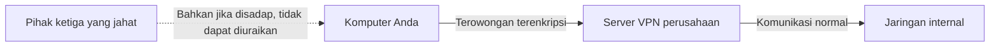

## 1. Wi-Fi Kafe adalah Alun-alun yang "Bisa Didengar oleh Semua Orang"

Internet yang biasa kita gunakan adalah jaringan publik raksasa tempat komputer-komputer di seluruh dunia terhubung.
Terutama saat menggunakan koneksi publik seperti Wi-Fi gratis di kafe atau bandara, data yang Anda kirim dan terima (seperti kata sandi, riwayat penjelajahan, informasi rahasia perusahaan) selalu berada dalam bahaya "penyadapan (pengupingan)" oleh pihak ketiga yang jahat yang terhubung ke Wi-Fi yang sama.

Ibaratnya, internet adalah "**alun-alun raksasa di mana orang-orang berbicara dengan suara keras**".
Mekanisme untuk berbicara rahasia dengan pihak yang jauh (seperti server perusahaan) di alun-alun ini, di mana suara dapat didengar oleh siapa saja, tanpa diketahui oleh siapa pun adalah "**VPN (Virtual Private Network: Jaringan Privat Virtual)**".

## 2. 3 Keajaiban untuk Mewujudkan VPN

VPN, secara harfiah, membangun "jaringan (Network) khusus (Private) virtual (Virtual) milik Anda sendiri di tempat umum yang disebut internet". Untuk mewujudkannya, tiga teknologi utama berikut digunakan.

### ① Tunneling (Mengamankan Rute)
Di dalam alun-alun internet, sebuah "**terowongan khusus**" yang tidak terlihat dari luar dibuat secara virtual.
Pipa logis dibuat antara komputer Anda dan server VPN perusahaan sehingga data tidak tersesat ke jaringan lain dan pihak luar tidak dapat masuk ke dalam pipa tanpa izin.

### ② Enkapsulasi (Menyembunyikan Data)
Data yang melewati terowongan selanjutnya dibungkus dalam "kapsul (kotak lain)" dan dikirim.
Biasanya, alamat "pengirim" dan "tujuan" (alamat IP) tertulis pada data. Dalam enkapsulasi, data asli dibungkus seluruhnya dalam paket lain, dan tujuannya diubah menjadi "server VPN". Dengan ini, bahkan jika paket diambil di tengah jalan, "dengan siapa sebenarnya Anda berkomunikasi" dapat disembunyikan.

### ③ Enkripsi (Melindungi Isi)
Meskipun data telah dienkapsulasi dan dikirim melalui terowongan, tidak akan ada artinya jika terowongan itu bocor dan isinya terlihat. Oleh karena itu, data itu sendiri "**dienkripsi**".
VPN menggunakan algoritma enkripsi yang kuat (seperti AES). Oleh karena itu, bahkan jika data disadap, data tersebut hanya akan terlihat seperti "rentetan karakter yang tidak bermakna" jika tidak memiliki kunci untuk mendekripsinya.

## 3. 2 Jenis Utama VPN

VPN secara umum memiliki dua jenis berdasarkan tujuannya.

1. **VPN Internet (VPN Akses Jarak Jauh)**
   Ini adalah yang kita gunakan saat bekerja dari rumah (telework) untuk terhubung ke jaringan perusahaan. Terowongan dibuat antara perangkat lunak VPN yang diinstal di komputer Anda dan router VPN perusahaan.
2. **VPN Antar-Situs (VPN Site-to-Site)**
   Ini adalah metode untuk menghubungkan jaringan kantor yang berjauhan dengan aman melalui internet, seperti "Kantor Pusat Tokyo" dan "Kantor Cabang Osaka". Biayanya bisa ditekan secara drastis dibandingkan dengan menarik jalur khusus.

## 4. Evolusi Protokol (Aturan Komunikasi)

Ada beberapa jenis aturan (protokol) untuk membuat terowongan VPN.

- **IPsec**: Protokol yang sangat kuat yang melakukan enkripsi pada lapisan internet (tingkat IP). Sering digunakan dalam VPN Antar-Situs.
- **OpenVPN**: Protokol arus utama modern yang dikembangkan secara open source dan memiliki tingkat keamanan serta fleksibilitas yang sangat tinggi.
- **WireGuard**: Protokol terbaru yang menarik perhatian dalam beberapa tahun terakhir. Ciri khasnya adalah kode sumbernya sangat pendek dan sederhana, serta cepat dan aman.

## 5. Kesimpulan

VPN adalah "kunci keamanan yang sangat penting" dalam masyarakat modern di mana kerja jarak jauh (telework) telah meluas.
Namun, VPN bukanlah segalanya. Serangan siber yang menargetkan "kerentanan perangkat VPN (bug perangkat lunak)" juga meningkat pesat. Penting untuk tidak terlalu percaya pada "terowongan aman" yang disebut VPN, dan tetap memperbarui perangkat lunak secara berkala, serta melakukan pertahanan berlapis seperti menggabungkan autentikasi dua faktor (MFA) selain kata sandi.
