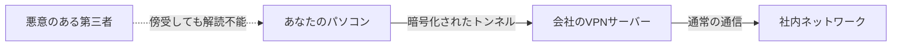

## 1. カフェのWi-Fiは「全員に丸聞こえ」の広場

私たちが普段使っているインターネットは、世界中のコンピュータが繋がった巨大な公共ネットワークです。
特に、カフェや空港の無料Wi-Fiなどの公衆回線を利用しているとき、あなたの送受信しているデータ（パスワードや閲覧履歴、会社の機密情報など）は、同じWi-Fiに繋いでいる悪意のある第三者から「傍受（盗聴）」される危険性に常に晒されています。

例えるなら、インターネットは「**大声で会話している巨大な広場**」です。
誰にでも声が聞こえてしまうこの広場で、絶対に誰にも聞かれないように遠くの相手（会社のサーバーなど）と内緒話をするための仕組みが「**VPN（Virtual Private Network: 仮想プライベートネットワーク）**」です。

## 2. VPNを実現する3つの魔法

VPNは、文字通り「インターネットという公共の場に、仮想的（Virtual）な自分専用（Private）のネットワーク（Network）」を構築します。これを実現するために、主に以下の3つの技術が使われています。

### ① トンネリング（道筋の確保）
インターネットの広場の中に、外部からは見えない「**専用のトンネル**」を仮想的に作り出します。
あなたのパソコンと会社のVPNサーバーとの間に論理的なパイプを作り、データが他のネットワークに迷い込んだり、部外者が勝手にパイプの中に入り込んだりできないようにします。

### ② カプセル化（データの隠蔽）
トンネルを通るデータを、さらに「カプセル（別の箱）」に包み込んで送ります。
通常、データには「送り主」と「宛先」の住所（IPアドレス）が書かれています。カプセル化では、本来のデータを別のパケットで丸ごと包み込み、宛先を「VPNサーバー」にしてしまいます。これにより、途中でパケットを拾われても「最終的に誰と通信しているのか」を隠すことができます。

### ③ 暗号化（中身の保護）
カプセル化してトンネルを通しても、万が一トンネルに穴を開けられて中身を覗かれたら意味がありません。そこで、データそのものを「**暗号化**」します。
VPNでは強固な暗号化アルゴリズム（AESなど）が使われます。これによって、もしデータが盗聴されても、暗号を解く鍵を持っていなければ「意味不明な文字の羅列」にしか見えません。

## 3. VPNの2つの主要な種類

VPNには、目的によって大きく2つの種類があります。

1. **インターネットVPN（リモートアクセスVPN）**
   私たちがテレワークで自宅から会社のネットワークに繋ぐときに使うのがこれです。パソコンにインストールしたVPNソフトを使って、会社のVPNルーターまでの間にトンネルを作ります。
2. **拠点間VPN（サイト間VPN）**
   「東京本社」と「大阪支社」など、離れたオフィス同士のネットワークを、インターネット経由で安全に繋ぐ方法です。専用線を引くよりも圧倒的にコストを抑えることができます。

## 4. プロトコル（通信ルール）の進化

VPNのトンネルを作るためのルール（プロトコル）にも、いくつかの種類があります。

- **IPsec**: インターネット層（IPレベル）で暗号化を行う非常に強固なプロトコル。拠点間VPNでよく使われます。
- **OpenVPN**: オープンソースで開発され、非常に高いセキュリティと柔軟性を持つ現代の主流プロトコル。
- **WireGuard**: 近年注目されている最新のプロトコル。ソースコードが非常に短くシンプルで、高速かつ安全であることが特徴です。

## 5. まとめ

VPNは、テレワークが普及した現代社会において「なくてはならないセキュリティの要」です。
しかし、VPNは万能ではありません。「VPN機器の脆弱性（ソフトウェアのバグ）」を狙ったサイバー攻撃も急増しています。VPNという「安全なトンネル」を過信せず、ソフトウェアを常に最新に保ち、パスワードだけでなく二段階認証（MFA）を組み合わせるなど、多層的な防御を行うことが重要です。
