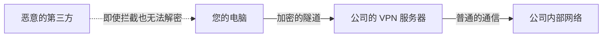

## 1. 咖啡厅的 Wi-Fi 是“所有人都能听见”的广场

我们平时使用的互联网，是全世界的计算机连接在一起的巨大公共网络。
特别是在使用咖啡厅或机场的免费 Wi-Fi 等公共网络时，您发送和接收的数据（密码、浏览记录、公司机密信息等）始终面临着被连接到同一 Wi-Fi 的恶意第三方“拦截（窃听）”的危险。

打个比方，互联网就像是一个 “ **大家都在大声交谈的巨大广场** ” 。
在这个任何人都能听到声音的广场上，为了能和远处的对象（如公司的服务器）进行绝对不被任何人听到的秘密交谈，所使用的机制就是 “ **VPN（Virtual Private Network：虚拟专用网络）** ” 。

## 2. 实现 VPN 的 3 个魔法

VPN 顾名思义，就是在“互联网这个公共场所中，构建一个虚拟的（Virtual）自己专用的（Private）网络（Network）”。为了实现这一点，主要使用了以下 3 种技术。

### ① 隧道技术（确保路径）
在互联网的广场中，虚拟地打造出一条从外部无法看到的 “ **专用隧道** ” 。
在您的电脑和公司的 VPN 服务器之间建立一个逻辑管道，防止数据迷失到其他网络中，也防止无关人员擅自进入管道内。

### ② 封装（隐藏数据）
将通过隧道的数据，进一步包裹在“胶囊（另一个盒子）”中进行发送。
通常，数据上写有“发件人”和“收件人”的地址（IP 地址）。在封装过程中，会将原来的数据原封不动地用另一个数据包包裹起来，并将收件人改为“VPN 服务器”。这样一来，即使数据包在途中被截获，也能隐藏“最终是在和谁通信”这一事实。

### ③ 加密（保护内容）
即使进行了封装并穿过隧道，万一隧道被凿开，里面的内容被偷看，那就毫无意义了。因此，我们要对数据本身进行 “ **加密** ” 。
VPN 中使用了强大的加密算法（如 AES 等）。这样一来，即使数据被窃听，如果没有解密的密钥，看起来也只是“一堆毫无意义的乱码”。

## 3. VPN 的 2 种主要类型

根据目的的不同，VPN 主要分为 2 种类型。

1. **互联网 VPN（远程访问 VPN）**
   我们在远程办公时，从家里连接到公司的网络使用的就是这种。使用安装在电脑上的 VPN 软件，在与公司的 VPN 路由器之间建立隧道。
2. **站点间 VPN（网点间 VPN）**
   这是一种通过互联网安全地连接相隔较远的办公室（如“东京总部”和“大阪分公司”）网络的方法。与拉设专线相比，这种方法能够大幅降低成本。

## 4. 协议（通信规则）的演进

用于建立 VPN 隧道的规则（协议）也有几种类型。

- **IPsec**: 在互联网层（IP 层）进行加密的非常强大的协议。常用于站点间 VPN。
- **OpenVPN**: 作为开源项目开发，具有极高安全性和灵活性的现代主流协议。
- **WireGuard**: 近年来备受关注的最新协议。其特点是源代码非常简短，且高速安全。

## 5. 总结

VPN 是在远程办公普及的现代社会中“不可或缺的安全基石”。
然而，VPN 并不是万能的。针对“VPN 设备的漏洞（软件的 Bug）”的网络攻击也在急剧上升。不要过度迷信 VPN 这个“安全的隧道”，始终保持软件更新，不仅使用密码还要结合双因素认证（MFA）等进行多层防御，这些都是非常重要的。
