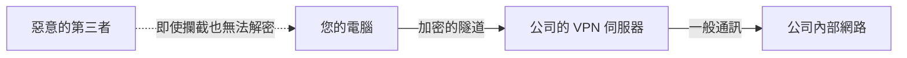

## 1. 咖啡廳的 Wi-Fi 是「所有人都聽得見」的廣場

我們平時使用的網際網路，是連結全球電腦的巨大公共網路。
特別是當您使用咖啡廳或機場的免費 Wi-Fi 等公共網路時，您傳送與接收的資料（密碼、瀏覽紀錄、公司的機密資訊等），隨時都面臨著被連接在同一個 Wi-Fi 上的惡意第三者「攔截（竊聽）」的風險。

打個比方，網際網路就像是一個「 **大聲交談的巨大廣場** 」。
在這個任何人都聽得見聲音的廣場上，為了確保能與遠方的對象（如公司伺服器）說悄悄話而不被任何人聽見，所使用的機制就是「 **VPN (Virtual Private Network: 虛擬私人網路)** 」。

## 2. 實現 VPN 的 3 個魔法

VPN 顧名思義，就是在「網際網路這個公共場所，建立虛擬的 (Virtual) 專屬 (Private) 網路 (Network)」。為了實現這點，主要使用了以下 3 種技術。

### ① 隧道技術（確保路徑）
在網際網路的廣場中，虛擬地打造一條外部看不見的「 **專屬隧道** 」。
在您的電腦與公司的 VPN 伺服器之間建立一條邏輯管道，防止資料迷失到其他網路中，並阻止無關人員擅自進入管道。

### ② 封裝（隱藏資料）
將通過隧道的資料，進一步用「膠囊（另一個箱子）」包裝起來傳送。
通常，資料上會寫著「寄件者」與「收件者」的地址（IP 位址）。在封裝中，會將原本的資料整個用另一個封包包覆，並將收件者設為「VPN 伺服器」。這樣一來，即使中途封包被攔截，也能隱藏「最終是在與誰通訊」。

### ③ 加密（保護內容）
即使封裝後通過隧道，萬一隧道被挖了個洞、內容被偷看，那就失去意義了。因此，會將資料本身進行「 **加密** 」。
VPN 會使用強大的加密演算法（如 AES）。藉此，即使資料遭到竊聽，只要沒有解密用的金鑰，看起來就只是一串「毫無意義的文字排列」。

## 3. VPN 的 2 種主要類型

VPN 根據目的，主要可以分為 2 種類型。

1. **網際網路 VPN（遠端存取 VPN）**
   這就是我們遠距工作時，從家裡連線到公司網路所使用的類型。利用安裝在電腦上的 VPN 軟體，在與公司的 VPN 路由器之間建立隧道。
2. **據點間 VPN（站點對站點 VPN）**
   這是將「東京總公司」與「大阪分公司」等相隔兩地的辦公室網路，透過網際網路安全連接的方法。這比拉實體專線能大幅降低成本。

## 4. 協定（通訊規則）的進化

用來建立 VPN 隧道的規則（協定），也有幾種類型。

- **IPsec**: 在網際網路層（IP 層）進行加密，非常強大的協定。常被用於據點間 VPN。
- **OpenVPN**: 以開源方式開發，具備極高安全性與彈性的現代主流協定。
- **WireGuard**: 近年備受矚目的最新協定。特徵是原始碼非常簡短單純，且兼具高速與安全。

## 5. 總結

在遠距工作普及的現代社會中，VPN 是「不可或缺的資安要件」。
然而，VPN 並非萬能。針對「VPN 設備漏洞（軟體錯誤）」發動的網路攻擊也正在急遽增加。我們不能過度依賴 VPN 這條「安全隧道」，而是必須隨時保持軟體在最新狀態，並結合密碼以外的雙重認證（MFA）等措施，實行多層次防禦。
