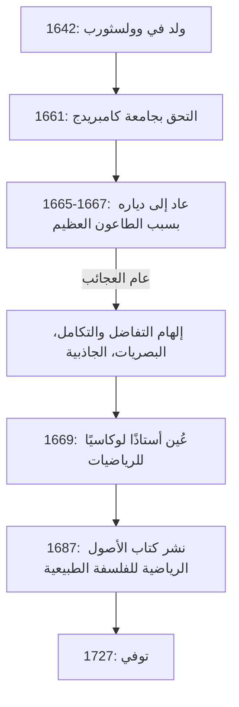

إذا كان علينا أن نذكر شخصًا واحدًا كان له التأثير الأعمق على تطور العلوم في تاريخ البشرية، فسيذكر الكثيرون **[إسحاق نيوتن](https://kenji.blog/p/newton/)** . لقد حقق اكتشافات ثورية في مجالات متنوعة مثل الفيزياء والرياضيات وعلم الفلك. ليس من المبالغة القول إن إنجازاته لم تكن مجرد اكتشافات لحقبة واحدة، بل إنها بنت الأسس ذاتها للعلوم الحديثة.

في هذا المقال، سوف نتتبع الأحداث الاستثنائية من نشأة نيوتن حتى سنواته الأخيرة، ونستكشف بعمق مآثره الرياضية والفيزيائية، مع التركيز بشكل خاص على **حساب التفاضل والتكامل** (طريقة التدفق)، و **نظرية ذات الحدين المعممة** ، و **طريقة نيوتن** .

## حياة نيوتن وأحداثها

### طفولة وحيدة والولادة في وولسثورب

ولد [إسحاق نيوتن](https://kenji.blog/p/newton/) في يوم عيد الميلاد عام 1642 (التقويم اليولياني؛ 4 يناير 1643 في التقويم الغريغوري) في قرية وولسثورب الصغيرة، بمقاطعة لينكولنشاير، إنجلترا. وُلد قبل الأوان، وكان جسده صغيرًا للغاية، وفي البداية كان بقاؤه على قيد الحياة موضع شك. ومما زاد الطين بلة، توفي والد نيوتن قبل ولادته بثلاثة أشهر.

عندما كان في الثالثة من عمره، تزوجت والدته مرة أخرى وتركت نيوتن في رعاية جدته لتنضم إلى زوجها الجديد. يُقال إن تجربة الانفصال المبكرة هذه عن والدته أثرت بعمق على شخصية نيوتن، مما ساهم في الشخصية السرية والمريبة للغاية التي طورها في وقت لاحق من حياته.

عندما بدأ في الالتحاق بالمدرسة المحلية، لم يكن نيوتن في البداية طالبًا متميزًا. ومع ذلك، هناك حكاية تروي أنه بعد فوزه في عراك ضد زميل في الصف كان يتنمر عليه، عقد العزم على التغلب عليه في المجال الأكاديمي أيضًا، مما أدى إلى ارتفاع درجاته بشكل كبير. كما أظهر اهتمامًا قويًا ببناء ألعاب ميكانيكية مثل الساعات الشمسية والساعات المائية ونماذج طواحين الهواء.

### جامعة كامبريدج و "عام العجائب"

في عام 1661، التحق نيوتن بكلية ترينيتي في كامبريدج. في حين كانت الجامعة في ذلك الوقت تُدرّس الفلسفة الأرسطية بشكل أساسي، انجذب نيوتن بشدة إلى الأفكار العلمية الجديدة ل[رينيه ديكارت](https://kenji.blog/p/descartes/) وغاليليو غاليلي ويوهانس كيبلر. ترك ملاحظة في دفتر ملاحظاته تنص على: **"Amicus Plato amicus Aristoteles magis amica veritas"** (أفلاطون صديقي، أرسطو صديقي، لكن أعظم أصدقائي هي الحقيقة).

في عام 1665، ضرب تفشٍ حاد للطاعون العظيم لندن، مما أجبر الجامعة على إغلاق أبوابها. عاد نيوتن إلى مسقط رأسه في وولسثورب وانغمس في التأمل لمدة عام ونصف تقريبًا. خلال هذه الفترة الهادئة والمنعزلة، وجد الإلهام لإنجازاته الثلاثة الكبرى: أسس حساب التفاضل والتكامل، والبصريات (التحليل الطيفي للضوء باستخدام منشور)، وقانون الجاذبية العامة. يُعرف هذا العام في تاريخ العلوم باسم **Annus Mirabilis** (عام العجائب).



### الحقيقة وراء قصة التفاحة

عند الحديث عن نيوتن، فإن الحكاية القائلة بأنه "اكتشف الجاذبية العامة عند رؤية تفاحة تسقط من شجرة" مشهورة بشكل لا يصدق، لكن هل حدث هذا حقًا؟

وفقًا لسجلات ويليام ستوكلي، كاتب سيرة نيوتن، فإن نيوتن نفسه روى هذا الحدث في سنواته الأخيرة. ذات يوم، بينما كان نيوتن في مزاج تأملي تحت شجرة تفاح في حديقته، رأى تفاحة تسقط وتساءل: "لماذا يجب أن تنزل تلك التفاحة دائمًا بشكل عمودي على الأرض؟ لماذا لا تذهب جانباً، أو لأعلى، بل تتجه باستمرار نحو مركز الأرض؟".

بعبارة أخرى، إنها ليست قصة كوميدية لتفاحة تضرب رأسه في ومضة مفاجئة من العبقرية. بل هو بالأحرى حدث يوضح بصيرته العميقة، حيث ربط ظاهرة يومية تافهة بقانون كوني (الجاذبية العامة): **"أليست القوة التي تجذب بها الأرض الأشياء هي نفس القوة التي تحافظ على مدارات القمر والكواكب؟"** .

### الخلاف حول حساب التفاضل والتكامل مع لايبنيز

ابتكر نيوتن فكرة حساب التفاضل والتكامل حوالي عام 1665، لكنه لم ينشر نتائجه على الفور. في هذه الأثناء، اكتشف عالم الرياضيات الألماني غوتفريد فيلهلم لايبنيز بشكل مستقل طريقة حساب التفاضل والتكامل في سبعينيات القرن السابع عشر ونشرها كبحث.

أثار هذا واحدة من أعنف نزاعات الأولوية في تاريخ العلوم حول "من اكتشف التفاضل والتكامل أولاً". اليوم، يُستنتج أن كليهما اكتشف التفاضل والتكامل بشكل مستقل. ومع ذلك، لأن الرموز التي أدخلها لايبنيز، مثل $dx$ و $\int$، كانت متفوقة، انتشرت رموز لايبنيز عبر قارة أوروبا، بينما تمسكت مجتمع الرياضيات البريطاني بعناد برموزهم الخاصة، فتخلفوا مؤقتًا نتيجة لذلك.

---

## غوص عميق في الإنجازات الرياضية لنيوتن

من هنا، سنشرح بالتفصيل الإنجازات المحددة التي حققها نيوتن في مجال الرياضيات، مصحوبة بالصيغ.

### 1. تأسيس حساب التفاضل والتكامل (طريقة التدفق)

أطلق نيوتن على طريقته في حساب التفاضل والتكامل اسم **طريقة التدفق** . لالتقاط التغيرات الفيزيائية المستمرة، أطلق على الكميات التي تتغير باستمرار بمرور الوقت اسم "المتدفقات" (Fluents)، وأشار إليها بـ $x, y$، إلخ، وأطلق على معدل تغيرها اسم "التدفقات" (Fluxions)، باستخدام رموز مثل $\dot{x}, \dot{y}$.

كانت إحدى أعظم مساهمات نيوتن هي التأسيس الواضح لـ **النظرية الأساسية لحساب التفاضل والتكامل** —وهي حقيقة أن التفاضل (إيجاد المماسات) والتكامل (إيجاد المساحات) هما عمليتان عكسيتان لبعضهما البعض.

تُعرّف مشتقة الدالة $f(x)$ باستخدام النهايات كما يلي:

$$
f'(x) = \lim_{\Delta x \to 0} \frac{f(x + \Delta x) - f(x)}{\Delta x}
$$

هنا، تمثل $\Delta x$ تغيرًا متناهي الصغر. باستخدام هذا المفهوم للمتناهيات في الصغر، أسس نيوتن طريقة منهجية لحساب ميل المماس للمنحنى والمساحة المحصورة بمنحنى. أصبحت هذه الطريقة أداة رياضية قوية لتحليل سرعة وتسارع الأجسام المتحركة.

### 2. نظرية ذات الحدين المعممة

نظرية ذات الحدين التي تُدرس في رياضيات المدرسة الثانوية هي صيغة لتوسيع $(x+y)^n$ عندما يكون الأس $n$ عددًا صحيحًا موجبًا.

$$
(x+y)^n = \sum_{k=0}^{n} \binom{n}{k} x^{n-k} y^k
$$

في عام 1665، قام نيوتن بتوسيع هذه النظرية لتشمل **الأسس الكسرية والسالبة** . إذا كان الأس عددًا حقيقيًا $\alpha$، في ظل شرط $|x| < 1$، فيمكن توسيعه كمتسلسلة لانهائية على النحو التالي:

$$
(1+x)^\alpha = 1 + \alpha x + \frac{\alpha(\alpha-1)}{2!} x^2 + \frac{\alpha(\alpha-1)(\alpha-2)}{3!} x^3 + \dots
$$

جعلت نظرية ذات الحدين المعممة هذه من الممكن التعبير عن الجذور التربيعية والمقلوبات كمتسلسلات لانهائية، وكانت بمثابة سلاح قوي عندما استنبط نيوتن متسلسلات التمدد اللانهائية للدوال اللوغاريتمية والمثلثية (مقدمة لتمدد تايلور).

### 3. طريقة نيوتن

طريقة نيوتن (المعروفة أيضًا باسم طريقة نيوتن-رافسون) هي خوارزمية تكرارية لإيجاد الجذور الحقيقية التقريبية للمعادلة $f(x) = 0$. هذه الطريقة هي تقنية عالية الكفاءة تقترب من الجذر باستخدام مماس الدالة.

بالنظر إلى قيمة تقريبية معينة $x_n$، يتم إيجاد القيمة التقريبية التالية $x_{n+1}$ بواسطة علاقة التكرار التالية:

$$
x_{n+1} = x_n - \frac{f(x_n)}{f'(x_n)}
$$

على سبيل المثال، لإيجاد حل للمعادلة $x^2 = 2$ (أي $\sqrt{2}$)، نضع $f(x) = x^2 - 2$. مشتقتها هي $f'(x) = 2x$. بالتعويض بذلك في علاقة التكرار نحصل على:

$$
x_{n+1} = x_n - \frac{x_n^2 - 2}{2x_n} = \frac{1}{2} \left( x_n + \frac{2}{x_n} \right)
$$

ينتج عن هذا صيغة تكرار بسيطة جدًا. التعبير عن هذه الصيغة الرياضية في برنامج يبدو كالتالي:

```python
# مثال على طريقة نيوتن لإيجاد الجذر التربيعي للدالة f(x) = x^2 - 2
def newton_method_sqrt(value, tolerance=1e-7, max_iterations=100):
    # تعيين التخمين الأولي
    x = value / 2.0
    for i in range(max_iterations):
        # f(x) = x^2 - value, f'(x) = 2x
        # علاقة التكرار: x_{n+1} = x_n - f(x_n)/f'(x_n) = 0.5 * (x_n + value / x_n)
        next_x = 0.5 * (x + value / x)
        
        # التحقق مما إذا كان قد تقارب ضمن خطأ التسامح
        if abs(x - next_x) < tolerance:
            return next_x
        x = next_x
    return x

# طباعة القيمة التقريبية للجذر التربيعي للعدد 2
print(f"القيمة التقريبية للجذر التربيعي للعدد 2: {newton_method_sqrt(2)}")
```

تتقارب هذه الخوارزمية بسرعة كبيرة ولا تزال مستخدمة على نطاق واسع حتى اليوم لحساب الجذور التربيعية في أجهزة الكمبيوتر وفي الطرق العددية لحل المعادلات غير الخطية.

---

## التطبيق على الفيزياء و "الأصول الرياضية" (Principia)

بينما حقق نيوتن نتائج مبتكرة في الرياضيات، قام بتطبيقها في نفس الوقت لتوضيح الظواهر الفيزيائية. نُشر كتابه **الأصول الرياضية للفلسفة الطبيعية** (Philosophiæ Naturalis Principia Mathematica) عام 1687 بإلحاح شديد من عالم الفلك إدموند هالي، ويُعتبر أحد أهم الكتب في تاريخ العلوم.

صاغ في هذا الكتاب **قوانين الحركة الثلاثة** التالية:
1. **قانون القصور الذاتي** (القانون الأول): يبقى الجسم الساكن ساكنًا والجسم المتحرك في خط مستقيم متحركًا بسرعة منتظمة ما لم تؤثر عليه قوة خارجية.
2. **قانون الحركة** (القانون الثاني): القوة تساوي حاصل ضرب الكتلة في التسارع ( $F = ma$ ).
3. **قانون الفعل ورد الفعل** (القانون الثالث): لكل فعل رد فعل مساوٍ له في المقدار ومعاكس له في الاتجاه.

من خلال دمج هذه القوانين رياضيًا مع قوانين كيبلر لحركة الكواكب، أثبت **قانون الجاذبية العامة** . ينص هذا القانون على أن قوة التجاذب $F$ المؤثرة بين جسمين لهما كتلة تتناسب طرديًا مع كتلتهما $m_1, m_2$ وعكسيًا مع مربع المسافة $r$ بينهما.

$$
F = G \frac{m_1 m_2}{r^2} \quad \left( \text{حيث } G \text{ هو ثابت الجاذبية} \right)
$$

أثبت هذا أن كلاً من سقوط تفاحة على الأرض وحركة جرم سماوي مثل القمر يمكن تفسيرهما بنفس القانون الفيزيائي الدقيق. لقد كان حقًا تحولًا جذريًا قلب نظرة البشرية للعالم رأسًا على عقب.

## السنوات الأخيرة والتأثير على الأجيال القادمة

على الرغم من أن نيوتن وصل إلى قمة العلوم، إلا أنه نأى بنفسه عن البحث العلمي في سنواته الأخيرة. عمل كمراقب ومدير لدار سك العملة الملكية، وتولى مهمة اتخاذ إجراءات صارمة ضد المزورين، وسيطر على المجتمع العلمي البريطاني كرئيس للجمعية الملكية. من المثير للاهتمام أن الغالبية العظمى من المخطوطات التي تركها لم تكن عن الفيزياء أو الرياضيات، بل عن **الخيمياء** و **التسلسل الزمني التوراتي (اللاهوت)** . كان آخر رجال عصر النهضة ومثقفًا لعصر لم تكن فيه العلوم والسحر متمايزين بعد.

ترك نيوتن الكلمات المتواضعة التالية فيما يتعلق بإنجازاته:

> "إذا كنت قد رأيت أبعد من غيري، فذلك لأنني وقفت على أكتاف العمالقة."

تعبر هذه الكلمات عن احترامه، واعترافه بأن اكتشافاته لم تكن ممكنة إلا بفضل العمل المتراكم لكبار العلماء في الماضي (مثل كوبرنيكوس وغاليليو وكيبلر).

ظل نظام الميكانيكا الكلاسيكية الذي أسسه هو الأساس المطلق للفيزياء لمدة 200 عام تقريبًا حتى نشر ألبرت أينشتاين نظرية النسبية في أوائل القرن العشرين. حتى اليوم، تُستخدم الميكانيكا النيوتونية بدقة وفعالية كبيرتين في حساب الظواهر الفيزيائية على نطاقنا اليومي ومدارات المسابير الفضائية.

فتح [إسحاق نيوتن](https://kenji.blog/p/newton/)، بدءًا من طفولته الوحيدة، حقائق الكون من خلال تركيزه الاستثنائي وحدسه العبقري. لا تزال العديد من القوانين والنظريات الرياضية التي تركها تدعم تقنيتنا ومجتمعنا حتى يومنا هذا.
