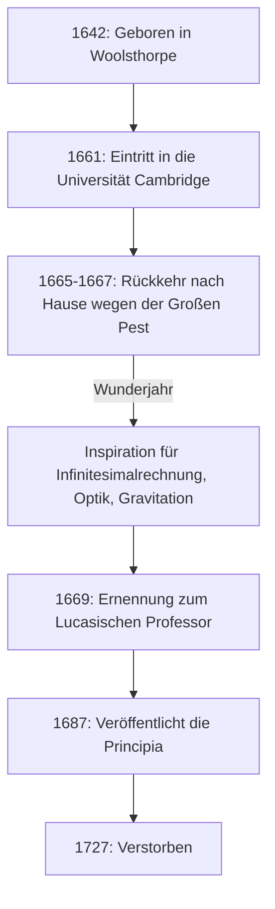

Wenn wir eine Person nennen müssten, die den tiefgreifendsten Einfluss auf die Entwicklung der Wissenschaft in der Menschheitsgeschichte hatte, würden viele **[Isaac Newton](https://kenji.blog/de/p/newton/)** nennen. Er erzielte revolutionäre Entdeckungen in so unterschiedlichen Bereichen wie Physik, Mathematik und Astronomie. Es ist keine Übertreibung zu sagen, dass seine Errungenschaften nicht nur Entdeckungen einer einzelnen Epoche waren, sondern die eigentlichen Grundlagen der modernen Wissenschaft bildeten.

In diesem Artikel werden wir die außergewöhnlichen Episoden von Newtons Erziehung bis zu seinen späteren Jahren nachzeichnen und seine mathematischen und physikalischen Leistungen tiefgehend erforschen, wobei wir uns insbesondere auf die **Infinitesimalrechnung** (die Fluxionsmethode), den **verallgemeinerten binomischen Lehrsatz** und das **Newton-Verfahren** konzentrieren.

## Newtons Leben und Episoden

### Eine einsame Kindheit und die Geburt in Woolsthorpe

[Isaac Newton](https://kenji.blog/de/p/newton/) wurde am Weihnachtstag 1642 (Julianischer Kalender; 4. Januar 1643 im Gregorianischen Kalender) in dem kleinen Dorf Woolsthorpe in Lincolnshire, England, geboren. Als Frühchen geboren, war sein Körper extrem klein, und anfangs zweifelte man an seinem Überleben. Erschwerend kam hinzu, dass Newtons Vater drei Monate vor seiner Geburt verstorben war.

Als er drei Jahre alt war, heiratete seine Mutter erneut und überließ Newton der Obhut seiner Großmutter, um zu ihrem neuen Ehemann zu ziehen. Man sagt, dass diese frühe Erfahrung der Trennung von seinem Elternteil Newtons Persönlichkeit tiefgreifend beeinflusste und zu dem extrem verschwiegenen und misstrauischen Charakter beitrug, den er später im Leben entwickelte.

Als er anfing, die örtliche Schule zu besuchen, war Newton anfangs kein herausragender Schüler. Es ist jedoch eine Anekdote überliefert, wonach er, nachdem er einen Kampf gegen einen Mitschüler gewonnen hatte, der ihn schikaniert hatte, beschloss, ihn auch akademisch zu schlagen, was seine Noten in die Höhe schnellen ließ. Er zeigte auch ein starkes Interesse am Bau mechanischer Spielzeuge wie Sonnenuhren, Wasseruhren und Windmühlenmodellen.

### Die Universität Cambridge und das "Wunderjahr"

1661 trat Newton in das Trinity College in Cambridge ein. Während die Universität zu dieser Zeit hauptsächlich aristotelische Philosophie lehrte, fühlte sich Newton stark zu den neuen wissenschaftlichen Gedanken von [René Descartes](https://kenji.blog/de/p/descartes/), Galileo Galilei und Johannes Kepler hingezogen. Er hinterließ in seinem Notizbuch eine Notiz, in der stand: **"Amicus Plato amicus Aristoteles magis amica veritas"** (Platon ist mein Freund, Aristoteles ist mein Freund, aber mein größter Freund ist die Wahrheit).

1665 traf ein schwerer Ausbruch der Großen Pest London und zwang die Universität zur Schließung. Newton kehrte in seine Heimatstadt Woolsthorpe zurück und vertiefte sich etwa anderthalb Jahre lang in Kontemplation. Während dieser ruhigen und einsamen Zeit fand er die Inspiration für seine drei großen Errungenschaften: die Grundlagen der Infinitesimalrechnung, die Optik (Spektralanalyse des Lichts mithilfe eines Prismas) und das Gesetz der universellen Gravitation. In der Wissenschaftsgeschichte ist diese Zeit als das **Annus Mirabilis** (Wunderjahr) bekannt.



### Die Wahrheit hinter der Apfel-Anekdote

Wenn man von Newton spricht, ist die Anekdote, dass er "die universelle Gravitation entdeckte, als er einen Apfel vom Baum fallen sah", unglaublich berühmt, aber ist das wirklich passiert?

Nach den Aufzeichnungen von William Stukeley, Newtons Biograf, hat Newton selbst diese Episode in seinen späteren Jahren erzählt. Eines Tages, als Newton in einer nachdenklichen Stimmung unter einem Apfelbaum in seinem Garten war, sah er einen Apfel fallen und fragte sich: "Warum sollte dieser Apfel immer senkrecht zu Boden fallen? Warum sollte er nicht zur Seite oder nach oben gehen, sondern ständig zum Erdmittelpunkt?"

Mit anderen Worten, es ist keine komische Geschichte von einem Apfel, der ihn in einem plötzlichen Geistesblitz auf den Kopf trifft. Vielmehr ist es eine Episode, die seine tiefe Einsicht demonstriert, die ein triviales alltägliches Phänomen mit einem universellen Gesetz (der universellen Gravitation) verbindet: **"Ist die Kraft, mit der die Erde Objekte anzieht, nicht dieselbe Kraft, die die Umlaufbahnen des Mondes und der Planeten aufrechterhält?"** .

### Der Streit um die Infinitesimalrechnung mit Leibniz

Newton konzipierte die Idee der Infinitesimalrechnung um 1665, veröffentlichte seine Ergebnisse jedoch nicht sofort. Unterdessen entdeckte der deutsche Mathematiker Gottfried Wilhelm Leibniz in den 1670er Jahren unabhängig davon eine Methode der Infinitesimalrechnung und veröffentlichte sie als Abhandlung.

Dies löste einen der heftigsten Prioritätsstreitigkeiten in der Geschichte der Wissenschaft darüber aus, "wer die Infinitesimalrechnung zuerst entdeckt hat". Heute kommt man zu dem Schluss, dass beide die Infinitesimalrechnung unabhängig voneinander entdeckt haben. Weil jedoch die von Leibniz eingeführte Notation wie $dx$ und $\int$ überlegen war, verbreitete sich die Leibniz'sche Notation in Kontinentaleuropa, während die britische mathematische Gemeinschaft stur an ihren eigenen Symbolen festhielt und dadurch vorübergehend ins Hintertreffen geriet.

---

## Tiefer Einblick in Newtons mathematische Errungenschaften

Von hier an werden wir die spezifischen Leistungen, die Newton im Bereich der Mathematik erbracht hat, anhand von Formeln im Detail erklären.

### 1. Die Begründung der Infinitesimalrechnung (Fluxionsmethode)

Newton nannte seine Methode der Infinitesimalrechnung die **Fluxionsmethode** . Um physikalische kontinuierliche Veränderungen zu erfassen, nannte er Größen, die sich im Laufe der Zeit kontinuierlich ändern, "Fluenten", die er mit $x, y$ usw. bezeichnete, und die Rate ihrer Änderung nannte er "Fluxionen", wofür er Symbole wie $\dot{x}, \dot{y}$ verwendete.

Einer von Newtons größten Beiträgen war die klare Etablierung des **Hauptsatzes der Differential- und Integralrechnung** – die Tatsache, dass Differentiation (Finden von Tangenten) und Integration (Finden von Flächen) zueinander inverse Operationen sind.

Die Ableitung einer Funktion $f(x)$ wird mithilfe von Grenzwerten wie folgt definiert:

$$
f'(x) = \lim_{\Delta x \to 0} \frac{f(x + \Delta x) - f(x)}{\Delta x}
$$

Hier stellt $\Delta x$ eine infinitesimale Änderung dar. Mit diesem Konzept der Infinitesimalen etablierte Newton eine systematische Methode zur Berechnung der Steigung der Tangente an eine Kurve und der von einer Kurve begrenzten Fläche. Diese Methode wurde zu einem mächtigen mathematischen Werkzeug zur Analyse von Geschwindigkeit und Beschleunigung bewegter Objekte.

### 2. Verallgemeinerter binomischer Lehrsatz

Der in der Schulmathematik gelehrte binomische Lehrsatz ist eine Formel zum Ausmultiplizieren von $(x+y)^n$, wenn der Exponent $n$ eine positive ganze Zahl ist.

$$
(x+y)^n = \sum_{k=0}^{n} \binom{n}{k} x^{n-k} y^k
$$

Im Jahr 1665 erweiterte Newton diesen Satz auf **gebrochene und negative Exponenten** . Wenn der Exponent eine reelle Zahl $\alpha$ ist, kann er unter der Bedingung $|x| < 1$ als unendliche Reihe wie folgt entwickelt werden:

$$
(1+x)^\alpha = 1 + \alpha x + \frac{\alpha(\alpha-1)}{2!} x^2 + \frac{\alpha(\alpha-1)(\alpha-2)}{3!} x^3 + \dots
$$

Dieser verallgemeinerte binomische Lehrsatz machte es möglich, Quadratwurzeln und Kehrwerte als unendliche Reihen auszudrücken, und diente als mächtige Waffe, als Newton die unendlichen Reihenentwicklungen logarithmischer und trigonometrischer Funktionen (der Vorläufer der Taylor-Entwicklung) ableitete.

### 3. Newton-Verfahren

Das Newton-Verfahren (auch bekannt als Newton-Raphson-Verfahren) ist ein iterativer Algorithmus zum Finden angenäherter reeller Wurzeln einer Gleichung $f(x) = 0$. Diese Methode ist eine hocheffiziente Technik, die sich der Wurzel unter Ausnutzung der Tangente der Funktion nähert.

Bei einem gegebenen bestimmten Näherungswert $x_n$ wird der nächste Näherungswert $x_{n+1}$ durch folgende Rekursionsformel gefunden:

$$
x_{n+1} = x_n - \frac{f(x_n)}{f'(x_n)}
$$

Um beispielsweise die Lösung für $x^2 = 2$ (d. h. $\sqrt{2}$) zu finden, setzen wir $f(x) = x^2 - 2$. Ihre Ableitung ist $f'(x) = 2x$. Setzt man dies in die Rekursionsformel ein, ergibt sich:

$$
x_{n+1} = x_n - \frac{x_n^2 - 2}{2x_n} = \frac{1}{2} \left( x_n + \frac{2}{x_n} \right)
$$

Dies liefert eine sehr einfache Rekursionsformel. Wenn man diese mathematische Formel in einem Programm ausdrückt, sieht das so aus:

```python
# Beispiel für das Newton-Verfahren zur Berechnung der Quadratwurzel für die Funktion f(x) = x^2 - 2
def newton_method_sqrt(value, tolerance=1e-7, max_iterations=100):
    # Startwert festlegen
    x = value / 2.0
    for i in range(max_iterations):
        # f(x) = x^2 - value, f'(x) = 2x
        # Rekursionsformel: x_{n+1} = x_n - f(x_n)/f'(x_n) = 0.5 * (x_n + value / x_n)
        next_x = 0.5 * (x + value / x)
        
        # Prüfen, ob der Wert innerhalb der Toleranz konvergiert ist
        if abs(x - next_x) < tolerance:
            return next_x
        x = next_x
    return x

# Näherungswert der Quadratwurzel von 2 ausgeben
print(f"Näherungswert der Quadratwurzel von 2: {newton_method_sqrt(2)}")
```

Dieser Algorithmus konvergiert extrem schnell und wird noch heute häufig in Computern zur Berechnung von Quadratwurzeln und in numerischen Methoden zur Lösung nichtlinearer Gleichungen verwendet.

---

## Anwendung in der Physik und die "Principia"

Während Newton in der Mathematik innovative Ergebnisse erzielte, wandte er diese gleichzeitig zur Aufklärung physikalischer Phänomene an. Sein 1687 auf starkes Drängen des Astronomen Edmond Halley veröffentlichtes Buch **Philosophiæ Naturalis Principia Mathematica** (Mathematische Prinzipien der Naturphilosophie) gilt als eines der wichtigsten Bücher in der Wissenschaftsgeschichte.

In diesem Buch formulierte er die folgenden **Drei Newtonschen Gesetze** :
1. **Trägheitsgesetz** (Erstes Gesetz): Ein Körper verharrt im [Zustand](https://kenji.blog/de/p/state-management-history-redux-context-recoil-zustand/) der Ruhe oder der gleichförmigen Translation, sofern er nicht durch einwirkende Kräfte zur Änderung seines Zustands gezwungen wird.
2. **Aktionsprinzip** (Zweites Gesetz): Die Änderung der Bewegung ist der Einwirkung der bewegenden Kraft proportional und geschieht nach der Richtung derjenigen geraden Linie, nach welcher jene Kraft wirkt ( $F = ma$ ).
3. **Reaktionsprinzip** (Drittes Gesetz): Kräfte treten immer paarweise auf. Übt ein Körper A auf einen anderen Körper B eine Kraft aus (actio), so wirkt eine gleich große, aber entgegen gerichtete Kraft von Körper B auf Körper A (reactio).

Durch die mathematische Integration dieser Gesetze mit Keplers Gesetzen der Planetenbewegung bewies er das **Newtonsche Gravitationsgesetz** . Dieses Gesetz besagt, dass die Anziehungskraft $F$, die zwischen zwei massenbehafteten Körpern wirkt, direkt proportional dem Produkt der beiden Massen $m_1, m_2$ und umgekehrt proportional dem Quadrat ihres Abstandes $r$ ist.

$$
F = G \frac{m_1 m_2}{r^2} \quad \left( \text{wobei } G \text{ die Gravitationskonstante ist} \right)
$$

Dies bewies, dass sowohl das Fallen eines Apfels auf der Erde als auch die Bewegung eines Himmelskörpers wie des Mondes durch dasselbe exakte physikalische Gesetz erklärt werden könnten. Es war wirklich ein Paradigmenwechsel, der das Weltbild der Menschheit grundlegend umstieß.

## Spätere Jahre und Einfluss auf die Nachwelt

Obwohl Newton den Höhepunkt der Wissenschaft erreichte, distanzierte er sich in seinen späteren Jahren von der wissenschaftlichen Forschung. Er diente als Warden und Master of the Royal Mint, wo er die Aufgabe übernahm, hart gegen Fälscher vorzugehen, und regierte als Präsident der Royal Society über die britische wissenschaftliche Gemeinschaft. Interessanterweise handelte die große Mehrheit der Manuskripte, die er hinterließ, nicht von Physik oder Mathematik, sondern von **Alchemie** und **biblischer Chronologie (Theologie)** . Er war der letzte der Renaissance-Menschen und ein Intellektueller einer Ära, in der Wissenschaft und Magie noch undifferenziert waren.

Newton hinterließ in Bezug auf seine eigenen Leistungen die folgenden bescheidenen Worte:

> "Wenn ich weiter gesehen habe, so deshalb, weil ich auf den Schultern von Riesen stand."

Diese Worte drücken seinen Respekt aus und erkennen an, dass seine Entdeckungen nur durch die gesammelte Arbeit großer Wissenschaftler der Vergangenheit (wie Kopernikus, Galilei und Kepler) möglich waren.

Das von ihm begründete System der klassischen Mechanik blieb für etwa 200 Jahre das absolute Fundament der Physik, bis Albert Einstein im frühen 20. Jahrhundert die Relativitätstheorie veröffentlichte. Noch heute wird die Newtonsche Mechanik äußerst genau und effektiv bei der Berechnung physikalischer Phänomene unserer alltäglichen Größenordnung und der Umlaufbahnen von Raumsonden verwendet.

[Isaac Newton](https://kenji.blog/de/p/newton/), ausgehend von einer einsamen Kindheit, entschlüsselte durch seine außergewöhnliche Konzentration und geniale Intuition die Wahrheiten des Universums. Die zahlreichen Gesetze und mathematischen Sätze, die er hinterließ, stützen unsere Technologie und Gesellschaft bis zum heutigen Tag.
