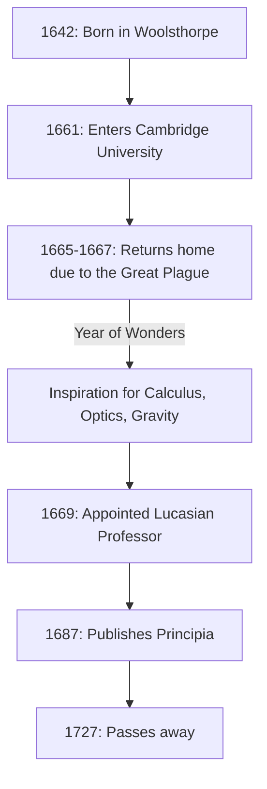

If we were to name one person who had the most profound impact on the development of science in human history, many would name **[Isaac Newton](https://kenji.blog/en/p/newton/)** . He achieved revolutionary discoveries across diverse fields such as physics, mathematics, and astronomy. It is no exaggeration to say that his achievements were not merely discoveries of a single era, but built the very foundations of modern science.

In this article, we will trace the extraordinary episodes from Newton's upbringing to his later years, and deeply explore his mathematical and physical feats, particularly focusing on **calculus** (the method of fluxions), the **generalized binomial theorem** , and **Newton's method** .

## Newton's Life and Episodes

### A Solitary Childhood and Birth in Woolsthorpe

[Isaac Newton](https://kenji.blog/en/p/newton/) was born on Christmas Day in 1642 (Julian calendar; January 4, 1643, in the Gregorian calendar) in the small village of Woolsthorpe, Lincolnshire, England. Born prematurely, his body was extremely small, and at first, his survival was in doubt. To make matters worse, Newton's father had passed away three months before his birth.

When he was three years old, his mother remarried and left Newton in the care of his grandmother to join her new husband. This early experience of separation from his parent is said to have profoundly influenced Newton's personality, contributing to the extremely secretive and suspicious character he developed later in life.

When he began attending the local school, Newton was initially not an outstanding student. However, an anecdote remains that after winning a fight against a classmate who had bullied him, he resolved to beat him in academics as well, causing his grades to skyrocket. He also showed a strong interest in building mechanical toys such as sundials, water clocks, and models of windmills.

### Cambridge University and the "Year of Wonders"

In 1661, Newton entered Trinity College, Cambridge. While the university at the time mainly taught Aristotelian philosophy, Newton was strongly drawn to the new scientific thoughts of [René Descartes](https://kenji.blog/en/p/descartes/), Galileo Galilei, and Johannes Kepler. He left a note in his notebook stating, **"Amicus Plato amicus Aristoteles magis amica veritas"** (Plato is my friend, Aristotle is my friend, but my greatest friend is truth).

In 1665, a severe outbreak of the Great Plague hit London, forcing the university to close. Newton returned to his hometown of Woolsthorpe and immersed himself in contemplation for about a year and a half. During this quiet and solitary period, he found the inspiration for his three major achievements: the foundations of calculus, optics (spectral analysis of light using a prism), and the law of universal gravitation. In the history of science, this period is known as the **Annus Mirabilis** (Year of Wonders).



### The Truth Behind the Apple Anecdote

When speaking of Newton, the anecdote that he "discovered universal gravitation upon seeing an apple fall from a tree" is incredibly famous, but did this really happen?

According to the records of William Stukeley, Newton's biographer, Newton himself recounted this episode in his later years. One day, while Newton was in a contemplative mood under an apple tree in his garden, he saw an apple fall and wondered, "Why should that apple always descend perpendicularly to the ground? Why should it not go sideways, or upwards, but constantly to the earth's centre?"

In other words, it is not a comical story of an apple hitting his head in a sudden flash of genius. Rather, it is an episode that demonstrates his deep insight, linking a trivial everyday phenomenon to a universal law (universal gravitation): **"Is the force by which the Earth pulls objects not the same as the force that maintains the orbits of the moon and planets?"**

### The Calculus Dispute with Leibniz

Newton conceived the idea of calculus around 1665, but he did not immediately publish his results. Meanwhile, the German mathematician Gottfried Wilhelm Leibniz independently discovered a method of calculus in the 1670s and published it as a paper.

This sparked one of the most intense priority disputes in the history of science over "who discovered calculus first." Today, it is concluded that both independently discovered calculus. However, because the notation introduced by Leibniz, such as $dx$ and $\int$, was superior, Leibniz's notation spread across continental Europe, while the British mathematical community stubbornly stuck to its own symbols, temporarily falling behind as a result.

---

## Deep Dive into Newton's Mathematical Achievements

From here, we will explain in detail the specific achievements Newton made in the field of mathematics, accompanied by formulas.

### 1. The Founding of Calculus (Method of Fluxions)

Newton called his method of calculus the **Method of Fluxions** . To capture physical continuous changes, he called quantities that change continuously over time "Fluents," denoting them with $x, y$, etc., and called the rate of their change "Fluxions," using symbols like $\dot{x}, \dot{y}$.

One of Newton's greatest contributions was clearly establishing the **Fundamental Theorem of Calculus** —the fact that differentiation (finding tangents) and integration (finding areas) are inverse operations of each other.

The derivative of a function $f(x)$ is defined using limits as follows:

$$
f'(x) = \lim_{\Delta x \to 0} \frac{f(x + \Delta x) - f(x)}{\Delta x}
$$

Here, $\Delta x$ represents an infinitesimal change. Using this concept of infinitesimals, Newton established a systematic method for calculating the slope of the tangent to a curve and the area bounded by a curve. This method became a powerful mathematical tool for analyzing the velocity and acceleration of moving objects.

### 2. Generalized Binomial Theorem

The binomial theorem taught in high school mathematics is a formula for expanding $(x+y)^n$ when the exponent $n$ is a positive integer.

$$
(x+y)^n = \sum_{k=0}^{n} \binom{n}{k} x^{n-k} y^k
$$

In 1665, Newton extended this theorem to **fractional and negative exponents** . If the exponent is a real number $\alpha$, under the condition $|x| < 1$, it can be expanded as an infinite series as follows:

$$
(1+x)^\alpha = 1 + \alpha x + \frac{\alpha(\alpha-1)}{2!} x^2 + \frac{\alpha(\alpha-1)(\alpha-2)}{3!} x^3 + \dots
$$

This generalized binomial theorem made it possible to express square roots and reciprocals as infinite series, serving as a powerful weapon when Newton derived the infinite series expansions of logarithmic and trigonometric functions (the precursor to Taylor expansion).

### 3. Newton's Method

Newton's method (also known as the Newton-Raphson method) is an iterative algorithm for finding approximate real roots of an equation $f(x) = 0$. This method is a highly efficient technique that approaches the root by utilizing the tangent of the function.

Given a certain approximate value $x_n$, the next approximate value $x_{n+1}$ is found by the following recurrence relation:

$$
x_{n+1} = x_n - \frac{f(x_n)}{f'(x_n)}
$$

For example, to find the solution for $x^2 = 2$ (i.e., $\sqrt{2}$), we set $f(x) = x^2 - 2$. Its derivative is $f'(x) = 2x$. Substituting this into the recurrence relation gives:

$$
x_{n+1} = x_n - \frac{x_n^2 - 2}{2x_n} = \frac{1}{2} \left( x_n + \frac{2}{x_n} \right)
$$

This yields a very simple recurrence formula. Expressing this mathematical formula in a program looks like the following:

```python
# Example of Newton's method to find the square root for the function f(x) = x^2 - 2
def newton_method_sqrt(value, tolerance=1e-7, max_iterations=100):
    # Set the initial guess
    x = value / 2.0
    for i in range(max_iterations):
        # f(x) = x^2 - value, f'(x) = 2x
        # Recurrence relation: x_{n+1} = x_n - f(x_n)/f'(x_n) = 0.5 * (x_n + value / x_n)
        next_x = 0.5 * (x + value / x)
        
        # Check if it has converged within the tolerance error
        if abs(x - next_x) < tolerance:
            return next_x
        x = next_x
    return x

# Output the approximate value of the square root of 2
print(f"Approximate value of the square root of 2: {newton_method_sqrt(2)}")
```

This algorithm converges extremely fast and is still widely used today for calculating square roots in computers and in numerical methods for solving nonlinear equations.

---

## Application to Physics and the "Principia"

While achieving innovative results in mathematics, Newton simultaneously applied them to elucidating physical phenomena. Published in 1687 at the strong urging of the astronomer Edmond Halley, his book **Philosophiæ Naturalis Principia Mathematica** (Mathematical Principles of Natural Philosophy) is considered one of the most important books in the history of science.

In this book, he formulated the following **Three Laws of Motion** :
1. **Law of Inertia** (First Law): An object remains at rest or in uniform motion in a straight line unless acted upon by an external force.
2. **Law of Motion** (Second Law): Force is equal to the product of mass and acceleration ( $F = ma$ ).
3. **Law of Action and Reaction** (Third Law): For every action, there is an equal and opposite reaction.

By mathematically integrating these laws with Kepler's laws of planetary motion, he proved the **Law of Universal Gravitation** . This law states that the attractive force $F$ acting between two objects with mass is proportional to their respective masses $m_1, m_2$ and inversely proportional to the square of the distance $r$ between them.

$$
F = G \frac{m_1 m_2}{r^2} \quad \left( \text{where } G \text{ is the gravitational constant} \right)
$$

This proved that both the falling of an apple on Earth and the motion of a celestial body like the moon could be explained by the exact same physical law. It was truly a paradigm shift that fundamentally overturned humanity's view of the world.

## Later Years and Impact on Posterity

Although Newton reached the pinnacle of science, he distanced himself from scientific research in his later years. He served as the Warden and Master of the Royal Mint, taking on the task of strictly cracking down on counterfeiters, and reigned over the British scientific community as the President of the Royal Society. Interestingly, the vast majority of the manuscripts he left behind were not about physics or mathematics, but about **alchemy** and **biblical chronology (theology)** . He was the last of the Renaissance men and an intellectual of an era where science and magic were yet undifferentiated.

Newton left the following humble words regarding his own achievements:

> "If I have seen further it is by standing on the shoulders of Giants."

These words express his respect, acknowledging that his discoveries were only possible thanks to the accumulated work of great past scientists (such as Copernicus, Galileo, and Kepler).

The system of classical mechanics he established remained the absolute foundation of physics for about 200 years until Albert Einstein published the theory of relativity in the early 20th century. Even today, Newtonian mechanics is used extremely accurately and effectively in calculating the physical phenomena of our daily scale and the orbits of space probes.

[Isaac Newton](https://kenji.blog/en/p/newton/), starting from a solitary childhood, unlocked the truths of the universe through his extraordinary concentration and genius intuition. The numerous laws and mathematical theorems he left behind continue to support our technology and society to this day.
