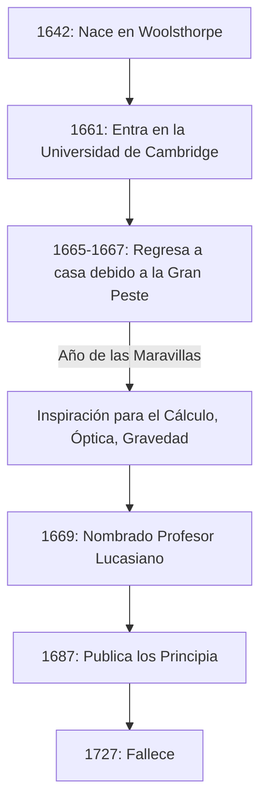

Si tuviéramos que nombrar a una persona que tuvo el impacto más profundo en el desarrollo de la ciencia en la historia de la humanidad, muchos nombrarían a **Isaac Newton** . Logró descubrimientos revolucionarios en diversos campos como la física, las matemáticas y la astronomía. No es exagerado decir que sus logros no fueron meros descubrimientos de una sola época, sino que construyeron los cimientos mismos de la ciencia moderna.

En este artículo, rastrearemos los episodios extraordinarios desde la educación de Newton hasta sus últimos años, y exploraremos profundamente sus hazañas matemáticas y físicas, centrándonos particularmente en el **cálculo** (el método de las fluxiones), el **teorema del binomio generalizado** y el **método de Newton** .

## La vida y los episodios de Newton

### Una infancia solitaria y su nacimiento en Woolsthorpe

Isaac Newton nació el día de Navidad de 1642 (calendario juliano; 4 de enero de 1643 en el calendario gregoriano) en el pequeño pueblo de Woolsthorpe, Lincolnshire, Inglaterra. Nacido prematuramente, su cuerpo era extremadamente pequeño, y al principio se dudaba de su supervivencia. Para empeorar las cosas, el padre de Newton había fallecido tres meses antes de su nacimiento.

Cuando tenía tres años, su madre se volvió a casar y dejó a Newton al cuidado de su abuela para unirse a su nuevo marido. Se dice que esta temprana experiencia de separación de su progenitor influyó profundamente en la personalidad de Newton, contribuyendo al carácter extremadamente reservado y desconfiado que desarrolló más tarde en su vida.

Cuando comenzó a asistir a la escuela local, Newton inicialmente no era un estudiante destacado. Sin embargo, se conserva una anécdota que cuenta que, tras ganar una pelea contra un compañero de clase que lo había acosado, resolvió vencerlo también en lo académico, lo que hizo que sus calificaciones se dispararan. También mostró un fuerte interés en construir juguetes mecánicos como relojes de sol, clepsidras y modelos de molinos de viento.

### La Universidad de Cambridge y el "Año de las Maravillas"

En 1661, Newton ingresó en el Trinity College de Cambridge. Si bien la universidad de la época enseñaba principalmente la filosofía aristotélica, Newton se sintió fuertemente atraído por los nuevos pensamientos científicos de René Descartes, Galileo Galilei y Johannes Kepler. Dejó una nota en su cuaderno afirmando: **"Amicus Plato amicus Aristoteles magis amica veritas"** (Platón es mi amigo, Aristóteles es mi amigo, pero mi mejor amiga es la verdad).

En 1665, un grave brote de la Gran Peste azotó Londres, lo que obligó a la universidad a cerrar. Newton regresó a su ciudad natal de Woolsthorpe y se sumergió en la contemplación durante aproximadamente un año y medio. Durante este período tranquilo y solitario, encontró la inspiración para sus tres grandes logros: los fundamentos del cálculo, la óptica (análisis espectral de la luz usando un prisma) y la ley de la gravitación universal. En la historia de la ciencia, este período se conoce como el **Annus Mirabilis** (Año de las Maravillas).



### La verdad detrás de la anécdota de la manzana

Al hablar de Newton, la anécdota de que "descubrió la gravitación universal al ver caer una manzana de un árbol" es increíblemente famosa, pero ¿realmente sucedió esto?

Según los registros de William Stukeley, biógrafo de Newton, el propio Newton relató este episodio en sus últimos años. Un día, mientras Newton estaba de un humor contemplativo bajo un manzano en su jardín, vio caer una manzana y se preguntó: "¿Por qué esa manzana debería descender siempre perpendicularmente al suelo? ¿Por qué no debería ir hacia los lados, o hacia arriba, sino constantemente hacia el centro de la tierra?".

En otras palabras, no se trata de una historia cómica de una manzana golpeándole la cabeza en un repentino destello de genialidad. Más bien, es un episodio que demuestra su profunda perspicacia, vinculando un fenómeno cotidiano trivial a una ley universal (gravitación universal): **"¿Acaso la fuerza por la cual la Tierra atrae a los objetos no es la misma que la fuerza que mantiene las órbitas de la luna y los planetas?"** .

### La disputa del cálculo con Leibniz

Newton concibió la idea del cálculo alrededor de 1665, pero no publicó inmediatamente sus resultados. Mientras tanto, el matemático alemán Gottfried Wilhelm Leibniz descubrió de forma independiente un método de cálculo en la década de 1670 y lo publicó como un artículo.

Esto provocó una de las disputas de prioridad más intensas en la historia de la ciencia sobre "quién descubrió el cálculo primero". Hoy en día, se concluye que ambos descubrieron el cálculo de forma independiente. Sin embargo, debido a que la notación introducida por Leibniz, como $dx$ y $\int$, era superior, la notación de Leibniz se extendió por Europa continental, mientras que la comunidad matemática británica se aferró obstinadamente a sus propios símbolos, quedándose temporalmente atrás como resultado.

---

## Profundizando en los logros matemáticos de Newton

A partir de aquí, explicaremos en detalle los logros específicos que Newton hizo en el campo de las matemáticas, acompañados de fórmulas.

### 1. La fundación del cálculo (Método de las fluxiones)

Newton llamó a su método de cálculo el **Método de las fluxiones** . Para capturar los cambios continuos físicos, llamó "Fluentes" a las cantidades que cambian continuamente a lo largo del tiempo, denotándolas con $x, y$, etc., y llamó a la tasa de su cambio "Fluxiones", usando símbolos como $\dot{x}, \dot{y}$.

Una de las mayores contribuciones de Newton fue establecer claramente el **Teorema Fundamental del Cálculo** : el hecho de que la derivación (encontrar tangentes) y la integración (encontrar áreas) son operaciones inversas entre sí.

La derivada de una función $f(x)$ se define usando límites de la siguiente manera:

$$
f'(x) = \lim_{\Delta x \to 0} \frac{f(x + \Delta x) - f(x)}{\Delta x}
$$

Aquí, $\Delta x$ representa un cambio infinitesimal. Usando este concepto de infinitesimales, Newton estableció un método sistemático para calcular la pendiente de la tangente a una curva y el área delimitada por una curva. Este método se convirtió en una poderosa herramienta matemática para analizar la velocidad y la aceleración de los objetos en movimiento.

### 2. Teorema del binomio generalizado

El teorema del binomio que se enseña en las matemáticas de secundaria es una fórmula para expandir $(x+y)^n$ cuando el exponente $n$ es un entero positivo.

$$
(x+y)^n = \sum_{k=0}^{n} \binom{n}{k} x^{n-k} y^k
$$

En 1665, Newton amplió este teorema a **exponentes fraccionarios y negativos** . Si el exponente es un número real $\alpha$, bajo la condición $|x| < 1$, se puede expandir como una serie infinita de la siguiente manera:

$$
(1+x)^\alpha = 1 + \alpha x + \frac{\alpha(\alpha-1)}{2!} x^2 + \frac{\alpha(\alpha-1)(\alpha-2)}{3!} x^3 + \dots
$$

Este teorema del binomio generalizado hizo posible expresar raíces cuadradas y recíprocos como series infinitas, sirviendo como un arma poderosa cuando Newton derivó las expansiones en series infinitas de funciones logarítmicas y trigonométricas (la precursora de la expansión de Taylor).

### 3. Método de Newton

El método de Newton (también conocido como método de Newton-Raphson) es un algoritmo iterativo para encontrar raíces reales aproximadas de una ecuación $f(x) = 0$. Este método es una técnica altamente eficiente que se acerca a la raíz utilizando la tangente de la función.

Dado un cierto valor aproximado $x_n$, el siguiente valor aproximado $x_{n+1}$ se encuentra mediante la siguiente relación de recurrencia:

$$
x_{n+1} = x_n - \frac{f(x_n)}{f'(x_n)}
$$

Por ejemplo, para encontrar la solución para $x^2 = 2$ (es decir, $\sqrt{2}$), establecemos $f(x) = x^2 - 2$. Su derivada es $f'(x) = 2x$. Sustituyendo esto en la relación de recurrencia se obtiene:

$$
x_{n+1} = x_n - \frac{x_n^2 - 2}{2x_n} = \frac{1}{2} \left( x_n + \frac{2}{x_n} \right)
$$

Esto produce una fórmula de recurrencia muy simple. Expresar esta fórmula matemática en un programa se ve así:

```python
# Ejemplo del método de Newton para encontrar la raíz cuadrada para la función f(x) = x^2 - 2
def newton_method_sqrt(value, tolerance=1e-7, max_iterations=100):
    # Establecer la suposición inicial
    x = value / 2.0
    for i in range(max_iterations):
        # f(x) = x^2 - value, f'(x) = 2x
        # Relación de recurrencia: x_{n+1} = x_n - f(x_n)/f'(x_n) = 0.5 * (x_n + value / x_n)
        next_x = 0.5 * (x + value / x)
        
        # Comprobar si ha convergido dentro del error de tolerancia
        if abs(x - next_x) < tolerance:
            return next_x
        x = next_x
    return x

# Imprimir el valor aproximado de la raíz cuadrada de 2
print(f"Valor aproximado de la raíz cuadrada de 2: {newton_method_sqrt(2)}")
```

Este algoritmo converge extremadamente rápido y todavía se usa ampliamente hoy en día para calcular raíces cuadradas en computadoras y en métodos numéricos para resolver ecuaciones no lineales.

---

## Aplicación a la física y los "Principia"

Si bien logró resultados innovadores en matemáticas, Newton los aplicó simultáneamente para dilucidar fenómenos físicos. Publicado en 1687 a instancias del astrónomo Edmond Halley, su libro **Philosophiæ Naturalis Principia Mathematica** (Principios matemáticos de la filosofía natural) se considera uno de los libros más importantes en la historia de la ciencia.

En este libro, formuló las siguientes **Tres Leyes del Movimiento** :
1. **Ley de inercia** (Primera Ley): Un objeto permanece en reposo o en movimiento uniforme en línea recta a menos que una fuerza externa actúe sobre él.
2. **Ley del movimiento** (Segunda Ley): La fuerza es igual al producto de la masa por la aceleración ( $F = ma$ ).
3. **Ley de acción y reacción** (Tercera Ley): Para cada acción, hay una reacción igual y opuesta.

Al integrar matemáticamente estas leyes con las leyes del movimiento planetario de Kepler, demostró la **Ley de Gravitación Universal** . Esta ley establece que la fuerza de atracción $F$ que actúa entre dos objetos con masa es proporcional a sus respectivas masas $m_1, m_2$ e inversamente proporcional al cuadrado de la distancia $r$ entre ellos.

$$
F = G \frac{m_1 m_2}{r^2} \quad \left( \text{donde } G \text{ es la constante de gravitación} \right)
$$

Esto demostró que tanto la caída de una manzana en la Tierra como el movimiento de un cuerpo celeste como la luna podrían explicarse por la misma ley física exacta. Fue verdaderamente un cambio de paradigma que anuló fundamentalmente la visión del mundo de la humanidad.

## Últimos años e impacto en la posteridad

Aunque Newton alcanzó la cúspide de la ciencia, se distanció de la investigación científica en sus últimos años. Se desempeñó como Guardián y Maestro de la Casa de la Moneda Real, asumiendo la tarea de tomar medidas enérgicas contra los falsificadores, y reinó sobre la comunidad científica británica como Presidente de la Royal Society. Curiosamente, la gran mayoría de los manuscritos que dejó no trataban sobre física o matemáticas, sino sobre **alquimia** y **cronología bíblica (teología)** . Fue el último de los hombres del Renacimiento y un intelectual de una época en la que la ciencia y la magia aún estaban indiferenciadas.

Newton dejó las siguientes humildes palabras con respecto a sus propios logros:

> "Si he visto más lejos, es poniéndome sobre los hombros de gigantes."

Estas palabras expresan su respeto, reconociendo que sus descubrimientos solo fueron posibles gracias al trabajo acumulado de grandes científicos del pasado (como Copérnico, Galileo y Kepler).

El sistema de mecánica clásica que estableció siguió siendo la base absoluta de la física durante unos 200 años hasta que Albert Einstein publicó la teoría de la relatividad a principios del siglo XX. Incluso hoy en día, la mecánica newtoniana se utiliza con extrema precisión y eficacia para calcular los fenómenos físicos de nuestra escala diaria y las órbitas de las sondas espaciales.

Isaac Newton, partiendo de una infancia solitaria, descubrió las verdades del universo a través de su extraordinaria concentración y genial intuición. Las numerosas leyes y teoremas matemáticos que dejó siguen sustentando nuestra tecnología y sociedad hasta el día de hoy.
