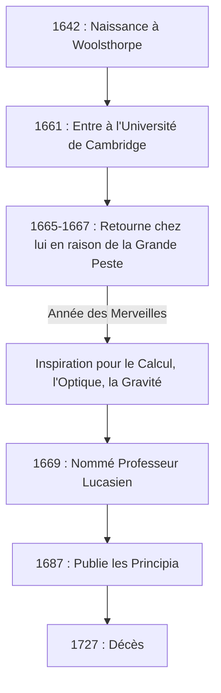

Si nous devions nommer une personne qui a eu l'impact le plus profond sur le développement de la science dans l'histoire de l'humanité, beaucoup nommeraient **[Isaac Newton](https://kenji.blog/fr/p/newton/)** . Il a réalisé des découvertes révolutionnaires dans divers domaines tels que la physique, les mathématiques et l'astronomie. Il n'est pas exagéré de dire que ses réalisations n'étaient pas de simples découvertes d'une seule époque, mais ont construit les fondements mêmes de la science moderne.

Dans cet article, nous retracerons les épisodes extraordinaires de l'éducation de Newton jusqu'à ses dernières années, et explorerons profondément ses exploits mathématiques et physiques, en nous concentrant particulièrement sur le **calcul** (la méthode des fluxions), le **théorème du binôme généralisé** , et la **méthode de Newton** .

## La vie et les épisodes de Newton

### Une enfance solitaire et sa naissance à Woolsthorpe

[Isaac Newton](https://kenji.blog/fr/p/newton/) est né le jour de Noël en 1642 (calendrier julien ; 4 janvier 1643 dans le calendrier grégorien) dans le petit village de Woolsthorpe, Lincolnshire, en Angleterre. Né prématurément, son corps était extrêmement petit et, au début, sa survie était incertaine. Pour aggraver les choses, le père de Newton était décédé trois mois avant sa naissance.

Lorsqu'il eut trois ans, sa mère se remaria et confia Newton aux soins de sa grand-mère pour rejoindre son nouveau mari. On dit que cette expérience précoce de séparation avec son parent a profondément influencé la personnalité de Newton, contribuant au caractère extrêmement secret et méfiant qu'il a développé plus tard dans sa vie.

Lorsqu'il a commencé à fréquenter l'école locale, Newton n'était au départ pas un élève exceptionnel. Cependant, une anecdote subsiste selon laquelle, après avoir remporté une bagarre contre un camarade de classe qui l'avait intimidé, il a résolu de le battre également sur le plan académique, ce qui a fait monter ses notes en flèche. Il a également montré un vif intérêt pour la construction de jouets mécaniques tels que des cadrans solaires, des clepsydres et des modèles de moulins à vent.

### L'Université de Cambridge et "l'Année des Merveilles"

En 1661, Newton entre au Trinity College de Cambridge. Alors que l'université de l'époque enseignait principalement la philosophie aristotélicienne, Newton était fortement attiré par les nouvelles pensées scientifiques de [René Descartes](https://kenji.blog/fr/p/descartes/), Galiléo Galilei et Johannes Kepler. Il a laissé une note dans son carnet déclarant : **"Amicus Plato amicus Aristoteles magis amica veritas"** (Platon est mon ami, Aristote est mon ami, mais ma plus grande amie est la vérité).

En 1665, une grave épidémie de la Grande Peste frappe Londres, forçant l'université à fermer. Newton est retourné dans sa ville natale de Woolsthorpe et s'est plongé dans la contemplation pendant environ un an et demi. Au cours de cette période calme et solitaire, il a trouvé l'inspiration de ses trois grandes réalisations : les fondements du calcul, l'optique (analyse spectrale de la lumière à l'aide d'un prisme) et la loi de la gravitation universelle. Dans l'histoire des sciences, cette période est connue sous le nom de **Annus Mirabilis** (Année des Merveilles).



### La vérité derrière l'anecdote de la pomme

En parlant de Newton, l'anecdote selon laquelle il "a découvert la gravitation universelle en voyant une pomme tomber d'un arbre" est incroyablement célèbre, mais cela s'est-il vraiment passé ?

Selon les archives de William Stukeley, le biographe de Newton, Newton lui-même a raconté cet épisode dans ses dernières années. Un jour, alors que Newton était d'humeur contemplative sous un pommier dans son jardin, il a vu une pomme tomber et s'est demandé : "Pourquoi cette pomme devrait-elle toujours descendre perpendiculairement au sol ? Pourquoi ne devrait-elle pas aller de côté, ou vers le haut, mais constamment vers le centre de la terre ?".

En d'autres termes, ce n'est pas l'histoire comique d'une pomme frappant sa tête dans un soudain éclair de génie. C'est plutôt un épisode qui démontre sa profonde perspicacité, reliant un phénomène banal du quotidien à une loi universelle (la gravitation universelle) : **"La force par laquelle la Terre attire les objets n'est-elle pas la même que la force qui maintient les orbites de la lune et des planètes ?"** .

### La querelle du calcul avec Leibniz

Newton a conçu l'idée du calcul vers 1665, mais il n'a pas immédiatement publié ses résultats. Pendant ce temps, le mathématicien allemand Gottfried Wilhelm Leibniz a découvert indépendamment une méthode de calcul dans les années 1670 et l'a publiée sous forme d'article.

Cela a déclenché l'une des disputes de priorité les plus intenses de l'histoire des sciences pour savoir "qui a découvert le calcul en premier". Aujourd'hui, il est conclu que tous deux ont découvert le calcul de manière indépendante. Cependant, parce que la notation introduite par Leibniz, comme $dx$ et $\int$, était supérieure, la notation de Leibniz s'est répandue dans toute l'Europe continentale, tandis que la communauté mathématique britannique s'en est obstinément tenue à ses propres symboles, prenant temporairement du retard en conséquence.

---

## Plongée au cœur des réalisations mathématiques de Newton

À partir d'ici, nous expliquerons en détail les réalisations spécifiques que Newton a accomplies dans le domaine des mathématiques, accompagnées de formules.

### 1. La fondation du calcul (Méthode des fluxions)

Newton a appelé sa méthode de calcul la **Méthode des fluxions** . Pour capturer les changements continus physiques, il a appelé "Fluentes" les quantités qui changent continuellement au fil du temps, les désignant par $x, y$, etc., et a appelé le taux de leur changement "Fluxions", en utilisant des symboles comme $\dot{x}, \dot{y}$.

L'une des plus grandes contributions de Newton a été d'établir clairement le **Théorème fondamental de l'analyse** —le fait que la dérivation (trouver des tangentes) et l'intégration (trouver des aires) sont des opérations inverses l'une de l'autre.

La dérivée d'une fonction $f(x)$ est définie en utilisant des limites comme suit :

$$
f'(x) = \lim_{\Delta x \to 0} \frac{f(x + \Delta x) - f(x)}{\Delta x}
$$

Ici, $\Delta x$ représente un changement infinitésimal. En utilisant ce concept d'infinitésimal, Newton a établi une méthode systématique pour calculer la pente de la tangente à une courbe et l'aire délimitée par une courbe. Cette méthode est devenue un puissant outil mathématique pour analyser la vitesse et l'accélération des objets en mouvement.

### 2. Théorème du binôme généralisé

Le théorème du binôme enseigné dans les mathématiques du lycée est une formule pour développer $(x+y)^n$ lorsque l'exposant $n$ est un entier positif.

$$
(x+y)^n = \sum_{k=0}^{n} \binom{n}{k} x^{n-k} y^k
$$

En 1665, Newton a étendu ce théorème aux **exposants fractionnaires et négatifs** . Si l'exposant est un nombre réel $\alpha$, sous la condition $|x| < 1$, il peut être développé comme une série infinie comme suit :

$$
(1+x)^\alpha = 1 + \alpha x + \frac{\alpha(\alpha-1)}{2!} x^2 + \frac{\alpha(\alpha-1)(\alpha-2)}{3!} x^3 + \dots
$$

Ce théorème du binôme généralisé a permis d'exprimer les racines carrées et les réciproques sous forme de séries infinies, servant d'arme puissante lorsque Newton a dérivé les développements en séries infinies de fonctions logarithmiques et trigonométriques (le précurseur du développement de Taylor).

### 3. Méthode de Newton

La méthode de Newton (également connue sous le nom de méthode de Newton-Raphson) est un algorithme itératif pour trouver des racines réelles approchées d'une équation $f(x) = 0$. Cette méthode est une technique très efficace qui s'approche de la racine en utilisant la tangente de la fonction.

Étant donné une certaine valeur approximative $x_n$, la valeur approximative suivante $x_{n+1}$ est trouvée par la relation de récurrence suivante :

$$
x_{n+1} = x_n - \frac{f(x_n)}{f'(x_n)}
$$

Par exemple, pour trouver la solution pour $x^2 = 2$ (c'est-à-dire $\sqrt{2}$), nous posons $f(x) = x^2 - 2$. Sa dérivée est $f'(x) = 2x$. La substitution de ceci dans la relation de récurrence donne :

$$
x_{n+1} = x_n - \frac{x_n^2 - 2}{2x_n} = \frac{1}{2} \left( x_n + \frac{2}{x_n} \right)
$$

Cela donne une formule de récurrence très simple. L'expression de cette formule mathématique dans un programme se présente comme suit :

```python
# Exemple de la méthode de Newton pour trouver la racine carrée de la fonction f(x) = x^2 - 2
def newton_method_sqrt(value, tolerance=1e-7, max_iterations=100):
    # Définir l'hypothèse initiale
    x = value / 2.0
    for i in range(max_iterations):
        # f(x) = x^2 - value, f'(x) = 2x
        # Relation de récurrence : x_{n+1} = x_n - f(x_n)/f'(x_n) = 0.5 * (x_n + value / x_n)
        next_x = 0.5 * (x + value / x)
        
        # Vérifier si elle a convergé dans l'erreur de tolérance
        if abs(x - next_x) < tolerance:
            return next_x
        x = next_x
    return x

# Afficher la valeur approximative de la racine carrée de 2
print(f"Valeur approximative de la racine carrée de 2 : {newton_method_sqrt(2)}")
```

Cet algorithme converge extrêmement rapidement et est encore largement utilisé aujourd'hui pour calculer des racines carrées dans les ordinateurs et dans les méthodes numériques pour résoudre des équations non linéaires.

---

## Application à la physique et les "Principia"

Tout en obtenant des résultats novateurs en mathématiques, Newton les a simultanément appliqués à l'élucidation de phénomènes physiques. Publié en 1687 sur les fortes recommandations de l'astronome Edmond Halley, son livre **Philosophiæ Naturalis Principia Mathematica** (Principes mathématiques de la philosophie naturelle) est considéré comme l'un des livres les plus importants de l'histoire des sciences.

Dans ce livre, il a formulé les **Trois lois du mouvement** suivantes :
1. **Loi de l'inertie** (Première loi) : Un objet reste au repos ou en mouvement uniforme en ligne droite à moins qu'une force externe n'agisse sur lui.
2. **Loi du mouvement** (Deuxième loi) : La force est égale au produit de la masse et de l'accélération ( $F = ma$ ).
3. **Loi d'action et de réaction** (Troisième loi) : Pour chaque action, il y a une réaction égale et opposée.

En intégrant mathématiquement ces lois aux lois du mouvement planétaire de Kepler, il a prouvé la **Loi de la gravitation universelle** . Cette loi stipule que la force d'attraction $F$ agissant entre deux objets massifs est proportionnelle à leurs masses respectives $m_1, m_2$ et inversement proportionnelle au carré de la distance $r$ qui les sépare.

$$
F = G \frac{m_1 m_2}{r^2} \quad \left( \text{où } G \text{ est la constante gravitationnelle} \right)
$$

Cela prouvait que la chute d'une pomme sur Terre et le mouvement d'un corps céleste comme la Lune pouvaient être expliqués par la même loi physique exacte. C'était véritablement un changement de paradigme qui a fondamentalement renversé la vision du monde de l'humanité.

## Dernières années et impact sur la postérité

Bien que Newton ait atteint le sommet de la science, il a pris ses distances avec la recherche scientifique dans ses dernières années. Il a occupé le poste de directeur et maître de la Monnaie royale, se chargeant de réprimer sévèrement les faux-monnayeurs, et a régné sur la communauté scientifique britannique en tant que président de la Royal Society. Fait intéressant, la grande majorité des manuscrits qu'il a laissés derrière lui ne portaient pas sur la physique ou les mathématiques, mais sur l' **alchimie** et la **chronologie biblique (théologie)** . Il était le dernier des hommes de la Renaissance et un intellectuel d'une époque où la science et la magie étaient encore indifférenciées.

Newton a laissé les humbles mots suivants concernant ses propres réalisations :

> "Si j'ai vu plus loin, c'est en me tenant sur les épaules de géants."

Ces mots expriment son respect, reconnaissant que ses découvertes n'ont été possibles que grâce aux travaux accumulés de grands scientifiques du passé (tels que Copernic, Galilée et Kepler).

Le système de mécanique classique qu'il a établi est resté le fondement absolu de la physique pendant environ 200 ans jusqu'à ce qu'Albert Einstein publie la théorie de la relativité au début du 20e siècle. Aujourd'hui encore, la mécanique newtonienne est utilisée de manière extrêmement précise et efficace pour calculer les phénomènes physiques de notre échelle quotidienne et les orbites des sondes spatiales.

[Isaac Newton](https://kenji.blog/fr/p/newton/), partant d'une enfance solitaire, a percé les vérités de l'univers grâce à sa concentration extraordinaire et son intuition géniale. Les nombreuses lois et théorèmes mathématiques qu'il a laissés derrière lui continuent de soutenir notre technologie et notre société à ce jour.
