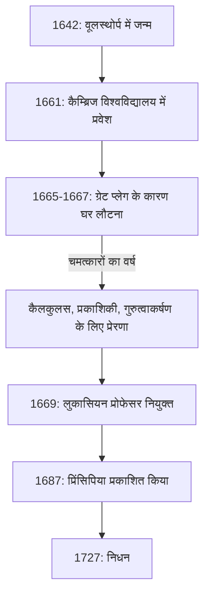

अगर हमें किसी एक ऐसे व्यक्ति का नाम लेना हो जिसका मानव इतिहास में विज्ञान के विकास पर सबसे गहरा प्रभाव पड़ा है, तो कई लोग **[आइजैक न्यूटन](https://kenji.blog/hi/p/newton/)** का नाम लेंगे। उन्होंने भौतिकी, गणित और खगोल विज्ञान जैसे विविध क्षेत्रों में क्रांतिकारी खोजें कीं। यह कहना अतिशयोक्ति नहीं होगी कि उनकी उपलब्धियाँ केवल एक युग की खोजें नहीं थीं, बल्कि उन्होंने आधुनिक विज्ञान की नींव रखी।

इस लेख में, हम न्यूटन की परवरिश से लेकर उनके अंतिम वर्षों तक के असाधारण प्रसंगों का पता लगाएंगे, और उनके गणितीय और भौतिक कारनामों का गहराई से पता लगाएंगे, विशेष रूप से **कैलकुलस** (फ्लक्सियंस की विधि), **सामान्यीकृत द्विपद प्रमेय** , और **न्यूटन की विधि** पर ध्यान केंद्रित करते हुए।

## न्यूटन का जीवन और प्रसंग

### एक एकांत बचपन और वूलस्थोर्प में जन्म

[आइजैक न्यूटन](https://kenji.blog/hi/p/newton/) का जन्म 1642 के क्रिसमस के दिन (जूलियन कैलेंडर; ग्रेगोरियन कैलेंडर में 4 जनवरी 1643) इंग्लैंड के लिंकनशायर के छोटे से गांव वूलस्थोर्प में हुआ था। समय से पहले पैदा हुए, उनका शरीर बेहद छोटा था, और पहले तो उनके जीवित रहने पर संदेह था। मामले को बदतर बनाने के लिए, न्यूटन के पिता का उनके जन्म से तीन महीने पहले निधन हो गया था।

जब वह तीन साल के थे, उनकी माँ ने पुनर्विवाह कर लिया और न्यूटन को उनकी दादी की देखभाल में छोड़कर अपने नए पति के पास चली गईं। कहा जाता है कि माता-पिता से अलग होने के इस शुरुआती अनुभव ने न्यूटन के व्यक्तित्व को गहराई से प्रभावित किया, जिससे उनके जीवन में बाद में विकसित हुए बेहद गुप्त और संदिग्ध चरित्र में योगदान मिला।

जब उन्होंने स्थानीय स्कूल में जाना शुरू किया, तो न्यूटन शुरू में एक उत्कृष्ट छात्र नहीं थे। हालाँकि, एक किस्सा बाकी है कि एक सहपाठी के खिलाफ लड़ाई जीतने के बाद जिसने उन्हें धमकाया था, उन्होंने उसे शिक्षाविदों में भी हराने का संकल्प लिया, जिससे उनके ग्रेड आसमान छूने लगे। उन्होंने सूंडियल, पानी की घड़ियां और पवनचक्की के मॉडल जैसे यांत्रिक खिलौने बनाने में भी गहरी दिलचस्पी दिखाई।

### कैम्ब्रिज विश्वविद्यालय और "चमत्कारों का वर्ष"

1661 में, न्यूटन ने ट्रिनिटी कॉलेज, कैम्ब्रिज में प्रवेश किया। जबकि उस समय विश्वविद्यालय मुख्य रूप से अरिस्टोटेलियन दर्शन पढ़ाता था, न्यूटन [रेने डेसकार्टेस](https://kenji.blog/hi/p/descartes/), गैलीलियो गैलीली और जोहान्स केप्लर के नए वैज्ञानिक विचारों की ओर दृढ़ता से आकर्षित थे। उन्होंने अपनी नोटबुक में एक नोट छोड़ा जिसमें लिखा था: **"Amicus Plato amicus Aristoteles magis amica veritas"** (प्लेटो मेरा मित्र है, अरस्तू मेरा मित्र है, लेकिन मेरी सबसे बड़ी मित्र सच्चाई है)।

1665 में, ग्रेट प्लेग के एक गंभीर प्रकोप ने लंदन को प्रभावित किया, जिससे विश्वविद्यालय को बंद करना पड़ा। न्यूटन अपने गृहनगर वूलस्थोर्प लौट आए और लगभग डेढ़ साल तक चिंतन में डूबे रहे। इस शांत और एकांत अवधि के दौरान, उन्हें अपनी तीन प्रमुख उपलब्धियों की प्रेरणा मिली: कैलकुलस की नींव, प्रकाशिकी (प्रिज्म का उपयोग करके प्रकाश का वर्णक्रमीय विश्लेषण), और सार्वभौमिक गुरुत्वाकर्षण का नियम। विज्ञान के इतिहास में, इस अवधि को **Annus Mirabilis** (चमत्कारों का वर्ष) के रूप में जाना जाता है।



### सेब के किस्से के पीछे की सच्चाई

न्यूटन की बात करें तो यह किस्सा कि "उन्होंने पेड़ से गिरते हुए सेब को देखकर सार्वभौमिक गुरुत्वाकर्षण की खोज की" अविश्वसनीय रूप से प्रसिद्ध है, लेकिन क्या यह वास्तव में हुआ था?

न्यूटन के जीवनी लेखक विलियम स्टुकले के रिकॉर्ड के अनुसार, न्यूटन ने स्वयं अपने अंतिम वर्षों में इस घटना का वर्णन किया था। एक दिन, जब न्यूटन अपने बगीचे में सेब के पेड़ के नीचे एक चिंतनशील मनोदशा में थे, उन्होंने एक सेब को गिरते देखा और सोचा: "वह सेब हमेशा जमीन पर लंबवत क्यों गिरना चाहिए? इसे बग़ल में, या ऊपर की ओर क्यों नहीं जाना चाहिए, बल्कि लगातार पृथ्वी के केंद्र की ओर क्यों जाना चाहिए?"।

दूसरे शब्दों में, यह सेब के उनके सिर पर अचानक एक प्रतिभा की चमक में टकराने की हास्यपूर्ण कहानी नहीं है। बल्कि, यह एक ऐसा प्रसंग है जो उनकी गहरी अंतर्दृष्टि को प्रदर्शित करता है, जो एक तुच्छ रोजमर्रा की घटना को एक सार्वभौमिक नियम (सार्वभौमिक गुरुत्वाकर्षण) से जोड़ता है: **"क्या वह बल जिसके द्वारा पृथ्वी वस्तुओं को खींचती है, वही बल नहीं है जो चंद्रमा और ग्रहों की कक्षाओं को बनाए रखता है?"** ।

### लाइबनिज के साथ कैलकुलस विवाद

न्यूटन ने 1665 के आसपास कैलकुलस के विचार की कल्पना की, लेकिन उन्होंने तुरंत अपने परिणाम प्रकाशित नहीं किए। इस बीच, जर्मन गणितज्ञ गॉटफ्रीड विल्हेम लाइबनिज ने 1670 के दशक में स्वतंत्र रूप से कैलकुलस की एक विधि की खोज की और इसे एक पेपर के रूप में प्रकाशित किया।

इसने विज्ञान के इतिहास में "किसने पहले कैलकुलस की खोज की" पर सबसे तीव्र प्राथमिकता विवादों में से एक को जन्म दिया। आज, यह निष्कर्ष निकाला गया है कि दोनों ने स्वतंत्र रूप से कैलकुलस की खोज की थी। हालाँकि, क्योंकि लीबनिज़ द्वारा पेश किया गया अंकन, जैसे कि $dx$ और $\int$, बेहतर था, इसलिए लीबनिज़ का अंकन पूरे महाद्वीपीय यूरोप में फैल गया, जबकि ब्रिटिश गणितीय समुदाय हठपूर्वक अपने प्रतीकों पर अड़ा रहा, जिसके परिणामस्वरूप वह अस्थायी रूप से पिछड़ गया।

---

## न्यूटन की गणितीय उपलब्धियों में गहरा गोता

यहाँ से, हम उन विशिष्ट उपलब्धियों को विस्तार से समझाएंगे जो न्यूटन ने गणित के क्षेत्र में सूत्र के साथ की थीं।

### 1. कैलकुलस की स्थापना (फ्लक्सियंस की विधि)

न्यूटन ने कैलकुलस की अपनी विधि को **फ्लक्सियंस की विधि** कहा। भौतिक निरंतर परिवर्तनों को पकड़ने के लिए, उन्होंने उन मात्राओं को कहा जो समय के साथ लगातार बदलती हैं "फ्लुएंट्स", उन्हें $x, y$, आदि के साथ दर्शाते हुए, और उनके परिवर्तन की दर को "फ्लक्सियंस" कहा, प्रतीकों का उपयोग करते हुए जैसे $\dot{x}, \dot{y}$।

न्यूटन के सबसे बड़े योगदानों में से एक **कैलकुलस के मौलिक प्रमेय** को स्पष्ट रूप से स्थापित करना था - यह तथ्य कि विभेदीकरण (स्पर्शरेखा खोजना) और एकीकरण (क्षेत्र खोजना) एक दूसरे के विपरीत संचालन हैं।

एक फलन $f(x)$ का व्युत्पन्न सीमा का उपयोग करके निम्नानुसार परिभाषित किया गया है:

$$
f'(x) = \lim_{\Delta x \to 0} \frac{f(x + \Delta x) - f(x)}{\Delta x}
$$

यहाँ, $\Delta x$ एक अतिसूक्ष्म परिवर्तन का प्रतिनिधित्व करता है। अतिसूक्ष्म के इस अवधारणा का उपयोग करते हुए, न्यूटन ने एक वक्र के स्पर्शरेखा के ढलान और वक्र से घिरे क्षेत्र की गणना के लिए एक व्यवस्थित विधि स्थापित की। यह विधि गतिमान वस्तुओं के वेग और त्वरण का विश्लेषण करने के लिए एक शक्तिशाली गणितीय उपकरण बन गई।

### 2. सामान्यीकृत द्विपद प्रमेय

हाई स्कूल के गणित में पढ़ाया जाने वाला द्विपद प्रमेय $(x+y)^n$ के विस्तार के लिए एक सूत्र है जब घातांक $n$ एक धनात्मक पूर्णांक होता है।

$$
(x+y)^n = \sum_{k=0}^{n} \binom{n}{k} x^{n-k} y^k
$$

1665 में, न्यूटन ने इस प्रमेय को **भिन्नात्मक और ऋणात्मक घातांक** तक बढ़ाया। यदि घातांक एक वास्तविक संख्या $\alpha$ है, तो शर्त $|x| < 1$ के तहत, इसे एक अनंत श्रृंखला के रूप में निम्नानुसार विस्तारित किया जा सकता है:

$$
(1+x)^\alpha = 1 + \alpha x + \frac{\alpha(\alpha-1)}{2!} x^2 + \frac{\alpha(\alpha-1)(\alpha-2)}{3!} x^3 + \dots
$$

इस सामान्यीकृत द्विपद प्रमेय ने वर्गमूल और व्युत्क्रमों को अनंत श्रृंखला के रूप में व्यक्त करना संभव बना दिया, जब न्यूटन ने लघुगणकीय और त्रिकोणमितीय कार्यों के अनंत श्रृंखला विस्तार (टेलर विस्तार के अग्रदूत) को प्राप्त किया तो यह एक शक्तिशाली हथियार के रूप में काम करता था।

### 3. न्यूटन की विधि

न्यूटन की विधि (जिसे न्यूटन-रैफसन विधि के रूप में भी जाना जाता है) एक समीकरण $f(x) = 0$ के अनुमानित वास्तविक मूल खोजने के लिए एक पुनरावृत्त एल्गोरिदम है। यह विधि एक अत्यधिक कुशल तकनीक है जो फलन की स्पर्शरेखा का उपयोग करके मूल तक पहुँचती है।

एक निश्चित अनुमानित मान $x_n$ दिए जाने पर, अगला अनुमानित मान $x_{n+1}$ निम्नलिखित पुनरावृत्ति संबंध द्वारा पाया जाता है:

$$
x_{n+1} = x_n - \frac{f(x_n)}{f'(x_n)}
$$

उदाहरण के लिए, $x^2 = 2$ (अर्थात $\sqrt{2}$) के लिए समाधान खोजने के लिए, हम $f(x) = x^2 - 2$ निर्धारित करते हैं। इसका व्युत्पन्न $f'(x) = 2x$ है। इसे पुनरावृत्ति संबंध में प्रतिस्थापित करने से मिलता है:

$$
x_{n+1} = x_n - \frac{x_n^2 - 2}{2x_n} = \frac{1}{2} \left( x_n + \frac{2}{x_n} \right)
$$

यह एक बहुत ही सरल पुनरावृत्ति सूत्र देता है। एक प्रोग्राम में इस गणितीय सूत्र को व्यक्त करना निम्न जैसा दिखता है:

```python
# फलन f(x) = x^2 - 2 के लिए वर्गमूल खोजने के लिए न्यूटन की विधि का उदाहरण
def newton_method_sqrt(value, tolerance=1e-7, max_iterations=100):
    # प्रारंभिक अनुमान निर्धारित करें
    x = value / 2.0
    for i in range(max_iterations):
        # f(x) = x^2 - value, f'(x) = 2x
        # पुनरावृत्ति संबंध: x_{n+1} = x_n - f(x_n)/f'(x_n) = 0.5 * (x_n + value / x_n)
        next_x = 0.5 * (x + value / x)
        
        # जाँच करें कि क्या यह सहनशीलता त्रुटि के भीतर अभिसरित हो गया है
        if abs(x - next_x) < tolerance:
            return next_x
        x = next_x
    return x

# 2 के वर्गमूल का अनुमानित मान प्रिंट करें
print(f"2 के वर्गमूल का अनुमानित मान: {newton_method_sqrt(2)}")
```

यह एल्गोरिथ्म बहुत तेजी से अभिसरित होता है और आज भी कंप्यूटर में वर्गमूल की गणना करने और अरेखीय समीकरणों को हल करने के लिए संख्यात्मक विधियों में व्यापक रूप से उपयोग किया जाता है।

---

## भौतिकी के लिए आवेदन और "प्रिंसिपिया"

गणित में अभिनव परिणाम प्राप्त करते हुए, न्यूटन ने भौतिक घटनाओं को स्पष्ट करने के लिए उनका एक साथ उपयोग किया। खगोलशास्त्री एडमंड हैली के कड़े आग्रह पर 1687 में प्रकाशित उनकी पुस्तक **Philosophiæ Naturalis Principia Mathematica** (प्राकृतिक दर्शन के गणितीय सिद्धांत) को विज्ञान के इतिहास की सबसे महत्वपूर्ण पुस्तकों में से एक माना जाता है।

इस पुस्तक में, उन्होंने निम्नलिखित **गति के तीन नियम** तैयार किए:
1. **जड़त्व का नियम** (पहला नियम): कोई वस्तु तब तक विरामावस्था में या सीधी रेखा में एकसमान गति में रहती है जब तक कि उस पर कोई बाहरी बल कार्य न करे।
2. **गति का नियम** (दूसरा नियम): बल द्रव्यमान और त्वरण के उत्पाद के बराबर होता है ( $F = ma$ )।
3. **क्रिया और प्रतिक्रिया का नियम** (तीसरा नियम): प्रत्येक क्रिया के लिए, एक समान और विपरीत प्रतिक्रिया होती है।

केप्लर के ग्रहों की गति के नियमों के साथ गणितीय रूप से इन नियमों को एकीकृत करके, उन्होंने **सार्वभौमिक गुरुत्वाकर्षण का नियम** सिद्ध किया। यह नियम बताता है कि द्रव्यमान वाली दो वस्तुओं के बीच काम करने वाला आकर्षण बल $F$ उनके संबंधित द्रव्यमान $m_1, m_2$ के समानुपाती और उनके बीच की दूरी $r$ के वर्ग के व्युत्क्रमानुपाती होता है।

$$
F = G \frac{m_1 m_2}{r^2} \quad \left( \text{जहाँ } G \text{ गुरुत्वाकर्षण नियतांक है} \right)
$$

इससे साबित हो गया कि पृथ्वी पर सेब का गिरना और चंद्रमा जैसे खगोलीय पिंड की गति दोनों को एक ही सटीक भौतिक नियम से समझाया जा सकता है। यह वास्तव में एक आदर्श बदलाव था जिसने मानवता के विश्वदृष्टि को मौलिक रूप से उलट दिया।

## बाद के वर्ष और भावी पीढ़ी पर प्रभाव

हालाँकि न्यूटन विज्ञान के शिखर पर पहुँच गए थे, लेकिन उन्होंने अपने अंतिम वर्षों में खुद को वैज्ञानिक अनुसंधान से दूर कर लिया। उन्होंने रॉयल मिंट के वार्डन और मास्टर के रूप में कार्य किया, जालसाजों पर सख्ती से नकेल कसने का काम संभाला और रॉयल सोसाइटी के अध्यक्ष के रूप में ब्रिटिश वैज्ञानिक समुदाय पर राज किया। दिलचस्प बात यह है कि उनके द्वारा छोड़ी गई अधिकांश पांडुलिपियाँ भौतिकी या गणित के बारे में नहीं थीं, बल्कि **कीमिया** और **बाइबिल कालक्रम (धर्मशास्त्र)** के बारे में थीं। वह पुनर्जागरण के अंतिम व्यक्ति थे और एक ऐसे युग के बुद्धिजीवी थे जहाँ विज्ञान और जादू अभी भी अविभाज्य थे।

न्यूटन ने अपनी स्वयं की उपलब्धियों के संबंध में निम्नलिखित विनम्र शब्द छोड़े:

> "यदि मैंने और आगे देखा है तो यह दिग्गजों के कंधों पर खड़े होकर देखा है।"

ये शब्द उनके सम्मान को व्यक्त करते हैं, यह स्वीकार करते हुए कि उनकी खोजें अतीत के महान वैज्ञानिकों (जैसे कोपरनिकस, गैलीलियो और केप्लर) के संचित कार्यों के कारण ही संभव थीं।

उन्होंने जो शास्त्रीय यांत्रिकी की प्रणाली स्थापित की, वह 20वीं सदी की शुरुआत में अल्बर्ट आइंस्टीन द्वारा सापेक्षता के सिद्धांत को प्रकाशित करने तक लगभग 200 वर्षों तक भौतिकी की पूर्ण नींव बनी रही। आज भी, हमारे दैनिक पैमाने की भौतिक घटनाओं और अंतरिक्ष जांच की कक्षाओं की गणना में न्यूटनियन यांत्रिकी का उपयोग बहुत सटीक और प्रभावी ढंग से किया जाता है।

[आइजैक न्यूटन](https://kenji.blog/hi/p/newton/), एक एकांत बचपन से शुरू होकर, अपनी असाधारण एकाग्रता और प्रतिभाशाली अंतर्ज्ञान के माध्यम से ब्रह्मांड के सत्य को खोलते हैं। उनके द्वारा छोड़े गए कई कानून और गणितीय प्रमेय आज भी हमारी तकनीक और समाज का समर्थन करते हैं।
