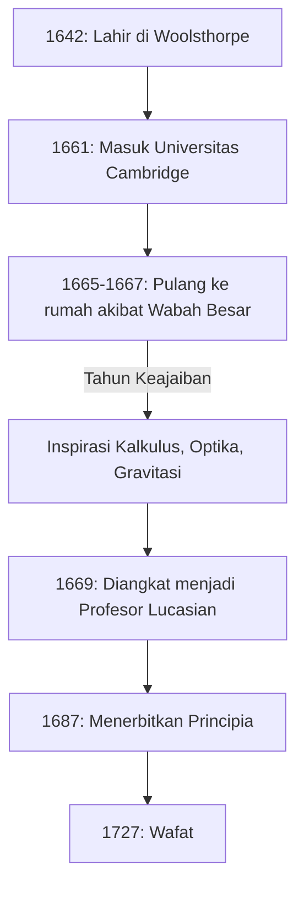

Jika kita harus menyebutkan satu orang yang memiliki dampak paling mendalam terhadap perkembangan ilmu pengetahuan dalam sejarah manusia, banyak yang akan menyebut **Isaac Newton** . Ia mencapai penemuan-penemuan revolusioner di berbagai bidang seperti fisika, matematika, dan astronomi. Tidak berlebihan untuk mengatakan bahwa pencapaiannya bukan sekadar penemuan pada satu era, melainkan membangun fondasi bagi ilmu pengetahuan modern.

Dalam artikel ini, kita akan menelusuri episode luar biasa dari masa kecil Newton hingga tahun-tahun terakhirnya, dan menggali lebih dalam pencapaian matematis dan fisikanya, dengan fokus khusus pada **kalkulus** (metode fluksion), **teorema binomial yang digeneralisasi** , dan **metode Newton** .

## Kehidupan dan Episode Newton

### Masa Kecil yang Sepi dan Kelahiran di Woolsthorpe

Isaac Newton lahir pada Hari Natal tahun 1642 (kalender Julian; 4 Januari 1643, dalam kalender Gregorian) di desa kecil Woolsthorpe, Lincolnshire, Inggris. Lahir prematur, tubuhnya sangat kecil, dan pada awalnya, kelangsungan hidupnya diragukan. Lebih buruk lagi, ayah Newton telah meninggal tiga bulan sebelum kelahirannya.

Ketika ia berusia tiga tahun, ibunya menikah lagi dan menitipkan Newton dalam asuhan neneknya untuk bergabung dengan suami barunya. Pengalaman awal perpisahan dari orang tuanya ini dikatakan sangat memengaruhi kepribadian Newton, berkontribusi pada karakter yang sangat tertutup dan curiga yang ia kembangkan di kemudian hari.

Saat mulai bersekolah di sekolah setempat, Newton pada awalnya bukanlah murid yang berprestasi. Namun, ada sebuah anekdot yang menceritakan bahwa setelah memenangkan perkelahian dengan teman sekelas yang merundungnya, ia memutuskan untuk mengalahkannya dalam bidang akademik juga, sehingga nilainya melonjak. Ia juga menunjukkan minat yang besar dalam membuat mainan mekanis seperti jam matahari, jam air, dan model kincir angin.

### Universitas Cambridge dan "Tahun Keajaiban"

Pada tahun 1661, Newton masuk ke Trinity College, Cambridge. Meskipun universitas pada saat itu terutama mengajarkan filosofi Aristoteles, Newton sangat tertarik pada pemikiran ilmiah baru dari René Descartes, Galileo Galilei, dan Johannes Kepler. Ia meninggalkan catatan di buku catatannya yang menyatakan: **"Amicus Plato amicus Aristoteles magis amica veritas"** (Plato adalah temanku, Aristoteles adalah temanku, tetapi teman terbesarku adalah kebenaran).

Pada tahun 1665, wabah besar Melanda London, memaksa universitas untuk ditutup. Newton kembali ke kampung halamannya di Woolsthorpe dan tenggelam dalam perenungan selama sekitar satu setengah tahun. Selama periode yang tenang dan sepi ini, ia menemukan inspirasi untuk tiga pencapaian utamanya: dasar-dasar kalkulus, optika (analisis spektrum cahaya menggunakan prisma), dan hukum gravitasi universal. Dalam sejarah sains, periode ini dikenal sebagai **Annus Mirabilis** (Tahun Keajaiban).



### Kebenaran di Balik Anekdot Apel

Saat berbicara tentang Newton, anekdot bahwa ia "menemukan gravitasi universal setelah melihat apel jatuh dari pohon" sangatlah terkenal, tetapi apakah hal ini benar-benar terjadi?

Menurut catatan William Stukeley, penulis biografi Newton, Newton sendiri menceritakan episode ini pada tahun-tahun terakhirnya. Suatu hari, ketika Newton sedang merenung di bawah pohon apel di kebunnya, ia melihat sebuah apel jatuh dan bertanya-tanya: "Mengapa apel itu selalu jatuh tegak lurus ke tanah? Mengapa tidak menyamping, atau ke atas, tetapi selalu menuju pusat bumi?".

Dengan kata lain, ini bukanlah cerita komikal tentang sebuah apel yang mengenai kepalanya dalam sekejap kejeniusan. Sebaliknya, ini adalah episode yang menunjukkan wawasan mendalamnya, menghubungkan fenomena sehari-hari yang sepele dengan hukum universal (gravitasi universal): **"Bukankah gaya yang menarik benda-benda ke Bumi sama dengan gaya yang mempertahankan orbit bulan dan planet-planet?"** .

### Perselisihan Kalkulus dengan Leibniz

Newton menyusun gagasan kalkulus sekitar tahun 1665, tetapi ia tidak segera menerbitkan hasilnya. Sementara itu, matematikawan Jerman Gottfried Wilhelm Leibniz secara independen menemukan metode kalkulus pada tahun 1670-an dan menerbitkannya sebagai makalah.

Hal ini memicu salah satu perselisihan prioritas paling sengit dalam sejarah sains tentang "siapa yang menemukan kalkulus lebih dulu". Saat ini, disimpulkan bahwa keduanya secara independen menemukan kalkulus. Namun, karena notasi yang diperkenalkan oleh Leibniz, seperti $dx$ dan $\int$, lebih unggul, notasi Leibniz menyebar ke seluruh benua Eropa, sementara komunitas matematika Inggris bersikeras pada simbol mereka sendiri, dan akibatnya tertinggal untuk sementara waktu.

---

## Menggali Lebih Dalam Pencapaian Matematis Newton

Mulai dari sini, kita akan menjelaskan secara rinci pencapaian spesifik yang dibuat Newton dalam bidang matematika, disertai dengan rumus-rumus.

### 1. Dasar Kalkulus (Metode Fluksion)

Newton menyebut metode kalkulusnya sebagai **Metode Fluksion** . Untuk menangkap perubahan fisik yang berkelanjutan, ia menyebut kuantitas yang berubah secara terus-menerus dari waktu ke waktu sebagai "Fluen", menyimbolkannya dengan $x, y$, dll., dan menyebut laju perubahannya sebagai "Fluksion", menggunakan simbol-simbol seperti $\dot{x}, \dot{y}$.

Salah satu kontribusi terbesar Newton adalah menetapkan secara jelas **Teorema Dasar Kalkulus** —fakta bahwa diferensiasi (mencari garis singgung) dan integrasi (mencari luas) adalah operasi yang saling berkebalikan.

Turunan dari sebuah fungsi $f(x)$ didefinisikan menggunakan limit sebagai berikut:

$$
f'(x) = \lim_{\Delta x \to 0} \frac{f(x + \Delta x) - f(x)}{\Delta x}
$$

Di sini, $\Delta x$ mewakili perubahan yang sangat kecil (infinitesimal). Dengan menggunakan konsep infinitesimal ini, Newton menetapkan metode sistematis untuk menghitung kemiringan garis singgung suatu kurva dan luas wilayah yang dibatasi oleh kurva tersebut. Metode ini menjadi alat matematika yang ampuh untuk menganalisis kecepatan dan percepatan benda yang bergerak.

### 2. Teorema Binomial yang Digeneralisasi

Teorema binomial yang diajarkan dalam matematika sekolah menengah adalah rumus untuk menjabarkan $(x+y)^n$ ketika eksponen $n$ adalah bilangan bulat positif.

$$
(x+y)^n = \sum_{k=0}^{n} \binom{n}{k} x^{n-k} y^k
$$

Pada tahun 1665, Newton memperluas teorema ini untuk **eksponen pecahan dan negatif** . Jika eksponen adalah bilangan real $\alpha$, dengan kondisi $|x| < 1$, ia dapat dijabarkan sebagai deret tak terhingga sebagai berikut:

$$
(1+x)^\alpha = 1 + \alpha x + \frac{\alpha(\alpha-1)}{2!} x^2 + \frac{\alpha(\alpha-1)(\alpha-2)}{3!} x^3 + \dots
$$

Teorema binomial yang digeneralisasi ini memungkinkan pengekspresian akar kuadrat dan kebalikan sebagai deret tak terhingga, berfungsi sebagai senjata ampuh saat Newton menurunkan penjabaran deret tak terhingga dari fungsi logaritma dan trigonometri (pendahulu ekspansi Taylor).

### 3. Metode Newton

Metode Newton (juga dikenal sebagai metode Newton-Raphson) adalah algoritme iteratif untuk mencari perkiraan akar riil dari suatu persamaan $f(x) = 0$. Metode ini adalah teknik yang sangat efisien yang mendekati akar dengan memanfaatkan garis singgung fungsi.

Diberikan suatu nilai perkiraan tertentu $x_n$, nilai perkiraan berikutnya $x_{n+1}$ ditemukan melalui relasi perulangan berikut:

$$
x_{n+1} = x_n - \frac{f(x_n)}{f'(x_n)}
$$

Misalnya, untuk mencari penyelesaian dari $x^2 = 2$ (yaitu $\sqrt{2}$), kita misalkan $f(x) = x^2 - 2$. Turunannya adalah $f'(x) = 2x$. Dengan menyubstitusikan ini ke dalam relasi perulangan, akan diperoleh:

$$
x_{n+1} = x_n - \frac{x_n^2 - 2}{2x_n} = \frac{1}{2} \left( x_n + \frac{2}{x_n} \right)
$$

Hal ini menghasilkan rumus perulangan yang sangat sederhana. Mengekspresikan rumus matematika ini dalam sebuah program akan terlihat seperti berikut:

```python
# Contoh metode Newton untuk mencari akar kuadrat dari fungsi f(x) = x^2 - 2
def newton_method_sqrt(value, tolerance=1e-7, max_iterations=100):
    # Tetapkan tebakan awal
    x = value / 2.0
    for i in range(max_iterations):
        # f(x) = x^2 - value, f'(x) = 2x
        # Relasi perulangan: x_{n+1} = x_n - f(x_n)/f'(x_n) = 0.5 * (x_n + value / x_n)
        next_x = 0.5 * (x + value / x)
        
        # Periksa apakah telah konvergen dalam toleransi kesalahan
        if abs(x - next_x) < tolerance:
            return next_x
        x = next_x
    return x

# Cetak nilai perkiraan akar kuadrat dari 2
print(f"Nilai perkiraan akar kuadrat dari 2: {newton_method_sqrt(2)}")
```

Algoritme ini konvergen dengan sangat cepat dan masih digunakan secara luas saat ini untuk menghitung akar kuadrat dalam komputer dan dalam metode numerik untuk menyelesaikan persamaan nonlinier.

---

## Aplikasi dalam Fisika dan "Principia"

Sementara mencapai hasil-hasil inovatif dalam matematika, Newton secara bersamaan menerapkannya untuk menjelaskan fenomena fisika. Diterbitkan pada tahun 1687 atas desakan kuat dari astronom Edmond Halley, bukunya **Philosophiæ Naturalis Principia Mathematica** (Prinsip-Prinsip Matematika Filsafat Alam) dianggap sebagai salah satu buku terpenting dalam sejarah sains.

Dalam buku ini, ia merumuskan **Tiga Hukum Gerak** berikut:
1. **Hukum Inersia** (Hukum Pertama): Benda akan tetap diam atau bergerak lurus beraturan kecuali jika dikenai gaya luar.
2. **Hukum Gerak** (Hukum Kedua): Gaya sama dengan hasil kali massa dan percepatan ( $F = ma$ ).
3. **Hukum Aksi dan Reaksi** (Hukum Ketiga): Untuk setiap aksi, selalu ada reaksi yang sama besar dan berlawanan arah.

Dengan mengintegrasikan hukum-hukum ini secara matematis dengan hukum gerak planet Kepler, ia membuktikan **Hukum Gravitasi Universal** . Hukum ini menyatakan bahwa gaya tarik $F$ yang bekerja di antara dua benda bermassa sebanding dengan massa masing-masing $m_1, m_2$ dan berbanding terbalik dengan kuadrat jarak $r$ di antara keduanya.

$$
F = G \frac{m_1 m_2}{r^2} \quad \left( \text{di mana } G \text{ adalah konstanta gravitasi} \right)
$$

Hal ini membuktikan bahwa jatuhnya apel di Bumi maupun pergerakan benda langit seperti bulan dapat dijelaskan dengan hukum fisika yang sama persis. Ini benar-benar merupakan pergeseran paradigma yang secara mendasar mengubah pandangan dunia umat manusia.

## Tahun-Tahun Terakhir dan Dampak pada Anak Cucu

Meskipun Newton mencapai puncak sains, ia menjauhkan diri dari penelitian ilmiah di tahun-tahun terakhirnya. Ia menjabat sebagai Pengawas dan Kepala Percetakan Uang Kerajaan, mengambil tugas untuk menindak tegas para pemalsu, dan menguasai komunitas ilmiah Inggris sebagai Presiden Royal Society. Menariknya, sebagian besar naskah yang ia tinggalkan bukanlah tentang fisika atau matematika, melainkan tentang **alkimia** dan **kronologi alkitab (teologi)** . Ia adalah tokoh renaisans terakhir dan seorang intelektual di era ketika sains dan sihir belum terpisahkan.

Newton meninggalkan kata-kata rendah hati berikut mengenai pencapaiannya sendiri:

> "Jika saya telah melihat lebih jauh, itu karena saya berdiri di atas bahu Raksasa."

Kata-kata ini mengungkapkan rasa hormatnya, yang mengakui bahwa penemuannya hanya dimungkinkan berkat akumulasi karya para ilmuwan hebat di masa lalu (seperti Copernicus, Galileo, dan Kepler).

Sistem mekanika klasik yang ia bangun tetap menjadi fondasi mutlak fisika selama sekitar 200 tahun hingga Albert Einstein menerbitkan teori relativitas pada awal abad ke-20. Bahkan hingga hari ini, mekanika Newton digunakan dengan sangat akurat dan efektif dalam menghitung fenomena fisik skala sehari-hari kita dan orbit wahana antariksa.

Isaac Newton, bermula dari masa kecil yang sepi, membuka kebenaran alam semesta melalui konsentrasinya yang luar biasa dan intuisi jeniusnya. Banyak hukum dan teorema matematis yang ia tinggalkan terus mendukung teknologi dan masyarakat kita hingga hari ini.
