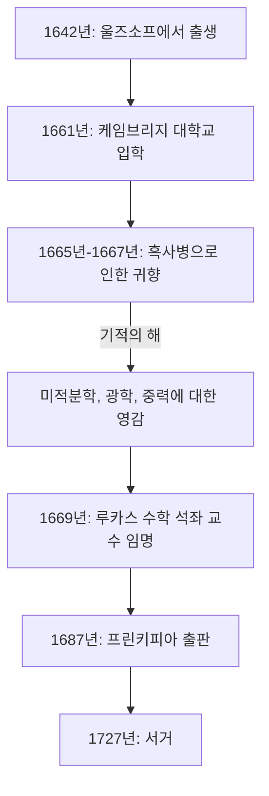

인류 역사상 과학 발전에 가장 깊은 영향을 미친 인물을 한 명 꼽자면 많은 사람들이 **아이작 뉴턴** 을 꼽을 것입니다. 그는 물리학, 수학, 천문학 등 다양한 분야에서 혁명적인 발견을 이루어냈습니다. 그의 업적은 단순히 한 시대의 발견에 그치지 않고 현대 과학의 근간을 세웠다고 해도 과언이 아닙니다.

이 글에서는 뉴턴의 성장 배경부터 말년에 이르기까지의 비범한 일화들을 살펴보고, 특히 **미적분학** (유율법), **일반화된 이항 정리** , 그리고 **뉴턴 방법** 에 초점을 맞추어 그의 수학적, 물리학적 업적을 깊이 있게 탐구해 보겠습니다.

## 뉴턴의 생애와 일화

### 외로운 유년기와 울즈소프에서의 탄생

아이작 뉴턴은 1642년 크리스마스(율리우스력; 그레고리력으로는 1643년 1월 4일)에 잉글랜드 링컨셔주의 작은 마을 울즈소프에서 태어났습니다. 미숙아로 태어난 그의 몸은 극도로 작았으며 처음에는 생존조차 불투명했습니다. 설상가상으로 뉴턴의 아버지는 그가 태어나기 세 달 전에 세상을 떠났습니다.

그가 3살이 되었을 때 어머니는 재혼하여 뉴턴을 할머니에게 맡기고 새 남편에게 떠났습니다. 어린 시절 부모와 떨어져 지낸 이 경험은 뉴턴의 성격 형성에 깊은 영향을 미쳐 훗날 매우 비밀스럽고 의심이 많은 성격을 갖게 된 한 원인으로 여겨집니다.

동네 학교에 다니기 시작했을 때 뉴턴은 처음에는 뛰어난 학생이 아니었습니다. 그러나 자신을 괴롭히던 동급생과 싸워 이긴 후 학업에서도 그를 이기겠다고 결심하여 성적이 급상승했다는 일화가 남아 있습니다. 그는 해시계, 물시계, 풍차 모형 등 기계 장난감을 만드는 데 강한 흥미를 보였습니다.

### 케임브리지 대학과 '기적의 해'

1661년 뉴턴은 케임브리지 대학의 트리니티 칼리지에 입학했습니다. 당시 대학에서는 주로 아리스토텔레스 철학을 가르쳤지만, 뉴턴은 르네 데카르트, 갈릴레오 갈릴레이, 요하네스 케플러 등의 새로운 과학 사상에 강하게 끌렸습니다. 그는 노트에 **"Amicus Plato amicus Aristoteles magis amica veritas"** (플라톤은 나의 친구, 아리스토텔레스도 나의 친구, 하지만 나의 가장 큰 친구는 진리이다)라는 글을 남겼습니다.

1665년 런던에 흑사병이 크게 유행하여 대학은 문을 닫아야 했습니다. 뉴턴은 고향인 울즈소프에 돌아가 약 1년 반 동안 사색에 잠겼습니다. 이 조용하고 고독한 기간 동안 그는 미적분학의 기초, 광학(프리즘을 이용한 빛의 분광), 그리고 만유인력의 법칙이라는 세 가지 주요 업적에 대한 영감을 얻었습니다. 과학사에서는 이 시기를 **Annus Mirabilis** (기적의 해)라고 부릅니다.



### 사과 일화의 진실

뉴턴이라고 하면 "나무에서 떨어지는 사과를 보고 만유인력을 발견했다"는 일화가 매우 유명하지만, 이것이 과연 사실일까요?

뉴턴의 전기 작가인 윌리엄 스튜클리의 기록에 따르면, 말년에 뉴턴 자신이 직접 이 일화를 이야기했다고 합니다. 어느 날 뉴턴이 정원 사과나무 아래에서 사색에 잠겨 있을 때, 사과가 떨어지는 것을 보고 "왜 저 사과는 항상 땅을 향해 수직으로 떨어질까? 옆이나 위가 아니라 항상 지구의 중심을 향하는 이유는 무엇일까?"라고 의문을 품었다고 합니다.

즉, 사과가 머리에 떨어져 번뜩이는 천재성으로 갑자기 발견했다는 코믹한 이야기가 아닙니다. 오히려 일상적인 사소한 현상을 우주적 법칙(만유인력)과 연결 짓는 그의 깊은 통찰력을 보여주는 일화입니다. **"지구가 물체를 끌어당기는 힘과 달이나 행성이 궤도를 유지하게 하는 힘이 같은 것은 아닐까?"**

### 라이프니츠와의 미적분학 논쟁

뉴턴은 1665년경 미적분학의 아이디어를 떠올렸지만, 그 결과를 즉시 발표하지는 않았습니다. 한편 독일의 수학자 고트프리트 빌헬름 라이프니츠는 1670년대에 독자적으로 미적분법을 발견하여 논문으로 발표했습니다.

이로 인해 "누가 먼저 미적분학을 발견했는가"를 두고 과학사에서 가장 격렬한 우선권 논쟁이 일어났습니다. 오늘날에는 두 사람이 독립적으로 미적분학을 발견했다고 결론이 내려졌습니다. 그러나 라이프니츠가 도입한 $dx$ 와 $\int$ 같은 기호가 더 우수했기 때문에 유럽 대륙에서는 라이프니츠의 표기법이 퍼진 반면, 영국 수학계는 자국의 기호를 고집하여 결과적으로 한동안 뒤처지게 되었습니다.

---

## 뉴턴의 수학적 업적 깊이 파보기

여기부터는 뉴턴이 수학 분야에서 이룩한 구체적인 업적들을 수식과 함께 자세히 설명하겠습니다.

### 1. 미적분학(유율법)의 창시

뉴턴은 자신의 미적분법을 **유율법** (Method of Fluxions)이라고 불렀습니다. 물리적인 연속적 변화를 포착하기 위해 그는 시간에 따라 연속적으로 변하는 양을 "유량(Fluents)"이라 부르며 $x, y$ 등으로 나타내고, 그 변화율을 "유율(Fluxions)"이라 불러 $\dot{x}, \dot{y}$ 와 같은 기호를 사용했습니다.

뉴턴의 가장 큰 공헌 중 하나는 미분(접선 구하기)과 적분(면적 구하기)이 서로 역연산 관계에 있다는 사실, 즉 **미적분학의 기본 정리** 를 명확히 확립했다는 점입니다.

함수 $f(x)$ 의 미분(도함수)은 극한을 사용하여 다음과 같이 정의됩니다.

$$
f'(x) = \lim_{\Delta x \to 0} \frac{f(x + \Delta x) - f(x)}{\Delta x}
$$

여기서 $\Delta x$ 는 무한소(infinitesimal)의 변화량을 나타냅니다. 이 무한소 개념을 사용하여 뉴턴은 곡선의 접선 기울기와 곡선으로 둘러싸인 영역의 넓이를 계산하는 체계적인 방법을 확립했습니다. 이 방법은 운동하는 물체의 속도와 가속도를 분석하는 데 강력한 수학적 도구가 되었습니다.

### 2. 일반화된 이항 정리

고등학교 수학에서 배우는 이항 정리는 지수 $n$ 이 양의 정수일 때 $(x+y)^n$ 을 전개하는 공식입니다.

$$
(x+y)^n = \sum_{k=0}^{n} \binom{n}{k} x^{n-k} y^k
$$

1665년 뉴턴은 이 정리를 **분수 및 음의 지수** 에까지 확장했습니다. 지수를 실수 $\alpha$ 라고 할 때, $|x| < 1$ 이라는 조건 하에서 다음과 같이 무한급수로 전개할 수 있습니다.

$$
(1+x)^\alpha = 1 + \alpha x + \frac{\alpha(\alpha-1)}{2!} x^2 + \frac{\alpha(\alpha-1)(\alpha-2)}{3!} x^3 + \dots
$$

이 일반화된 이항 정리는 제곱근이나 역수를 무한급수로 표현할 수 있게 해주었으며, 뉴턴이 로그 함수와 삼각 함수의 무한급수 전개(테일러 전개의 전신)를 이끌어낼 때 강력한 무기가 되었습니다.

### 3. 뉴턴 방법

뉴턴 방법(또는 뉴턴-랩슨 방법)은 방정식 $f(x) = 0$ 의 근사적인 실근을 찾기 위한 반복 알고리즘입니다. 이 방법은 함수의 접선을 이용하여 근에 접근하는 매우 효율적인 기법입니다.

어떤 근사값 $x_n$ 이 주어졌을 때, 다음 근사값 $x_{n+1}$ 은 다음 점화식으로 구합니다.

$$
x_{n+1} = x_n - \frac{f(x_n)}{f'(x_n)}
$$

예를 들어 $x^2 = 2$ 의 해(즉 $\sqrt{2}$)를 구하기 위해 $f(x) = x^2 - 2$ 로 둡니다. 이 함수의 도함수는 $f'(x) = 2x$ 입니다. 이를 점화식에 대입하면 다음과 같습니다.

$$
x_{n+1} = x_n - \frac{x_n^2 - 2}{2x_n} = \frac{1}{2} \left( x_n + \frac{2}{x_n} \right)
$$

이 식은 매우 간단한 점화식을 제공합니다. 이 수학적 공식을 프로그램으로 표현하면 다음과 같습니다.

```python
# 함수 f(x) = x^2 - 2 의 제곱근을 구하는 뉴턴 방법의 예
def newton_method_sqrt(value, tolerance=1e-7, max_iterations=100):
    # 초기 추정값 설정
    x = value / 2.0
    for i in range(max_iterations):
        # f(x) = x^2 - value, f'(x) = 2x
        # 점화식: x_{n+1} = x_n - f(x_n)/f'(x_n) = 0.5 * (x_n + value / x_n)
        next_x = 0.5 * (x + value / x)
        
        # 허용 오차 내로 수렴했는지 확인
        if abs(x - next_x) < tolerance:
            return next_x
        x = next_x
    return x

# 2의 제곱근 근사값 출력
print(f"2의 제곱근 근사값: {newton_method_sqrt(2)}")
```

이 알고리즘은 수렴 속도가 매우 빠르며, 오늘날에도 컴퓨터에서 제곱근을 계산하거나 비선형 방정식의 수치해법에서 널리 사용되고 있습니다.

---

## 물리학에의 응용과 『프린키피아』

뉴턴은 수학에서 혁신적인 성과를 내는 동시에 이를 물리 현상을 규명하는 데 응용했습니다. 1687년 천문학자 에드먼드 핼리의 강력한 권유로 출판된 그의 저서 **『자연철학의 수학적 원리 (프린키피아)』** (Philosophiæ Naturalis Principia Mathematica)는 과학사에서 가장 중요한 책 중 하나로 꼽힙니다.

이 책에서 그는 다음의 **운동 제3법칙** 을 공식화했습니다.
1. **관성의 법칙** (제1법칙): 외부에서 힘이 가해지지 않는 한, 물체는 정지해 있거나 등속 직선 운동을 계속한다.
2. **운동의 법칙** (제2법칙): 힘은 질량과 가속도의 곱과 같다 ( $F = ma$ ).
3. **작용 반작용의 법칙** (제3법칙): 모든 작용에는 크기가 같고 방향이 반대인 반작용이 있다.

그리고 이 법칙들과 케플러의 행성 운동 법칙을 수학적으로 통합하여 **만유인력의 법칙** 을 증명했습니다. 질량을 가진 두 물체 사이에 작용하는 인력 $F$ 는 두 물체의 질량 $m_1, m_2$ 에 비례하고, 두 물체 사이의 거리 $r$ 의 제곱에 반비례한다는 법칙입니다.

$$
F = G \frac{m_1 m_2}{r^2} \quad \left( \text{여기서 } G \text{ 는 만유인력 상수} \right)
$$

이로써 지구상에서 사과가 떨어지는 것이나 달과 같은 천체의 운동이 정확히 같은 물리 법칙으로 설명될 수 있음이 증명되었습니다. 이는 인류의 세계관을 근본적으로 뒤집은 진정한 패러다임의 전환이었습니다.

## 말년과 후세에 미친 영향

과학의 정점에 올랐음에도 불구하고 뉴턴은 말년에 과학 연구에서 멀어졌습니다. 그는 영국 조폐국장(Warden and Master of the Royal Mint)으로 재직하며 위조 지폐범들을 엄격하게 단속하는 임무를 맡았고, 왕립학회 회장으로서 영국 과학계에 군림했습니다. 흥미롭게도 그가 남긴 방대한 원고의 대부분은 물리학이나 수학이 아닌 **연금술** 과 **성서 연대기(신학)** 에 관한 것이었습니다. 그는 마지막 르네상스인이었으며 과학과 마법이 아직 분리되지 않았던 시대의 지식인이었습니다.

뉴턴은 자신의 업적에 대해 다음과 같은 겸손한 말을 남겼습니다.

> "내가 남들보다 더 멀리 볼 수 있었다면, 그것은 거인들의 어깨 위에 서 있었기 때문입니다."

이 말은 자신의 발견이 과거 위대한 과학자들(코페르니쿠스, 갈릴레오, 케플러 등)의 축적된 연구가 있었기에 가능했다는 것을 인정하고 존경을 표하는 의미입니다.

그가 확립한 고전역학 체계는 20세기 초 알베르트 아인슈타인이 상대성 이론을 발표하기 전까지 약 200년 동안 물리학의 절대적인 기반이 되었습니다. 그리고 오늘날에도 우리의 일상적인 규모의 물리 현상이나 우주 탐사선의 궤도 계산에 있어서 뉴턴 역학은 매우 정확하고 효과적으로 사용되고 있습니다.

아이작 뉴턴은 외로운 유년기에서 출발하여 비범한 집중력과 천재적인 직관으로 우주의 진리를 밝혀냈습니다. 그가 남긴 수많은 법칙과 수학적 정리들은 오늘날까지도 우리의 기술과 사회를 든든하게 뒷받침하고 있습니다.
