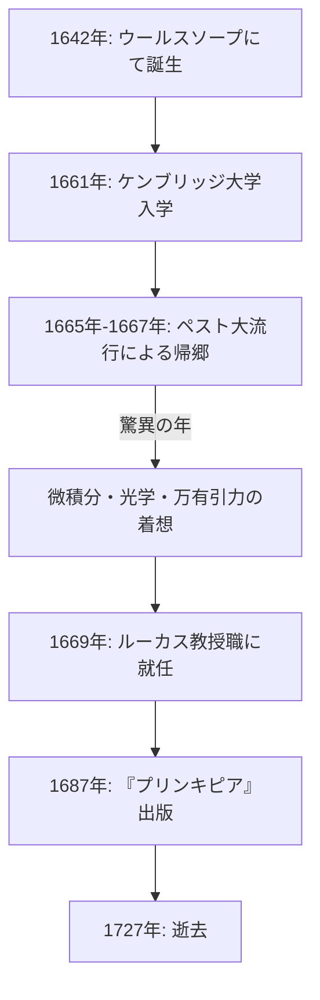

人類の歴史において、科学の発展に最も大きな影響を与えた人物を一人挙げるとすれば、多くの人が **アイザック・[ニュートン](https://kenji.blog/p/newton/)** （[Isaac Newton](https://kenji.blog/p/newton/)）の名を挙げることでしょう。彼は物理学、数学、天文学といった多岐にわたる分野で革命的な発見を成し遂げました。彼の業績は、単なる一時代の発見にとどまらず、近代科学の礎を築いたと言っても過言ではありません。

この記事では、[ニュートン](https://kenji.blog/p/newton/)の生い立ちから晩年に至るまでの数奇なエピソードを辿るとともに、彼の数学的・物理学的な偉業、特に **微積分学** （流率法）や **一般化された二項定理** 、そして **[ニュートン](https://kenji.blog/p/newton/)法** について詳細に深掘りしていきます。

## [ニュートン](https://kenji.blog/p/newton/)の生涯とエピソード

### 孤独な幼少期とウールスソープでの誕生

アイザック・[ニュートン](https://kenji.blog/p/newton/)は、1642年のクリスマス（ユリウス暦。グレゴリオ暦では1643年1月4日）、イングランドのリンカンシャー州にあるウールスソープという小さな村で誕生しました。彼は未熟児として生まれ、その体は非常に小さく、最初は生き延びることさえ危ぶまれました。さらに不幸なことに、[ニュートン](https://kenji.blog/p/newton/)の父親は彼が生まれる3ヶ月前に他界していました。

彼が3歳の時、母親は再婚し、[ニュートン](https://kenji.blog/p/newton/)を祖母に預けて新しい夫のもとへ去ってしまいました。この幼少期の親からの分離体験は、後の[ニュートン](https://kenji.blog/p/newton/)の人格に大きな影響を与え、極度に秘密主義で猜疑心の強い性格を形成した一因とも言われています。

地元の学校に通い始めた[ニュートン](https://kenji.blog/p/newton/)は、初めは決して優秀な生徒ではありませんでしたが、ある時自分をいじめた同級生に喧嘩で勝ち、学業でも彼を打ち負かそうと決心したことから、成績が急上昇したというエピソードが残っています。彼はまた、日時計や水時計、風車の模型などの機械的なおもちゃを作ることに強い関心を示しました。

### ケンブリッジ大学と「驚異の年」

1661年、[ニュートン](https://kenji.blog/p/newton/)はケンブリッジ大学のトリニティ・カレッジに入学しました。当時の大学では主にアリストテレスの哲学が教えられていましたが、ニュートンは[ルネ・デカルト](https://kenji.blog/p/descartes/)やガリレオ・ガリレイ、ヨハネス・ケプラーなどの新しい科学思想に強く惹かれました。彼は **「私はプラトンの友、アリストテレスの友、しかし何よりも真理の友である」** という言葉を手帳に書き残しています。

1665年、ロンドンでペストが大流行し、大学は閉鎖を余儀なくされました。[ニュートン](https://kenji.blog/p/newton/)は故郷のウールスソープに戻り、約1年半にわたって思索にふけりました。この静かで孤独な期間に、彼は微積分学の基礎、光学（プリズムによる光の分光）、そして万有引力の法則という、三大業績のインスピレーションを得ました。科学史において、この期間は **驚異の年** （Annus Mirabilis）と呼ばれています。



### リンゴの逸話の真相

[ニュートン](https://kenji.blog/p/newton/)と言えば「木から落ちるリンゴを見て万有引力を発見した」というエピソードが非常に有名ですが、これは本当にあったことなのでしょうか。

[ニュートン](https://kenji.blog/p/newton/)の伝記作家であるウィリアム・ステュークリーの記録によれば、晩年のニュートン自身がこのエピソードを語ったとされています。ある日、[ニュートン](https://kenji.blog/p/newton/)が庭のリンゴの木の下で瞑想していたとき、リンゴが落ちるのを見て「なぜリンゴは常に地面に対して垂直に落ちるのか。横や上ではなく、常に地球の中心に向かうのはなぜか」と疑問を持ったと言います。

つまり、リンゴが頭に当たって突然ひらめいたというコミカルな話ではなく、日常の些細な現象から **「地球が物体を引く力は、月や惑星の軌道を保つ力と同じものではないか」** という普遍的な法則（万有引力）へと結びつけた、彼の深い洞察力を示すエピソードなのです。

### [ライプニッツ](https://kenji.blog/p/leibniz/)との微積分論争

[ニュートン](https://kenji.blog/p/newton/)が微積分学の着想を得たのは1665年頃でしたが、彼はその成果をすぐには公表しませんでした。一方で、ドイツの数学者ゴットフリート・ヴィルヘルム・[ライプニッツ](https://kenji.blog/p/leibniz/)は、1670年代に独自に微積分法を発見し、論文として発表しました。

これが原因で、「どちらが先に微積分を発見したか」という科学史上で最も激しい優先権争いが勃発しました。現在では、両者は独立して微積分を発見したと結論づけられていますが、[ライプニッツ](https://kenji.blog/p/leibniz/)が導入した $dx$ や $\int$ といった記法の方が優れていたため、大陸ヨーロッパでは[ライプニッツ](https://kenji.blog/p/leibniz/)の記法が普及し、イギリス数学界は独自の記号に固執したため一時的に遅れをとる結果となりました。

---

## [ニュートン](https://kenji.blog/p/newton/)の数学的業績の深掘り

ここからは、[ニュートン](https://kenji.blog/p/newton/)が数学の分野で成し遂げた具体的な業績について、数式を交えながら詳しく解説します。

### 1. 微分積分学（流率法）の創始

[ニュートン](https://kenji.blog/p/newton/)は自身の微積分法を **流率法** （Method of Fluxions）と呼びました。彼は物理的な連続変化を捉えるために、時間とともに変化する量（連続量）を「流量（Fluent）」と呼び $x, y$ などで表し、その変化の速度を「流率（Fluxion）」と呼んで $\dot{x}, \dot{y}$ という記号を使いました。

[ニュートン](https://kenji.blog/p/newton/)の最大の功績の一つは、微分（接線を求めること）と積分（面積を求めること）が互いに逆の操作であること、すなわち **微積分学の基本定理** を明確に確立したことです。

関数 $f(x)$ の微分（導関数）は極限を用いて次のように定義されます。

$$
f'(x) = \lim_{\Delta x \to 0} \frac{f(x + \Delta x) - f(x)}{\Delta x}
$$

ここで、 $\Delta x$ は無限小（infinitesimal）の変化量を表します。[ニュートン](https://kenji.blog/p/newton/)はこの無限小の概念を用いて、曲線の接線の傾きや、曲線で囲まれた領域の面積を計算する体系的な手法を確立しました。この手法は、運動する物体の速度や加速度を解析するための強力な数学的道具となりました。

### 2. 一般化された二項定理 (Generalized Binomial Theorem)

高校の数学で学ぶ二項定理は、指数 $n$ が正の整数の場合に $(x+y)^n$ を展開する公式です。

$$
(x+y)^n = \sum_{k=0}^{n} \binom{n}{k} x^{n-k} y^k
$$

[ニュートン](https://kenji.blog/p/newton/)は1665年に、この定理を **分数や負の指数** にまで拡張しました。指数を実数 $\alpha$ とすると、 $|x| < 1$ の条件のもとで、無限級数として次のように展開できます。

$$
(1+x)^\alpha = 1 + \alpha x + \frac{\alpha(\alpha-1)}{2!} x^2 + \frac{\alpha(\alpha-1)(\alpha-2)}{3!} x^3 + \dots
$$

この一般化された二項定理は、平方根や逆数を無限級数で表現することを可能にし、[ニュートン](https://kenji.blog/p/newton/)が対数関数や三角関数の無限級数展開（テイラー展開の先駆け）を導き出す際の強力な武器となりました。

### 3. [ニュートン](https://kenji.blog/p/newton/)法 (Newton's Method)

[ニュートン](https://kenji.blog/p/newton/)法（[ニュートン](https://kenji.blog/p/newton/)・ラフソン法とも呼ばれる）は、方程式 $f(x) = 0$ の実数解を近似的に求めるための反復アルゴリズムです。この方法は、関数の接線を利用して解に近づいていくという非常に効率的な手法です。

ある近似値 $x_n$ が与えられたとき、次の近似値 $x_{n+1}$ は以下の漸化式で求められます。

$$
x_{n+1} = x_n - \frac{f(x_n)}{f'(x_n)}
$$

例えば、 $x^2 = 2$ の解（すなわち $\sqrt{2}$ ）を求める場合、 $f(x) = x^2 - 2$ と置きます。この導関数は $f'(x) = 2x$ です。これを漸化式に代入すると、

$$
x_{n+1} = x_n - \frac{x_n^2 - 2}{2x_n} = \frac{1}{2} \left( x_n + \frac{2}{x_n} \right)
$$

という非常にシンプルな漸化式が得られます。この数式をプログラムで表現すると以下のようになります。

```python
# 関数 f(x) = x^2 - 2 の平方根を求めるニュートン法の例
def newton_method_sqrt(value, tolerance=1e-7, max_iterations=100):
    # 初期推測値を設定
    x = value / 2.0
    for i in range(max_iterations):
        # f(x) = x^2 - value, f'(x) = 2x
        # 漸化式: x_{n+1} = x_n - f(x_n)/f'(x_n) = 0.5 * (x_n + value / x_n)
        next_x = 0.5 * (x + value / x)
        
        # 許容誤差内に収束したかチェック
        if abs(x - next_x) < tolerance:
            return next_x
        x = next_x
    return x

# 2の平方根の近似値を出力
print(f"2の平方根の近似値: {newton_method_sqrt(2)}")
```

このアルゴリズムは収束が非常に速く、現在でもコンピュータにおける平方根の計算や、非線形方程式の数値解法において広く使用されています。

---

## 物理学への応用と『プリンキピア』

[ニュートン](https://kenji.blog/p/newton/)は数学において革新的な成果を上げると同時に、それを物理現象の解明に応用しました。1687年、天文学者エドモンド・ハレーの強い勧めで出版された著書 **『自然哲学の数学的諸原理（プリンキピア）』** （Philosophiæ Naturalis Principia Mathematica）は、科学史上最も重要な書物の一つとされています。

この書物の中で、彼は以下の **運動の三法則** を定式化しました。
1. **慣性の法則** （第1法則）：外部から力が働かない限り、物体は静止し続けるか、等速直線運動を続ける。
2. **運動の法則** （第2法則）：力は質量と加速度の積に等しい（ $F = ma$ ）。
3. **作用・反作用の法則** （第3法則）：すべての作用に対して、等しく逆向きの反作用が存在する。

そして、これらの法則と、ケプラーの惑星運動の法則を数学的に統合することで、 **万有引力の法則** を証明しました。質量を持つ2つの物体の間に働く引力 $F$ は、それぞれの質量 $m_1, m_2$ に比例し、距離 $r$ の2乗に反比例するという法則です。

$$
F = G \frac{m_1 m_2}{r^2} \quad \left( \text{ここで } G \text{ は万有引力定数} \right)
$$

これにより、地球上のリンゴの落下も、天体である月の運動も、全く同じ一つの物理法則で説明できることが証明されたのです。これは人類の世界観を根本から覆す、まさにパラダイムシフトでした。

## 晩年と後世への影響

科学において頂点を極めた[ニュートン](https://kenji.blog/p/newton/)でしたが、晩年は科学の研究から遠ざかりました。彼は王立造幣局の長官として贋金作りを厳しく取り締まる任務に就き、また王立協会の会長としてイギリス科学界に君臨しました。興味深いことに、彼が遺した膨大な草稿の大部分は、物理学や数学ではなく、 **錬金術** と **聖書の年代学（神学）** に関するものでした。彼は最後のルネサンス人であり、科学と魔術が未分化な時代の知識人でもあったのです。

[ニュートン](https://kenji.blog/p/newton/)は自身の業績について、次のような謙虚な言葉を残しています。

> 「私が他の人よりも遠くを見ることができたとすれば、それは巨人の肩の上に立っていたからです。」

この言葉は、過去の偉大な科学者たち（コペルニクス、ガリレオ、ケプラーなど）の蓄積があってこそ、自分の発見があったのだという敬意を表しています。

彼の打ち立てた古典力学の体系は、20世紀初頭にアルベルト・アインシュタインが相対性理論を発表するまでの約200年間、物理学の絶対的な基礎であり続けました。そして現代でも、私たちの日常的なスケールでの物理現象や宇宙探査機の軌道計算においては、[ニュートン](https://kenji.blog/p/newton/)力学が極めて正確かつ有効に使用されています。

アイザック・[ニュートン](https://kenji.blog/p/newton/)は、孤独な少年時代から始まり、その非凡な集中力と天才的な直感によって、宇宙の真理を解き明かしました。彼の遺した数々の法則と数学的定理は、今もなお私たちの技術と社会を支え続けているのです。
