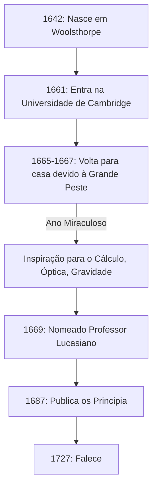

Se tivéssemos que nomear uma pessoa que teve o impacto mais profundo no desenvolvimento da ciência na história da humanidade, muitos nomeariam **Isaac Newton** . Ele alcançou descobertas revolucionárias em campos tão diversos quanto a física, a matemática e a astronomia. Não é exagero dizer que suas realizações não foram meras descobertas de uma única época, mas construíram os próprios fundamentos da ciência moderna.

Neste artigo, traçaremos os episódios extraordinários desde a educação de Newton até seus últimos anos, e exploraremos profundamente suas façanhas matemáticas e físicas, com foco particular no **cálculo** (o método das fluxões), o **teorema binomial generalizado** , e o **método de Newton** .

## A Vida e os Episódios de Newton

### Uma Infância Solitária e Nascimento em Woolsthorpe

Isaac Newton nasceu no dia de Natal de 1642 (calendário juliano; 4 de janeiro de 1643, no calendário gregoriano) na pequena vila de Woolsthorpe, Lincolnshire, Inglaterra. Nascido prematuramente, seu corpo era extremamente pequeno e, a princípio, sua sobrevivência era duvidosa. Para piorar a situação, o pai de Newton havia falecido três meses antes de seu nascimento.

Quando ele tinha três anos, sua mãe se casou novamente e deixou Newton aos cuidados da avó para se juntar ao novo marido. Diz-se que essa experiência precoce de separação de seus pais influenciou profundamente a personalidade de Newton, contribuindo para o caráter extremamente reservado e desconfiado que ele desenvolveu mais tarde na vida.

Quando começou a frequentar a escola local, Newton inicialmente não era um aluno notável. No entanto, resta uma anedota de que, depois de vencer uma briga contra um colega de classe que o intimidava, ele resolveu vencê-lo também nos estudos, fazendo com que suas notas disparassem. Ele também demonstrou forte interesse em construir brinquedos mecânicos, como relógios de sol, relógios de água e modelos de moinhos de vento.

### A Universidade de Cambridge e o "Ano Miraculoso"

Em 1661, Newton ingressou no Trinity College, em Cambridge. Embora a universidade da época ensinasse principalmente filosofia aristotélica, Newton foi fortemente atraído pelos novos pensamentos científicos de René Descartes, Galileu Galilei e Johannes Kepler. Ele deixou uma nota em seu caderno afirmando: **"Amicus Plato amicus Aristoteles magis amica veritas"** (Platão é meu amigo, Aristóteles é meu amigo, mas minha maior amiga é a verdade).

Em 1665, um grave surto da Grande Peste atingiu Londres, forçando a universidade a fechar. Newton voltou para sua cidade natal de Woolsthorpe e mergulhou na contemplação por cerca de um ano e meio. Durante este período de silêncio e solidão, ele encontrou a inspiração para as suas três grandes realizações: os fundamentos do cálculo, a óptica (análise espectral da luz usando um prisma) e a lei da gravitação universal. Na história da ciência, este período é conhecido como o **Annus Mirabilis** (Ano Miraculoso).



### A Verdade por trás da Anedota da Maçã

Ao falar de Newton, a anedota de que ele "descobriu a gravitação universal ao ver uma maçã cair de uma árvore" é incrivelmente famosa, mas isso realmente aconteceu?

De acordo com os registros de William Stukeley, biógrafo de Newton, o próprio Newton relatou este episódio em seus últimos anos. Um dia, enquanto Newton estava em um estado de contemplação sob uma macieira em seu jardim, ele viu uma maçã cair e se perguntou: "Por que aquela maçã deveria descer sempre perpendicularmente ao chão? Por que não deveria ir para os lados, ou para cima, mas constantemente em direção ao centro da terra?".

Em outras palavras, não é uma história cômica de uma maçã atingindo sua cabeça em um súbito lampejo de genialidade. Em vez disso, é um episódio que demonstra sua profunda percepção, ligando um fenômeno cotidiano trivial a uma lei universal (gravitação universal): **"A força pela qual a Terra atrai os objetos não é a mesma força que mantém as órbitas da lua e dos planetas?"** .

### A Disputa do Cálculo com Leibniz

Newton concebeu a ideia do cálculo por volta de 1665, mas não publicou imediatamente seus resultados. Enquanto isso, o matemático alemão Gottfried Wilhelm Leibniz descobriu independentemente um método de cálculo na década de 1670 e publicou-o como um artigo.

Isso desencadeou uma das disputas de prioridade mais intensas da história da ciência sobre "quem descobriu o cálculo primeiro". Hoje, conclui-se que ambos descobriram independentemente o cálculo. No entanto, como a notação introduzida por Leibniz, como $dx$ e $\int$, era superior, a notação de Leibniz espalhou-se pela Europa continental, enquanto a comunidade matemática britânica teimosamente se apegou aos seus próprios símbolos, ficando temporariamente para trás como resultado.

---

## Mergulho Profundo nas Realizações Matemáticas de Newton

A partir daqui, explicaremos em detalhes as realizações específicas que Newton fez no campo da matemática, acompanhadas de fórmulas.

### 1. A Fundação do Cálculo (Método das Fluxões)

Newton chamou seu método de cálculo de **Método das Fluxões** . Para capturar mudanças contínuas físicas, ele chamou quantidades que mudam continuamente ao longo do tempo de "Fluentes", denotando-as com $x, y$, etc., e chamou a taxa de sua mudança de "Fluxões", usando símbolos como $\dot{x}, \dot{y}$.

Uma das maiores contribuições de Newton foi estabelecer claramente o **Teorema Fundamental do Cálculo** —o fato de que a diferenciação (encontrar tangentes) e a integração (encontrar áreas) são operações inversas uma da outra.

A derivada de uma função $f(x)$ é definida usando limites da seguinte forma:

$$
f'(x) = \lim_{\Delta x \to 0} \frac{f(x + \Delta x) - f(x)}{\Delta x}
$$

Aqui, $\Delta x$ representa uma mudança infinitesimal. Usando esse conceito de infinitesimais, Newton estabeleceu um método sistemático para calcular a inclinação da tangente a uma curva e a área delimitada por uma curva. Esse método tornou-se uma ferramenta matemática poderosa para analisar a velocidade e a aceleração de objetos em movimento.

### 2. Teorema Binomial Generalizado

O teorema binomial ensinado na matemática do ensino médio é uma fórmula para expandir $(x+y)^n$ quando o expoente $n$ é um número inteiro positivo.

$$
(x+y)^n = \sum_{k=0}^{n} \binom{n}{k} x^{n-k} y^k
$$

Em 1665, Newton estendeu este teorema para **expoentes fracionários e negativos** . Se o expoente for um número real $\alpha$, sob a condição $|x| < 1$, pode ser expandido como uma série infinita da seguinte forma:

$$
(1+x)^\alpha = 1 + \alpha x + \frac{\alpha(\alpha-1)}{2!} x^2 + \frac{\alpha(\alpha-1)(\alpha-2)}{3!} x^3 + \dots
$$

Esse teorema binomial generalizado tornou possível expressar raízes quadradas e recíprocos como séries infinitas, servindo como uma arma poderosa quando Newton derivou as expansões em séries infinitas de funções logarítmicas e trigonométricas (o precursor da expansão de Taylor).

### 3. Método de Newton

O método de Newton (também conhecido como método de Newton-Raphson) é um algoritmo iterativo para encontrar raízes reais aproximadas de uma equação $f(x) = 0$. Este método é uma técnica altamente eficiente que se aproxima da raiz utilizando a tangente da função.

Dado um certo valor aproximado $x_n$, o próximo valor aproximado $x_{n+1}$ é encontrado pela seguinte relação de recorrência:

$$
x_{n+1} = x_n - \frac{f(x_n)}{f'(x_n)}
$$

Por exemplo, para encontrar a solução para $x^2 = 2$ (ou seja, $\sqrt{2}$), definimos $f(x) = x^2 - 2$. Sua derivada é $f'(x) = 2x$. Substituindo isso na relação de recorrência resulta em:

$$
x_{n+1} = x_n - \frac{x_n^2 - 2}{2x_n} = \frac{1}{2} \left( x_n + \frac{2}{x_n} \right)
$$

Isso produz uma fórmula de recorrência muito simples. Expressar essa fórmula matemática em um programa se parece com o seguinte:

```python
# Exemplo do método de Newton para encontrar a raiz quadrada da função f(x) = x^2 - 2
def newton_method_sqrt(value, tolerance=1e-7, max_iterations=100):
    # Definir o palpite inicial
    x = value / 2.0
    for i in range(max_iterations):
        # f(x) = x^2 - value, f'(x) = 2x
        # Relação de recorrência: x_{n+1} = x_n - f(x_n)/f'(x_n) = 0.5 * (x_n + value / x_n)
        next_x = 0.5 * (x + value / x)
        
        # Verificar se convergiu dentro do erro de tolerância
        if abs(x - next_x) < tolerance:
            return next_x
        x = next_x
    return x

# Imprimir o valor aproximado da raiz quadrada de 2
print(f"Valor aproximado da raiz quadrada de 2: {newton_method_sqrt(2)}")
```

Este algoritmo converge extremamente rápido e ainda é amplamente utilizado hoje para calcular raízes quadradas em computadores e em métodos numéricos para resolver equações não lineares.

---

## Aplicação à Física e os "Principia"

Enquanto alcançava resultados inovadores em matemática, Newton os aplicou simultaneamente para elucidar fenômenos físicos. Publicado em 1687 sob a forte insistência do astrônomo Edmond Halley, seu livro **Philosophiæ Naturalis Principia Mathematica** (Princípios Matemáticos da Filosofia Natural) é considerado um dos livros mais importantes da história da ciência.

Neste livro, ele formulou as seguintes **Três Leis do Movimento** :
1. **Lei da Inércia** (Primeira Lei): Um objeto permanece em repouso ou em movimento uniforme em linha reta, a menos que seja submetido a uma força externa.
2. **Lei do Movimento** (Segunda Lei): A força é igual ao produto da massa pela aceleração ( $F = ma$ ).
3. **Lei da Ação e Reação** (Terceira Lei): Para cada ação, há uma reação igual e oposta.

Ao integrar matematicamente essas leis com as leis do movimento planetário de Kepler, ele provou a **Lei da Gravitação Universal** . Esta lei afirma que a força de atração $F$ atuando entre dois objetos com massa é proporcional às suas respectivas massas $m_1, m_2$ e inversamente proporcional ao quadrado da distância $r$ entre eles.

$$
F = G \frac{m_1 m_2}{r^2} \quad \left( \text{onde } G \text{ é a constante gravitacional} \right)
$$

Isso provou que tanto a queda de uma maçã na Terra quanto o movimento de um corpo celeste como a lua poderiam ser explicados pela exata mesma lei física. Foi verdadeiramente uma mudança de paradigma que derrubou fundamentalmente a visão de mundo da humanidade.

## Últimos Anos e Impacto na Posteridade

Embora Newton tenha alcançado o ápice da ciência, ele se distanciou da pesquisa científica em seus últimos anos. Serviu como Guardião e Mestre da Casa da Moeda Real, assumindo a tarefa de reprimir severamente os falsificadores, e reinou sobre a comunidade científica britânica como Presidente da Royal Society. Curiosamente, a grande maioria dos manuscritos que ele deixou para trás não eram sobre física ou matemática, mas sobre **alquimia** e **cronologia bíblica (teologia)** . Ele foi o último dos homens da Renascença e um intelectual de uma época em que ciência e magia ainda eram indiferenciadas.

Newton deixou as seguintes palavras humildes sobre suas próprias realizações:

> "Se vi mais longe foi por estar de pé sobre ombros de gigantes."

Estas palavras expressam seu respeito, reconhecendo que suas descobertas só foram possíveis graças ao trabalho acumulado de grandes cientistas do passado (como Copérnico, Galileu e Kepler).

O sistema de mecânica clássica que ele estabeleceu permaneceu o fundamento absoluto da física por cerca de 200 anos, até que Albert Einstein publicou a teoria da relatividade no início do século 20. Ainda hoje, a mecânica newtoniana é usada com extrema precisão e eficácia no cálculo dos fenômenos físicos de nossa escala diária e das órbitas das sondas espaciais.

Isaac Newton, partindo de uma infância solitária, desvendou as verdades do universo por meio de sua extraordinária concentração e intuição genial. As numerosas leis e teoremas matemáticos que ele deixou para trás continuam a apoiar nossa tecnologia e sociedade até hoje.
