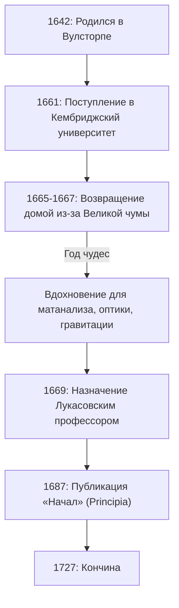

Если бы нам нужно было назвать одного человека, оказавшего наиболее глубокое влияние на развитие науки в истории человечества, многие назвали бы **Исаака Ньютона** . Он совершил революционные открытия в таких разных областях, как физика, математика и астрономия. Не будет преувеличением сказать, что его достижения не были просто открытиями одной эпохи, а заложили сами основы современной науки.

В этой статье мы проследим необычайные эпизоды из жизни Ньютона, начиная с его ранних лет и до старости, а также глубоко исследуем его математические и физические достижения, уделив особое внимание **математическому анализу** (методу флюксий), **обобщенной биномиальной теореме** и **методу Ньютона** .

## Жизнь Ньютона и интересные эпизоды

### Одинокое детство и рождение в Вулсторпе

[Исаак Ньютон](https://kenji.blog/p/newton/) родился в Рождество 1642 года (по юлианскому календарю; 4 января 1643 года по григорианскому) в небольшой деревне Вулсторп, графство Линкольншир, Англия. Рожденный недоношенным, он был чрезвычайно мал, и поначалу его выживание было под вопросом. Хуже того, отец Ньютона скончался за три месяца до его рождения.

Когда ему было три года, его мать снова вышла замуж и оставила Ньютона на попечении бабушки, переехав к новому мужу. Говорят, что этот ранний опыт разлуки с родителями глубоко повлиял на личность Ньютона, способствуя развитию крайне скрытного и подозрительного характера в более поздние годы.

Когда он начал посещать местную школу, Ньютон изначально не был выдающимся учеником. Однако сохранился эпизод, согласно которому после победы в драке над одноклассником, который издевался над ним, Ньютон решил превзойти его и в учебе, что привело к резкому росту его оценок. Он также проявлял сильный интерес к созданию механических игрушек, таких как солнечные и водяные часы, а также модели ветряных мельниц.

### Кембриджский университет и «Год чудес»

В 1661 году Ньютон поступил в Тринити-колледж в Кембридже. Хотя в университете того времени в основном преподавалась аристотелевская философия, Ньютона сильно привлекали новые научные идеи [Рене Декарт](https://kenji.blog/p/descartes/)а, Галилео Галилея и Иоганна Кеплера. Он оставил в своей записной книжке заметку: **«Amicus Plato amicus Aristoteles magis amica veritas»** (Платон мне друг, Аристотель мне друг, но самый большой друг — истина).

В 1665 году в Лондоне вспыхнула Великая чума, что заставило университет закрыться. Ньютон вернулся в свой родной город Вулсторп и погрузился в размышления примерно на полтора года. В этот тихий и уединенный период он нашел вдохновение для трех своих главных достижений: основ математического анализа, оптики (спектральный анализ света с помощью призмы) и закона всемирного тяготения. В истории науки этот период известен как **Annus Mirabilis** (Год чудес).



### Правда за историей о яблоке

Когда говорят о Ньютоне, невероятно знаменит эпизод о том, что он «открыл всемирное тяготение, увидев, как яблоко падает с дерева», но действительно ли это произошло?

Согласно записям Уильяма Стьюкли, биографа Ньютона, сам Ньютон рассказывал об этом эпизоде в свои последние годы. Однажды, когда Ньютон в задумчивом настроении сидел под яблоней в своем саду, он увидел, как падает яблоко, и задался вопросом: «Почему это яблоко всегда должно падать перпендикулярно земле? Почему бы ему не падать в сторону или вверх, а не постоянно к центру земли?».

Другими словами, это не комичная история о том, как яблоко ударило его по голове в результате внезапной вспышки гениальности. Скорее, это эпизод, демонстрирующий его глубокую проницательность, связывающий тривиальное повседневное явление с универсальным законом (всемирным тяготением): **«А не та ли самая сила, с которой Земля притягивает объекты, удерживает на орбитах луну и планеты?»** .

### Спор о приоритете создания математического анализа с Лейбницем

Ньютон придумал идею математического анализа примерно в 1665 году, но не сразу опубликовал свои результаты. Тем временем немецкий математик Готфрид Вильгельм Лейбниц независимо открыл метод исчисления в 1670-х годах и опубликовал его в виде статьи.

Это вызвало один из самых интенсивных споров о приоритете в истории науки по поводу того, «кто первым открыл исчисление». Сегодня считается, что оба независимо друг от друга открыли математический анализ. Однако поскольку нотация, введенная Лейбницем, например $dx$ и $\int$, была более удобной, она распространилась по всей континентальной Европе, в то время как британское математическое сообщество упрямо придерживалось своих собственных символов, в результате чего временно отстало.

---

## Глубокое погружение в математические достижения Ньютона

С этого момента мы подробно объясним конкретные достижения, которые Ньютон сделал в области математики, сопровождаемые формулами.

### 1. Основание математического анализа (Метод флюксий)

Ньютон назвал свой метод исчисления **Методом флюксий** . Чтобы уловить физические непрерывные изменения, он назвал величины, которые непрерывно изменяются со временем, «Флюэнтами», обозначая их $x, y$ и т. д., а скорость их изменения назвал «Флюксиями», используя такие символы, как $\dot{x}, \dot{y}$.

Одним из величайших вкладов Ньютона было четкое установление **Основной теоремы математического анализа** — того факта, что дифференцирование (нахождение касательных) и интегрирование (нахождение площадей) являются взаимно обратными операциями.

Производная функции $f(x)$ определяется с помощью пределов следующим образом:

$$
f'(x) = \lim_{\Delta x \to 0} \frac{f(x + \Delta x) - f(x)}{\Delta x}
$$

Здесь $\Delta x$ представляет собой бесконечно малое изменение. Используя эту концепцию бесконечно малых величин, Ньютон разработал систематический метод для вычисления наклона касательной к кривой и площади, ограниченной кривой. Этот метод стал мощным математическим инструментом для анализа скорости и ускорения движущихся объектов.

### 2. Обобщенная биномиальная теорема

Бином Ньютона, изучаемый в школьной математике, — это формула для разложения $(x+y)^n$, когда показатель $n$ является целым положительным числом.

$$
(x+y)^n = \sum_{k=0}^{n} \binom{n}{k} x^{n-k} y^k
$$

В 1665 году Ньютон расширил эту теорему на **дробные и отрицательные показатели** . Если показатель является действительным числом $\alpha$, при условии $|x| < 1$, выражение может быть разложено в бесконечный ряд следующим образом:

$$
(1+x)^\alpha = 1 + \alpha x + \frac{\alpha(\alpha-1)}{2!} x^2 + \frac{\alpha(\alpha-1)(\alpha-2)}{3!} x^3 + \dots
$$

Эта обобщенная биномиальная теорема позволила выразить квадратные корни и обратные величины в виде бесконечных рядов, послужив мощным оружием, когда Ньютон вывел разложения в бесконечный ряд логарифмических и тригонометрических функций (предшественник ряда Тейлора).

### 3. Метод Ньютона

Метод Ньютона (также известный как метод Ньютона-Рафсона) — это итерационный алгоритм для нахождения приближенных вещественных корней уравнения $f(x) = 0$. Этот метод представляет собой высокоэффективный метод, который приближается к корню с использованием касательной к функции.

Задавшись некоторым приближенным значением $x_n$, следующее приближенное значение $x_{n+1}$ находится по следующему рекуррентному соотношению:

$$
x_{n+1} = x_n - \frac{f(x_n)}{f'(x_n)}
$$

Например, чтобы найти решение для $x^2 = 2$ (то есть $\sqrt{2}$), мы полагаем $f(x) = x^2 - 2$. Ее производная есть $f'(x) = 2x$. Подставляя это в рекуррентное соотношение, получаем:

$$
x_{n+1} = x_n - \frac{x_n^2 - 2}{2x_n} = \frac{1}{2} \left( x_n + \frac{2}{x_n} \right)
$$

Получается очень простая рекуррентная формула. Выражение этой математической формулы в программе выглядит следующим образом:

```python
# Пример метода Ньютона для нахождения квадратного корня для функции f(x) = x^2 - 2
def newton_method_sqrt(value, tolerance=1e-7, max_iterations=100):
    # Установка начального приближения
    x = value / 2.0
    for i in range(max_iterations):
        # f(x) = x^2 - value, f'(x) = 2x
        # Рекуррентное соотношение: x_{n+1} = x_n - f(x_n)/f'(x_n) = 0.5 * (x_n + value / x_n)
        next_x = 0.5 * (x + value / x)
        
        # Проверка сходимости в пределах допустимой погрешности
        if abs(x - next_x) < tolerance:
            return next_x
        x = next_x
    return x

# Вывод приближенного значения квадратного корня из 2
print(f"Приближенное значение квадратного корня из 2: {newton_method_sqrt(2)}")
```

Этот алгоритм сходится чрезвычайно быстро и до сих пор широко используется сегодня для вычисления квадратных корней в компьютерах и в численных методах для решения нелинейных уравнений.

---

## Применение в физике и «Начала» (Principia)

Достигая новаторских результатов в математике, Ньютон одновременно применял их к выяснению физических явлений. Его книга **Philosophiæ Naturalis Principia Mathematica** (Математические начала натуральной философии), опубликованная в 1687 году по настоятельной просьбе астронома Эдмонда Галлея, считается одной из самых важных книг в истории науки.

В этой книге он сформулировал следующие **Три закона механики** :
1. **Закон инерции** (Первый закон): Объект остается в состоянии покоя или равномерного прямолинейного движения, если на него не действует внешняя сила.
2. **Закон движения** (Второй закон): Сила равна произведению массы на ускорение ( $F = ma$ ).
3. **Закон действия и противодействия** (Третий закон): Любому действию есть равное и противоположно направленное противодействие.

Математически объединив эти законы с законами движения планет Кеплера, он доказал **Закон всемирного тяготения** . Этот закон гласит, что сила притяжения $F$, действующая между двумя телами, обладающими массой, прямо пропорциональна их массам $m_1, m_2$ и обратно пропорциональна квадрату расстояния $r$ между ними.

$$
F = G \frac{m_1 m_2}{r^2} \quad \left( \text{где } G \text{ — гравитационная постоянная} \right)
$$

Это доказало, что как падение яблока на Земле, так и движение небесного тела, подобного Луне, можно объяснить одним и тем же точным физическим законом. Поистине, это был сдвиг парадигмы, который коренным образом перевернул мировоззрение человечества.

## Последние годы и влияние на потомков

Хотя Ньютон достиг вершины науки, в последние годы он отдалился от научных исследований. Он служил Смотрителем и Мастером Королевского монетного двора, взяв на себя задачу строго бороться с фальшивомонетчиками, и царствовал над британским научным сообществом в качестве президента Королевского общества. Интересно, что подавляющее большинство оставленных им рукописей было посвящено не физике или математике, а **алхимии** и **библейской хронологии (теологии)** . Он был последним из людей эпохи Возрождения и интеллектуалом эпохи, когда наука и магия еще были нераздельны.

Относительно своих собственных достижений Ньютон оставил следующие скромные слова:

> «Если я видел дальше других, то потому, что стоял на плечах гигантов».

Эти слова выражают его уважение, признавая, что его открытия стали возможны только благодаря накопленным трудам великих ученых прошлого (таких как Коперник, Галилей и Кеплер).

Созданная им система классической механики оставалась абсолютным фундаментом физики на протяжении около 200 лет, пока Альберт Эйнштейн не опубликовал теорию относительности в начале 20 века. Даже сегодня ньютоновская механика используется чрезвычайно точно и эффективно при вычислении физических явлений нашего повседневного масштаба и орбит космических зондов.

[Исаак Ньютон](https://kenji.blog/p/newton/), начав с одинокого детства, открыл истины Вселенной благодаря своей необычайной концентрации и гениальной интуиции. Многочисленные законы и математические теоремы, оставленные им, продолжают поддерживать наши технологии и общество по сей день.
