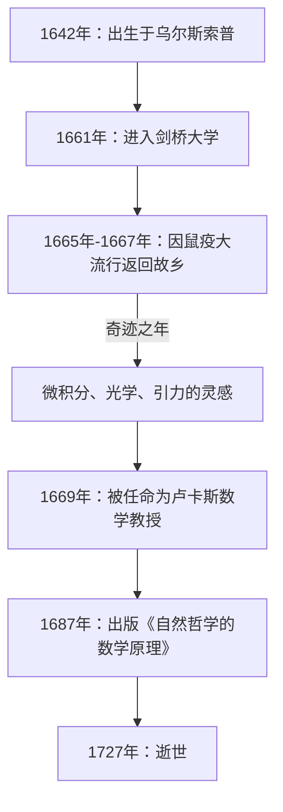

如果要说在人类历史上对科学发展产生最深远影响的一位人物，许多人会提到 **[艾萨克·牛顿](https://kenji.blog/zh-cn/p/newton/)** （[Isaac Newton](https://kenji.blog/zh-cn/p/newton/)）。他在物理学、数学和天文学等各个领域都取得了革命性的发现。毫不夸张地说，他的成就不仅是某一个时代的发现，更是奠定了现代科学的基础。

在本文中，我们将追溯从牛顿的成长经历到晚年的传奇轶事，并深入探讨他在数学和物理学上的伟大成就，特别是 **微积分** （流数法）、 **广义二项式定理** 以及 **牛顿法** 。

## 牛顿的一生与轶事

### 孤独的童年与在乌尔斯索普的诞生

[艾萨克·牛顿](https://kenji.blog/zh-cn/p/newton/)出生于1642年的圣诞节（儒略历；公历为1643年1月4日），出生地是英格兰林肯郡一个名叫乌尔斯索普的小村庄。由于是早产儿，他的身体极其瘦小，起初甚至连能否存活下来都成问题。更不幸的是，牛顿的父亲在他出生前三个月就去世了。

当他三岁时，母亲改嫁，将牛顿留给祖母照顾，自己则去与新任丈夫共同生活。这种年幼时与父母分离的经历据说对牛顿的性格产生了深远影响，促成了他后来极其隐秘和多疑的性格。

在开始当地学校的学业时，牛顿起初并不是一名出色的学生。然而，有这样一段轶事：在打赢了一个曾经欺负过他的同班同学后，他决心在学业上也击败对方，从而使成绩突飞猛进。他还对制作日晷、水钟和风车模型等机械玩具表现出浓厚的兴趣。

### 剑桥大学与“奇迹之年”

1661年，牛顿进入了剑桥大学三一学院。虽然当时的大学主要教授亚里士多德哲学，但牛顿却被[勒内·笛卡尔](https://kenji.blog/zh-cn/p/descartes/)、伽利略·伽利莱和约翰内斯·开普勒等人的新科学思想深深吸引。他在笔记本上留下了一句话： **“Amicus Plato amicus Aristoteles magis amica veritas”** （柏拉图是我的朋友，亚里士多德是我的朋友，但我最好的朋友是真理）。

1665年，伦敦爆发了严重的鼠疫，大学被迫关闭。牛顿回到了他的故乡乌尔斯索普，在一年半的时间里沉浸在沉思之中。在这段宁静而孤独的时期，他获得了三大成就的灵感：微积分的基础、光学（利用三棱镜进行光的色散分析）以及万有引力定律。在科学史上，这段时期被称为 **Annus Mirabilis** （奇迹之年）。



### 苹果轶事的真相

提到牛顿，“看到苹果从树上掉下来从而发现万有引力”的轶事非常著名，但这真的发生过吗？

根据牛顿的传记作者威廉·斯蒂克利的记录，晚年的牛顿亲自讲述了这段插曲。有一天，牛顿在花园里的苹果树下沉思时，看到一个苹果落下，便在心中疑问：“为什么那个苹果总是垂直落向地面？为什么它不向侧面或向上飞，而是始终落向地球的中心呢？”

换句话说，这并不是一个苹果砸到他头上从而突然产生天才火花的滑稽故事。相反，这段轶事展示了他敏锐的洞察力，将日常的琐碎现象与普遍定律（万有引力）联系了起来： **“地球吸引物体的力，难道不就是维持月球和行星轨道的力吗？”**

### 与莱布尼茨的微积分之争

牛顿大约在1665年构思了微积分的理念，但他并没有立即发表自己的成果。与此同时，德国数学家戈特弗里德·威廉·莱布尼茨在1670年代独立发现了微积分的方法，并作为论文发表。

这引发了科学史上关于“谁先发现微积分”的最激烈的优先权之争。如今，学术界得出结论，两人是各自独立发现微积分的。然而，由于莱布尼茨引入的 $dx$ 和 $\int$ 等符号更为优越，莱布尼茨的符号体系在欧洲大陆广泛传播，而英国数学界则固执地坚持自己的符号，导致英国数学在一段时间内落后。

---

## 深入探究牛顿的数学成就

接下来，我们将结合公式，详细解释牛顿在数学领域取得的具体成就。

### 1. 微积分（流数法）的创立

牛顿将他的微积分方法称为 **流数法** （Method of Fluxions）。为了捕捉物理上的连续变化，他将随时间连续变化的量称为“流量”（Fluents），用 $x, y$ 等表示，并将它们的变化率称为“流数”（Fluxions），使用 $\dot{x}, \dot{y}$ 这样的符号。

牛顿最大的贡献之一是明确确立了 **微积分基本定理** ——即微分（求切线）和积分（求面积）互为逆运算。

函数 $f(x)$ 的导数利用极限定义如下：

$$
f'(x) = \lim_{\Delta x \to 0} \frac{f(x + \Delta x) - f(x)}{\Delta x}
$$

这里的 $\Delta x$ 代表无限小（infinitesimal）的变化量。利用这种无限小的概念，牛顿建立了一套系统的计算曲线切线斜率和曲线围成面积的方法。该方法成为了分析运动物体速度和加速度的强大数学工具。

### 2. 广义二项式定理

高中数学中学习的二项式定理，是当指数 $n$ 为正整数时展开 $(x+y)^n$ 的公式。

$$
(x+y)^n = \sum_{k=0}^{n} \binom{n}{k} x^{n-k} y^k
$$

1665年，牛顿将这一定理扩展到了 **分数和负数指数** 。如果指数是实数 $\alpha$，在满足 $|x| < 1$ 的条件下，可以将其展开为如下的无穷级数：

$$
(1+x)^\alpha = 1 + \alpha x + \frac{\alpha(\alpha-1)}{2!} x^2 + \frac{\alpha(\alpha-1)(\alpha-2)}{3!} x^3 + \dots
$$

这一广义二项式定理使得将平方根和倒数表示为无穷级数成为可能，在牛顿推导对数和三角函数的无穷级数展开（泰勒展开的先驱）时，它成为了一种强大的武器。

### 3. 牛顿法

牛顿法（又称牛顿-拉弗森方法）是一种用于求方程 $f(x) = 0$ 的近似实数根的迭代算法。这种方法是一种极其高效的技术，它利用函数的切线来逼近根。

给定一个近似值 $x_n$，下一个近似值 $x_{n+1}$ 可以通过以下递推公式求得：

$$
x_{n+1} = x_n - \frac{f(x_n)}{f'(x_n)}
$$

例如，要求 $x^2 = 2$ 的解（即 $\sqrt{2}$ ），我们设 $f(x) = x^2 - 2$。它的导数是 $f'(x) = 2x$。将其代入递推公式可得：

$$
x_{n+1} = x_n - \frac{x_n^2 - 2}{2x_n} = \frac{1}{2} \left( x_n + \frac{2}{x_n} \right)
$$

这提供了一个非常简单的递推公式。将这个数学公式用程序表达出来如下：

```python
# 使用牛顿法求函数 f(x) = x^2 - 2 平方根的示例
def newton_method_sqrt(value, tolerance=1e-7, max_iterations=100):
    # 设置初始猜测值
    x = value / 2.0
    for i in range(max_iterations):
        # f(x) = x^2 - value, f'(x) = 2x
        # 递推公式： x_{n+1} = x_n - f(x_n)/f'(x_n) = 0.5 * (x_n + value / x_n)
        next_x = 0.5 * (x + value / x)
        
        # 检查是否在容差范围内收敛
        if abs(x - next_x) < tolerance:
            return next_x
        x = next_x
    return x

# 打印 2 的平方根的近似值
print(f"2的平方根的近似值：{newton_method_sqrt(2)}")
```

这个算法收敛速度极快，至今仍广泛应用于计算机中计算平方根以及非线性方程的数值解法中。

---

## 物理学的应用与《原理》

在取得数学领域创新成果的同时，牛顿也将这些成果应用于阐释物理现象。在天文学家爱德蒙·哈雷的强烈劝说下，他的著作 **《自然哲学的数学原理》** （Philosophiæ Naturalis Principia Mathematica）于1687年出版，被认为是科学史上最重要的书籍之一。

在这本书中，他系统地提出了以下 **运动三大定律** ：
1. **惯性定律** （第一定律）：除非受到外力作用，物体将保持静止或匀速直线运动状态。
2. **运动定律** （第二定律）：力等于质量与加速度的乘积（ $F = ma$ ）。
3. **作用与反作用定律** （第三定律）：相互作用的两个物体，其作用力与反作用力大小相等，方向相反。

通过将这些定律与开普勒的行星运动定律进行数学结合，他证明了 **万有引力定律** 。该定律指出，两个具有质量的物体之间的引力 $F$ 与它们的质量 $m_1, m_2$ 的乘积成正比，与它们之间距离 $r$ 的平方成反比。

$$
F = G \frac{m_1 m_2}{r^2} \quad \left( \text{其中 } G \text{ 为万有引力常数} \right)
$$

这证明了地球上的苹果下落和月球等天体的运动，完全可以用同一个物理定律来解释。这无疑是一场彻底颠覆了人类世界观的范式转移。

## 晚年与对后世的影响

尽管牛顿登上了科学的巅峰，但他在晚年却远离了科学研究。他担任了皇家造币厂的厂长与总管，承担了严厉打击伪造货币者的任务，并作为皇家学会会长统治着英国科学界。有趣的是，他留下的绝大多数手稿并非关于物理或数学，而是关于 **炼金术** 和 **圣经年代学（神学）** 。他是最后一位文艺复兴人，也是一个科学与魔法尚未完全分化的时代的知识分子。

关于自己的成就，牛顿留下了这样一句谦逊的名言：

> “如果说我看得比别人更远，那是因为我站在巨人的肩膀上。”

这句话表达了他的敬意，承认自己的发现只有在积累了过去伟大科学家（如哥白尼、伽利略和开普勒）的成果之上才有可能实现。

他建立的经典力学体系，在20世纪初阿尔伯特·爱因斯坦发表相对论之前的约200年里，一直保持着物理学绝对基础的地位。即便在今天，在计算我们日常尺度的物理现象和太空探测器的轨道时，牛顿力学仍被极其精确且有效地运用。

[艾萨克·牛顿](https://kenji.blog/zh-cn/p/newton/)，从孤独的童年起步，凭借其非凡的专注力和天才的直觉，解开了宇宙的真理。他留下的众多定律和数学定理，至今依然支撑着我们的技术与社会。
