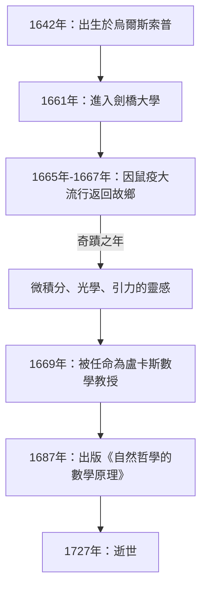

如果要說在人類歷史上對科學發展產生最深遠影響的一位人物，許多人會提到 **艾薩克·牛頓** （Isaac Newton）。他在物理學、數學和天文學等各個領域都取得了革命性的發現。毫不誇張地說，他的成就不僅是某一個時代的發現，更是奠定了現代科學的基礎。

在本文中，我們將追溯從牛頓的成長經歷到晚年的傳奇軼事，並深入探討他在數學和物理學上的偉大成就，特別是 **微積分** （流數法）、 **廣義二項式定理** 以及 **牛頓法** 。

## 牛頓的一生與軼事

### 孤獨的童年與在烏爾斯索普的誕生

艾薩克·牛頓出生於1642年的聖誕節（儒略曆；公曆為1643年1月4日），出生地是英格蘭林肯郡一個名叫烏爾斯索普的小村莊。由於是早產兒，他的身體極其瘦小，起初甚至連能否存活下來都成問題。更不幸的是，牛頓的父親在他出生前三個月就去世了。

當他三歲時，母親改嫁，將牛頓留給祖母照顧，自己則去與新任丈夫共同生活。這種年幼時與父母分離的經歷據說對牛頓的性格產生了深遠影響，促成了他後來極其隱秘和多疑的性格。

在開始當地學校的學業時，牛頓起初並不是一名出色的學生。然而，有這樣一段軼事：在打贏了一個曾經欺負過他的同班同學後，他決心在學業上也擊敗對方，從而使成績突飛猛進。他還對製作日晷、水鐘和風車模型等機械玩具表現出濃厚的興趣。

### 劍橋大學與「奇蹟之年」

1661年，牛頓進入了劍橋大學三一學院。雖然當時的大學主要教授亞里士多德哲學，但牛頓卻被勒內·笛卡兒、伽利略·伽利萊和約翰尼斯·克卜勒等人的新科學思想深深吸引。他在筆記本上留下了一句話： **「Amicus Plato amicus Aristoteles magis amica veritas」** （柏拉圖是我的朋友，亞里士多德是我的朋友，但我最好的朋友是真理）。

1665年，倫敦爆發了嚴重的鼠疫，大學被迫關閉。牛頓回到了他的故鄉烏爾斯索普，在一年半的時間裡沉浸在沉思之中。在這段寧靜而孤獨的時期，他獲得了三大成就的靈感：微積分的基礎、光學（利用三稜鏡進行光的色散分析）以及萬有引力定律。在科學史上，這段時期被稱為 **Annus Mirabilis** （奇蹟之年）。



### 蘋果軼事的真相

提到牛頓，「看到蘋果從樹上掉下來從而發現萬有引力」的軼事非常著名，但這真的發生過嗎？

根據牛頓的傳記作者威廉·史圖克利的記錄，晚年的牛頓親自講述了這段插曲。有一天，牛頓在花園裡的蘋果樹下沉思時，看到一個蘋果落下，便在心中疑問：「為什麼那個蘋果總是垂直落向地面？為什麼它不向側面或向上飛，而是始終落向地球的中心呢？」

換句話說，這並不是一個蘋果砸到他頭上從而突然產生天才火花的滑稽故事。相反，這段軼事展示了他敏銳的洞察力，將日常的瑣碎現象與普遍定律（萬有引力）聯繫了起來： **「地球吸引物體的力，難道不就是維持月球和行星軌道的力嗎？」**

### 與萊布尼茲的微積分之爭

牛頓大約在1665年構思了微積分的理念，但他並沒有立即發表自己的成果。與此同時，德國數學家戈特弗里德·威廉·萊布尼茲在1670年代獨立發現了微積分的方法，並作為論文發表。

這引發了科學史上關於「誰先發現微積分」的最激烈的優先權之爭。如今，學術界得出結論，兩人是各自獨立發現微積分的。然而，由於萊布尼茲引入的 $dx$ 和 $\int$ 等符號更為優越，萊布尼茲的符號體系在歐洲大陸廣泛傳播，而英國數學界則固執地堅持自己的符號，導致英國數學在一段時間內落後。

---

## 深入探究牛頓的數學成就

接下來，我們將結合公式，詳細解釋牛頓在數學領域取得的具體成就。

### 1. 微積分（流數法）的創立

牛頓將他的微積分方法稱為 **流數法** （Method of Fluxions）。為了捕捉物理上的連續變化，他將隨時間連續變化的量稱為「流量」（Fluents），用 $x, y$ 等表示，並將它們的變化率稱為「流數」（Fluxions），使用 $\dot{x}, \dot{y}$ 這樣的符號。

牛頓最大的貢獻之一是明確確立了 **微積分基本定理** ——即微分（求切線）和積分（求面積）互為逆運算。

函數 $f(x)$ 的導數利用極限定義如下：

$$
f'(x) = \lim_{\Delta x \to 0} \frac{f(x + \Delta x) - f(x)}{\Delta x}
$$

這裡的 $\Delta x$ 代表無限小（infinitesimal）的變化量。利用這種無限小的概念，牛頓建立了一套系統的計算曲線切線斜率和曲線圍成面積的方法。該方法成為了分析運動物體速度和加速度的強大數學工具。

### 2. 廣義二項式定理

高中數學中學習的二項式定理，是當指數 $n$ 為正整數時展開 $(x+y)^n$ 的公式。

$$
(x+y)^n = \sum_{k=0}^{n} \binom{n}{k} x^{n-k} y^k
$$

1665年，牛頓將這一定理擴展到了 **分數和負數指數** 。如果指數是實數 $\alpha$，在滿足 $|x| < 1$ 的條件下，可以將其展開為如下的無窮級數：

$$
(1+x)^\alpha = 1 + \alpha x + \frac{\alpha(\alpha-1)}{2!} x^2 + \frac{\alpha(\alpha-1)(\alpha-2)}{3!} x^3 + \dots
$$

這一廣義二項式定理使得將平方根和倒數表示為無窮級數成為可能，在牛頓推導對數和三角函數的無窮級數展開（泰勒展開的先驅）時，它成為了一種強大的武器。

### 3. 牛頓法

牛頓法（又稱牛頓-拉弗森方法）是一種用於求方程 $f(x) = 0$ 的近似實數根的迭代演算法。這種方法是一種極其高效的技術，它利用函數的切線來逼近根。

給定一個近似值 $x_n$，下一個近似值 $x_{n+1}$ 可以透過以下遞迴公式求得：

$$
x_{n+1} = x_n - \frac{f(x_n)}{f'(x_n)}
$$

例如，要求 $x^2 = 2$ 的解（即 $\sqrt{2}$ ），我們設 $f(x) = x^2 - 2$。它的導數是 $f'(x) = 2x$。將其代入遞迴公式可得：

$$
x_{n+1} = x_n - \frac{x_n^2 - 2}{2x_n} = \frac{1}{2} \left( x_n + \frac{2}{x_n} \right)
$$

這提供了一個非常簡單的遞迴公式。將這個數學公式用程式表達出來如下：

```python
# 使用牛頓法求函數 f(x) = x^2 - 2 平方根的範例
def newton_method_sqrt(value, tolerance=1e-7, max_iterations=100):
    # 設定初始猜測值
    x = value / 2.0
    for i in range(max_iterations):
        # f(x) = x^2 - value, f'(x) = 2x
        # 遞迴公式： x_{n+1} = x_n - f(x_n)/f'(x_n) = 0.5 * (x_n + value / x_n)
        next_x = 0.5 * (x + value / x)
        
        # 檢查是否在容差範圍內收斂
        if abs(x - next_x) < tolerance:
            return next_x
        x = next_x
    return x

# 列印 2 的平方根的近似值
print(f"2的平方根的近似值：{newton_method_sqrt(2)}")
```

這個演算法收斂速度極快，至今仍廣泛應用於電腦中計算平方根以及非線性方程的數值解法中。

---

## 物理學的應用與《原理》

在取得數學領域創新成果的同時，牛頓也將這些成果應用於闡釋物理現象。在天文學家愛德蒙·哈雷的強烈勸說下，他的著作 **《自然哲學的數學原理》** （Philosophiæ Naturalis Principia Mathematica）於1687年出版，被認為是科學史上最重要的書籍之一。

在這本書中，他系統地提出了以下 **運動三大定律** ：
1. **慣性定律** （第一定律）：除非受到外力作用，物體將保持靜止或等速直線運動狀態。
2. **運動定律** （第二定律）：力等於質量與加速度的乘積（ $F = ma$ ）。
3. **作用與反作用定律** （第三定律）：相互作用的兩個物體，其作用力與反作用力大小相等，方向相反。

透過將這些定律與克卜勒的行星運動定律進行數學結合，他證明了 **萬有引力定律** 。該定律指出，兩個具有質量的物體之間的引力 $F$ 與它們的質量 $m_1, m_2$ 的乘積成正比，與它們之間距離 $r$ 的平方成反比。

$$
F = G \frac{m_1 m_2}{r^2} \quad \left( \text{其中 } G \text{ 為萬有引力常數} \right)
$$

這證明了地球上的蘋果下落和月球等天體的運動，完全可以用同一個物理定律來解釋。這無疑是一場徹底顛覆了人類世界觀的典範轉移。

## 晚年與對後世的影響

儘管牛頓登上了科學的巔峰，但他在晚年卻遠離了科學研究。他擔任了皇家造幣廠的廠長與總管，承擔了嚴厲打擊偽造貨幣者的任務，並作為皇家學會會長統治著英國科學界。有趣的是，他留下的絕大多數手稿並非關於物理或數學，而是關於 **鍊金術** 和 **聖經年代學（神學）** 。他是最後一位文藝復興人，也是一個科學與魔法尚未完全分化的時代的知識分子。

關於自己的成就，牛頓留下了這樣一句謙遜的名言：

> 「如果說我看得比別人更遠，那是因為我站在巨人的肩膀上。」

這句話表達了他的敬意，承認自己的發現只有在積累了過去偉大科學家（如哥白尼、伽利略和克卜勒）的成果之上才有可能實現。

他建立的古典力學體系，在20世紀初阿爾伯特·愛因斯坦發表相對論之前的約200年裡，一直保持著物理學絕對基礎的地位。即便在今天，在計算我們日常尺度的物理現象和太空探測器的軌道時，牛頓力學仍被極其精確且有效地運用。

艾薩克·牛頓，從孤獨的童年起步，憑藉其非凡的專注力和天才的直覺，解開了宇宙的真理。他留下的眾多定律和數學定理，至今依然支撐著我們的技術與社會。
