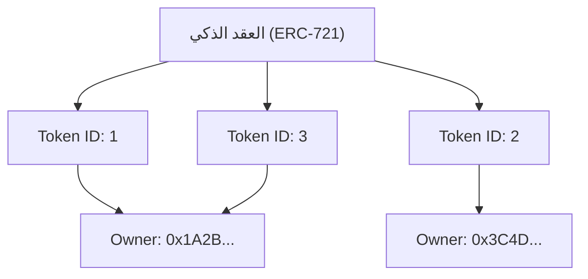

منذ انتشار الإنترنت، تم التعامل مع البيانات الرقمية على أنها شيء "يمكن نسخه بأي قدر". لا تتدهور الملفات مثل الصور والنصوص والموسيقى على أجهزة الكمبيوتر عند نسخها، ويمكن مضاعفتها إلى ما لا نهاية. في حين أن "سهولة النسخ" هذه كانت القوة الدافعة وراء الانتشار الهائل للإنترنت، إلا أنها جعلت من الصعب للغاية منح "الندرة" أو "حقوق الملكية الفريدة" للبيانات الرقمية.

ومع ذلك، مع ظهور تقنية البلوكتشين (blockchain) والعقود الذكية (smart contracts)، تم قلب هذا الافتراض بشكل كبير. في قلب هذا التحول النموذجي توجد "NFTs (الرموز غير القابلة للاستبدال: Non-Fungible Tokens)".

في هذه المقالة، سنتعمق من منظور تقني في ماهية الـ NFT بالضبط، والعمليات التي تجري خلف الكواليس في "ERC-721"، وهو المعيار التقني على شبكة الإيثيريوم (Ethereum) الذي يدعمها.

## 1. الفرق الجوهري بين FT (الرموز القابلة للاستبدال) و NFT (الرموز غير القابلة للاستبدال)

لفهم الـ NFT، يجب أولاً أن نفهم الكلمة المضادة لها، وهي "FT (الرموز القابلة للاستبدال: Fungible Tokens)".

### ما هو القابل للاستبدال (Fungible)
تعني كلمة "Fungible (قابل للاستبدال)" أن أصلاً ما له نفس القيمة تمامًا مثل أصل آخر من نفس النوع ويمكن استبداله به.
أوضح الأمثلة هي العملات الورقية (مثل الين أو الدولار) والأصول المشفرة مثل البيتكوين (Bitcoin).

الورقة النقدية بقيمة 10000 ين التي تمتلكها والورقة النقدية بقيمة 10000 ين التي أمتلكها، على الرغم من اختلاف أرقامها التسلسلية، إلا أنها متساوية تمامًا في القيمة. و 1 BTC التي تمتلكها لها نفس قيمة 1 BTC التي أمتلكها، ولن يشتكي أحد إذا قمنا بتبادلها. هذه الخاصية المتمثلة في "إمكانية الاستبدال بآخر من نفس النوع" تسمى قابلية الاستبدال (Fungibility).

### ما هو غير القابل للاستبدال (Non-Fungible)
من ناحية أخرى، تعني كلمة "Non-Fungible (غير قابل للاستبدال)" أن الأصل فريد ولا يمكن استبداله بشيء آخر.
من الأمثلة في العالم الحقيقي لوحة الموناليزا، أو عقار بعنوان محدد، أو كتاب يحمل توقيعك. لكل من هذه الأشياء قيمة وسمات فريدة، ولا يمكن ببساطة استبدالها بشكل متساوٍ بـ "لوحة أخرى" أو "منزل آخر".

تطبيق هذا المفهوم على البيانات الرقمية هو ما يسمى بـ NFT. الـ NFTs هي رموز يتم إصدارها على البلوكتشين، ولكن كل منها يمتلك مُعرّفًا فريدًا (Token ID) ويرتبط كل منها ببيانات وصفية مختلفة (مثل الصور ومقاطع الفيديو والنصوص). هذا يسمح بإنشاء حالة في الفضاء الرقمي حيث "تكون هذه البيانات الوحيدة من نوعها في العالم".

## 2. آلية معيار ERC-721 الخاص بـ Ethereum

المعيار التقني الأكثر شهرة لتنفيذ الـ NFTs هو "ERC-721" على شبكة إيثيريوم بلوكتشين. ERC هي اختصار لـ "Ethereum Request for Comments"، وهي تقترح مواصفات قياسية على شبكة إيثيريوم.

يحدد ERC-721 واجهة لإدارة "من يمتلك أي معرف رمز (Token ID)" باستخدام العقود الذكية.

### تعيين معرف الرمز وعنوان المالك (Mapping)

يكمن جوهر ERC-721 في بنية "تعيين (Mapping)" بسيطة للغاية (هيكل بيانات من نوع القاموس). داخل العقد الذكي، يتم ربط معرف رمز محدد (على سبيل المثال `TokenID: 1`) بعنوان الإيثيريوم الخاص بالمستخدم الذي يمتلكه (على سبيل المثال `0x123...`) ويتم تسجيله.

يوضح المخطط المفاهيمي التالي الحالة الداخلية للعقد الذكي.



بهذه الطريقة، فإن الحالة التي يتم فيها حفر جدول تعيين "Token ID" و "عنوان المالك" في العقد على البلوكتشين هي الجوهر الحقيقي لـ "الملكية" في NFT.

## 3. البيانات الوصفية (Metadata) والتخزين خارج السلسلة (Off-chain Storage)

تسجيل البيانات على البلوكتشين يكلف الكثير (رسوم الغاز). إذا حاولت حفظ البيانات الثنائية للصور أو مقاطع الفيديو عالية الجودة مباشرة على شبكة إيثيريوم بلوكتشين، فسوف تتكبد تكاليف فلكية.

لذلك، في ERC-721، يتم استخدام طريقة حيث يحتوي الرمز نفسه فقط على "رابط للبيانات الوصفية (URI)"، بينما يتم حفظ بيانات الصورة الفعلية والمعلومات التفصيلية خارج البلوكتشين (خارج السلسلة).

### TokenURI والبيانات الوصفية بتنسيق JSON

يعرّف عقد ERC-721 دالة تسمى `tokenURI(uint256 _tokenId)`. عند تمرير Token ID إلى هذه الدالة، فإنها تُرجع عنوان URL لملف JSON يصف معلومات ذلك الرمز.

```json
{
  "name": "My Awesome NFT #1",
  "description": "هذا فن رقمي نادر جدًا.",
  "image": "ipfs://QmXoypizjW3WknFiJnKLwHCnL72vedxjQkDDP1mXWo6uco/image.png",
  "attributes": [
    {
      "trait_type": "Background",
      "value": "Blue"
    }
  ]
}
```

داخل ملف JSON هذا، يتم تحديد عنوان URL لملف الصورة الفعلي (في حقل `image`).

### استخدام IPFS (نظام الملفات بين الكواكب)

ماذا يحدث إذا وضعت ملف JSON الخاص بالبيانات الوصفية أو ملف الصورة على خادم ويب عادي (مثل AWS S3)؟
إذا قام مسؤول الخادم بحذف الملف، أو تغيير عنوان URL، أو إذا تعطل الخادم نفسه، فسيصبح الـ NFT مجرد رمز فارغ مع "رابط معطل".

لمنع ذلك، تستخدم العديد من مشاريع الـ NFT نظام ملفات لامركزي يسمى "IPFS". في IPFS، يتم إنشاء قيمة تجزئة (CID: Content Identifier) من محتوى الملف نفسه، وتُستخدم كعنوان.
إذا تغير محتوى الملف بمقدار بايت واحد، سيتغير العنوان أيضًا، مما يضمن عدم التلاعب بالبيانات، ويزيد بشكل كبير من احتمالية الاحتفاظ بالبيانات بشكل دائم على شبكة نظير إلى نظير (P2P).

## 4. الانتقادات التي تفيد بأن "ما تملكه هو مجرد عنوان URL" والابتكارات التقنية

عندما أصبحت الـ NFTs شائعة، كان هناك انتقاد قوي بأنه "حتى لو قلت أنك اشتريت NFT، فأنت مجرد تشتري 'عنوان URL' مسجلًا على البلوكتشين، ولا تملك الصورة نفسها".

من الناحية التقنية، هذا الانتقاد صحيح (في معظم المشاريع). ما يتم تسجيله في العقد الذكي هو فقط تعيين Token ID والمالك، وعنوان URL إلى ملف JSON، ولا يتم نقل حقوق الوصول الحصري (الحق في منع الآخرين من رؤيتها) أو حقوق الطبع والنشر لبيانات الصورة نفسها تلقائيًا.

ومع ذلك، تتقدم الأساليب التقنية والابتكارات لمعالجة هذه المشكلة أيضًا.

### الـ NFTs الكاملة على السلسلة (On-chain NFT)
تتبنى بعض المشاريع نهجًا "كاملاً على السلسلة" حيث يتم كتابة بيانات الصورة مباشرة إلى البلوكتشين بدلاً من وضعها على خوادم خارجية أو IPFS.
على سبيل المثال، يتم تمثيل الصورة بتنسيق نصي يسمى SVG (Scalable Vector Graphics)، ويتم حفظ هذا الكود داخل العقد الذكي. هذا يضمن أنه طالما أن شبكة إيثيريوم بلوكتشين موجودة، فإن بيانات الصورة لن تختفي أبدًا.

### التخزين الدائم مثل Arweave
على الرغم من أن IPFS لامركزي، إلا أنه يحمل خطر الاختفاء من الشبكة على المدى الطويل ما لم يستمر شخص ما في "تثبيت (Pinning)" البيانات. لذلك، أصبح هناك نهج شائع لتخزين البيانات الوصفية والصور على مساحة تخزين بلوكتشين تضمن، على مستوى البروتوكول، حفظ البيانات بشكل شبه دائم بمجرد دفع رسوم لمرة واحدة، مثل "Arweave".

## الخاتمة

ليست NFT و ERC-721 مجرد كلمات طنانة، بل هي حل تقني مبتكر لمشكلة طال أمدها على الإنترنت تتمثل في "منح التفرد وحقوق الملكية للبيانات الرقمية".

في حين أن الانتقاد بأنها "مجرد ملكية لعنوان URL" يشير إلى حقيقة تقنية، إلا أنه من خلال فهم آليتها بشكل صحيح والجمع بين الابتكارات التقنية الجديدة مثل السلسلة الكاملة (On-chain) والتخزين الدائم، فإننا نبني عالمًا أكثر قوة لـ "الأصول الرقمية".
مع نضوج البلوكتشين كبنية تحتية، ستستمر الخلفية التقنية للـ NFTs في التطور، وسيستمر تطبيقها الاجتماعي في التقدم.
