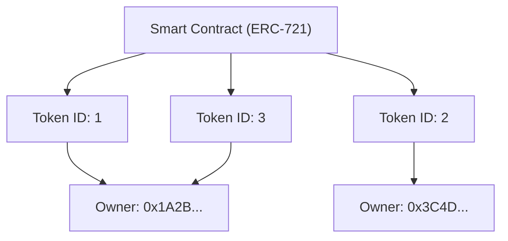

Seit der Verbreitung des Internets wurden digitale Daten als etwas behandelt, das "beliebig oft kopiert werden kann". Daten auf einem Computer, wie Bilddateien, Textdaten und Musikdateien, verschlechtern sich beim Kopieren nicht und können unendlich vervielfältigt werden. Obwohl diese "leichte Kopierbarkeit" die treibende Kraft hinter der explosiven Verbreitung des Internets war, machte sie es gleichzeitig extrem schwierig, digitalen Daten "Seltenheit" oder "einzigartiges Eigentum" zu verleihen.

Jedoch wurde diese Prämisse durch das Aufkommen der Blockchain-Technologie und Smart Contracts grundlegend auf den Kopf gestellt. Im Zentrum dieses Paradigmenwechsels steht der "NFT (Non-Fungible Token)".

In diesem Artikel werden wir aus einer technischen Perspektive tief eintauchen, um zu verstehen, was ein NFT eigentlich ist und welche Prozesse hinter "ERC-721", dem technischen Standard von Ethereum, der dies unterstützt, ablaufen.

## 1. Der wesentliche Unterschied zwischen FT (Fungible Token) und NFT (Non-Fungible Token)

Um NFTs zu verstehen, müssen wir zunächst das Gegenteil, den "FT (Fungible Token)", verstehen.

### Was bedeutet Fungibel (Fungible)?
"Fungibel (Austauschbar)" bedeutet, dass ein Vermögenswert genau den gleichen Wert wie ein anderer Vermögenswert derselben Art hat und austauschbar ist.
Die verständlichsten Beispiele sind Fiat-Währungen (Yen oder Dollar) und Krypto-Assets wie Bitcoin.

Ein 10.000-Yen-Schein, den Sie haben, und ein 10.000-Yen-Schein, den ich habe, haben zwar unterschiedliche Seriennummern, sind aber vom Wert her völlig gleichwertig. Auch 1 BTC, den Sie besitzen, und 1 BTC, den ich besitze, haben genau den gleichen Wert, und niemand wird sich beschweren, wenn wir sie tauschen. Diese Eigenschaft, "durch etwas anderes Gleiches ersetzt werden zu können", nennt man Fungibilität.

### Was bedeutet Non-Fungible (Nicht fungibel)?
Im Gegensatz dazu bedeutet "Non-Fungible (Nicht austauschbar)", dass der Vermögenswert einzigartig ist und nicht gegen etwas anderes ausgetauscht werden kann.
Beispiele aus der realen Welt sind das Gemälde der Mona Lisa, eine Immobilie mit einer bestimmten Adresse oder ein Buch mit Ihrer Unterschrift. Diese haben jeweils ihren eigenen Wert und ihre eigenen Attribute und können nicht einfach eins zu eins gegen ein "anderes Gemälde" oder ein "anderes Haus" getauscht werden.

NFTs wenden dies auf digitale Daten an. Ein NFT ist ein Token, der auf einer Blockchain ausgegeben wird, aber jeder hat eine eindeutige Kennung (Token ID) und ist mit unterschiedlichen Metadaten (Informationen wie Bilder, Videos, Texte usw.) verknüpft. Dies ermöglicht es, einen Zustand im digitalen Raum zu schaffen, in dem "diese Daten die einzigen auf der Welt sind".

## 2. Wie der Ethereum ERC-721-Standard funktioniert

Der bekannteste technische Standard zur Implementierung von NFTs ist "ERC-721" auf der Ethereum-Blockchain. ERC steht für "Ethereum Request for Comments" und schlägt eine Standardvorgabe im Ethereum-Netzwerk vor.

ERC-721 definiert eine Schnittstelle zur Verwaltung, "wer welche Token ID besitzt", mithilfe von Smart Contracts.

### Zuordnung von Token-ID und Besitzeradresse

Der Kern von ERC-721 liegt in einem sehr einfachen "Mapping (Wörterbuch-Datenstruktur)". Innerhalb des Smart Contracts wird eine bestimmte Token-ID (z.B. `TokenID: 1`) aufgezeichnet und mit der Ethereum-Adresse des Benutzers verknüpft, der sie besitzt (z.B. `0x123...`).

Ein konzeptionelles Diagramm des internen Zustands eines Smart Contracts ist unten dargestellt.



Dieser Zustand, in dem die Zuordnungstabelle von "Token ID" und "Besitzeradresse" in den Contract auf der Blockchain eingraviert ist, ist die wahre Identität des "Besitzes" bei einem NFT.

## 3. Metadaten und Off-Chain-Speicherung

Das Speichern von Daten auf der Blockchain ist mit sehr hohen Kosten (Gasgebühren) verbunden. Der Versuch, Binärdaten von hochauflösenden Bildern oder Videos direkt in der Ethereum-Blockchain zu speichern, würde astronomische Kosten verursachen.

Daher verwendet ERC-721 einen Ansatz, bei dem der Token selbst nur einen "Link (URI) zu den Metadaten" enthält und die eigentlichen Bilddaten und detaillierten Informationen außerhalb der Blockchain (Off-Chain) gespeichert werden.

### TokenURI und JSON-Metadaten

Der ERC-721-Contract definiert eine Funktion namens `tokenURI(uint256 _tokenId)`. Wenn Sie eine Token-ID an diese übergeben, gibt sie die URL der JSON-Datei zurück, die die Informationen für diesen Token enthält.

```json
{
  "name": "My Awesome NFT #1",
  "description": "Dies ist ein sehr seltenes digitales Kunstwerk.",
  "image": "ipfs://QmXoypizjW3WknFiJnKLwHCnL72vedxjQkDDP1mXWo6uco/image.png",
  "attributes": [
    {
      "trait_type": "Background",
      "value": "Blue"
    }
  ]
}
```

In dieser JSON-Datei wird zusätzlich die URL der tatsächlichen Bilddatei (Feld `image`) angegeben.

### Nutzung von IPFS (InterPlanetary File System)

Was würde passieren, wenn Sie die Metadaten-JSON- oder Bilddateien auf einem normalen Webserver (wie AWS S3) ablegen würden?
Wenn der Serveradministrator die Datei löscht, die URL ändern würde oder der Server selbst ausfällt, wird der NFT zu einem leeren Token mit einem einfachen "toten Link".

Um dies zu verhindern, verwenden viele NFT-Projekte ein dezentrales Dateisystem namens "IPFS". In IPFS wird aus dem Dateiinhalt selbst ein Hash-Wert (CID: Content Identifier) generiert, der als Adresse dient.
Da sich die Adresse ändert, selbst wenn sich der Dateiinhalt um 1 Byte ändert, kann garantiert werden, dass die Daten nicht manipuliert wurden, was die Wahrscheinlichkeit erhöht, dass die Daten dauerhaft im P2P-Netzwerk aufbewahrt werden.

## 4. Die Kritik, dass man "nur eine URL besitzt", und technische Lösungen

Als NFTs boomten, gab es starke Kritik, die besagte: "Selbst wenn man sagt, man habe einen NFT gekauft, hat man nur eine 'einfache URL' gekauft, die auf der Blockchain registriert ist, und man besitzt das Bild selbst nicht."

Technisch gesehen ist diese Kritik (für viele Projekte) wahr. Was im Smart Contract gespeichert ist, ist nur die Zuordnung von Token-ID zum Besitzer und die URL zum JSON. Ein exklusives Zugriffsrecht (das Recht, andere daran zu hindern, es zu sehen) oder das Urheberrecht an den Bilddaten selbst wird nicht automatisch übertragen.

Es gibt jedoch zunehmend technische Ansätze und Lösungen für dieses Problem.

### Full On-Chain NFT

Einige Projekte verfolgen einen "Full On-Chain"-Ansatz, bei dem Bilddaten direkt in die Blockchain geschrieben werden, anstatt auf externen Servern oder in IPFS gespeichert zu werden.
Beispielsweise wird ein Bild in einem textbasierten Format namens SVG (Scalable Vector Graphics) dargestellt, und sein Code wird im Smart Contract gespeichert. Dies garantiert, dass die Bilddaten niemals verschwinden, solange die Ethereum-Blockchain existiert.

### Dauerhafte Speicherung wie Arweave

Obwohl IPFS dezentralisiert ist, besteht das Risiko, dass Daten langfristig aus dem Netzwerk verschwinden, wenn nicht jemand die Daten weiterhin "anpinnt (pinning)". Daher werden Ansätze populärer, bei denen Metadaten und Bilder in Blockchain-Speichern wie "Arweave" gespeichert werden, die auf Protokollebene garantieren, dass Daten nach einmaliger Zahlung einer Gebühr semi-permanent gespeichert werden.

## Fazit

NFTs und ERC-721 sind nicht nur ein Modewort, sondern eine bahnbrechende technische Lösung für das langjährige Problem des Internets, "digitalen Daten Einzigartigkeit und Eigentum zu verleihen".

Die Kritik, dass man "nur eine URL besitzt", trifft einen technischen Kern, aber durch das richtige Verständnis des Mechanismus und die Kombination neuer technischer Lösungen wie Full On-Chain und dauerhafter Speicherung bauen wir an einer robusteren Welt der "digitalen Assets".
Während die Blockchain als Infrastruktur reift, wird sich auch die technische Seite der NFTs weiterentwickeln und ihre gesellschaftliche Implementierung voranschreiten.
