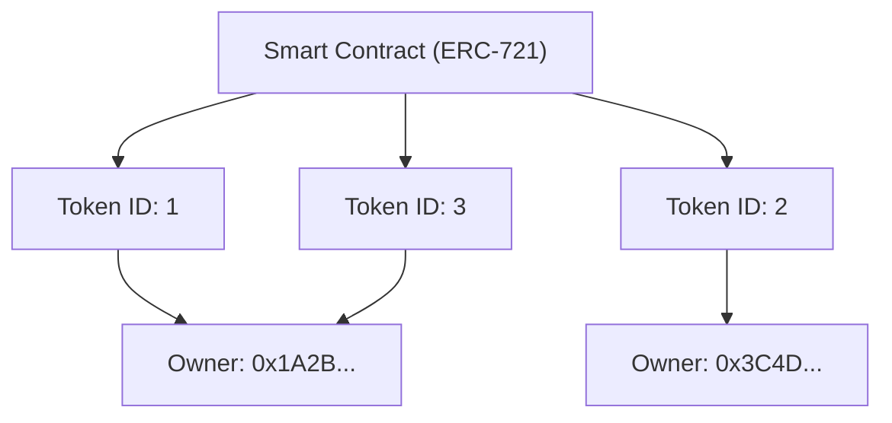

Since the widespread adoption of the Internet, digital data has been treated as something that "can be copied infinitely". Data on computers, such as image files, text data, and music files, can be duplicated without degradation and multiplied endlessly. While this "ease of copying" was the driving force behind the explosive spread of the Internet, it also made it extremely difficult to endow digital data with "scarcity" or "one-of-a-kind ownership".

However, with the advent of blockchain technology and smart contracts, this premise was largely overturned. At the center of this paradigm shift is the "NFT (Non-Fungible Token)".

In this article, we will dig deep from a technical perspective into what an NFT actually is, and what kind of processing takes place behind the scenes of "ERC-721", the Ethereum technical standard that supports it.

## 1. The Essential Difference Between FTs (Fungible Tokens) and NFTs (Non-Fungible Tokens)

To understand NFTs, it is first necessary to understand their antonym, "FT (Fungible Token)".

### What is Fungible?
"Fungible" means that a certain asset has exactly the same value as another asset of the same type and is interchangeable.
The most easy-to-understand examples are fiat currencies (like Yen or Dollars) and crypto assets like Bitcoin.

The 10,000 yen bill you have and the 10,000 yen bill I have are completely equivalent in value, even though their serial numbers differ. 1 BTC you hold and 1 BTC I hold also have the exact same value, and no one would complain if we exchanged them. This property of being "replaceable with another of the same kind" is called fungibility.

### What is Non-Fungible?
On the other hand, "Non-Fungible" means that the asset is one-of-a-kind and cannot be exchanged for something else.
Examples in the real world include the Mona Lisa painting, real estate with a specific address, or a book with your signature on it. Each of these has unique value and attributes, and cannot simply be exchanged equivalently for "another painting" or "another house".

Applying this to digital data is what NFTs do. NFTs are tokens issued on a blockchain, but each has a unique identifier (Token ID) and is linked to different metadata (information such as images, videos, texts). This makes it possible to create a state in the digital space where "this data is the only one in the world".

## 2. How Ethereum's ERC-721 Standard Works

The most famous technical standard for implementing NFTs is "ERC-721" on the Ethereum blockchain. ERC stands for "Ethereum Request for Comments", which proposes standard specifications on the Ethereum network.

ERC-721 defines an interface for managing "who owns which Token ID" using smart contracts.

### Mapping Between Token IDs and Owner Addresses

The core of ERC-721 lies in a very simple "mapping (dictionary-type data structure)". Within the smart contract, a specific token ID (e.g., `TokenID: 1`) and the Ethereum address of the user who owns it (e.g., `0x123...`) are linked and recorded.

A conceptual diagram of the internal state of the smart contract is shown below.



In this way, the state in which the correspondence table of "Token ID" and "Owner's Address" is engraved in the contract on the blockchain is exactly the true nature of "ownership" in NFTs.

## 3. Metadata and Off-Chain Storage

Recording data on the blockchain incurs a very high cost (gas fees). If you tried to store high-quality image or video binary data directly on the Ethereum blockchain, astronomical costs would be incurred.

Therefore, in ERC-721, a method is taken where the token itself only holds a "link to the metadata (URI)", and the actual image data and detailed information are stored outside the blockchain (off-chain).

### TokenURI and JSON Metadata

The ERC-721 contract defines a function called `tokenURI(uint256 _tokenId)`. When a Token ID is passed to this, it returns the URL of a JSON file that describes the information of that token.

```json
{
  "name": "My Awesome NFT #1",
  "description": "This is a very rare digital art.",
  "image": "ipfs://QmXoypizjW3WknFiJnKLwHCnL72vedxjQkDDP1mXWo6uco/image.png",
  "attributes": [
    {
      "trait_type": "Background",
      "value": "Blue"
    }
  ]
}
```

Within this JSON file, the URL of the actual image file (the `image` field) is further specified.

### Utilization of IPFS (InterPlanetary File System)

What would happen if the metadata JSON or image files were placed on an ordinary web server (such as AWS S3)?
If the server administrator deletes the files, changes the URLs, or if the server itself goes down, the NFT becomes nothing more than an empty token with a "broken link".

To prevent this, many NFT projects utilize a decentralized file system called "IPFS". In IPFS, a hash value (CID: Content Identifier) is generated from the file contents itself, and this is used as the address.
Since the address changes if even a single byte of the file contents changes, it guarantees that the data has not been tampered with, and increases the likelihood that the data will be permanently retained on the P2P network.

## 4. The Criticism That "You Only Own a URL" and Technical Innovations

When NFTs boomed, there was strong criticism stating, "Even if you say you bought an NFT, you merely bought 'just a URL' recorded on the blockchain, and you do not own the image itself."

Technically speaking, this criticism is a fact (in many projects). What is recorded in the smart contract is only the mapping of the Token ID and the owner, and the URL to the JSON. It does not automatically transfer exclusive access rights to the image data itself (the right to prevent others from seeing it) or copyright.

However, technical approaches and innovations to address this issue are also advancing.

### Fully On-Chain NFTs (On-chain NFT)
Some projects adopt a "fully on-chain" method where image data is written directly onto the blockchain, rather than being placed on external servers or IPFS.
For example, the image is represented in a text-based format called SVG (Scalable Vector Graphics), and its code is stored within the smart contract. This guarantees that the image data will never disappear as long as the Ethereum blockchain exists.

### Persistent Storage like Arweave
Although IPFS is decentralized, there is a risk that data will disappear from the network in the long term if someone does not continue to "Pin" it. Therefore, an approach to store metadata and images on blockchain storage like "Arweave", which guarantees at the protocol level to store data semi-permanently once a fee is paid, is also becoming popular.

## Conclusion

NFTs and ERC-721 are not just buzzwords; they are a groundbreaking technical answer to a long-standing challenge on the Internet of "giving uniqueness and ownership to digital data".

The criticism of "owning just a URL" points out a technical fact, but by correctly understanding its mechanism and combining new technical innovations such as fully on-chain and persistent storage, we are building a more robust world of "digital assets".
As the blockchain matures as infrastructure, the technical backend of NFTs will evolve further, and its implementation in society will likely progress.
