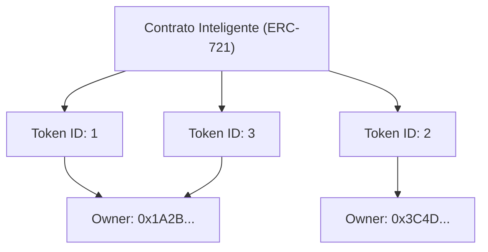

Desde la popularización de Internet, los datos digitales se han tratado como "algo que se puede copiar infinitamente". Los datos en una computadora, como archivos de imágenes, datos de texto y archivos de música, se pueden duplicar sin degradación y multiplicar de manera infinita. Esta "facilidad de copia" fue la fuerza impulsora que respaldó la adopción explosiva de Internet, pero por otro lado, hacía extremadamente difícil otorgar a los datos digitales "escasez" o "propiedad única e inigualable".

Sin embargo, con la llegada de la tecnología blockchain y los contratos inteligentes (smart contracts), esta premisa está a punto de cambiar drásticamente. En el centro de este cambio de paradigma se encuentran los "NFT" (Non-Fungible Tokens: Tokens No Fungibles).

En este artículo, profundizaremos desde una perspectiva técnica en qué son exactamente los NFT y qué tipo de procesamiento se lleva a cabo tras bambalinas en "ERC-721", el estándar técnico de Ethereum que los respaldda.

## 1. La diferencia fundamental entre FT (Tokens Fungibles) y NFT (Tokens No Fungibles)

Para entender los NFT, primero debemos entender su antónimo, "FT (Fungible Token: Token Fungible)".

### ¿Qué significa Fungible (Fungible)?
"Fungible" significa que un activo tiene exactamente el mismo valor que otro activo del mismo tipo y que pueden intercambiarse.
Los ejemplos más claros son las monedas fiduciarias (como el yen o el dólar) y los criptoactivos como Bitcoin.

El billete de 10,000 yenes que tú tienes y el billete de 10,000 yenes que yo tengo pueden tener un número de serie diferente, pero su valor es completamente equivalente. El 1 BTC que tú posees y el 1 BTC que yo poseo tienen exactamente el mismo valor, y si los intercambiamos, nadie se quejará. A esta propiedad de "poder ser reemplazado por otro igual" se le llama fungibilidad.

### ¿Qué significa No Fungible (Non-Fungible)?
Por el contrario, "No Fungible" significa que el activo es único en su tipo y no puede ser intercambiado por otro.
Ejemplos en el mundo real incluyen la pintura de la Mona Lisa, bienes raíces con una dirección específica o un libro con tu firma. Cada uno de estos tiene un valor y atributos únicos, y no se pueden intercambiar por "otra pintura" u "otra casa" asumiendo una equivalencia simple.

La aplicación de esto a los datos digitales es el NFT. Los NFT son tokens emitidos en una blockchain, pero cada uno tiene un identificador único (Token ID) y cada uno está vinculado a metadatos diferentes (información como imágenes, videos, texto, etc.). Esto permite crear un estado en el espacio digital donde "estos datos son los únicos en el mundo".

## 2. El mecanismo del estándar ERC-721 de Ethereum

El estándar técnico más famoso para implementar NFT es "ERC-721" en la blockchain de Ethereum. ERC significa "Ethereum Request for Comments" y propone una especificación estándar en la red de Ethereum.

ERC-721 define una interfaz para gestionar "quién posee qué Token ID" utilizando contratos inteligentes.

### Mapeo entre el Token ID y la dirección del propietario

El núcleo de ERC-721 se encuentra en un "mapeo (estructura de datos tipo diccionario)" muy simple. Dentro del contrato inteligente, se registra un vínculo entre un ID de token específico (por ejemplo, `TokenID: 1`) y la dirección de Ethereum del usuario que lo posee (por ejemplo, `0x123...`).

A continuación se muestra un diagrama conceptual del estado interno de un contrato inteligente.



De esta manera, el estado en el que la tabla de correspondencia de "Token ID" y "dirección del propietario" está grabada en el contrato en la blockchain es precisamente la verdadera naturaleza de la "propiedad" en los NFT.

## 3. Metadatos y almacenamiento fuera de la cadena (Off-chain)

Registrar datos en la blockchain conlleva un costo muy alto (gas). Si se intenta guardar datos binarios de imágenes o videos de alta calidad directamente en la blockchain de Ethereum, se incurriría en costos astronómicos.

Por ello, en ERC-721, se adopta el método donde el token en sí solo tiene un "enlace (URI) a los metadatos", y los datos de imagen reales y la información detallada se almacenan fuera de la blockchain (off-chain).

### TokenURI y metadatos JSON

El contrato ERC-721 define una función llamada `tokenURI(uint256 _tokenId)`. Al pasarle un Token ID a esta función, devuelve la URL de un archivo JSON que describe la información de ese token.

```json
{
  "name": "My Awesome NFT #1",
  "description": "Este es un arte digital muy raro.",
  "image": "ipfs://QmXoypizjW3WknFiJnKLwHCnL72vedxjQkDDP1mXWo6uco/image.png",
  "attributes": [
    {
      "trait_type": "Background",
      "value": "Blue"
    }
  ]
}
```

Dentro de este archivo JSON, se especifica a su vez la URL del archivo de imagen real (campo `image`).

### Aprovechando IPFS (InterPlanetary File System)

¿Qué pasaría si pusiéramos los archivos JSON de metadatos o los archivos de imagen en un servidor web normal (como AWS S3)?
Si el administrador del servidor elimina el archivo, cambia la URL o si el servidor en sí se cae, el NFT se convertiría en un token vacío, simplemente un "enlace roto".

Para evitar esto, muchos proyectos de NFT utilizan un sistema de archivos descentralizado llamado "IPFS". En IPFS, se genera un valor hash (CID: Content Identifier) a partir del contenido del archivo mismo, y se utiliza como dirección.
Si el contenido del archivo cambia en un solo byte, la dirección también cambiará. Esto garantiza que los datos no hayan sido manipulados y aumenta la probabilidad de que se retengan permanentemente en la red P2P.

## 4. La crítica de que "lo que posees es solo una URL" y el ingenio técnico

Cuando los NFT se volvieron populares, hubo una fuerte crítica que decía: "Incluso si dices que compraste un NFT, solo compraste 'una simple URL' registrada en la blockchain, y no posees la imagen en sí".

Técnicamente hablando, esta crítica es cierta (en muchos proyectos). Lo que está registrado en el contrato inteligente es el mapeo del Token ID y el propietario, y la URL hacia el JSON, y los derechos de acceso exclusivo a los datos de la imagen (el derecho a evitar que otras personas los vean) o los derechos de autor no se transfieren automáticamente.

Sin embargo, los enfoques y el ingenio técnico para resolver este problema también están avanzando.

### NFT totalmente en cadena (Full On-chain NFT)
Algunos proyectos adoptan un método de "cadena completa (full on-chain)" donde, en lugar de colocar datos de imágenes en un servidor externo o en IPFS, los escriben directamente en la blockchain.
Por ejemplo, la imagen se representa en un formato basado en texto llamado SVG (Scalable Vector Graphics) y ese código se almacena dentro del contrato inteligente. Esto garantiza que mientras exista la blockchain de Ethereum, los datos de la imagen nunca desaparecerán.

### Almacenamiento persistente como Arweave
Aunque IPFS es descentralizado, si alguien no continúa "fijando (pinning)" los datos, existe el riesgo de que desaparezcan de la red a largo plazo. Por lo tanto, también se ha popularizado el enfoque de almacenar metadatos e imágenes en sistemas de almacenamiento en blockchain que garantizan la conservación semipermanente de los datos a nivel de protocolo con el pago de una tarifa única, como "Arweave".

## Conclusión

Los NFT y ERC-721 no son simples palabras de moda, sino una solución técnica revolucionaria al viejo problema de Internet de "otorgar unicidad y propiedad a los datos digitales".

La crítica de poseer "solo una URL" señala un hecho técnico, pero al comprender su mecanismo correctamente y combinarlo con nuevos ingenios técnicos como los NFT "on-chain" y el almacenamiento persistente, estamos construyendo un mundo de "activos digitales" mucho más robusto.
A medida que la blockchain madure como infraestructura, el trasfondo técnico de los NFT también evolucionará, y su implementación en la sociedad avanzará aún más.
