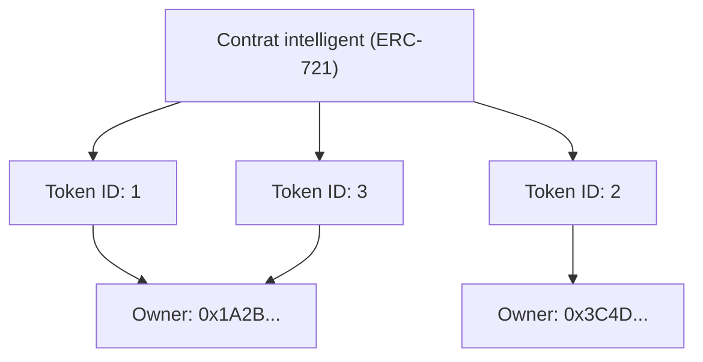

Depuis que l'Internet s'est démocratisé, les données numériques ont été traitées comme des éléments "copiables à l'infini". Les fichiers d'images, les données textuelles et les fichiers musicaux, ainsi que toutes les données sur les ordinateurs, peuvent être dupliqués sans se dégrader et peuvent se multiplier à l'infini. Cette "facilité de copie" a été le moteur de la propagation explosive d'Internet, mais d'un autre côté, elle a rendu extrêmement difficile d'attribuer une "rareté" et un "droit de propriété unique" aux données numériques.

Cependant, avec l'avènement de la technologie blockchain et des contrats intelligents (smart contracts), cette prémisse est complètement bouleversée. Au cœur de ce changement de paradigme se trouvent les "NFT (Non-Fungible Token : Jetons Non Fongibles)".

Dans cet article, nous explorerons en profondeur, d'un point de vue technique, ce que sont exactement les NFT et quel type de traitement se déroule en coulisses de la norme technologique d'Ethereum, "l'ERC-721", qui les soutient.

## 1. La différence fondamentale entre les FT (Jetons Fongibles) et les NFT (Jetons Non Fongibles)

Pour comprendre les NFT, vous devez d'abord comprendre leur antonyme, les "FT (Fungible Token : Jetons Fongibles)".

### Qu'est-ce que la fongibilité (Fungible) ?
"Fungible (Fongible)" signifie qu'un actif a exactement la même valeur et est interchangeable avec un autre actif du même type.
Les exemples les plus évidents sont les monnaies fiduciaires (comme le yen ou le dollar) et les crypto-actifs comme le Bitcoin.

Le billet de 10 000 yens que vous possédez et le billet de 10 000 yens que je possède ont des numéros de série différents, mais leur valeur est parfaitement équivalente. Le 1 BTC que vous possédez et le 1 BTC que je possède ont également exactement la même valeur, et personne ne se plaindra si nous les échangeons. Cette propriété de pouvoir être "remplacée par une autre chose identique" est appelée la fongibilité.

### Qu'est-ce que la non-fongibilité (Non-Fungible) ?
D'autre part, "Non-Fungible (Non fongible)" signifie que l'actif est unique en son genre et ne peut pas être échangé avec un autre.
Des exemples dans le monde réel incluent le tableau de la Joconde, un bien immobilier avec une adresse spécifique, ou un livre avec votre signature. Chacun de ces éléments possède une valeur et des attributs uniques, et ne peut pas être simplement échangé à valeur égale contre "un autre tableau" ou "une autre maison".

L'application de ce concept aux données numériques a donné naissance aux NFT. Les NFT sont des jetons émis sur une blockchain, mais chacun possède un identifiant unique (Token ID) et est lié à des métadonnées différentes (des informations comme des images, des vidéos ou du texte). Cela permet de créer un état dans l'espace numérique où "cette donnée est unique au monde".

## 2. Le mécanisme de la norme ERC-721 d'Ethereum

La norme technologique la plus célèbre pour la mise en œuvre des NFT est "l'ERC-721" sur la blockchain Ethereum. ERC signifie "Ethereum Request for Comments", ce qui propose des spécifications standard sur le réseau Ethereum.

L'ERC-721 définit une interface pour gérer "qui possède quel Token ID" à l'aide de contrats intelligents (smart contracts).

### Le mappage (mapping) entre l'ID du jeton et l'adresse du propriétaire

Le cœur de l'ERC-721 réside dans un "mappage" (structure de données de type dictionnaire) très simple. Dans le contrat intelligent, un Token ID spécifique (par exemple `TokenID: 1`) est lié à l'adresse Ethereum de l'utilisateur qui le possède (par exemple `0x123...`) et est enregistré.

Voici un schéma conceptuel de l'état interne d'un contrat intelligent :



De cette façon, l'état dans lequel le tableau de correspondance entre le "Token ID" et "l'adresse du propriétaire" est gravé dans le contrat sur la blockchain est la véritable nature de la "propriété" dans les NFT.

## 3. Métadonnées et stockage hors chaîne (Off-chain)

L'enregistrement de données sur la blockchain implique des coûts (frais de gaz) très élevés. Si vous essayez de sauvegarder directement des données binaires d'images ou de vidéos de haute qualité sur la blockchain Ethereum, des coûts astronomiques seront générés.

Par conséquent, dans l'ERC-721, le jeton lui-même ne contient qu'un "lien (URI) vers les métadonnées", et la méthode choisie est de sauvegarder les données d'image réelles et les informations détaillées en dehors de la blockchain (hors chaîne).

### TokenURI et métadonnées JSON

La fonction `tokenURI(uint256 _tokenId)` est définie dans le contrat ERC-721, et si vous lui passez un Token ID, l'URL du fichier JSON contenant les informations de ce jeton est renvoyée.

```json
{
  "name": "My Awesome NFT #1",
  "description": "Ceci est une œuvre d'art numérique très rare.",
  "image": "ipfs://QmXoypizjW3WknFiJnKLwHCnL72vedxjQkDDP1mXWo6uco/image.png",
  "attributes": [
    {
      "trait_type": "Background",
      "value": "Blue"
    }
  ]
}
```

Dans ce fichier JSON, l'URL du fichier d'image réel (champ `image`) est spécifiée.

### L'utilisation d'IPFS (InterPlanetary File System)

Que se passerait-il si les métadonnées JSON ou le fichier image étaient placés sur un serveur Web ordinaire (comme AWS S3) ?
Si l'administrateur du serveur supprime le fichier, modifie l'URL, ou si le serveur lui-même tombe en panne, le NFT deviendra simplement un jeton vide avec un "lien mort".

Pour éviter cela, de nombreux projets NFT utilisent un système de fichiers décentralisé appelé "IPFS". Dans IPFS, une valeur de hachage (CID : Content Identifier) est générée à partir du contenu du fichier lui-même, et elle est utilisée comme adresse.
Si le contenu du fichier change ne serait-ce que d'un octet, l'adresse changera également, ce qui permet de garantir que les données n'ont pas été falsifiées et augmente la probabilité que les données soient conservées en permanence sur le réseau P2P.

## 4. La critique selon laquelle "vous ne possédez qu'une URL" et les solutions techniques

Lorsque les NFT sont devenus populaires, il y a eu une forte critique disant que "même si vous dites avoir acheté un NFT, vous n'avez acheté qu'une 'simple URL' enregistrée sur la blockchain, et vous ne possédez pas l'image elle-même".

Techniquement parlant, cette critique est un fait (pour de nombreux projets). Ce qui est enregistré dans le contrat intelligent, ce n'est que le mappage entre le Token ID et le propriétaire, ainsi que l'URL vers le JSON, et les droits d'accès exclusifs (le droit d'empêcher les autres de voir) ou les droits d'auteur sur les données de l'image elle-même ne sont pas automatiquement transférés.

Cependant, les approches techniques et les solutions à ce problème progressent également.

### NFT entièrement sur chaîne (Full On-chain NFT)
Certains projets adoptent une approche "entièrement sur chaîne" où les données d'image sont écrites directement sur la blockchain plutôt que d'être placées sur un serveur externe ou IPFS.
Par exemple, l'image est représentée dans un format basé sur le texte appelé SVG (Scalable Vector Graphics), et son code est stocké dans le contrat intelligent. Cela garantit que tant que la blockchain Ethereum existe, les données de l'image ne disparaîtront jamais.

### Le stockage permanent comme Arweave
Bien qu'IPFS soit décentralisé, si quelqu'un ne continue pas à "épingler (Pinning)" les données, il y a un risque qu'elles disparaissent du réseau à long terme. Par conséquent, l'approche consistant à stocker les métadonnées et les images sur un stockage blockchain comme "Arweave", qui garantit au niveau du protocole de stocker les données de manière semi-permanente une fois que les frais sont payés, devient également populaire.

## Conclusion

Les NFT et l'ERC-721 ne sont pas de simples mots à la mode, mais des réponses techniques révolutionnaires à un problème de longue date sur Internet : "donner de l'unicité et la propriété aux données numériques".

La critique de "la simple possession d'une URL" pointe une réalité technique, mais en comprenant correctement ses mécanismes et en combinant de nouvelles solutions techniques telles que les NFT entièrement sur chaîne et le stockage permanent, nous sommes en train de construire un monde plus robuste d'actifs numériques.
À mesure que la blockchain mûrit en tant qu'infrastructure, l'envers technologique des NFT continuera également d'évoluer, et leur intégration sociale progressera.
