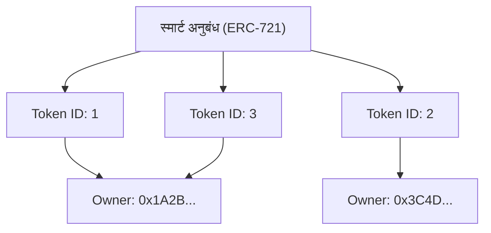

इंटरनेट के लोकप्रिय होने के बाद से, डिजिटल डेटा को ऐसी चीज़ माना जाता है जिसकी "कितनी भी कॉपी बनाई जा सकती है"। छवि फ़ाइलें, टेक्स्ट डेटा, संगीत फ़ाइलें आदि, कंप्यूटर पर मौजूद डेटा को बिना खराब हुए कॉपी किया जा सकता है और असीमित रूप से बढ़ाया जा सकता है। यह "कॉपी करने में आसानी" ही इंटरनेट के विस्फोटक प्रसार की प्रेरक शक्ति थी, लेकिन साथ ही इसने डिजिटल डेटा को "दुर्लभता" और "अद्वितीय स्वामित्व" देना भी बेहद मुश्किल बना दिया था।

हालाँकि, ब्लॉकचेन तकनीक और स्मार्ट अनुबंधों के आगमन के साथ, यह आधार काफी हद तक बदल गया है। इस प्रतिमान बदलाव के केंद्र में "एनएफटी (नॉन-फंजिबल टोकन: गैर-विनिमेय टोकन)" है।

इस लेख में, हम तकनीकी दृष्टिकोण से गहराई से जानेंगे कि एनएफटी आखिर क्या है और इसके पीछे काम करने वाले एथेरियम (Ethereum) के तकनीकी मानक "ERC-721" के पीछे किस तरह की प्रक्रियाएँ चल रही हैं।

## 1. एफटी (फंजिबल टोकन) और एनएफटी (नॉन-फंजिबल टोकन) के बीच आवश्यक अंतर

एनएफटी को समझने के लिए, आपको सबसे पहले इसके विलोम "एफटी (फंजिबल टोकन: विनिमेय टोकन)" को समझना होगा।

### फंजिबल (Fungible) क्या है?
"फंजिबल (विनिमेय)" का अर्थ है कि एक संपत्ति का मूल्य उसी प्रकार की दूसरी संपत्ति के बिल्कुल समान होता है, और वे आपस में बदले जा सकते हैं।
सबसे आसान उदाहरण फिएट मुद्रा (येन या डॉलर) या बिटकॉइन (Bitcoin) जैसी क्रिप्टोकरेंसी हैं।

आपके पास मौजूद 10,000 येन का नोट और मेरे पास मौजूद 10,000 येन का नोट, भले ही उनके सीरियल नंबर अलग-अलग हों, मूल्य में पूरी तरह से समान हैं। आपके पास जो 1 बीटीसी है और मेरे पास जो 1 बीटीसी है, उनका मूल्य भी बिल्कुल समान है, और अगर हम उनका आदान-प्रदान करते हैं तो कोई शिकायत नहीं करेगा। इस तरह "समान चीजों के साथ प्रतिस्थापित होने में सक्षम" की इस प्रकृति को विनिमेयता (फंजिबिलिटी) कहा जाता है।

### नॉन-फंजिबल (Non-Fungible) क्या है?
इसके विपरीत, "नॉन-फंजिबल (गैर-विनिमेय)" का अर्थ है कि संपत्ति अद्वितीय है और इसे किसी अन्य चीज़ से बदला नहीं जा सकता।
वास्तविक दुनिया में इसके उदाहरणों में मोनालिसा की पेंटिंग, किसी विशिष्ट पते वाली अचल संपत्ति, या आपके हस्ताक्षर वाली कोई किताब शामिल है। इनमें से प्रत्येक का अपना अनूठा मूल्य और गुण है, और इन्हें "किसी अन्य पेंटिंग" या "किसी अन्य घर" के साथ समान मूल्य पर आसानी से बदला नहीं जा सकता है।

एनएफटी इसी अवधारणा को डिजिटल डेटा पर लागू करता है। एनएफटी ब्लॉकचेन पर जारी किए गए टोकन हैं, लेकिन हर एक का अपना विशिष्ट पहचानकर्ता (Token ID) होता है, और प्रत्येक अलग-अलग मेटाडेटा (चित्र, वीडियो, टेक्स्ट आदि जैसी जानकारी) से जुड़ा होता है। इससे डिजिटल दुनिया में एक ऐसी स्थिति पैदा करना संभव हो जाता है जहां "यह डेटा दुनिया में एकमात्र है।"

## 2. एथेरियम के ERC-721 मानक का तंत्र

एनएफटी को लागू करने के लिए सबसे प्रसिद्ध तकनीकी मानक एथेरियम ब्लॉकचेन पर "ERC-721" है। ERC का अर्थ "Ethereum Request for Comments" है, जो एथेरियम नेटवर्क पर मानक विशिष्टताओं का प्रस्ताव करता है।

ERC-721 स्मार्ट अनुबंधों का उपयोग करके "किसके पास कौन सी Token ID है" इसे प्रबंधित करने के लिए एक इंटरफ़ेस परिभाषित करता है।

### टोकन आईडी और मालिक के पते की मैपिंग

ERC-721 का मूल एक बहुत ही सरल "मैपिंग (डिक्शनरी-प्रकार डेटा संरचना)" में निहितConstraint। स्मार्ट अनुबंध के भीतर, एक विशिष्ट टोकन आईडी (उदाहरण के लिए `TokenID: 1`) और उसे रखने वाले उपयोगकर्ता का एथेरियम पता (उदाहरण के लिए `0x123...`) एक साथ जुड़े होते हैं और रिकॉर्ड किए जाते हैं।

स्मार्ट अनुबंध की आंतरिक स्थिति का एक वैचारिक आरेख नीचे दिखाया गया है।



इस प्रकार, "टोकन आईडी" और "मालिक के पते" के बीच पत्राचार तालिका को ब्लॉकचेन पर अनुबंध में उकेरे जाने की स्थिति ही एनएफटी में "स्वामित्व" की वास्तविक प्रकृति है।

## 3. मेटाडेटा और ऑफ-चेन स्टोरेज

ब्लॉकचेन पर डेटा रिकॉर्ड करने में बहुत अधिक लागत (गैस फीस) शामिल होती है। एथेरियम ब्लॉकचेन पर उच्च-गुणवत्ता वाली छवियों या वीडियो के बाइनरी डेटा को सीधे सहेजने का प्रयास करने पर खगोलीय खर्च आ सकता है।

इसलिए, ERC-721 में यह तरीका अपनाया जाता है कि टोकन में केवल "मेटाडेटा का लिंक (URI)" होता है, और वास्तविक छवि डेटा या विस्तृत जानकारी ब्लॉकचेन के बाहर (ऑफ-चेन) सहेजी जाती है।

### TokenURI और JSON मेटाडेटा

ERC-721 अनुबंध में `tokenURI(uint256 _tokenId)` नामक एक फ़ंक्शन परिभाषित किया गया है। जब आप इसमें Token ID पास करते हैं, तो यह उस टोकन की जानकारी वाले JSON फ़ाइल का URL लौटाता है।

```json
{
  "name": "My Awesome NFT #1",
  "description": "यह एक बहुत ही दुर्लभ डिजिटल कला है।",
  "image": "ipfs://QmXoypizjW3WknFiJnKLwHCnL72vedxjQkDDP1mXWo6uco/image.png",
  "attributes": [
    {
      "trait_type": "Background",
      "value": "Blue"
    }
  ]
}
```

इस JSON फ़ाइल के अंदर, वास्तविक छवि फ़ाइल का URL (`image` फ़ील्ड) निर्दिष्ट किया गया है।

### IPFS (InterPlanetary File System) का उपयोग

यदि हम मेटाडेटा JSON या छवि फ़ाइलों को किसी सामान्य वेब सर्वर (जैसे AWS S3) पर रख दें तो क्या होगा?
अगर सर्वर व्यवस्थापक फ़ाइल को हटा देता है, URL बदल देता है, या सर्वर ही डाउन हो जाता है, तो एनएफटी केवल एक "टूटे हुए लिंक" वाला खाली टोकन बनकर रह जाएगा।

इसे रोकने के लिए, कई एनएफटी प्रोजेक्ट "IPFS" नामक विकेंद्रीकृत फ़ाइल सिस्टम का उपयोग करते हैं। IPFS में, फ़ाइल की सामग्री से ही एक हैश वैल्यू (CID: Content Identifier) उत्पन्न की जाती है और उसे पते के रूप में उपयोग किया जाता है।
चूंकि फ़ाइल की सामग्री में एक बाइट का भी बदलाव होने पर पता बदल जाता है, यह गारंटी देता है कि डेटा के साथ छेड़छाड़ नहीं की गई है, और यह P2P नेटवर्क पर डेटा के स्थायी रूप से संरक्षित होने की संभावना को बढ़ाता है।

## 4. "आप केवल एक URL के मालिक हैं" की आलोचना और तकनीकी नवाचार

जब एनएफटी का क्रेज बढ़ा, तो एक कड़ी आलोचना यह हुई थी कि "भले ही आप कहें कि आपने एक एनएफटी खरीदा है, आपने केवल ब्लॉकचेन पर दर्ज 'एक URL' खरीदा है, और आप वास्तव में उस छवि के मालिक नहीं हैं।"

तकनीकी रूप से कहें तो, यह आलोचना (कई परियोजनाओं में) सच है। स्मार्ट अनुबंध में जो दर्ज है वह केवल Token ID और मालिक की मैपिंग है, और JSON का URL है। यह स्वचालित रूप से छवि डेटा तक अनन्य पहुँच (दूसरों को इसे देखने से रोकने का अधिकार) या कॉपीराइट हस्तांतरित नहीं करता है।

हालाँकि, इस समस्या को हल करने के लिए तकनीकी दृष्टिकोण और नवाचार भी आगे बढ़ रहे हैं।

### फुल ऑन-चेन एनएफटी (On-chain NFT)
कुछ परियोजनाएं बाहरी सर्वर या IPFS पर छवि डेटा रखने के बजाय ब्लॉकचेन पर सीधे लिखने का "फुल ऑन-चेन" तरीका अपनाती हैं।
उदाहरण के लिए, एक छवि को SVG (Scalable Vector Graphics) नामक टेक्स्ट-आधारित प्रारूप में दर्शाया जाता है, और इसके कोड को स्मार्ट अनुबंध के भीतर सहेजा जाता है। इसके परिणामस्वरूप, यह गारंटी दी जाती है कि जब तक एथेरियम का ब्लॉकचेन मौजूद है, छवि डेटा कभी नष्ट नहीं होगा।

### Arweave जैसे स्थायी स्टोरेज
हालांकि IPFS विकेंद्रीकृत है, अगर कोई डेटा को "पिन (Pinning)" करना जारी नहीं रखता है, तो लंबे समय में इसके नेटवर्क से गायब होने का जोखिम होता है। इसलिए, मेटाडेटा और छवियों को "Arweave" जैसे ब्लॉकचेन स्टोरेज में सहेजने का दृष्टिकोण भी लोकप्रिय हो गया है, जो एक बार शुल्क का भुगतान करने पर प्रोटोकॉल स्तर पर डेटा को अर्ध-स्थायी रूप से सहेजने की गारंटी देता है।

## निष्कर्ष

एनएफटी और ERC-721 केवल चर्चा के विषय नहीं हैं, बल्कि यह "डिजिटल डेटा को विशिष्टता और स्वामित्व देने" की इंटरनेट की लंबे समय से चली आ रही चुनौती का एक अभूतपूर्व तकनीकी समाधान है।

"केवल एक URL का स्वामित्व" होने की आलोचना तकनीकी तथ्यों को उजागर करती है, लेकिन इसके तंत्र को सही ढंग से समझकर और फुल ऑन-चेन या स्थायी स्टोरेज जैसे नए तकनीकी नवाचारों को जोड़कर, हम एक अधिक मजबूत "डिजिटल संपत्ति" की दुनिया का निर्माण कर रहे हैं।
जैसे-जैसे ब्लॉकचेन बुनियादी ढांचे के रूप में परिपक्व होगा, एनएफटी के तकनीकी पहलू और अधिक विकसित होंगे, और समाज में इसका कार्यान्वयन आगे बढ़ेगा。
