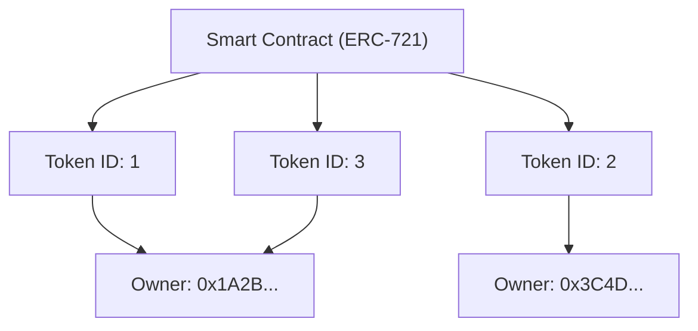

Sejak internet menyebar, data digital telah diperlakukan sebagai sesuatu yang "dapat disalin sebanyak apapun". Data di komputer seperti file gambar, data teks, dan file musik tidak menurun kualitasnya saat diduplikasi dan dapat diperbanyak tanpa batas. "Kemudahan menyalin" ini adalah kekuatan pendorong di balik penyebaran internet yang eksplosif, namun di sisi lain, ini membuat pemberian "kelangkaan" atau "hak milik yang unik dan satu-satunya" pada data digital menjadi sangat sulit.

Namun, dengan munculnya teknologi blockchain dan smart contract, asumsi ini sangat terbalik. Pusat dari pergeseran paradigma tersebut adalah "NFT (Non-Fungible Token: Token yang Tidak Dapat Dipertukarkan)".

Dalam artikel ini, kita akan menggali lebih dalam dari sudut pandang teknis mengenai apa sebenarnya NFT itu, dan proses seperti apa yang terjadi di balik standar teknis Ethereum yaitu "ERC-721" yang mendukungnya.

## 1. Perbedaan Mendasar antara FT (Fungible Token) dan NFT (Non-Fungible Token)

Untuk memahami NFT, pertama-tama kita perlu memahami antonimnya yaitu "FT (Fungible Token: Token yang Dapat Dipertukarkan)".

### Apa itu Fungible (Dapat Dipertukarkan)?
"Fungible (Dapat Dipertukarkan)" berarti sebuah aset memiliki nilai yang sama persis dengan aset lain dari jenis yang sama dan dapat dipertukarkan.
Contoh paling mudah dimengerti adalah mata uang fiat (Yen atau Dolar) atau aset kripto seperti Bitcoin.

Uang kertas 10.000 Yen yang Anda miliki dan uang kertas 10.000 Yen yang saya miliki, meskipun nomor serinya berbeda, nilainya benar-benar setara. 1 BTC yang Anda miliki dan 1 BTC yang saya miliki juga memiliki nilai yang sama persis, dan tidak ada yang akan mengeluh jika kita menukarnya. Sifat "dapat digantikan dengan benda lain yang sama" ini disebut keterpertukaran (fungibility).

### Apa itu Non-Fungible (Tidak Dapat Dipertukarkan)?
Sebaliknya, "Non-Fungible (Tidak Dapat Dipertukarkan)" berarti aset tersebut unik dan satu-satunya, dan tidak dapat dipertukarkan dengan hal lain.
Contoh dalam dunia nyata termasuk lukisan Mona Lisa, real estat dengan alamat tertentu, atau buku dengan tanda tangan Anda di atasnya. Ini masing-masing memiliki nilai dan atribut yang unik, dan tidak bisa begitu saja ditukar secara setara dengan "lukisan lain" atau "rumah lain".

Menerapkan ini ke data digital adalah NFT. NFT adalah token yang diterbitkan di blockchain, tetapi masing-masing memiliki pengenal unik (Token ID), dan masing-masing terikat dengan metadata yang berbeda (informasi seperti gambar, video, dan teks). Dengan ini, dimungkinkan untuk menciptakan keadaan di mana "data ini adalah satu-satunya di dunia" di ruang digital.

## 2. Mekanisme Standar ERC-721 Ethereum

Standar teknis paling terkenal untuk mengimplementasikan NFT adalah "ERC-721" di blockchain Ethereum. ERC adalah singkatan dari "Ethereum Request for Comments", dan ia mengusulkan spesifikasi standar di jaringan Ethereum.

ERC-721 mendefinisikan antarmuka (interface) untuk mengelola "siapa, memiliki Token ID yang mana" menggunakan smart contract.

### Pemetaan Token ID dan Alamat Pemilik

Inti dari ERC-721 terletak pada "pemetaan (struktur data tipe kamus)" yang sangat sederhana. Di dalam smart contract, Token ID tertentu (misalnya `TokenID: 1`) dikaitkan dan direkam dengan alamat Ethereum dari pengguna yang memilikinya (misalnya `0x123...`).

Diagram konseptual dari keadaan internal smart contract ditunjukkan di bawah ini.



Seperti ini, keadaan di mana tabel korespondensi "Token ID" dan "alamat pemilik" terukir pada contract di blockchain adalah identitas sebenarnya dari "kepemilikan" dalam NFT.

## 3. Metadata dan Penyimpanan Off-chain

Sangat mahal (biaya gas) untuk merekam data di blockchain. Jika Anda mencoba menyimpan data biner dari gambar atau video beresolusi tinggi secara langsung ke blockchain Ethereum, Anda akan dikenakan biaya yang sangat besar secara astronomis.

Oleh karena itu, dalam ERC-721, digunakan metode di mana token itu sendiri hanya memiliki "tautan ke metadata (URI)", dan data gambar aktual serta informasi detail disimpan di luar blockchain (off-chain).

### TokenURI dan Metadata JSON

Pada contract ERC-721, didefinisikan fungsi yang disebut `tokenURI(uint256 _tokenId)`. Jika Anda memberikan Token ID ke fungsi ini, ia akan mengembalikan URL file JSON yang mendeskripsikan informasi token tersebut.

```json
{
  "name": "My Awesome NFT #1",
  "description": "Ini adalah seni digital yang sangat langka.",
  "image": "ipfs://QmXoypizjW3WknFiJnKLwHCnL72vedxjQkDDP1mXWo6uco/image.png",
  "attributes": [
    {
      "trait_type": "Background",
      "value": "Blue"
    }
  ]
}
```

Dalam file JSON ini, URL dari file gambar yang sebenarnya (field `image`) ditentukan lebih lanjut.

### Pemanfaatan IPFS (InterPlanetary File System)

Apa yang akan terjadi jika JSON metadata dan file gambar ditempatkan di server Web biasa (seperti AWS S3)?
Jika administrator server menghapus file, mengubah URL, atau jika server itu sendiri down, NFT akan menjadi token kosong yang sekadar "tautan rusak".

Untuk mencegah hal ini, banyak proyek NFT menggunakan sistem file terdesentralisasi yang disebut "IPFS". Dalam IPFS, nilai hash (CID: Content Identifier) dihasilkan dari isi file itu sendiri, dan itu digunakan sebagai alamat.
Jika isi file berubah bahkan satu byte, alamatnya juga berubah. Hal ini dapat menjamin bahwa data belum dimanipulasi, dan meningkatkan kemungkinan bahwa data akan dipertahankan secara permanen di jaringan P2P.

## 4. Kritik "Yang Dimiliki Hanyalah URL" dan Inovasi Teknis

Ketika NFT menjadi tren, ada kritik kuat bahwa "bahkan jika Anda mengatakan Anda membeli NFT, Anda hanya membeli 'URL belaka' yang direkam di blockchain, dan Anda tidak benar-benar memiliki gambar itu sendiri."

Secara teknis, kritik ini (dalam banyak proyek) adalah benar. Apa yang direkam pada smart contract hanyalah pemetaan Token ID dan pemiliknya, dan URL ke JSON. Itu tidak secara otomatis mentransfer hak akses eksklusif (hak untuk mencegah orang lain melihatnya) atau hak cipta atas data gambar itu sendiri.

Namun, pendekatan dan inovasi teknis terhadap tantangan ini juga mengalami kemajuan.

### Full On-chain NFT

Beberapa proyek mengadopsi pendekatan "full on-chain" yang menulis data gambar secara langsung ke blockchain, daripada menempatkannya di server eksternal atau IPFS.
Misalnya, merepresentasikan gambar dalam format berbasis teks yang disebut SVG (Scalable Vector Graphics) dan menyimpan kodenya di dalam smart contract. Dengan ini, selama blockchain Ethereum ada, dijamin bahwa data gambar tidak akan pernah hilang selamanya.

### Penyimpanan Permanen seperti Arweave

Meskipun IPFS terdesentralisasi, jika tidak ada yang terus "menyematkan (Pinning)" data tersebut, ada risiko data tersebut akan hilang dari jaringan dalam jangka panjang. Oleh karena itu, pendekatan menyimpan metadata dan gambar di penyimpanan blockchain seperti "Arweave" juga menjadi populer. Arweave menjamin di tingkat protokol bahwa setelah Anda membayar biaya sekali, data akan disimpan secara semi-permanen.

## Kesimpulan

NFT dan ERC-721 bukan sekadar *buzzword*, melainkan solusi teknis revolusioner untuk masalah lama di internet tentang "memberikan keunikan dan hak milik pada data digital".

Kritik tentang "hanya memiliki URL" menunjukkan fakta teknis, tetapi dengan memahami mekanismenya secara benar dan menggabungkan inovasi teknis baru seperti *full on-chain* dan penyimpanan permanen, kita sedang membangun dunia "aset digital" yang lebih kuat.
Seiring dengan matangnya blockchain sebagai infrastruktur, sisi teknis dari NFT juga akan semakin berkembang dan implementasi sosialnya akan terus maju.
