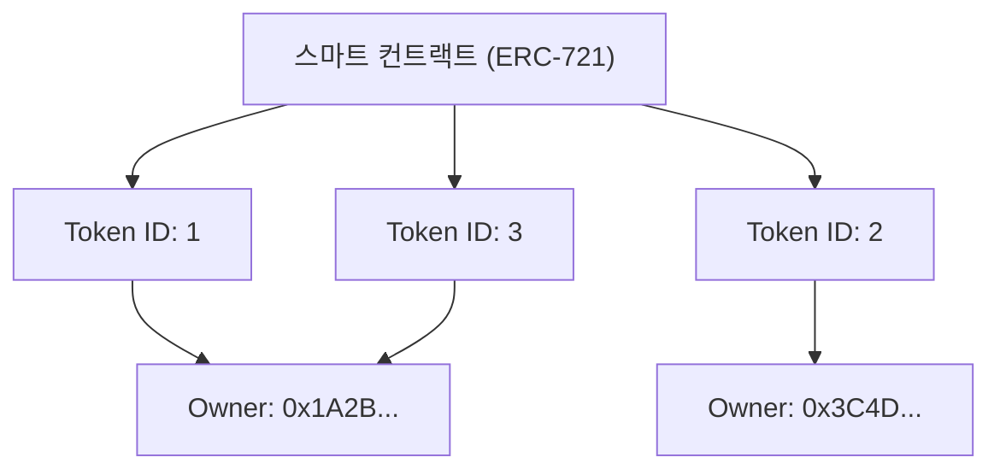

인터넷이 보급된 이래, 디지털 데이터는 "얼마든지 복사가 가능한 것"으로 취급되어 왔습니다. 이미지 파일, 텍스트 데이터, 음악 파일 등 컴퓨터 상의 데이터는 복제해도 열화되지 않고 무한히 증식시킬 수 있습니다. 이 "복사 용이성"이야말로 인터넷의 폭발적인 보급을 뒷받침한 원동력인 반면, 디지털 데이터에 "희소성"이나 "유일무이한 소유권"을 갖게 하는 것을 극히 어렵게 만들었습니다.

그러나 블록체인 기술과 스마트 컨트랙트의 등장으로 이 전제는 크게 뒤집히게 됩니다. 그 패러다임 시프트의 중심에 있는 것이 "NFT(Non-Fungible Token: 대체 불가능한 토큰)"입니다.

본 기사에서는 NFT란 대체 무엇인지, 그리고 그것을 뒷받침하는 이더리움(Ethereum)의 기술 규격인 "ERC-721"의 이면에서 어떤 처리가 이루어지고 있는지를 기술적인 관점에서 깊이 파헤쳐 보겠습니다.

## 1. FT(대체 가능 토큰)와 NFT(대체 불가능 토큰)의 본질적인 차이

NFT를 이해하기 위해서는 먼저 반의어인 "FT(Fungible Token: 대체 가능 토큰)"에 대해 이해할 필요가 있습니다.

### 대체 가능(Fungible)이란 무엇인가
"Fungible(대체 가능)"이란 어떤 자산이 다른 같은 종류의 자산과 완전히 같은 가치를 지니며, 교환 가능하다는 것을 의미합니다.
가장 알기 쉬운 예가 법정 통화(엔화나 달러)나 비트코인(Bitcoin) 등의 암호화폐입니다.

당신이 가진 1만 엔 지폐와 내가 가진 1만 엔 지폐는 일련번호는 다를지언정 가치로서는 완전히 등가입니다. 당신이 가진 1 BTC와 내가 가진 1 BTC도 전혀 같은 가치를 가지며, 교환해도 아무도 불만을 제기하지 않습니다. 이처럼 "다른 같은 것으로 대체가 가능"한 성질을 대체성이라고 부릅니다.

### 비대체성(Non-Fungible)이란 무엇인가
반면 "Non-Fungible(비대체성)"이란 그 자산이 유일무이하며, 다른 것과 교환 불가능하다는 것을 의미합니다.
현실 세계에서의 예로는 모나리자의 그림, 특정 주소를 가진 부동산, 혹은 당신의 사인이 들어간 책 등을 들 수 있습니다. 이것들은 각각이 고유한 가치와 속성을 가지고 있어, "다른 그림"이나 "다른 집"과 단순히 등가 교환할 수 없습니다.

이것을 디지털 데이터에 적용한 것이 NFT입니다. NFT는 블록체인 상에서 발행되는 토큰이지만, 각각이 고유한 식별자(Token ID)를 가지고 있으며, 각각이 다른 메타데이터(이미지, 동영상, 텍스트 등의 정보)와 연결되어 있습니다. 이를 통해 디지털 공간에서 "이 데이터는 세상에 하나밖에 없다"는 상태를 만들어낼 수 있는 것입니다.

## 2. Ethereum의 ERC-721 규격의 구조

NFT를 구현하기 위한 기술 규격으로 가장 유명한 것이 Ethereum 블록체인 상의 "ERC-721"입니다. ERC란 "Ethereum Request for Comments"의 약자로, Ethereum 네트워크 상에서의 표준 사양을 제안하는 것입니다.

ERC-721은 스마트 컨트랙트를 이용하여 "누가, 어느 Token ID를 소유하고 있는가"를 관리하기 위한 인터페이스를 정의하고 있습니다.

### 토큰 ID와 소유자 주소의 매핑

ERC-721의 핵심은 매우 단순한 "매핑(사전형 데이터 구조)"에 있습니다. 스마트 컨트랙트 내에서는 특정 토큰 ID(예: `TokenID: 1`)와 그것을 소유하고 있는 사용자의 Ethereum 주소(예: `0x123...`)가 연결되어 기록되어 있습니다.

스마트 컨트랙트의 내부 상태 개념도를 아래에 나타냅니다.



이와 같이 블록체인 상의 컨트랙트에 "Token ID"와 "소유자의 주소" 대응표가 새겨져 있는 상태야말로 NFT에 있어서의 "소유"의 정체입니다.

## 3. 메타데이터와 오프체인 스토리지

블록체인 상에 데이터를 기록하려면 매우 높은 비용(가스비)이 듭니다. Ethereum의 블록체인에 고화질 이미지나 동영상의 바이너리 데이터를 직접 저장하려고 하면 천문학적인 비용이 발생하게 됩니다.

그래서 ERC-721에서는 토큰 자체에는 "메타데이터への 링크(URI)"만을 갖게 하고, 실제 이미지 데이터나 상세 정보는 블록체인 밖(오프체인)에 저장하는 방식이 취해지고 있습니다.

### TokenURI와 JSON 메타데이터

ERC-721 컨트랙트에는 `tokenURI(uint256 _tokenId)`라는 함수가 정의되어 있으며, 여기에 Token ID를 전달하면 그 토큰의 정보가 기술된 JSON 파일의 URL이 반환됩니다.

```json
{
  "name": "My Awesome NFT #1",
  "description": "이것은 매우 희귀한 디지털 아트입니다.",
  "image": "ipfs://QmXoypizjW3WknFiJnKLwHCnL72vedxjQkDDP1mXWo6uco/image.png",
  "attributes": [
    {
      "trait_type": "Background",
      "value": "Blue"
    }
  ]
}
```

이 JSON 파일 안에서 다시 실제 이미지 파일의 URL(`image` 필드)이 지정되어 있습니다.

### IPFS(InterPlanetary File System)의 활용

만약 메타데이터의 JSON이나 이미지 파일을 일반적인 웹 서버(AWS의 S3 등)에 두어버리면 어떻게 될까요?
서버의 관리자가 파일을 삭제하거나 URL을 변경하거나, 서버 자체가 다운되거나 하면 NFT는 단순한 "끊어진 링크"의 텅 빈 토큰이 되어버립니다.

이를 방지하기 위해 많은 NFT 프로젝트에서는 "IPFS"라는 분산형 파일 시스템이 이용되고 있습니다. IPFS에서는 파일의 내용 그 자체로부터 해시값(CID: Content Identifier)을 생성하고, 그것을 주소로 사용합니다.
파일의 내용이 1바이트라도 바뀌면 주소도 바뀌기 때문에 데이터가 변조되지 않았음을 보증할 수 있고, P2P 네트워크 상에서 데이터가 영구적으로 유지될 가능성이 높아집니다.

## 4. "소유하고 있는 것은 단순한 URL이다"라는 비판과 기술적 궁리

NFT가 붐이 되었을 때, "NFT를 샀다고 해도 그것은 블록체인에 기록된 '단순한 URL'을 샀을 뿐이며, 이미지 자체를 소유하고 있는 것은 아니다"라는 강한 비판이 있었습니다.

기술적으로 말하자면, 이 비판은 (많은 프로젝트에서) 사실입니다. 스마트 컨트랙트에 기록되어 있는 것은 Token ID와 소유자의 매핑, 그리고 JSON으로의 URL뿐이며, 이미지 데이터 자체에 대한 배타적인 접근 권한(다른 사람이 볼 수 없도록 하는 권리)이나 저작권이 자동으로 양도되는 것은 아닙니다.

그러나 이 과제에 대한 기술적 접근과 궁리도 진행되고 있습니다.

### 풀 온체인 NFT (On-chain NFT)
일부 프로젝트에서는 이미지 데이터를 외부 서버나 IPFS에 두는 것이 아니라, 블록체인 상에 직접 기록하는 "풀 온체인"이라는 방식을 채택하고 있습니다.
예를 들어, 이미지를 SVG(Scalable Vector Graphics)라는 텍스트 기반의 형식으로 표현하고, 그 코드를 스마트 컨트랙트 내에 저장합니다. 이를 통해 Ethereum의 블록체인이 존재하는 한 이미지 데이터도 영원히 소멸하지 않음이 보장됩니다.

### Arweave 등의 영구 스토리지
IPFS는 분산형이지만, 누군가가 데이터를 계속 "고정(Pinning)"하지 않으면 장기적으로는 네트워크에서 사라져버릴 위험이 있습니다. 그래서 "Arweave"와 같이, 한 번 수수료를 지불하면 데이터를 반영구적으로 저장하는 것을 프로토콜 수준에서 보장하는 블록체인 스토리지에 메타데이터와 이미지를 저장하는 접근 방식도 널리 퍼지고 있습니다.

## 맺음말

NFT와 ERC-721은 단순한 버즈워드가 아니라 "디지털 데이터에 고유성과 소유권을 갖게 한다"는, 인터넷에 있어서의 오랜 과제에 대한 획기적인 기술적 해답입니다.

"단순한 URL의 소유"라는 비판은 기술적인 사실을 찌르고 있지만, 그 구조를 올바르게 이해하고, 풀 온체인이나 영구 스토리지와 같은 새로운 기술적 궁리를 결합함으로써, 우리는 보다 견고한 "디지털 자산"의 세계를 구축해 나가고 있습니다.
블록체인이 인프라로서 성숙해감에 따라 NFT의 기술적 이면도 더욱 진화하고, 사회적 구현이 진행되어 갈 것입니다.
