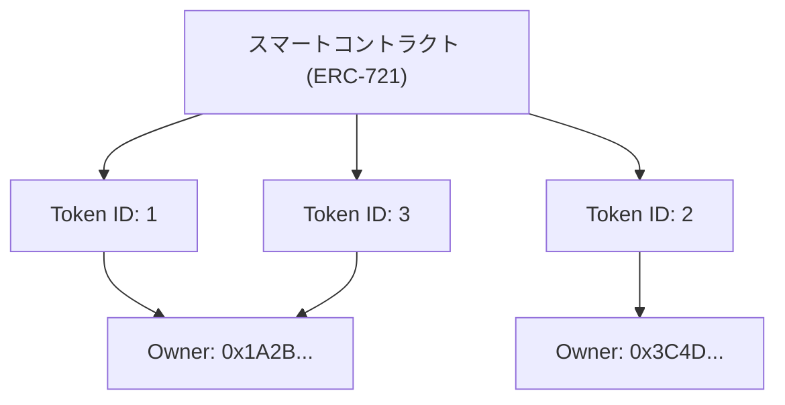

インターネットが普及して以来、デジタルデータというものは「いくらでもコピーが可能なもの」として扱われてきました。画像ファイル、テキストデータ、音楽ファイルなど、コンピュータ上のデータは複製しても劣化せず、無限に増殖させることができます。この「コピー容易性」こそがインターネットの爆発的な普及を支えた原動力である一方で、デジタルデータに「希少性」や「唯一無二の所有権」を持たせることを極めて困難にしていました。

しかし、ブロックチェーン技術とスマートコントラクトの登場により、この前提は大きく覆ることになります。そのパラダイムシフトの中心にあるのが「NFT（Non-Fungible Token：非代替性トークン）」です。

本記事では、NFTとは一体何なのか、そしてそれを支えるイーサリアム（Ethereum）の技術規格である「ERC-721」の裏側でどのような処理が行われているのかを、技術的な観点から深く掘り下げていきます。

## 1. FT（代替可能トークン）とNFT（非代替性トークン）の本質的な違い

NFTを理解するためには、まず対義語である「FT（Fungible Token：代替可能トークン）」について理解する必要があります。

### 代替可能（Fungible）とは何か
「Fungible（代替可能）」とは、ある資産が別の同じ種類の資産と全く同じ価値を持ち、交換可能であることを意味します。
最も分かりやすい例が法定通貨（円やドル）や、ビットコイン（Bitcoin）などの暗号資産です。

あなたが持っている1万円札と、私が持っている1万円札は、シリアルナンバーこそ違えど、価値としては完全に等価です。あなたが持っている1 BTCと、私が持っている1 BTCも全く同じ価値を持ち、交換しても誰も文句は言いません。このように「他の同じものと置き換えが可能」な性質を代替性と呼びます。

### 非代替性（Non-Fungible）とは何か
対して「Non-Fungible（非代替性）」とは、その資産が唯一無二であり、他のものと交換不可能であることを意味します。
現実世界における例としては、モナ・リザの絵画、特定の住所を持つ不動産、あるいはあなたのサインが入った本などが挙げられます。これらはそれぞれが固有の価値と属性を持っており、「別の絵画」や「別の家」と単純に等価交換することはできません。

これをデジタルデータに適用したのがNFTです。NFTはブロックチェーン上で発行されるトークンですが、それぞれが固有の識別子（Token ID）を持っており、それぞれが異なるメタデータ（画像、動画、テキストなどの情報）に紐付いています。これにより、デジタル空間において「このデータは世界に一つしかない」という状態を作り出すことができるのです。

## 2. EthereumのERC-721規格の仕組み

NFTを実装するための技術規格として最も有名なのが、Ethereumブロックチェーン上の「ERC-721」です。ERCとは「Ethereum Request for Comments」の略で、Ethereumネットワーク上での標準仕様を提案するものです。

ERC-721は、スマートコントラクトを用いて「誰が、どのToken IDを所有しているか」を管理するためのインターフェースを定義しています。

### トークンIDと所有者アドレスのマッピング

ERC-721の核心は、非常にシンプルな「マッピング（辞書型データ構造）」にあります。スマートコントラクト内では、特定のトークンID（例えば `TokenID: 1`）と、それを所有しているユーザーのEthereumアドレス（例えば `0x123...`）が紐付けられて記録されています。

スマートコントラクトの内部状態の概念図を以下に示します。



このように、ブロックチェーン上のコントラクトに「Token ID」と「所有者のアドレス」の対応表が刻まれている状態こそが、NFTにおける「所有」の正体です。

## 3. メタデータとオフチェーンストレージ

ブロックチェーン上にデータを記録するには、非常に高いコスト（ガス代）がかかります。Ethereumのブロックチェーンに高画質な画像や動画のバイナリデータを直接保存しようとすると、天文学的な費用が発生してしまいます。

そこでERC-721では、トークン自体には「メタデータへのリンク（URI）」だけを持たせ、実際の画像データや詳細情報はブロックチェーンの外（オフチェーン）に保存するという手法が取られています。

### TokenURIとJSONメタデータ

ERC-721コントラクトには `tokenURI(uint256 _tokenId)` という関数が定義されており、これにToken IDを渡すと、そのトークンの情報が記述されたJSONファイルのURLが返ってきます。

```json
{
  "name": "My Awesome NFT #1",
  "description": "これは非常にレアなデジタルアートです。",
  "image": "ipfs://QmXoypizjW3WknFiJnKLwHCnL72vedxjQkDDP1mXWo6uco/image.png",
  "attributes": [
    {
      "trait_type": "Background",
      "value": "Blue"
    }
  ]
}
```

このJSONファイルの中で、さらに実際の画像ファイルのURL（`image` フィールド）が指定されています。

### IPFS（InterPlanetary File System）の活用

もしメタデータのJSONや画像ファイルを普通のWebサーバー（AWSのS3など）に置いてしまうと、どうなるでしょうか？
サーバーの管理者がファイルを削除したり、URLを変更したり、サーバー自体がダウンしたりすると、NFTは単なる「リンク切れ」の空っぽのトークンになってしまいます。

これを防ぐため、多くのNFTプロジェクトでは「IPFS」という分散型ファイルシステムが利用されています。IPFSでは、ファイルの内容そのものからハッシュ値（CID：Content Identifier）を生成し、それをアドレスとして使用します。
ファイルの内容が1バイトでも変わればアドレスも変わるため、データが改ざんされていないことを保証でき、P2Pネットワーク上でデータが永続的に保持される可能性が高まります。

## 4. 「所有しているのはただのURLである」という批判と技術的工夫

NFTがブームになった際、「NFTを買ったと言っても、それはブロックチェーンに記録された『ただのURL』を買っただけであり、画像そのものを所有しているわけではない」という強い批判がありました。

技術的に言えば、この批判は（多くのプロジェクトにおいて）事実です。スマートコントラクトに記録されているのはToken IDと所有者のマッピング、そしてJSONへのURLだけであり、画像データ自体に対する排他的なアクセス権（他の人が見られないようにする権利）や著作権が自動的に譲渡されるわけではありません。

しかし、この課題に対する技術的アプローチや工夫も進んでいます。

### フルオンチェーンNFT (On-chain NFT)
一部のプロジェクトでは、画像データを外部サーバーやIPFSに置くのではなく、ブロックチェーン上に直接書き込む「フルオンチェーン」という手法を採用しています。
例えば、画像をSVG（Scalable Vector Graphics）というテキストベースの形式で表現し、そのコードをスマートコントラクト内に保存します。これにより、Ethereumのブロックチェーンが存在する限り、画像データも永遠に消滅しないことが保証されます。

### Arweaveなどの永続ストレージ
IPFSは分散型ですが、誰かがデータを「ピン留め（Pinning）」し続けないと、長期的にはネットワークから消えてしまうリスクがあります。そこで、「Arweave」のような、一度手数料を払えばデータを半永久的に保存することをプロトコルレベルで保証するブロックチェーンストレージにメタデータと画像を保存するアプローチも普及しています。

## 結び

NFTとERC-721は、単なるバズワードではなく、「デジタルデータに一意性と所有権を持たせる」という、インターネットにおける長年の課題に対する画期的な技術的解答です。

「ただのURLの所有」という批判は技術的な事実を突いていますが、その仕組みを正しく理解し、フルオンチェーンや永続ストレージといった新しい技術的工夫を組み合わせることで、私たちはより堅牢な「デジタル資産」の世界を構築しつつあります。
ブロックチェーンがインフラとして成熟していく中で、NFTの技術的裏側もさらに進化し、社会実装が進んでいくことでしょう。
