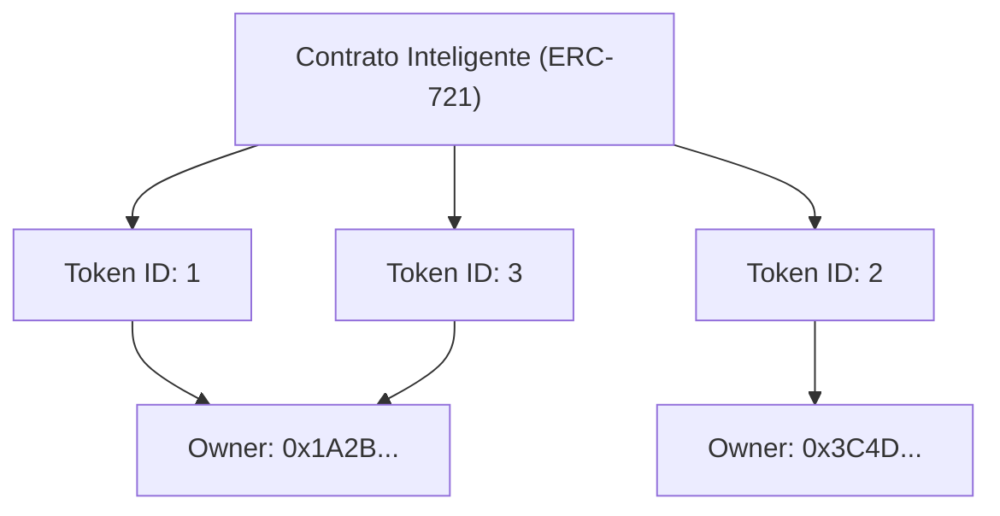

Desde a popularização da internet, os dados digitais têm sido tratados como algo que "pode ser copiado indefinidamente". Arquivos de imagem, dados de texto, arquivos de música e outros dados em computadores podem ser duplicados sem degradação e multiplicados infinitamente. Embora essa "facilidade de cópia" tenha sido a força motriz por trás da expansão explosiva da internet, ela também tornou extremamente difícil conferir "escassez" e "propriedade única e exclusiva" aos dados digitais.

No entanto, com o surgimento da tecnologia blockchain e dos contratos inteligentes (smart contracts), essa premissa foi completamente subvertida. No centro dessa mudança de paradigma estão os "NFTs (Non-Fungible Tokens: Tokens Não Fungíveis)".

Neste artigo, aprofundaremos, do ponto de vista técnico, o que exatamente são os NFTs e quais processos ocorrem nos bastidores do "ERC-721", o padrão técnico da Ethereum que os sustenta.

## 1. A Diferença Essencial entre FT (Tokens Fungíveis) e NFT (Tokens Não Fungíveis)

Para entender os NFTs, primeiro é necessário entender seu antônimo, "FT (Fungible Token: Token Fungível)".

### O que significa Fungível (Substituível)?
"Fungível (Substituível)" significa que um determinado ativo tem exatamente o mesmo valor que outro ativo do mesmo tipo, sendo assim intercambiáveis.
Os exemplos mais fáceis de entender são as moedas fiduciárias (como o iene ou o dólar) e os criptoativos como o Bitcoin.

Uma nota de 10.000 ienes que você possui e uma nota de 10.000 ienes que eu possuo, embora tenham números de série diferentes, são perfeitamente equivalentes em valor. O 1 BTC que você possui e o 1 BTC que eu possuo também têm exatamente o mesmo valor e, mesmo se os trocarmos, ninguém reclamará. Essa característica de "poder ser substituído por outra coisa igual" é chamada de fungibilidade.

### O que significa Não Fungível (Insubstituível)?
Por outro lado, "Non-Fungible (Não Fungível)" significa que o ativo é único e não pode ser trocado por outra coisa.
Exemplos no mundo real incluem a pintura da Mona Lisa, um imóvel com um endereço específico ou um livro com sua assinatura. Cada um deles possui um valor e atributos únicos, e não podem ser simplesmente trocados por "outra pintura" ou "outra casa" com valor equivalente.

Os NFTs aplicam isso aos dados digitais. Os NFTs são tokens emitidos em uma blockchain, mas cada um tem um identificador exclusivo (Token ID) e cada um está vinculado a metadados diferentes (informações como imagens, vídeos, texto, etc.). Isso permite criar um estado no espaço digital onde "este dado é único no mundo".

## 2. Como funciona o padrão ERC-721 da Ethereum

O padrão técnico mais famoso para a implementação de NFTs é o "ERC-721" na blockchain da Ethereum. ERC significa "Ethereum Request for Comments" (Pedido de Comentários da Ethereum), que propõe especificações padrão na rede Ethereum.

O ERC-721 define uma interface para gerenciar "quem possui qual Token ID" usando contratos inteligentes.

### Mapeamento de Token ID e Endereço do Proprietário

O núcleo do ERC-721 reside em um "mapeamento (estrutura de dados do tipo dicionário)" muito simples. Dentro do contrato inteligente, um Token ID específico (por exemplo, `TokenID: 1`) é vinculado e registrado ao endereço Ethereum do usuário que o possui (por exemplo, `0x123...`).

O diagrama conceitual do estado interno de um contrato inteligente é mostrado abaixo.



Dessa forma, o estado em que a tabela de correspondência de "Token ID" e "Endereço do Proprietário" está gravada no contrato na blockchain é a própria essência da "propriedade" em um NFT.

## 3. Metadados e Armazenamento Off-Chain

Gravar dados na blockchain tem um custo muito alto (gas fees). Tentar salvar os dados binários de imagens ou vídeos de alta resolução diretamente na blockchain da Ethereum resultaria em custos astronômicos.

Portanto, no ERC-721, é adotada uma abordagem em que o próprio token contém apenas um "link (URI) para os metadados", e os dados da imagem real e as informações detalhadas são armazenados fora da blockchain (off-chain).

### TokenURI e Metadados JSON

O contrato ERC-721 define uma função chamada `tokenURI(uint256 _tokenId)`. Quando você passa um Token ID para ela, ela retorna a URL de um arquivo JSON contendo as informações desse token.

```json
{
  "name": "My Awesome NFT #1",
  "description": "Esta é uma arte digital muito rara.",
  "image": "ipfs://QmXoypizjW3WknFiJnKLwHCnL72vedxjQkDDP1mXWo6uco/image.png",
  "attributes": [
    {
      "trait_type": "Background",
      "value": "Blue"
    }
  ]
}
```

Dentro deste arquivo JSON, é especificada a URL do arquivo de imagem real (campo `image`).

### Utilização do IPFS (InterPlanetary File System)

O que aconteceria se os arquivos JSON de metadados e os arquivos de imagem fossem colocados em um servidor da web comum (como o Amazon S3)?
Se o administrador do servidor excluísse os arquivos, alterasse as URLs ou se o próprio servidor ficasse inativo, o NFT se tornaria apenas um token vazio com um "link quebrado".

Para evitar isso, muitos projetos de NFT utilizam um sistema de arquivos descentralizado chamado "IPFS". No IPFS, um valor de hash (CID: Content Identifier) é gerado a partir do próprio conteúdo do arquivo e é usado como endereço.
Como o endereço muda se o conteúdo do arquivo for alterado em até mesmo 1 byte, pode-se garantir que os dados não foram adulterados, e há uma grande probabilidade de que os dados sejam preservados permanentemente em uma rede P2P.

## 4. A Crítica de que "O que se possui é apenas uma URL" e a Engenhosidade Técnica

Quando os NFTs se tornaram um boom, houve uma forte crítica de que "mesmo se você disser que comprou um NFT, você comprou apenas 'uma mera URL' registrada na blockchain e não possui a imagem em si".

Tecnicamente falando, esta crítica é (em muitos projetos) verdadeira. O que está registrado no contrato inteligente é apenas o mapeamento do Token ID para o proprietário e a URL para o JSON; o direito de acesso exclusivo aos dados da imagem em si (o direito de impedir que outras pessoas os vejam) e os direitos autorais não são transferidos automaticamente.

No entanto, abordagens técnicas e inovações para lidar com esse desafio também estão avançando.

### NFTs Totalmente On-chain (Full On-chain NFTs)
Alguns projetos adotam uma abordagem "totalmente on-chain", em que os dados da imagem são gravados diretamente na blockchain, em vez de serem colocados em servidores externos ou no IPFS.
Por exemplo, uma imagem pode ser representada em um formato baseado em texto chamado SVG (Scalable Vector Graphics) e seu código pode ser salvo dentro do contrato inteligente. Isso garante que, enquanto a blockchain da Ethereum existir, os dados da imagem nunca desaparecerão.

### Armazenamento Persistente como o Arweave
Embora o IPFS seja descentralizado, se alguém não continuar a "fixar (pinning)" os dados, existe o risco de eles desaparecerem da rede a longo prazo. Portanto, a abordagem de armazenar metadados e imagens em armazenamentos de blockchain que garantem a nível de protocolo que os dados serão salvos semi-permanentemente assim que uma taxa for paga, como o "Arweave", também está se tornando popular.

## Conclusão

NFT e ERC-721 não são meras palavras da moda (buzzwords); são soluções técnicas inovadoras para um problema de longa data na internet: "dar exclusividade e propriedade a dados digitais".

Embora a crítica de que se trata apenas da "propriedade de uma mera URL" aponte para um fato técnico, ao compreender corretamente seu mecanismo e combiná-lo com novas inovações técnicas, como armazenamento totalmente on-chain e persistente, estamos construindo um mundo de "ativos digitais" mais robusto.
À medida que a blockchain amadurece como infraestrutura, os bastidores técnicos dos NFTs evoluirão ainda mais e sua implementação social avançará.
