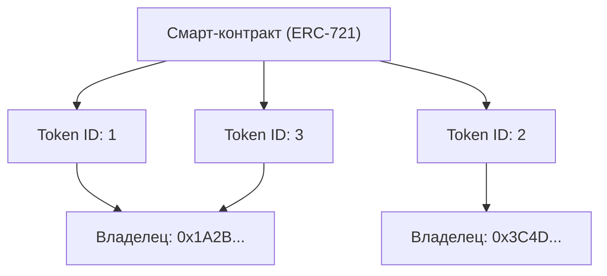

С момента широкого распространения Интернета цифровые данные рассматривались как то, что "можно копировать в любых количествах". Файлы изображений, текстовые данные, музыкальные файлы и другие данные на компьютерах можно дублировать без потери качества и размножать бесконечно. Эта "легкость копирования" стала движущей силой взрывного роста Интернета, но в то же время она сделала крайне сложным придание цифровым данным "редкости" или "уникального права собственности".

Однако с появлением технологии блокчейн и смарт-контрактов это предположение кардинально меняется. В центре этого сдвига парадигмы находится "NFT (Non-Fungible Token: невзаимозаменяемый токен)".

В этой статье мы подробно рассмотрим с технической точки зрения, что такое NFT и какие процессы происходят за кулисами "ERC-721", технического стандарта Ethereum, на котором они основаны.

## 1. Фундаментальное различие между FT (взаимозаменяемыми токенами) и NFT (невзаимозаменяемыми токенами)

Чтобы понять NFT, сначала нужно понять антоним — "FT (Fungible Token: взаимозаменяемый токен)".

### Что значит взаимозаменяемый (Fungible)
"Fungible (взаимозаменяемый)" означает, что определенный актив имеет точно такую же ценность, как другой актив того же типа, и они могут быть взаимозаменяемы.
Самые понятные примеры — это фиатные валюты (иены или доллары) и криптовалюты, такие как Биткоин (Bitcoin).

Купюра в 10 000 иен, которая есть у вас, и купюра в 10 000 иен, которая есть у меня, имеют разные серийные номера, но их ценность абсолютно эквивалентна. 1 BTC, который есть у вас, и 1 BTC, который есть у меня, также имеют совершенно одинаковую ценность, и никто не будет жаловаться, если мы ими обменяемся. Это свойство возможности замены "на другое такое же" называется взаимозаменяемостью.

### Что значит невзаимозаменяемый (Non-Fungible)
С другой стороны, "Non-Fungible (невзаимозаменяемый)" означает, что актив уникален и не может быть обменен на что-то другое.
В реальном мире примерами могут служить картина Мона Лиза, недвижимость по определенному адресу или книга с вашим автографом. Каждая из этих вещей обладает уникальной ценностью и атрибутами, и их нельзя просто так равноценно обменять на "другую картину" или "другой дом".

Применение этого принципа к цифровым данным и есть NFT. NFT — это токены, выпускаемые в блокчейне, но каждый из них имеет уникальный идентификатор (Token ID) и привязан к различным метаданным (информация, такая как изображения, видео, текст и т. д.). Это позволяет создать в цифровом пространстве ситуацию, при которой "эти данные являются единственными в мире".

## 2. Как работает стандарт ERC-721 в Ethereum

Самым известным техническим стандартом для реализации NFT является "ERC-721" в блокчейне Ethereum. ERC расшифровывается как "Ethereum Request for Comments" (Запрос комментариев Ethereum) и предлагает стандартные спецификации для сети Ethereum.

ERC-721 определяет интерфейс для управления тем, "кто владеет каким Token ID", с использованием смарт-контрактов.

### Привязка Token ID к адресу владельца

Суть ERC-721 заключается в очень простом "отображении (структура данных типа словарь)". В смарт-контракте определенный идентификатор токена (например, `Token ID: 1`) привязан к Ethereum-адресу пользователя, который им владеет (например, `0x123...`).

Концептуальная схема внутреннего состояния смарт-контракта показана ниже.



Таким образом, состояние, при котором таблица соответствия между "Token ID" и "Адресом владельца" записана в контракте на блокчейне, и является истинной сутью "владения" в NFT.

## 3. Метаданные и хранение вне сети (оффчейн)

Запись данных в блокчейн обходится очень дорого (плата за газ). Попытка сохранить бинарные данные изображений или видео в высоком разрешении непосредственно в блокчейне Ethereum привела бы к астрономическим затратам.

Поэтому в ERC-721 используется подход, при котором сам токен содержит только "ссылку на метаданные (URI)", а фактические данные изображения и подробная информация хранятся вне блокчейна (оффчейн).

### TokenURI и метаданные JSON

В контракте ERC-721 определена функция `tokenURI(uint256 _tokenId)`. Если передать ей Token ID, она вернет URL-адрес JSON-файла, содержащего информацию об этом токене.

```json
{
  "name": "Мой потрясающий NFT #1",
  "description": "Это очень редкое цифровое искусство.",
  "image": "ipfs://QmXoypizjW3WknFiJnKLwHCnL72vedxjQkDDP1mXWo6uco/image.png",
  "attributes": [
    {
      "trait_type": "Фон",
      "value": "Синий"
    }
  ]
}
```

В этом JSON-файле также указан URL фактического файла изображения (поле `image`).

### Использование IPFS (InterPlanetary File System)

Что произойдет, если разместить JSON метаданных и файлы изображений на обычном веб-сервере (например, AWS S3)?
Если администратор сервера удалит файл, изменит URL-адрес или сервер выйдет из строя, NFT превратится в пустой токен с просто "неработающей ссылкой".

Чтобы предотвратить это, многие проекты NFT используют децентрализованную файловую систему под названием "IPFS". В IPFS из самого содержимого файла генерируется хеш-значение (CID: Content Identifier), которое используется в качестве адреса.
Если содержимое файла изменится хотя бы на 1 байт, изменится и адрес, что гарантирует защиту данных от подделки и повышает вероятность того, что данные будут постоянно храниться в P2P-сети.

## 4. Критика "Владения просто URL-адресом" и технические решения

Когда случился бум NFT, возникла сильная критика: "Даже если вы говорите, что купили NFT, вы купили только 'просто URL-адрес', записанный в блокчейне, и вы не владеете самим изображением".

С технической точки зрения эта критика справедлива (для многих проектов). Смарт-контракт записывает только привязку Token ID к владельцу и URL-адрес к JSON, и он не дает автоматически эксклюзивных прав доступа к самим данным изображения (право не показывать их другим) или авторских прав.

Однако разрабатываются технические подходы и решения для этой проблемы.

### Полностью ончейн NFT (Full On-chain NFT)
В некоторых проектах используется "полностью ончейн" подход, при котором данные изображения записываются непосредственно в блокчейн, а не размещаются на внешних серверах или IPFS.
Например, изображение представляется в текстовом формате SVG (Scalable Vector Graphics), и этот код сохраняется в смарт-контракте. Это гарантирует, что пока существует блокчейн Ethereum, данные изображения никогда не исчезнут.

### Постоянное хранилище, такое как Arweave
Хотя IPFS децентрализована, если кто-то не будет продолжать "закреплять (pinning)" данные, существует риск, что они в конечном итоге исчезнут из сети. Поэтому все более популярным становится подход хранения метаданных и изображений в хранилищах блокчейна, таких как "Arweave", которые на уровне протокола гарантируют полупостоянное хранение данных после единовременной оплаты комиссии.

## Заключение

NFT и ERC-721 — это не просто модные словечки, а революционное техническое решение давней проблемы Интернета: "как придать уникальность и право собственности цифровым данным".

Критика "владения просто URL-адресом" бьет в технические факты, но, правильно поняв этот механизм и объединив его с новыми техническими решениями, такими как полностью ончейн и постоянные хранилища, мы строим более надежный мир "цифровых активов".
По мере развития блокчейна как инфраструктуры, техническая база NFT также будет развиваться, и их внедрение в общество будет расширяться.
