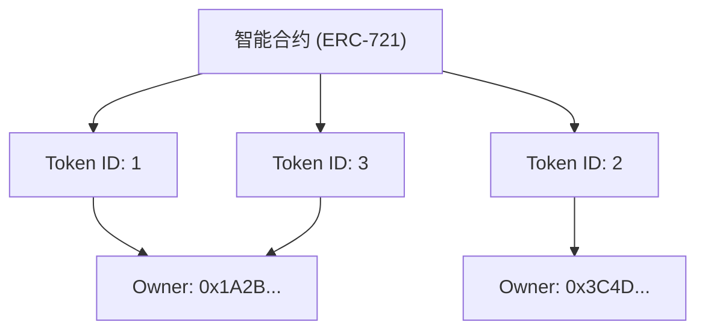

自从互联网普及以来，数字数据一直被视为“可以被无限复制的东西”。图像文件、文本数据、音乐文件等计算机上的数据即使被复制也不会退化，并且可以无限制地增加。这种“易于复制性”是支撑互联网爆炸性普及的驱动力，但另一方面，它也使得赋予数字数据“稀缺性”或“独一无二的所有权”变得极其困难。

然而，随着区块链技术和智能合约的出现，这一前提被彻底颠覆。这场范式转变的核心就是“NFT（Non-Fungible Token：非同质化代币）”。

在本文中，我们将从技术角度深入探讨NFT究竟是什么，以及支撑它的以太坊（Ethereum）技术标准“ERC-721”的背后究竟在进行着怎样的处理。

## 1. FT（同质化代币）与NFT（非同质化代币）的本质区别

为了理解NFT，首先需要理解其反义词“FT（Fungible Token：同质化代币）”。

### 什么是同质化（Fungible）
“Fungible（同质化）”意味着某种资产与另一种同类资产具有完全相同的价值，并且可以互换。
最明显的例子是法定货币（日元或美元）或比特币（Bitcoin）等加密资产。

你持有的一万日元纸币和我持有的一万日元纸币，虽然序列号不同，但它们的价值完全相等。你持有的 1 BTC 和我持有的 1 BTC 也具有完全相同的价值，即使交换也没有人会抱怨。这种“可以与其他相同事物互换”的性质称为同质性。

### 什么是非同质化（Non-Fungible）
相反，“Non-Fungible（非同质化）”意味着该资产是独一无二的，不能与其他事物互换。
现实世界中的例子包括蒙娜丽莎的画作、具有特定地址的房地产或带有你签名的书。它们各自具有固有的价值和属性，不能简单地与“另一幅画”或“另一栋房子”进行等价交换。

NFT 就是将这一概念应用于数字数据。NFT 是在区块链上发行的代币，但每个代币都有一个固有的标识符（Token ID），并绑定了不同的元数据（图像、视频、文本等信息）。这使得在数字空间中创造出“这个数据是世界上独一无二的”状态成为可能。

## 2. 以太坊 ERC-721 标准的机制

实现 NFT 最著名的技术标准是以太坊区块链上的“ERC-721”。ERC 是“Ethereum Request for Comments”的缩写，用于提出以太坊网络上的标准规范。

ERC-721 定义了一个接口，用于通过智能合约管理“谁拥有哪个 Token ID”。

### Token ID 和所有者地址的映射

ERC-721 的核心在于一个非常简单的“映射（字典型数据结构）”。在智能合约内部，特定的 Token ID（例如 `TokenID: 1`）与拥有它的用户的以太坊地址（例如 `0x123...`）绑定并记录。

智能合约内部状态的概念图如下所示：



正是这样，在区块链上的合约中刻录了“Token ID”和“所有者地址”的对应表，这才是 NFT 中“所有权”的真正面目。

## 3. 元数据与链下存储

在区块链上记录数据需要非常高的成本（Gas 费）。如果试图将高分辨率图像或视频的二进制数据直接保存在以太坊区块链上，将会产生天文数字的费用。

因此，在 ERC-721 中，采取了一种方法：代币本身仅包含“指向元数据的链接（URI）”，而实际的图像数据和详细信息则保存在区块链之外（链下）。

### TokenURI 和 JSON 元数据

ERC-721 合约中定义了一个名为 `tokenURI(uint256 _tokenId)` 的函数，如果向其传递 Token ID，它将返回一个记录了该代币信息的 JSON 文件的 URL。

```json
{
  "name": "My Awesome NFT #1",
  "description": "这是非常罕见的数字艺术。",
  "image": "ipfs://QmXoypizjW3WknFiJnKLwHCnL72vedxjQkDDP1mXWo6uco/image.png",
  "attributes": [
    {
      "trait_type": "Background",
      "value": "Blue"
    }
  ]
}
```

在这个 JSON 文件中，进一步指定了实际图像文件的 URL（`image` 字段）。

### IPFS（星际文件系统）的应用

如果将元数据的 JSON 或图像文件放在普通的 Web 服务器（如 AWS 的 S3）上会发生什么？
如果服务器管理员删除文件、更改 URL，或者服务器本身宕机，NFT 将变成仅仅是一个“死链”的空代币。

为了防止这种情况，许多 NFT 项目都使用了一种名为“IPFS”的分布式文件系统。在 IPFS 中，它从文件内容本身生成一个哈希值（CID：Content Identifier），并将其用作地址。
只要文件内容改变 1 字节，地址就会改变，因此可以保证数据未被篡改，并极大地增加了数据在 P2P 网络上永久保存的可能性。

## 4. “拥有的只是一个 URL”的批评与技术创新

在 NFT 热潮期间，有一种强烈的批评声音：“即使说买了 NFT，那也只是买了一个记录在区块链上的‘URL’，并不意味着拥有图像本身”。

从技术上讲，这种批评（在许多项目中）是事实。智能合约中记录的只是 Token ID 和所有者的映射，以及指向 JSON 的 URL，它并不会自动转让对图像数据本身的排他性访问权（不让其他人看到的权利）或版权。

然而，针对这一挑战的技术方法和创新也在不断发展。

### 全链上 NFT (On-chain NFT)
一些项目没有将图像数据放在外部服务器或 IPFS 上，而是采用了将其直接写入区块链的“全链上”方法。
例如，用一种称为 SVG（可缩放矢量图形）的基于文本的格式来表示图像，并将其代码保存在智能合约中。这保证了只要以太坊区块链存在，图像数据就永远不会消失。

### Arweave 等永久存储
虽然 IPFS 是分布式的，但如果没人持续“固定（Pinning）”数据，从长远来看，它也有从网络中消失的风险。因此，像“Arweave”这样，只要支付一次费用就在协议层面保证半永久性保存数据的区块链存储，也被广泛用于保存元数据和图像。

## 结语

NFT 和 ERC-721 不仅仅是流行语，更是针对互联网中“赋予数字数据唯一性和所有权”这一长期挑战的突破性技术解答。

虽然“拥有的只是一个 URL”的批评指出了技术事实，但通过正确理解其机制，并结合全链上和永久存储等新的技术创新，我们正在构建一个更稳健的“数字资产”世界。
随着区块链作为基础设施的不断成熟，NFT 的技术内幕也将进一步演进，其社会应用也会不断推进。
