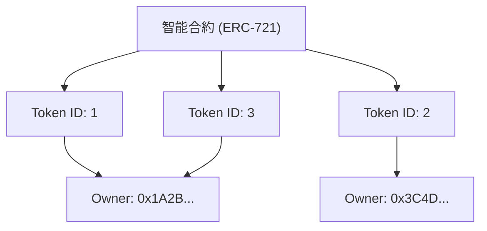

自從網際網路普及以來，數位資料一直被視為「可以無限複製的東西」。影像檔案、文字資料、音樂檔案等，電腦上的資料即使複製也不會劣化，並且可以無限增加。這種「易於複製性」正是支撐網際網路爆炸性普及的動力，但另一方面，也使得讓數位資料具有「稀缺性」和「獨一無二的所有權」變得極為困難。

然而，隨著區塊鏈技術與智能合約的出現，這個前提被大幅顛覆。在這場典範轉移的核心，就是「NFT（Non-Fungible Token：非同質化代幣）」。

在本文中，我們將從技術的角度深入探討NFT究竟是什麼，以及支撐它的以太坊（Ethereum）技術規格「ERC-721」的背後進行了什麼樣的處理。

## 1. FT（同質化代幣）與NFT（非同質化代幣）的本質差異

為了理解NFT，我們首先必須了解它的反義詞「FT（Fungible Token：同質化代幣）」。

### 何謂同質化（Fungible）
「Fungible（同質化）」意味著某項資產與另一項同類資產具有完全相同的價值，且可以互換。
最容易理解的例子就是法定貨幣（日圓或美元）以及比特幣（Bitcoin）等加密資產。

你持有的一萬日圓鈔票和我持有的一萬日圓鈔票，雖然序號不同，但價值完全相等。你持有的 1 BTC 和我持有的 1 BTC 也具有完全相同的價值，即使交換也不會有人抱怨。這種「可以與其他相同物品替換」的性質稱為同質性。

### 何謂非同質化（Non-Fungible）
相對地，「Non-Fungible（非同質化）」則意味著該資產是獨一無二的，無法與其他物品互換。
現實世界中的例子包括《蒙娜麗莎》畫作、具有特定地址的房地產，或是帶有你簽名的書本等。這些物品各自擁有獨特的價值與屬性，無法與「另一幅畫作」或「另一棟房子」進行簡單的等價交換。

將此概念應用於數位資料的就是 NFT。NFT 是在區塊鏈上發行的代幣，但每一個都擁有獨特的識別碼（Token ID），並與不同的元資料（圖片、影片、文字等資訊）綁定。這使得我們能在數位空間中創造出「這份資料在世界上獨一無二」的狀態。

## 2. Ethereum 的 ERC-721 規格機制

實作 NFT 的技術規格中，最著名的就是 Ethereum 區塊鏈上的「ERC-721」。ERC 是「Ethereum Request for Comments」的縮寫，用來提案 Ethereum 網路上的標準規格。

ERC-721 定義了使用智能合約來管理「誰擁有哪個 Token ID」的介面。

### 代幣 ID 與擁有者地址的映射 (Mapping)

ERC-721 的核心在於非常簡單的「映射（字典型資料結構）」。在智能合約內部，會將特定的代幣 ID（例如 `TokenID: 1`）與擁有它的使用者的 Ethereum 地址（例如 `0x123...`）綁定並記錄下來。

智能合約內部狀態的概念圖如下所示。



像這樣，區塊鏈上的合約刻印著「Token ID」與「擁有者地址」的對照表狀態，正是 NFT 中「擁有」的真面目。

## 3. 元資料與鏈下儲存 (Off-chain Storage)

將資料記錄在區塊鏈上需要花費非常高的成本（Gas 費用）。如果想將高畫質的圖片或影片的二進位資料直接儲存在 Ethereum 區塊鏈上，將會產生天文數字般的費用。

因此在 ERC-721 中，採取了一種方法：代幣本身只持有「指向元資料的連結（URI）」，而實際的圖片資料或詳細資訊則儲存在區塊鏈之外（鏈下）。

### TokenURI 與 JSON 元資料

ERC-721 合約中定義了 `tokenURI(uint256 _tokenId)` 函數，只要將 Token ID 傳遞給它，就會回傳記載該代幣資訊的 JSON 檔案的 URL。

```json
{
  "name": "My Awesome NFT #1",
  "description": "這是非常稀有的數位藝術品。",
  "image": "ipfs://QmXoypizjW3WknFiJnKLwHCnL72vedxjQkDDP1mXWo6uco/image.png",
  "attributes": [
    {
      "trait_type": "Background",
      "value": "Blue"
    }
  ]
}
```

在這個 JSON 檔案中，進一步指定了實際圖片檔案的 URL（`image` 欄位）。

### 活用 IPFS（星際檔案系統）

如果將元資料的 JSON 或圖片檔案放在普通的 Web 伺服器（如 AWS 的 S3）上會發生什麼事呢？
只要伺服器管理員刪除檔案、更改 URL，或是伺服器本身當機，NFT 就會變成一個只是「連結失效」的空殼代幣。

為了防止這種情況，許多 NFT 專案採用了名為「IPFS」的分散式檔案系統。IPFS 會從檔案內容本身產生雜湊值（CID：Content Identifier），並將其作為位址使用。
只要檔案內容改變哪怕是 1 個位元組，位址也會隨之改變，因此可以保證資料未被竄改，並提高資料在 P2P 網路上永久保存的可能性。

## 4. 針對「擁有的只是個 URL」的批評與技術對策

當 NFT 掀起熱潮時，出現了強烈的批評聲浪：「即使說買了 NFT，也只是買了記錄在區塊鏈上的『一個 URL』而已，並沒有擁有圖片本身。」

從技術上來說，這項批評（在許多專案中）是事實。智能合約中記錄的只有 Token ID 與擁有者的映射，以及指向 JSON 的 URL，並不會自動轉讓對圖片資料本身的排他性存取權（不讓其他人看到的權利）或版權。

然而，針對這個課題的技術應對與創新也在持續發展。

### 全鏈上 NFT (On-chain NFT)
部分專案並不將圖片資料放在外部伺服器或 IPFS 上，而是採用直接寫入區塊鏈上的「全鏈上 (Full on-chain)」手法。
例如，將圖片以 SVG（可縮放向量圖形）這種基於文字的格式來表現，並將該程式碼儲存在智能合約內。這樣一來，只要 Ethereum 區塊鏈存在，就能保證圖片資料也永遠不會消失。

### Arweave 等永久儲存
雖然 IPFS 是分散式的，但如果沒有人持續將資料「釘選（Pinning）」，長期來看還是有從網路中消失的風險。因此，將元資料與圖片儲存在像「Arweave」這樣、只要支付一次手續費便能在協定層面保證資料半永久保存的區塊鏈儲存系統的方法，也逐漸普及起來。

## 結語

NFT 與 ERC-721 不僅僅是個流行語，更是針對網際網路長久以來的課題「讓數位資料具備唯一性與所有權」的一項劃時代技術解答。

雖然「只是擁有 URL」的批評點出了技術上的事實，但只要正確理解其機制，並結合全鏈上或永久儲存等新的技術創新，我們正在建構一個更為堅固的「數位資產」世界。
隨著區塊鏈作為基礎設施逐漸成熟，NFT 的技術內幕也將進一步進化，並推動其在社會中的實際應用。
