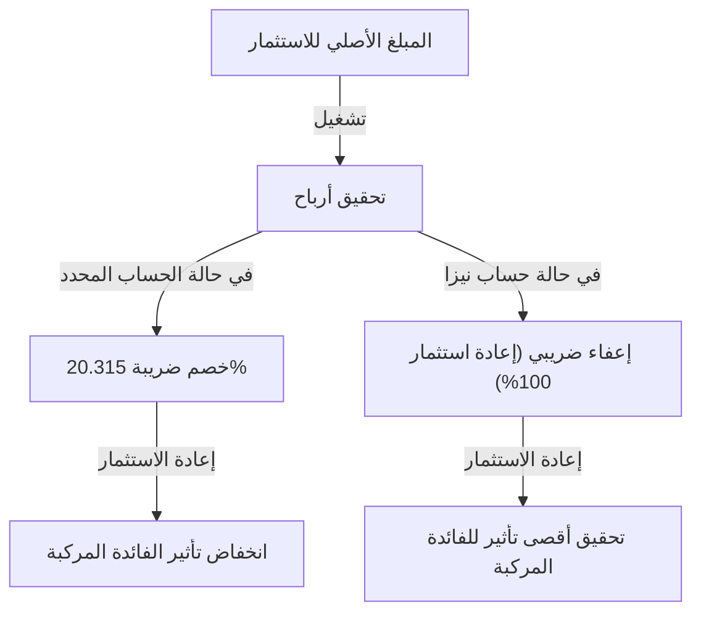

# مقدمة: لماذا تقوم الدولة بإعفاء الاستثمار من الضرائب؟

في المجتمع الحديث، أصبح تكوين الثروة الشخصية قضية أكثر أهمية من أي وقت مضى. في اليابان، وبسبب المخاوف من استمرار انخفاض أسعار الفائدة والتضخم، فضلاً عن القلق بشأن نظام التقاعد مع انخفاض معدلات المواليد وشيخوخة السكان، قامت الحكومة بالترويج بقوة لشعار "من الادخار إلى الاستثمار". المحور الأساسي لهذا النظام هو "نيزا (NISA: نظام الإعفاء الضريبي للاستثمارات الصغيرة)".

في الاستثمار العادي، تخضع الأرباح الرأسمالية (أرباح البيع) وأرباح الأسهم (الدخل) من الأسهم وصناديق الاستثمار المشترك لضريبة تبلغ حوالي 20٪ (تحديدًا 20.315٪). ومع ذلك، فإن جميع الأرباح المكتسبة من خلال حساب نيزا تكون "معفاة من الضرائب". السبب الذي يجعل الدولة تتخلى عن إيراداتها الضريبية القيمة لتعزيز هذا النظام هو تشجيع كل مواطن على بناء ثروته بشكل مستقل وضمان الاستقرار الاقتصادي المستقبلي على المستوى الفردي.

في هذا المقال، سنتعمق في المعنى الحقيقي للإعفاء من هذه الضريبة البالغة 20٪، وهيكل نيزا الجديد، وآلية النمو الهائل للأصول الذي يجلبه تأثير الفائدة المركبة، مع اتباع نهج رياضي.

---

# الفصل الأول: جدار الضريبة (حوالي 20٪) على الاستثمار العادي

أولاً، لفهم فوائد الإعفاء الضريبي، دعونا نوضح نوع الضرائب التي سيتم تكبدها إذا كنت تستثمر في حساب عادي خاضع للضريبة (حساب محدد أو حساب عام).

يمكن تقسيم الأرباح من الاستثمار إلى الفئتين التاليتين:

1. **الأرباح الرأسمالية (أرباح التحويل)**: الأرباح التي يتم الحصول عليها عند بيع الأسهم أو صناديق الاستثمار المشترك بسعر أعلى من سعر الشراء.
2. **أرباح الدخل (أرباح الأسهم والتوزيعات)**: أرباح الأسهم التي تدفعها الشركات لامتلاكها، والتوزيعات التي تُدفع بانتظام من صناديق الاستثمار المشترك.

بموجب النظام الضريبي الياباني، تُفرض ضريبة قدرها **20.315٪ (ضريبة الدخل 15.315٪ + ضريبة السكان 5٪)** على هذه الأرباح.

## مثال محدد: إذا حققت ربحًا قدره مليون ين

لنفترض أنك حققت ربحًا قدره مليون ين من الاستثمار. إذا كان حسابًا عاديًا، فسيتم خصم الضرائب على النحو التالي:

- الربح: 1,000,000 ين
- الضريبة: 1,000,000 ين × 20.315٪ = 203,150 ين
- الصافي: **796,850 ين**

في الواقع، يتم دفع أكثر من 200 ألف ين كضرائب للدولة. قد يكون هذا مقبولاً بعبارة "لا مفر منه" إذا كان ربحًا لمرة واحدة، ولكن إذا كنت تقوم بإعادة استثمار أصولك على مدى فترة طويلة، فإن هذه الضريبة البالغة 20٪ تضعف بشدة "قوة الفائدة المركبة".

---

# الفصل الثاني: الآلية الرياضية لتأثير الفائدة المركبة وقوة الإعفاء الضريبي

"الفائدة المركبة (Compound Interest)" التي يُقال إن أينشتاين وصفها بأنها "أعظم اكتشاف للبشرية". الفائدة المركبة هي آلية يتم فيها إضافة الفائدة المكتسبة على المبلغ الأصلي مرة أخرى إلى المبلغ الأصلي، ويتم كسب المزيد من الفائدة على هذا الإجمالي. بمرور الوقت، تتضخم الأصول مثل كرة الثلج.

## معادلة حساب الفائدة المركبة

يتم التعبير عن القيمة المستقبلية للأصل $A$ بالفائدة المركبة بالمعادلة التالية:

$$ A = P \times (1 + r)^n $$

- $P$: المبلغ الأصلي (مبلغ الاستثمار الأولي)
- $r$: العائد السنوي (العائد)
- $n$: فترة الاستثمار (بالسنوات)

على سبيل المثال، إذا استثمرت مليون ين ($P$) بعائد سنوي قدره 5٪ ($r=0.05$) لمدة 30 عامًا ($n=30$)، فستكون النتيجة كما يلي:

$$ A = 1,000,000 \times (1 + 0.05)^{30} \approx 4,321,942 \text{ ين} $$

تزداد الأصول بحوالي 4.3 مرة. هذه هي قوة الفائدة المركبة.

## التأثير المدمر للضرائب على الفائدة المركبة

ومع ذلك، فإن الواقع ليس بهذه السهولة. عند إعادة استثمار أرباح الأسهم أو إعادة التوازن على طول الطريق، يتم خصم حوالي 20٪ من الأرباح كضرائب في كل مرة. وبعبارة أخرى، ينخفض العائد الفعلي.

يتم حساب العائد الفعلي $r'$ بعد خصم الضرائب على النحو التالي:

$$ r' = r \times (1 - 0.20315) $$

في حالة العائد السنوي البالغ 5٪، ينخفض العائد الفعلي إلى حوالي 3.98٪.
إذا قمت بالاستثمار لمدة 30 عامًا بهذا العائد بعد الضرائب، فستكون قيمة الأصول على النحو التالي:

$$ A = 1,000,000 \times (1 + 0.0398)^{30} \approx 3,224,933 \text{ ين} $$

**في حالة الإعفاء الضريبي (NISA): حوالي 4.32 مليون ين**
**في حالة الحساب الخاضع للضريبة: حوالي 3.22 مليون ين**

يصل الفرق إلى **حوالي 1.1 مليون ين**. في الاستثمار طويل الأجل، فإن حد الإعفاء الضريبي لـ NISA الذي يعفي ضريبة الـ 20٪ ليس مجرد "توفير للضرائب"، بل هو أداة أساسية لتشغيل محرك الفائدة المركبة بكامل طاقته.

---

# الفصل الثالث: هيكل وخصائص نظام نيزا الجديد

نظام "نيزا الجديد" الذي بدأ في عام 2024، هو توسع كبير للنظام السابق (نيزا العام ونيزا التراكمي)، وقد تطور ليصبح أداة لبناء الثروة أكثر مرونة وقوة. الميزة الأكبر هي أنه أصبح من الممكن استخدام كل من "حصة الاستثمار التراكمي" و"حصة استثمار النمو" معًا.

## 1. حصة الاستثمار التراكمي

تستهدف حصة الاستثمار التراكمي صناديق الاستثمار المشترك (مثل صناديق المؤشرات) التي تستوفي متطلبات معينة ومناسبة للاستثمار طويل الأجل والتراكمي والمتنوع.

- **حد الاستثمار السنوي**: 1.2 مليون ين
- **أهداف الاستثمار**: صناديق الاستثمار المشترك التي حددتها وكالة الخدمات المالية، والتي تتميز برسوم منخفضة ومناسبة للاستثمار طويل الأجل
- **المزايا**: يمكنك بناء أصولك ميكانيكيًا دون التأثر بالعواطف. مثالي للمبتدئين أيضًا.

## 2. حصة استثمار النمو

تسمح حصة استثمار النمو بالاستثمار في مجموعة أوسع من المنتجات مقارنة بحصة الاستثمار التراكمي.

- **حد الاستثمار السنوي**: 2.4 مليون ين
- **أهداف الاستثمار**: الأسهم المدرجة (الأسهم اليابانية، الأسهم الأمريكية، إلخ)، صناديق الاستثمار المتداولة (ETF)، صناديق الاستثمار العقاري (REIT)، والعديد من صناديق الاستثمار المشترك
- **المزايا**: يتيح استثمارات استراتيجية، مثل استهداف عوائد عالية من خلال الاستثمار في أسهم فردية، أو بناء محفظة أسهم ذات أرباح عالية للحصول على دخل معفى من الضرائب.

## التحسينات الرئيسية في نيزا الجديد

1. **فترة الاحتفاظ المعفاة من الضرائب غير محددة**: تمت إزالة القيود السابقة "5 سنوات" أو "20 عامًا"، وأصبح من الممكن الآن الاحتفاظ بها معفاة من الضرائب مدى الحياة.
2. **زيادة حد الاستثمار السنوي**: يمكن الاستثمار بحد أقصى 3.6 مليون ين سنويًا (1.2 مليون تراكمي + 2.4 مليون نمو).
3. **تقديم حد الإعفاء الضريبي مدى الحياة (18 مليون ين)**: يُمنح كل فرد حدًا للإعفاء الضريبي يصل إلى 18 مليون ين (منها حصة استثمار النمو يمكن أن تصل إلى 12 مليون ين).
4. **إمكانية إعادة استخدام الحصة**: في حالة بيع منتج، يتم إحياء حد الإعفاء الضريبي (على أساس القيمة الدفترية) في العام التالي وما بعده، مما يسمح بإعادة استخدامه.

---

# الفصل الرابع: مزايا وعيوب متوسط التكلفة بالدولار (DCA)

طريقة الاستثمار الموصى بها في نيزا، وخاصة في حصة الاستثمار التراكمي، هي "متوسط التكلفة بالدولار (Dollar Cost Averaging: DCA)". هذه طريقة لمواصلة شراء نفس المنتج الاستثماري بانتظام بمبلغ ثابت.

## المزايا

1. **تسوية متوسط تكلفة الشراء**:
   ينتهي بك الأمر بشراء كميات أقل عندما تكون الأسعار مرتفعة وكميات أكبر عندما تكون الأسعار منخفضة. ونتيجة لذلك، على المدى الطويل، يمكنك توقع تأثير خفض متوسط تكلفة الشراء لكل وحدة.
2. **استبعاد العواطف**:
   يمكنك التغلب على الضعف النفسي البشري المتمثل في البيع بدافع الذعر عند انهيار السوق أو الشراء بأسعار مرتفعة عند الارتفاع المفاجئ. قاعدة "الاستمرار في الشراء ميكانيكيًا" تحمي المستثمرين من الأخطاء العاطفية.
3. **تقليل المخاطر بتوزيع الوقت**:
   من خلال عدم تركيز توقيت الاستثمار في وقت واحد، يمكنك تقليل خطر الاستثمار بمبلغ مقطوع بأسعار مرتفعة (خطر الشراء عند الذروة).

## العيوب والنقاط التي يجب الانتباه إليها

1. **تكلفة الفرصة البديلة (حدوث تكلفة الفرصة)**:
   في السوق الصاعدة، يميل الاستثمار بمبلغ مقطوع (Lump-Sum Investing) في البداية إلى تحقيق عائد أعلى على مدى فترة الاستثمار بأكملها. نظرًا لأنه يتم استثمار النقد تدريجيًا، فإنك تفوت فرصة نمو الجزء النقدي الذي لم يتم استثماره.
2. **العبء النفسي في السوق الهابطة**:
   إذا حدث انهيار كبير بعد الاستمرار في التراكم لسنوات، فسيكون الضرر الذي يلحق بإجمالي الأصول كبيرًا. يجب ملاحظة أن DCA هو مجرد "توزيع لتوقيت الشراء" وليس "توزيعًا لفئات الأصول (توزيع المحفظة)".

---

# الخلاصة: كيف يجب الاستفادة من نيزا

حد الاستثمار المعفى من الضرائب في نيزا هو "أقوى أداة لبناء الثروة" أعدتها الدولة. من خلال الإعفاء من ضريبة 20٪ تقريبًا، يتم تعظيم قوة الفائدة المركبة، ويتحسن منحنى نمو الأصول على المدى الطويل بشكل كبير.

ومع ذلك، فإن مجرد الاستفادة من النظام ليس كافيًا. النقاط الثلاث التالية مهمة:

1. **امتلاك منظور طويل الأجل**: عدم التأثر بالتقلبات قصيرة الأجل في السوق، والإيمان بتأثير الفائدة المركبة على مدى عقود.
2. **الاهتمام بالاستثمار المتنوع**: استخدام صناديق المؤشرات التي توزع الاستثمارات على الأسهم في جميع أنحاء العالم، والتحكم في المخاطر بشكل مناسب.
3. **الاستمرار في الاستثمار**: امتلاك الانضباط لمواصلة التراكم بهدوء حتى أثناء انهيارات السوق، وعدم التوقف في منتصف الطريق.

دعونا نفهم بعمق آلية نظام نيزا الجديد، ونستفيد بالكامل من هذا "الامتياز" المتمثل في حد الإعفاء الضريبي لبناء حريتك الاقتصادية المستقبلية.
