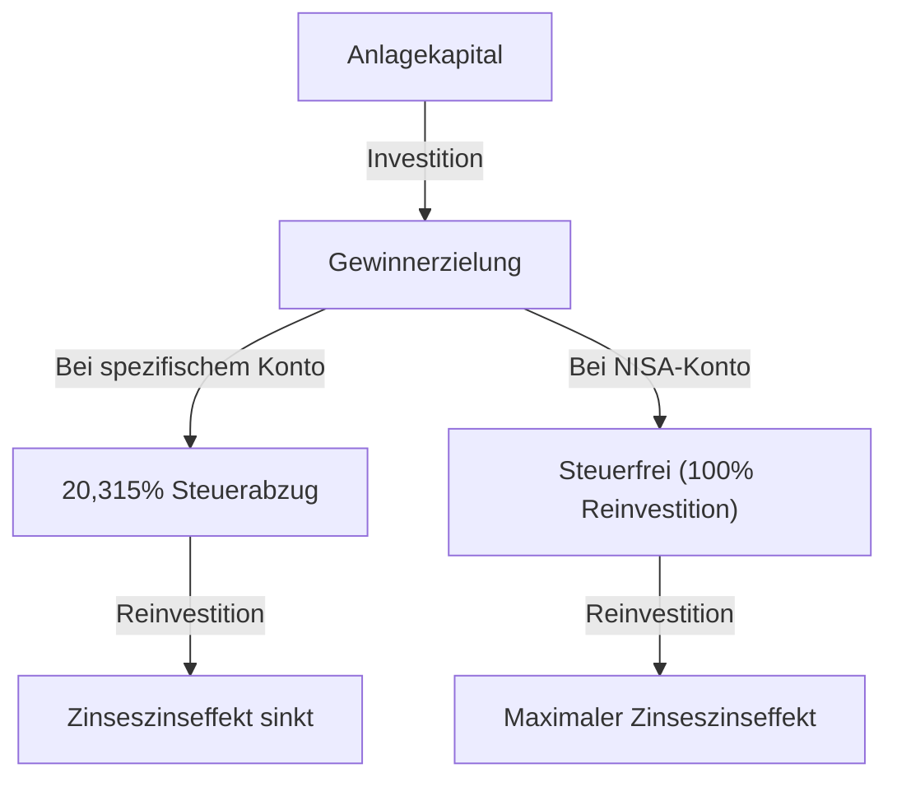

# Einleitung: Warum macht der Staat Investitionen steuerfrei?

In der heutigen modernen Gesellschaft ist die persönliche Vermögensbildung ein wichtigeres Thema denn je. In Japan wurde angesichts anhaltend niedriger Zinsen, Inflationssorgen und Unsicherheiten bezüglich des Rentensystems aufgrund der sinkenden Geburtenrate und einer alternden Bevölkerung der Slogan 'Vom Sparen zum Investieren' von der Regierung stark gefördert. Das Kernstück dieses Systems ist das 'NISA' (Nippon Individual Savings Account - Steuerbefreiungssystem für Kleinbetragsinvestitionen).

Bei normalen Investitionen wird eine Steuer von etwa 20 % (genau 20,315 %) auf Kapitalgewinne und Dividenden (Einkommensgewinne) aus Aktien und Investmentfonds erhoben. Die über ein NISA-Konto erzielten Gewinne sind jedoch alle 'steuerfrei'. Der Grund, warum der Staat dieses System vorantreibt, auch wenn er auf eigene wertvolle Steuereinnahmen verzichtet, besteht darin, jeden Bürger zu einer eigenständigen Vermögensbildung zu ermutigen und die künftige finanzielle Stabilität auf individueller Ebene zu sichern.

In diesem Artikel werden wir die wahre Bedeutung der Befreiung von dieser rund 20-prozentigen Steuer, die Struktur des neuen NISA und den Mechanismus der überwältigenden Vermögensvermehrung durch den Zinseszinseffekt anhand eines mathematischen Ansatzes vertieft untersuchen.

---

# Kapitel 1: Die Hürde der normalen Anlagesteuer (ca. 20 %)

Um die Vorteile der Steuerbefreiung zu verstehen, lassen Sie uns zunächst zusammenfassen, welche Steuern anfallen, wenn Sie auf einem normalen steuerpflichtigen Konto (spezifisches Konto oder allgemeines Konto) investieren.

Die Gewinne aus Investitionen lassen sich grob in folgende zwei Kategorien einteilen:

1. **Kapitalgewinn (Veräußerungsgewinn)**: Der Gewinn, der erzielt wird, wenn Aktien oder Investmentfonds zu einem höheren Preis verkauft werden als beim Kauf.
2. **Einkommensgewinn (Dividenden/Ausschüttungen)**: Dividenden, die von Unternehmen für das Halten von Aktien gezahlt werden, oder Ausschüttungen, die regelmäßig von Investmentfonds gezahlt werden.

Nach dem japanischen Steuersystem wird auf diese Gewinne eine Steuer von **20,315 % (Einkommensteuer 15,315 % + Einwohnersteuer 5 %)** erhoben.

## Konkretes Beispiel: Bei einem Gewinn von 1 Million Yen

Angenommen, Sie erzielen aus Ihrer Investition einen Gewinn von 1 Million Yen. Bei einem normalen Konto werden die Steuern wie folgt abgezogen:

- Gewinn: 1.000.000 Yen
- Steuer: 1.000.000 Yen × 20,315 % = 203.150 Yen
- Netto: **796.850 Yen**

Tatsächlich werden mehr als 200.000 Yen als Steuern an den Staat abgeführt. Bei einem einmaligen Gewinn könnte man sagen 'Das lässt sich nicht ändern', aber wenn Sie Vermögenswerte über einen langen Zeitraum reinvestieren, ist diese Steuer von 20 % eine Ursache für eine erhebliche Schwächung der 'Kraft des Zinseszinses'.

---

# Kapitel 2: Der mathematische Mechanismus des Zinseszinseffekts und die Macht der Steuerfreiheit

Der 'Zinseszins' (Compound Interest), den Einstein angeblich als 'die größte Entdeckung der Menschheit' bezeichnete. Der Zinseszins ist ein System, bei dem die auf das Kapital verdienten Zinsen wieder dem Kapital hinzugefügt werden und auf diesen Gesamtbetrag weitere Zinsen anfallen. Je mehr Zeit vergeht, desto mehr wächst das Vermögen schneeballartig an.

## Die Zinseszinsformel

Das künftige Vermögen $A$ durch Zinseszins lässt sich mit folgender mathematischer Formel ausdrücken:

$$ A = P \times (1 + r)^n $$

- $P$: Kapital (Anfangsinvestition)
- $r$: Jährliche Rendite
- $n$: Anlagezeitraum (Jahre)

Wenn Sie zum Beispiel 1 Million Yen ($P$) mit einer jährlichen Rendite von 5 % ($r=0,05$) über 30 Jahre ($n=30$) anlegen, sieht das wie folgt aus:

$$ A = 1.000.000 \times (1 + 0,05)^{30} \approx 4.321.942 \text{ Yen} $$

Das Vermögen steigt um etwa das 4,3-fache. Das ist die Kraft des Zinseszinses.

## Die zerstörerischen Auswirkungen der Besteuerung auf den Zinseszins

Die Realität ist jedoch nicht so einfach. Wenn Dividenden reinvestiert oder Portfolios unterwegs umgeschichtet werden, werden jedes Mal etwa 20 % Steuern auf den Gewinn abgezogen. Das bedeutet, dass die effektive Rendite sinkt.

Die reale Rendite nach Steuern $r'$ wird wie folgt berechnet:

$$ r' = r \times (1 - 0,20315) $$

Bei einer jährlichen Rendite von 5 % sinkt die reale Rendite auf etwa 3,98 %.
Wenn Sie 30 Jahre lang mit dieser Rendite nach Steuern anlegen, beträgt der Vermögenswert wie folgt:

$$ A = 1.000.000 \times (1 + 0,0398)^{30} \approx 3.224.933 \text{ Yen} $$

**Im Falle von Steuerfreiheit (NISA): ca. 4,32 Millionen Yen**
**Im Falle eines steuerpflichtigen Kontos: ca. 3,22 Millionen Yen**

Der Unterschied beläuft sich auf erstaunliche **ca. 1,1 Millionen Yen**. Bei langfristigen Investitionen ist der steuerfreie Freibetrag von NISA, bei dem 20 % Steuern erlassen werden, nicht nur eine einfache 'Steuerersparnis', sondern ein unverzichtbares Instrument, um den Zinseszins-Motor auf Hochtouren laufen zu lassen.

---

# Kapitel 3: Struktur und Merkmale des neuen NISA

Das 2024 gestartete 'neue NISA' ist eine deutliche Erweiterung des bisherigen NISA (Allgemeines NISA / Tsumitate NISA) und hat sich zu einem flexibleren und leistungsstärkeren Instrument zur Vermögensbildung entwickelt. Das wichtigste Merkmal ist, dass der 'Tsumitate-Anlagefreibetrag' und der 'Wachstumsanlagefreibetrag' zusammen genutzt werden können.

## 1. Tsumitate-Anlagefreibetrag (Sparplan-Freibetrag)

Der Tsumitate-Anlagefreibetrag richtet sich an Investmentfonds (wie Indexfonds), die bestimmte Voraussetzungen für langfristige, systematische und diversifizierte Anlagen erfüllen.

- **Jährlicher Anlagefreibetrag**: 1,2 Millionen Yen
- **Anlageobjekte**: Von der Finanzbehörde festgelegte Investmentfonds mit niedrigen Gebühren, die sich für langfristige Investitionen eignen
- **Vorteile**: Ermöglicht einen systematischen Vermögensaufbau ohne emotionale Beeinflussung. Ideal auch für Anfänger.

## 2. Wachstumsanlagefreibetrag

Der Wachstumsanlagefreibetrag ermöglicht Investitionen in eine breitere Palette von Produkten als der Tsumitate-Anlagefreibetrag.

- **Jährlicher Anlagefreibetrag**: 2,4 Millionen Yen
- **Anlageobjekte**: Börsennotierte Aktien (japanische, US-Aktien usw.), ETFs, REITs, viele Investmentfonds
- **Vorteile**: Ermöglicht strategische Investitionen, wie das Anvisieren hoher Renditen mit Einzelaktien oder den Aufbau eines Portfolios mit hochverzinslichen Aktien für steuerfreie Einkommensgewinne.

## Wichtige Verbesserungen des neuen NISA

1. **Unbefristete steuerfreie Haltedauer**: Die bisherigen Beschränkungen auf '5 Jahre' oder '20 Jahre' wurden abgeschafft, so dass Anlagen lebenslang steuerfrei gehalten werden können.
2. **Erhöhung des jährlichen Anlagefreibetrags**: Bis zu 3,6 Millionen Yen (Tsumitate 1,2 Millionen + Wachstum 2,4 Millionen) können pro Jahr investiert werden.
3. **Einführung eines lebenslangen steuerfreien Höchstbetrags (18 Millionen Yen)**: Jeder Person wird ein steuerfreier Freibetrag von maximal 18 Millionen Yen (davon bis zu 12 Millionen Yen für den Wachstumsanlagefreibetrag) gewährt.
4. **Wiederverwendbarkeit des Freibetrags**: Wenn ein Produkt verkauft wird, wird der entsprechende steuerfreie Freibetrag (auf Buchwertbasis) im darauffolgenden Jahr und darüber hinaus wiederhergestellt und kann erneut genutzt werden.

---

# Kapitel 4: Vor- und Nachteile der Dollar-Cost-Averaging-Methode (DCA)

Die für NISA, insbesondere den Tsumitate-Anlagefreibetrag, empfohlene Anlagestrategie ist der 'Durchschnittskosteneffekt' (Dollar Cost Averaging: DCA). Dabei wird regelmäßig der gleiche Anlagebetrag in dasselbe Anlageprodukt investiert.

## Vorteile

1. **Ausgleich des durchschnittlichen Kaufpreises**:
   Sie kaufen eine geringere Menge, wenn der Preis hoch ist, und eine größere Menge, wenn der Preis niedrig ist. Infolgedessen können Sie langfristig den durchschnittlichen Kaufpreis pro Anteil niedrig halten.
2. **Ausschalten von Emotionen**:
   Sie können die menschliche psychologische Schwäche überwinden, bei einem Marktcrash in Panik zu verkaufen oder bei einem Boom zu Höchstpreisen zu kaufen. Die Regel 'mechanisch weiterkaufen' schützt Anleger vor emotionalen Fehlern.
3. **Risikominderung durch zeitliche Streuung**:
   Indem Sie das Anlage-Timing nicht auf einen Zeitpunkt konzentrieren, können Sie das Risiko verringern, alles auf einmal zu einem hohen Preis zu investieren (Risiko des Kaufs am Höchststand).

## Nachteile und zu beachtende Punkte

1. **Opportunitätskosten (Entgangene Gewinne)**:
   In einem stetig steigenden Markt führt eine einmalige Investition (Lump-Sum Investing) zu Beginn tendenziell zu einer höheren Rendite über den gesamten Anlagezeitraum. Da Bargeld nach und nach investiert wird, verpassen Sie Wachstumschancen für den noch nicht investierten Bargeldanteil.
2. **Psychologische Belastung in Bärenmärkten**:
   Wenn nach jahrelangem systematischem Investieren ein massiver Crash auftritt, ist der Schaden für das Gesamtvermögen groß. Es ist zu beachten, dass DCA lediglich eine 'Streuung des Kaufzeitpunkts' und keine 'Streuung der Anlageklassen (Portfolio-Diversifikation)' ist.

---

# Fazit: Wie man NISA nutzen sollte

Der steuerfreie Anlagefreibetrag von NISA ist das 'stärkste vom Staat bereitgestellte Instrument zur Vermögensbildung'. Durch die Befreiung von rund 20 % Steuern wird die Kraft des Zinseszinses maximiert, und die langfristige Vermögenswachstumskurve steigt dramatisch an.

Es reicht jedoch nicht aus, das System nur zu nutzen. Die folgenden drei Punkte sind wichtig:

1. **Eine langfristige Perspektive einnehmen**: Lassen Sie sich nicht von kurzfristigen Marktschwankungen beeinflussen und glauben Sie an den Zinseszinseffekt über Jahrzehnte.
2. **Auf Diversifikation achten**: Kontrollieren Sie das Risiko angemessen, indem Sie beispielsweise Indexfonds nutzen, die in Aktien weltweit diversifizieren.
3. **Weiter investieren**: Haben Sie die Disziplin, nicht zwischendurch aufzuhören und selbst bei einem Marktcrash ruhig weiter zu investieren.

Lassen Sie uns den Mechanismus des neuen NISA tiefgreifend verstehen, dieses 'Privileg' des steuerfreien Freibetrags voll ausschöpfen und Ihre künftige finanzielle Freiheit aufbauen.
