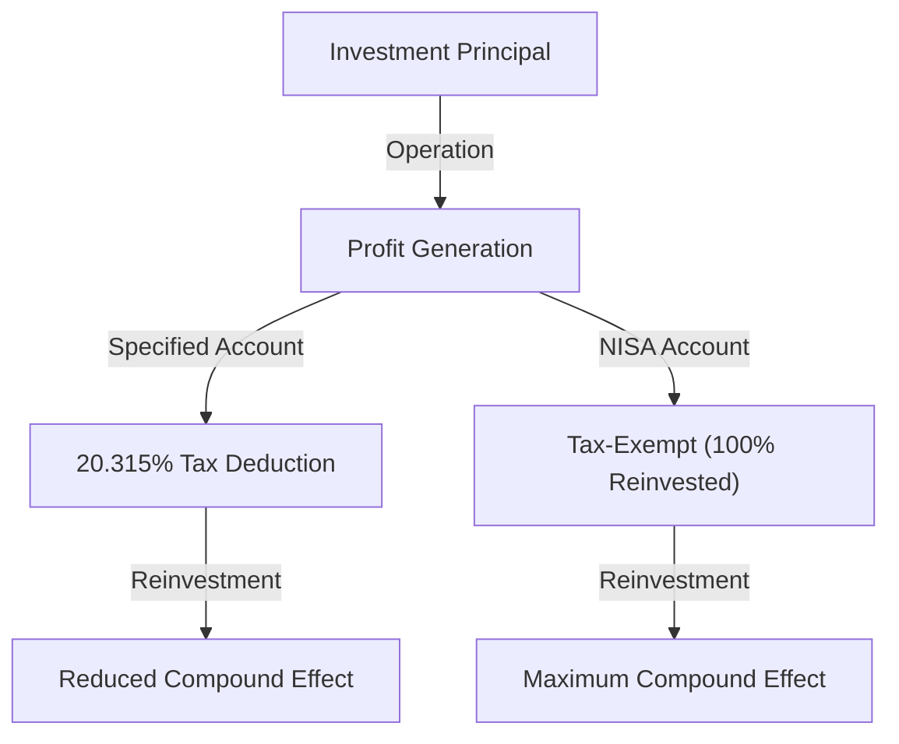

# Introduction: Why does the government make investments tax-exempt?

In modern society, individual asset building has become a more important issue than ever before. In Japan, driven by prolonged low interest rates, inflation concerns, and anxiety about the pension system due to a declining birthrate and aging population, the slogan 'from savings to investment' has been strongly promoted by the government. The core of this initiative is 'NISA' (Nippon Individual Savings Account / Small Investment Tax Exemption System).

In normal investing, a tax of approximately 20% (exactly 20.315%) is levied on capital gains (profit from selling stocks or mutual funds) and income gains (dividends). However, all profits obtained through a NISA account are 'tax-exempt'. The reason the government promotes this system even at the cost of its own valuable tax revenue is to encourage independent asset building by every citizen and have them secure future economic stability at the individual level.

In this article, we will delve deeply into the true meaning of being exempt from this approximately 20% tax, the structure of the new NISA, and the overwhelming wealth-building mechanism brought by the effect of compound interest, using a mathematical approach.

---

# Chapter 1: The Wall of Normal Investment Tax (approx. 20%)

First, to understand the benefits of tax exemption, let's clarify what kind of taxes are applied when investing in a standard taxable account (specified account or general account).

Profits from investments are broadly classified into the following two types:

1. **Capital Gain**: Profit obtained when selling stocks, mutual funds, etc. at a higher price than when purchased.
2. **Income Gain (Dividends/Distributions)**: Dividends paid by companies for holding their stocks, or periodic distributions paid from mutual funds.

Under the Japanese tax system, a tax of **20.315% (Income Tax 15.315% + Resident Tax 5%)** is imposed on these profits.

## Specific Example: When a profit of 1 million yen is made

Suppose you made a profit of 1 million yen from investing. If it's a regular account, taxes will be deducted as follows:

- Profit: 1,000,000 yen
- Tax: 1,000,000 yen × 20.315% = 203,150 yen
- Take-home pay: **796,850 yen**

Indeed, over 200,000 yen is paid to the government as tax. You might dismiss this as 'unavoidable' if it's a one-off profit, but when reinvesting assets over the long term, this 20% tax becomes a cause that significantly undermines the 'power of compound interest'.

---

# Chapter 2: The Mathematical Mechanism of Compound Interest and the Power of Tax Exemption

'Compound Interest', which Einstein supposedly called 'the greatest discovery in human history'. Compound interest is a system where the interest earned on the principal is added back to the principal, and then interest is earned on that combined total. The more time passes, the more the asset balloons like a snowball.

## Compound Interest Formula

The future asset value $A$ due to compound interest is expressed by the following formula:

$$ A = P \times (1 + r)^n $$

- $P$: Principal (Initial investment amount)
- $r$: Annual return (Interest rate)
- $n$: Investment period (Years)

For example, if you invest 1 million yen ($P$) at an annual interest rate of 5% ($r=0.05$) for 30 years ($n=30$), it will look like this:

$$ A = 1,000,000 \times (1 + 0.05)^{30} \approx 4,321,942 \text{ yen} $$

The asset increases by about 4.3 times. This is the power of compound interest.

## The Destructive Impact of Taxation on Compound Interest

However, reality is not so sweet. When reinvesting dividends or performing rebalancing along the way, a tax of approximately 20% is deducted from the profit every time. In other words, the effective yield decreases.

The effective yield after tax $r'$ is calculated as follows:

$$ r' = r \times (1 - 0.20315) $$

At a 5% annual rate, the effective yield drops to about 3.98%.
The asset value when investing for 30 years at this after-tax yield is as follows:

$$ A = 1,000,000 \times (1 + 0.0398)^{30} \approx 3,224,933 \text{ yen} $$

**In the case of tax exemption (NISA): approx. 4.32 million yen**
**In the case of a taxable account: approx. 3.22 million yen**

The difference amounts to a staggering **approx. 1.1 million yen**. In long-term investing, the NISA tax-exempt allowance, which exempts the 20% tax, is not merely 'tax saving' but can be called an essential tool for running the compound interest engine at full capacity.

---

# Chapter 3: Structure and Features of the New NISA

The 'New NISA', which started in 2024, has been significantly expanded from the conventional NISA (General NISA / Tsumitate NISA) and has evolved into a more flexible and powerful asset building tool. The biggest feature is that the 'Tsumitate Investment Quota' and 'Growth Investment Quota' can now be used together.

## 1. Tsumitate Investment Quota

The Tsumitate Investment Quota targets mutual funds (such as index funds) that meet certain requirements suitable for long-term, regular, and diversified investing.

- **Annual investment quota**: 1.2 million yen
- **Investment targets**: Mutual funds designated by the Financial Services Agency, featuring low fees and suitability for long-term investment
- **Merits**: Allows for mechanical asset accumulation without being swayed by emotions. Ideal for beginners.

## 2. Growth Investment Quota

The Growth Investment Quota allows investments in a broader range of products than the Tsumitate Investment Quota.

- **Annual investment quota**: 2.4 million yen
- **Investment targets**: Listed stocks (Japanese stocks, US stocks, etc.), ETFs, REITs, and many mutual funds
- **Merits**: Enables strategic investing, such as aiming for high returns through individual stock investments or building a high-dividend portfolio to earn tax-exempt income gains.

## Main Improvements of the New NISA

1. **Indefinite tax-exempt holding period**: The previous limits of '5 years' or '20 years' have been abolished, allowing you to hold investments tax-free for a lifetime.
2. **Expansion of annual investment quotas**: It's now possible to invest up to a maximum of 3.6 million yen annually (Tsumitate 1.2M + Growth 2.4M).
3. **Introduction of a lifetime tax-exempt limit (18 million yen)**: A tax-exempt allowance of up to 18 million yen per person (of which the Growth Investment Quota is up to 12 million yen) is granted.
4. **Reusability of quotas**: If you sell a product, the tax-exempt quota corresponding to it (based on book value) will be restored in the following year and can be reused.

---

# Chapter 4: Merits and Demerits of Dollar Cost Averaging (DCA)

The investment method recommended for NISA, especially for the Tsumitate Investment Quota, is 'Dollar Cost Averaging (DCA)'. This is a method of continually purchasing the same investment product with a fixed amount of money at regular intervals.

## Merits

1. **Smoothing the average purchase price**:
   You will buy a smaller quantity when prices are high, and a larger quantity when prices are low. As a result, you can expect the effect of keeping the average purchase price per unit low over the long term.
2. **Elimination of emotion**:
   It overcomes human psychological weaknesses, such as panic selling during market crashes or buying at the top during sudden spikes. The rule of 'mechanically continuing to buy' protects investors from emotional mistakes.
3. **Risk reduction through time diversification**:
   By not concentrating the investment timing all at once, you can reduce the risk of investing a lump sum at a high price (the risk of catching the top).

## Demerits and Precautions

1. **Opportunity loss (Occurrence of opportunity cost)**:
   In a consistently rising market, Lump-Sum Investing at the beginning tends to yield higher returns over the entire investment period. Because cash is invested little by little, you miss out on the growth opportunities for the uninvested cash portion.
2. **Mental burden in a declining market**:
   If a major crash occurs after years of continuous accumulation, the damage to the overall assets will be significant. It's necessary to note that DCA is strictly a 'diversification of purchase timing' and not a 'diversification of asset classes (portfolio diversification)'.

---

# Conclusion: How NISA should be utilized

The NISA tax-exempt investment quota is the 'strongest asset building tool' provided by the government. By exempting the roughly 20% tax, the power of compound interest is maximized, and the long-term asset growth curve turns dramatically upward.

However, just utilizing the system is not enough. The following three points are important:

1. **Have a long-term perspective**: Do not alternate between joy and sorrow over short-term market fluctuations, and believe in the compound interest effect over decades.
2. **Keep diversified investing in mind**: Utilize index funds that invest diversely in global stocks to appropriately control risk.
3. **Continue investing**: Have the discipline to consistently continue accumulating without quitting halfway, even during a market crash.

Deeply understand the mechanism of the new NISA, fully utilize this 'privilege' of the tax-exempt quota, and let's build your future economic freedom.
