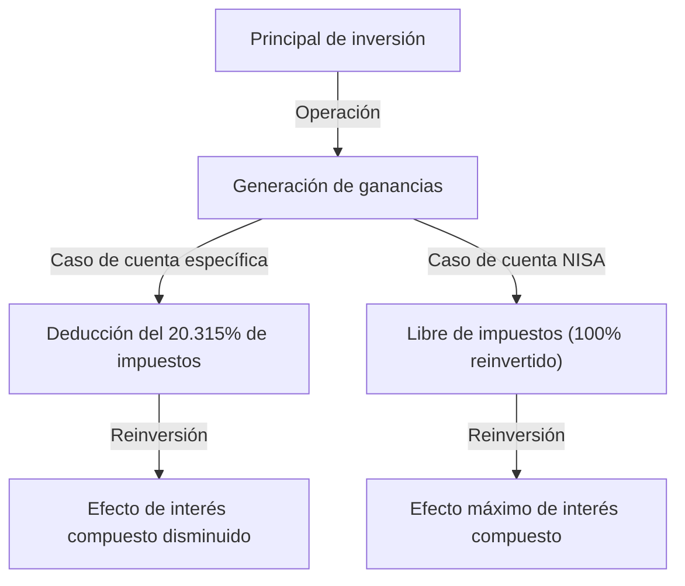

# Introducción: ¿Por qué el gobierno hace que las inversiones estén libres de impuestos?

En la sociedad moderna, la formación de activos personales se ha convertido en un tema más importante que nunca. En Japón, debido a las preocupaciones sobre las bajas tasas de interés prolongadas, la inflación y la ansiedad sobre el sistema de pensiones junto con el envejecimiento de la población y la disminución de la tasa de natalidad, el gobierno ha promovido fuertemente el lema 'del ahorro a la inversión'. El núcleo de esto es el sistema 'NISA' (Sistema de Exención de Impuestos para Pequeñas Inversiones).

En las inversiones regulares, las ganancias de capital (ganancias de transferencia) y las ganancias de ingresos (dividendos) de acciones y fondos de inversión están sujetas a un impuesto de aproximadamente el 20% (exactamente 20.315%). Sin embargo, todas las ganancias obtenidas a través de una cuenta NISA son 'libres de impuestos'. La razón por la que el país promueve este sistema, incluso renunciando a sus valiosos ingresos fiscales, es para alentar a cada ciudadano a construir activos de forma independiente y asegurar su estabilidad económica futura a nivel personal.

En este artículo, profundizaremos en el verdadero significado de estar exento de este impuesto de aproximadamente el 20%, la estructura del nuevo NISA y el mecanismo de aumento abrumador de activos producido por el efecto del interés compuesto, todo con un enfoque matemático.

---

# Capítulo 1: El muro de los impuestos (aprox. 20%) en inversiones regulares

Primero, para entender los beneficios de la exención de impuestos, aclaremos qué tipo de impuestos se aplican cuando se invierte en una cuenta gravable regular (cuenta específica o cuenta general).

Las ganancias de inversión se dividen principalmente en las siguientes dos categorías:

1. **Ganancias de capital (Ganancias de transferencia)**: Ganancias obtenidas al vender acciones o fondos de inversión a un precio más alto de lo que se compraron.
2. **Ganancias de ingresos (Dividendos/Distribuciones)**: Dividendos pagados por empresas por tener acciones o distribuciones pagadas regularmente de fondos de inversión.

Bajo el sistema tributario japonés, estas ganancias están sujetas a un impuesto del **20.315% (Impuesto sobre la renta 15.315% + Impuesto de residencia 5%)**.

## Ejemplo: Si obtienes una ganancia de 1 millón de yenes

Si obtienes una ganancia de 1 millón de yenes de tus inversiones. Con una cuenta regular, los impuestos se deducirían de la siguiente manera:

- Ganancia: 1,000,000 yenes
- Impuestos: 1,000,000 yenes × 20.315% = 203,150 yenes
- Ganancia neta: **796,850 yenes**

De hecho, se pagan más de 200,000 yenes al gobierno en impuestos. Esto puede ser perdonable si es una ganancia única, pero cuando se reinvierten activos a largo plazo, este impuesto del 20% se convierte en una causa que reduce significativamente el 'poder del interés compuesto'.

---

# Capítulo 2: El mecanismo matemático del efecto del interés compuesto y el poder de la exención de impuestos

Albert Einstein supuestamente lo llamó 'el mayor descubrimiento de la humanidad': el 'Interés Compuesto'. El interés compuesto es un mecanismo donde el interés devengado sobre el principal se reinvierte en el principal, y luego se gana interés sobre el monto total. A medida que pasa el tiempo, el activo se infla como una bola de nieve.

## Fórmula del interés compuesto

El monto futuro del activo $A$ con interés compuesto se expresa mediante la siguiente fórmula:

$$ A = P \times (1 + r)^n $$

- $P$: Principal (Monto de inversión inicial)
- $r$: Tasa de interés anual (Rendimiento)
- $n$: Período de inversión (Años)

Por ejemplo, si inviertes 1 millón de yenes ($P$) a una tasa de interés anual del 5% ($r=0.05$) durante 30 años ($n=30$), será de la siguiente manera:

$$ A = 1,000,000 \times (1 + 0.05)^{30} \approx 4,321,942 \text{ yenes} $$

El activo aumenta aproximadamente 4.3 veces. Este es el poder del interés compuesto.

## El impacto destructivo de los impuestos sobre el interés compuesto

Sin embargo, la realidad no es tan dulce. Cuando se reinvierten los dividendos o se rebalancea en el camino, se deduce un impuesto de aproximadamente el 20% de las ganancias cada vez. En otras palabras, el rendimiento efectivo disminuye.

El rendimiento efectivo después de impuestos $r'$ se calcula de la siguiente manera:

$$ r' = r \times (1 - 0.20315) $$

Si la tasa de interés anual es del 5%, el rendimiento efectivo cae a aproximadamente 3.98%.
El monto del activo al invertir a este rendimiento después de impuestos durante 30 años es el siguiente:

$$ A = 1,000,000 \times (1 + 0.0398)^{30} \approx 3,224,933 \text{ yenes} $$

**En el caso de libre de impuestos (NISA): Aprox. 4.32 millones de yenes**
**En el caso de una cuenta gravable: Aprox. 3.22 millones de yenes**

La diferencia es una asombrosa cantidad de **aprox. 1.1 millones de yenes**. En las inversiones a largo plazo, el marco libre de impuestos de NISA, que exime el impuesto del 20%, no es solo un 'ahorro de impuestos', sino una herramienta esencial para que el motor de interés compuesto funcione a su máxima capacidad.

---

# Capítulo 3: Estructura y características del nuevo NISA

El 'nuevo NISA' que comenzó en 2024 se ha ampliado significativamente desde el NISA convencional (NISA General, Tsumitate NISA) y ha evolucionado hacia una herramienta de formación de activos más flexible y poderosa. La mayor característica es que el 'marco de inversión de acumulación' y el 'marco de inversión de crecimiento' se pueden utilizar juntos.

## 1. Marco de inversión de acumulación (Tsumitate)

El marco de inversión de acumulación se dirige a fondos de inversión (como fondos indexados) que cumplen ciertos requisitos adecuados para inversiones a largo plazo, de acumulación y diversificadas.

- **Límite de inversión anual**: 1.2 millones de yenes
- **Objetivo de inversión**: Fondos de inversión determinados por la Agencia de Servicios Financieros, con bajas comisiones y adecuados para inversiones a largo plazo
- **Beneficios**: Los activos se pueden acumular mecánicamente sin dejarse influenciar por las emociones. Ideal para principiantes.

## 2. Marco de inversión de crecimiento

El marco de inversión de crecimiento es un marco que permite la inversión en una gama más amplia de productos que el marco de inversión de acumulación.

- **Límite de inversión anual**: 2.4 millones de yenes
- **Objetivo de inversión**: Acciones cotizadas (acciones japonesas, acciones estadounidenses, etc.), ETFs, REITs, muchos fondos de inversión
- **Beneficios**: Permite inversiones estratégicas, como apuntar a altos rendimientos con inversiones en acciones individuales, o construir una cartera de acciones de altos dividendos para obtener ganancias de ingresos libres de impuestos.

## Principales mejoras del nuevo NISA

1. **Período de tenencia libre de impuestos indefinido**: Se eliminaron los límites convencionales de '5 años' y '20 años', y ahora se pueden mantener libres de impuestos de por vida.
2. **Expansión del marco de inversión anual**: Se puede invertir un máximo de 3.6 millones de yenes anuales (1.2 millones de acumulación + 2.4 millones de crecimiento).
3. **Introducción del límite de exención de impuestos de por vida (18 millones de yenes)**: A cada persona se le otorga un marco libre de impuestos de hasta 18 millones de yenes (de los cuales hasta 12 millones de yenes son para el marco de inversión de crecimiento).
4. **Posibilidad de reutilización del marco**: Si vendes un producto, el marco libre de impuestos equivalente (basado en el valor en libros) se restablece al año siguiente y se puede reutilizar.

---

# Capítulo 4: Ventajas y desventajas del método de promedio de costo en dólares (DCA)

El método de inversión recomendado para NISA, especialmente para el marco de inversión de acumulación, es el 'Método de Promedio de Costo en Dólares (DCA)'. Este es un método para continuar comprando el mismo producto de inversión por una cantidad fija a intervalos regulares.

## Ventajas

1. **Nivelación del precio promedio de adquisición**:
   Comprarás una cantidad pequeña cuando el precio sea alto, y una cantidad grande cuando el precio sea bajo. Como resultado, a largo plazo, puedes esperar el efecto de mantener bajo el precio promedio de adquisición por unidad.
2. **Eliminación de las emociones**:
   Puedes superar las debilidades psicológicas humanas de vender en pánico cuando el mercado colapsa o comprar a precios altos cuando el mercado se dispara. La regla de 'seguir comprando mecánicamente' protege a los inversores de errores emocionales.
3. **Reducción del riesgo de dispersión temporal**:
   Al no concentrar el momento de la inversión de una sola vez, puedes reducir el riesgo de invertir todo de una vez a un precio alto (riesgo de comprar caro).

## Desventajas y puntos a tener en cuenta

1. **Costo de oportunidad**:
   En un mercado en alza, hacer una inversión global al principio (Lump-Sum Investing) tiende a generar un mayor rendimiento durante todo el período de inversión. Dado que el efectivo se invierte poco a poco, pierdes las oportunidades de crecimiento de la parte de efectivo no invertida.
2. **Carga mental en un mercado a la baja**:
   Si ocurre una gran caída después de años de acumulación, el daño a los activos en general será grande. Es importante tener en cuenta que el DCA es solo una 'dispersión del momento de compra' y no una 'dispersión de las clases de activos (diversificación de cartera)'.

---

# Conclusión: Cómo se debe utilizar NISA

El marco de inversión libre de impuestos de NISA es la 'herramienta de formación de activos más poderosa' preparada por el gobierno. Con una exención de impuestos de aproximadamente el 20%, el poder del interés compuesto se maximiza y la curva de crecimiento de los activos a largo plazo mejora drásticamente.

Sin embargo, no es suficiente simplemente usar el sistema. Los siguientes tres puntos son importantes:

1. **Tener una perspectiva a largo plazo**: No dejarse llevar por las fluctuaciones a corto plazo del mercado, sino creer en el efecto del interés compuesto a lo largo de décadas.
2. **Tener en cuenta la diversificación**: Controlar adecuadamente el riesgo utilizando fondos indexados que invierten de forma diversificada en acciones mundiales.
3. **Continuar invirtiendo**: Tener la disciplina de continuar acumulando sin detenerse a la mitad, incluso durante las caídas del mercado.

Entendiendo profundamente el mecanismo del nuevo NISA y aprovechando al máximo el 'privilegio' de este marco libre de impuestos, construyamos tu futura libertad económica.
