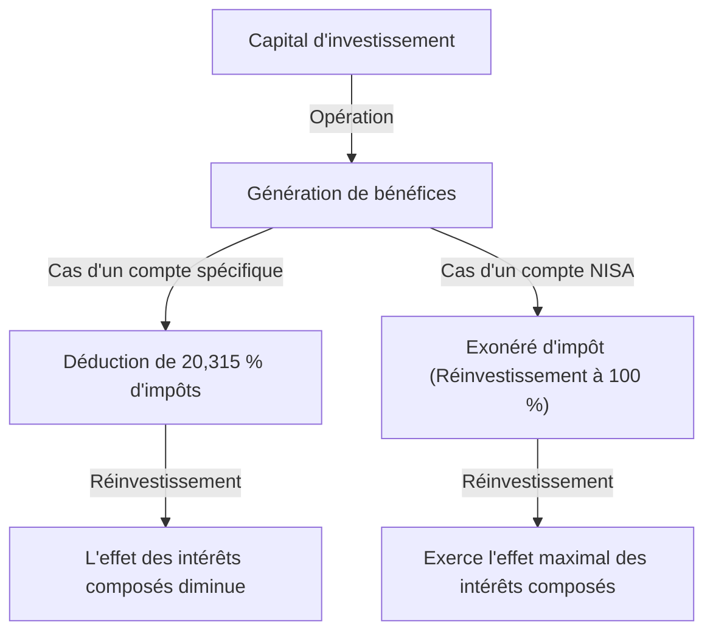

# Introduction : Pourquoi le gouvernement exonère-t-il les investissements d'impôts ?

Dans la société moderne, la constitution d'un patrimoine individuel est un enjeu plus important que jamais. Au Japon, face à de longues périodes de taux d'intérêt bas, aux craintes d'inflation et à l'inquiétude concernant le système de retraite due à la baisse de la natalité et au vieillissement de la population, le gouvernement a fortement promu le slogan « De l'épargne vers l'investissement ». Le système central de cette initiative est le « NISA (Nippon Individual Savings Account - Système d'exonération fiscale pour les petits investissements) ».

Dans les investissements classiques, les plus-values (gains en capital) et les dividendes (gains en revenus) provenant de la vente d'actions ou de fonds d'investissement sont soumis à un impôt d'environ 20 % (plus précisément 20,315 %). Cependant, tous les bénéfices réalisés via un compte NISA sont « exonérés d'impôt ». La raison pour laquelle le gouvernement promeut ce système au point de renoncer à ses propres recettes fiscales précieuses est d'encourager chaque citoyen à se constituer un patrimoine de manière autonome et d'assurer une stabilité économique future au niveau individuel.

Dans cet article, nous explorerons en profondeur la véritable signification de l'exonération de cet impôt d'environ 20 %, la structure du nouveau NISA et le mécanisme d'augmentation massive du patrimoine apporté par l'effet des intérêts composés, en utilisant une approche mathématique.

---

# Chapitre 1 : Le mur de l'impôt (environ 20 %) sur les investissements classiques

Tout d'abord, pour comprendre les avantages de l'exonération fiscale, faisons le point sur les impôts prélevés lors d'investissements dans un compte imposable classique (compte spécifique ou compte général).

Les bénéfices tirés des investissements se divisent principalement en deux catégories :

1. **Gains en capital (Plus-values de cession)** : Bénéfices obtenus lors de la vente d'actions ou de fonds d'investissement à un prix supérieur à celui d'achat.
2. **Gains en revenus (Dividendes et distributions)** : Dividendes versés par les entreprises pour la détention d'actions, ou distributions versées régulièrement par les fonds d'investissement.

Dans le système fiscal japonais, ces bénéfices sont soumis à un impôt de **20,315 % (Impôt sur le revenu 15,315 % + Impôt local 5 %)**.

## Exemple concret : En cas de bénéfice d'un million de yens

Supposons que vous réalisiez un bénéfice d'un million de yens grâce à vos investissements. S'il s'agit d'un compte ordinaire, les impôts seront déduits de la manière suivante :

- Bénéfice : 1 000 000 yens
- Impôt : 1 000 000 yens × 20,315 % = 203 150 yens
- Montant net : **796 850 yens**

En réalité, plus de 200 000 yens sont versés à l'État sous forme d'impôts. Si ce n'était qu'un bénéfice ponctuel, on pourrait dire que « c'est inévitable », mais lorsque vous réinvestissez vos actifs sur une longue période, cet impôt de 20 % réduit considérablement le « pouvoir des intérêts composés ».

---

# Chapitre 2 : Le mécanisme mathématique de l'effet des intérêts composés et la puissance de l'exonération fiscale

Les « intérêts composés » (Compound Interest), qu'Albert Einstein aurait qualifiés de « plus grande découverte de l'humanité ». Les intérêts composés sont un système où les intérêts générés par le capital initial sont ajoutés à ce capital, et le montant total génère à son tour des intérêts. Plus le temps passe, plus le patrimoine s'accroît par effet boule de neige.

## Formule de calcul des intérêts composés

Le montant futur des actifs $A$ grâce aux intérêts composés s'exprime par la formule suivante :

$$ A = P \times (1 + r)^n $$

- $P$ : Capital initial (Montant de l'investissement initial)
- $r$ : Rendement annuel
- $n$ : Période d'investissement (en années)

Par exemple, si vous investissez 1 million de yens ($P$) avec un rendement annuel de 5 % ($r=0.05$) pendant 30 ans ($n=30$), vous obtenez ce qui suit :

$$ A = 1 000 000 \times (1 + 0.05)^{30} \approx 4 321 942 \text{ yens} $$

Les actifs sont multipliés par environ 4,3. C'est le pouvoir des intérêts composés.

## L'impact destructeur de la fiscalité sur les intérêts composés

Cependant, la réalité n'est pas si simple. Lors du réinvestissement des dividendes ou du rééquilibrage du portefeuille, environ 20 % d'impôts sont déduits des bénéfices à chaque fois. Cela signifie que le rendement réel diminue.

Le rendement réel après impôts $r'$ est calculé comme suit :

$$ r' = r \times (1 - 0.20315) $$

Pour un rendement annuel de 5 %, le rendement réel chute à environ 3,98 %.
Le montant des actifs si vous investissez avec ce rendement après impôts pendant 30 ans serait le suivant :

$$ A = 1 000 000 \times (1 + 0.0398)^{30} \approx 3 224 933 \text{ yens} $$

**En cas d'exonération fiscale (NISA) : Environ 4,32 millions de yens**
**En cas de compte imposable : Environ 3,22 millions de yens**

La différence s'élève à la somme impressionnante d'**environ 1,1 million de yens**. Dans un investissement à long terme, le quota d'exonération fiscale du NISA, qui vous dispense de l'impôt de 20 %, n'est pas une simple « économie d'impôt », mais un outil indispensable pour faire tourner à plein régime le moteur des intérêts composés.

---

# Chapitre 3 : La structure et les caractéristiques du nouveau NISA

Le « Nouveau NISA », lancé en 2024, a considérablement élargi le système par rapport à l'ancien NISA (NISA général et NISA d'accumulation), évoluant vers un outil de création de patrimoine plus flexible et plus puissant. La plus grande caractéristique est la possibilité de combiner le « Quota d'investissement d'accumulation (Tsumitate) » et le « Quota d'investissement de croissance ».

## 1. Quota d'investissement d'accumulation (Tsumitate)

Le quota d'investissement d'accumulation cible les fonds d'investissement (tels que les fonds indiciels) qui répondent à certains critères adaptés à un investissement diversifié, régulier et à long terme.

- **Quota d'investissement annuel** : 1,2 million de yens
- **Cible d'investissement** : Fonds d'investissement désignés par l'Agence des services financiers, avec des frais réduits et adaptés à l'investissement à long terme.
- **Avantages** : Permet d'accumuler des actifs mécaniquement sans être influencé par les émotions. Idéal pour les débutants.

## 2. Quota d'investissement de croissance

Le quota d'investissement de croissance permet d'investir dans une gamme de produits plus large que le quota d'accumulation.

- **Quota d'investissement annuel** : 2,4 millions de yens
- **Cible d'investissement** : Actions cotées (actions japonaises, actions américaines, etc.), ETF, REIT, et de nombreux fonds d'investissement.
- **Avantages** : Permet des investissements stratégiques, comme viser des rendements élevés avec des actions individuelles ou construire un portefeuille d'actions à haut dividende pour obtenir des gains en revenus non imposables.

## Principales améliorations du nouveau NISA

1. **Période de détention non imposable illimitée** : Les limites précédentes de « 5 ans » ou « 20 ans » ont été supprimées, ce qui permet de détenir des actifs en franchise d'impôt à vie.
2. **Expansion du quota d'investissement annuel** : Il est désormais possible d'investir jusqu'à 3,6 millions de yens par an (1,2 million d'accumulation + 2,4 millions de croissance).
3. **Introduction d'un plafond d'exonération fiscale à vie (18 millions de yens)** : Un quota d'exonération fiscale maximum de 18 millions de yens par personne (dont un maximum de 12 millions de yens pour le quota de croissance) est accordé.
4. **Possibilité de réutiliser les quotas** : Si vous vendez un produit, le quota d'exonération fiscale équivalent (sur la base de la valeur comptable) est restauré à partir de l'année suivante et peut être réutilisé.

---

# Chapitre 4 : Les avantages et inconvénients de la méthode de la moyenne des coûts (DCA)

La méthode d'investissement recommandée dans le cadre du NISA, en particulier pour le quota d'accumulation, est la « méthode de la moyenne des coûts en dollars (Dollar Cost Averaging : DCA) ». Il s'agit d'une technique consistant à continuer d'acheter le même produit d'investissement avec un montant fixe à intervalles réguliers.

## Avantages

1. **Nivellement du coût d'acquisition moyen** :
   Vous achetez une petite quantité lorsque les prix sont élevés et une grande quantité lorsque les prix sont bas. Par conséquent, à long terme, on peut s'attendre à ce que le coût d'acquisition moyen par part reste bas.
2. **Élimination des émotions** :
   Vous pouvez surmonter les faiblesses psychologiques humaines, telles que la vente panique lors d'un krach boursier ou l'achat au prix fort lors d'une flambée des prix. La règle de « continuer à acheter mécaniquement » protège les investisseurs des erreurs émotionnelles.
3. **Réduction des risques par la diversification temporelle** :
   En ne concentrant pas le timing de l'investissement en une seule fois, vous pouvez réduire le risque d'investir un montant forfaitaire au prix le plus haut (risque d'acheter au sommet).

## Inconvénients et points d'attention

1. **Coût d'opportunité (Perte d'opportunité)** :
   Dans un marché en hausse, l'investissement d'une somme forfaitaire au début (Lump-Sum Investing) a tendance à générer un rendement plus élevé sur l'ensemble de la période d'investissement. Comme les liquidités sont investies petit à petit, vous manquez les opportunités de croissance de la portion en espèces non investie.
2. **Charge mentale lors des marchés baissiers** :
   Si un krach majeur survient après des années d'accumulation, les dommages sur l'ensemble des actifs seront importants. Il est important de noter que le DCA est uniquement une « diversification du timing d'achat » et non une « diversification des classes d'actifs (diversification du portefeuille) ».

---

# Conclusion : Comment tirer parti du NISA

Le quota d'investissement exonéré d'impôt du NISA est « l'outil ultime de création de patrimoine » mis en place par le gouvernement. En étant exonéré de l'impôt d'environ 20 %, le pouvoir des intérêts composés est maximisé et la courbe de croissance à long terme des actifs est considérablement améliorée.

Cependant, il ne suffit pas d'utiliser simplement le système. Les 3 points suivants sont importants :

1. **Avoir une vision à long terme** : Ne pas être ballotté par les fluctuations à court terme du marché et croire en l'effet des intérêts composés sur plusieurs décennies.
2. **Garder à l'esprit la diversification des investissements** : Contrôler correctement les risques en utilisant des fonds indiciels qui investissent de manière diversifiée dans des actions du monde entier, par exemple.
3. **Continuer à investir** : Avoir la discipline de ne pas s'arrêter en cours de route et de continuer l'accumulation avec constance, même lors des krachs boursiers.

Comprenez en profondeur le fonctionnement du nouveau NISA et utilisez pleinement ce « privilège » qu'est le quota d'exonération fiscale pour construire votre future liberté financière.
