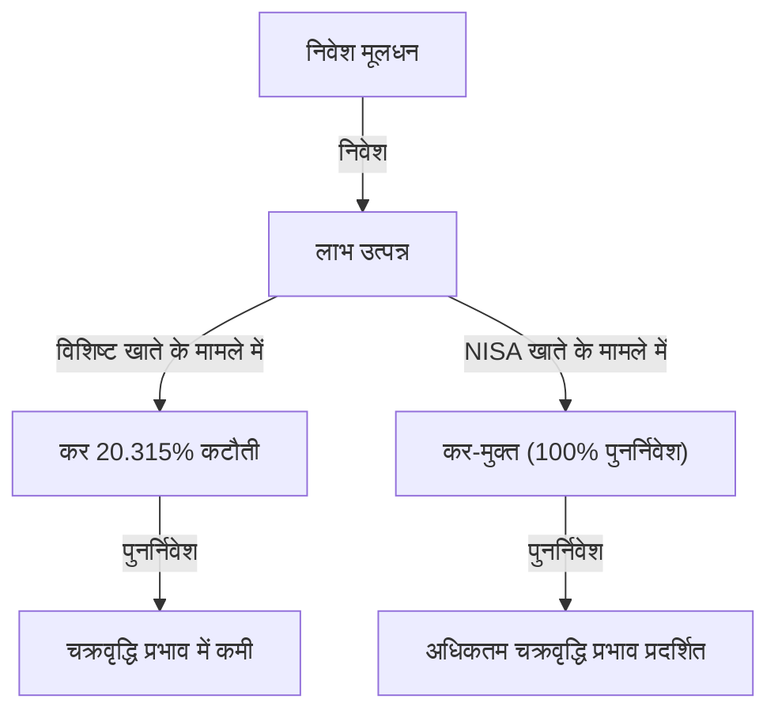

# प्रस्तावना: देश निवेश को कर-मुक्त क्यों बनाता है?

आधुनिक समाज में, व्यक्तिगत धन निर्माण पहले से कहीं अधिक महत्वपूर्ण मुद्दा बन गया है। जापान में, लंबे समय तक चलने वाली कम ब्याज दरों, मुद्रास्फीति की चिंताओं, और घटती जन्म दर तथा बढ़ती उम्र वाली आबादी के कारण पेंशन प्रणाली के बारे में चिंताओं की वजह से, सरकार द्वारा 'बचत से निवेश की ओर' नारे को दृढ़ता से बढ़ावा दिया गया है। इस पहल के मूल में 'NISA' (लघु निवेश कर-छूट प्रणाली) है।

सामान्य निवेश में, स्टॉक और म्यूचुअल फंड से होने वाले पूंजीगत लाभ और लाभांश पर लगभग 20% (सटीक रूप से 20.315%) कर लगता है। हालाँकि, NISA खाते के माध्यम से अर्जित सभी लाभ 'कर-मुक्त' होते हैं। सरकार द्वारा अपने मूल्यवान कर राजस्व को छोड़ कर भी इस प्रणाली को बढ़ावा देने का कारण यह है कि प्रत्येक नागरिक को स्वतंत्र रूप से संपत्ति बनाने के लिए प्रोत्साहित किया जा सके, ताकि व्यक्तिगत स्तर पर भविष्य की आर्थिक स्थिरता सुनिश्चित की जा सके।

इस लेख में, हम इस 20% कर छूट के वास्तविक अर्थ, नए NISA की संरचना, और चक्रवृद्धि प्रभाव द्वारा लाए गए संपत्ति वृद्धि के जबरदस्त तंत्र का गणितीय दृष्टिकोण के साथ गहराई से विश्लेषण करेंगे।

---

# अध्याय 1: सामान्य निवेश पर कर (लगभग 20%) की बाधा

सबसे पहले, कर-मुक्त होने के लाभों को समझने के लिए, आइए स्पष्ट करें कि सामान्य कर योग्य खाते (विशिष्ट खाते या सामान्य खाते) में निवेश करने पर किस प्रकार के कर लगते हैं।

निवेश से होने वाले लाभों को मोटे तौर पर निम्नलिखित दो प्रकारों में वर्गीकृत किया जा सकता है:

1. **पूंजीगत लाभ (कैपिटल गेन)**: स्टॉक या म्यूचुअल फंड को उनकी खरीद कीमत से अधिक कीमत पर बेचने से प्राप्त लाभ।
2. **आय लाभ (इनकम गेन - लाभांश/वितरण)**: स्टॉक रखने के लिए कंपनियों द्वारा भुगतान किया जाने वाला लाभांश, और म्यूचुअल फंड से नियमित रूप से भुगतान किया जाने वाला वितरण।

जापान की कर प्रणाली में, इन लाभों पर **20.315% (आयकर 15.315% + निवासी कर 5%)** कर लगाया जाता है।

## विशिष्ट उदाहरण: यदि 1 मिलियन येन का लाभ होता है

मान लीजिए कि आपने निवेश से 1 मिलियन येन का लाभ कमाया है। यदि यह एक सामान्य खाता है, तो कर इस प्रकार काटा जाएगा:

- लाभ: 1,000,000 येन
- कर: 1,000,000 येन × 20.315% = 203,150 येन
- शुद्ध प्राप्त राशि: **796,850 येन**

वास्तव में 2 लाख येन से अधिक का भुगतान देश को कर के रूप में किया जाता है। एक बार के लाभ के लिए इसे 'मजबूरी' मानकर छोड़ा जा सकता है, लेकिन लंबी अवधि तक संपत्ति को पुनर्निवेश करते समय, यह 20% कर 'चक्रवृद्धि की शक्ति' को काफी कम करने का कारण बनता है।

---

# अध्याय 2: चक्रवृद्धि प्रभाव का गणितीय तंत्र और कर-छूट की शक्ति

'चक्रवृद्धि ब्याज' (Compound Interest), जिसे अल्बर्ट आइंस्टीन ने 'मानव जाति की सबसे बड़ी खोज' कहा था। चक्रवृद्धि ब्याज एक ऐसी प्रणाली है जिसमें मूलधन पर अर्जित ब्याज को फिर से मूलधन में जोड़ दिया जाता है, और उस कुल राशि पर और ब्याज लगता है। समय बीतने के साथ, संपत्ति स्नोबॉल की तरह बढ़ती जाती है।

## चक्रवृद्धि ब्याज का सूत्र

चक्रवृद्धि ब्याज द्वारा भविष्य की संपत्ति राशि $A$ को निम्नलिखित सूत्र द्वारा दर्शाया जाता है:

$$ A = P \times (1 + r)^n $$

- $P$: मूलधन (प्रारंभिक निवेश राशि)
- $r$: वार्षिक प्रतिफल (रिटर्न)
- $n$: निवेश अवधि (वर्ष)

उदाहरण के लिए, यदि 1 मिलियन येन ($P$) को 30 वर्षों ($n=30$) के लिए 5% ($r=0.05$) की वार्षिक ब्याज दर पर निवेश किया जाता है, तो यह इस प्रकार होगा:

$$ A = 1,000,000 \times (1 + 0.05)^{30} \approx 4,321,942 \text{ येन} $$

संपत्ति लगभग 4.3 गुना बढ़ जाती है। यही चक्रवृद्धि की शक्ति है।

## कर का चक्रवृद्धि ब्याज पर विनाशकारी प्रभाव

हालाँकि, वास्तविकता इतनी सरल नहीं है। लाभांश को पुनर्निवेश करते समय या बीच में पोर्टफोलियो को रीबैलेंस करते समय, हर बार लाभ पर लगभग 20% कर काटा जाता है। इसका अर्थ है कि वास्तविक प्रतिफल (रिटर्न) कम हो जाता है।

कर-पश्चात वास्तविक प्रतिफल $r'$ की गणना इस प्रकार की जाती है:

$$ r' = r \times (1 - 0.20315) $$

5% वार्षिक ब्याज के मामले में, वास्तविक प्रतिफल घटकर लगभग 3.98% रह जाता है।
इस कर-पश्चात प्रतिफल के साथ 30 वर्षों तक निवेश करने पर संपत्ति की राशि इस प्रकार होगी:

$$ A = 1,000,000 \times (1 + 0.0398)^{30} \approx 3,224,933 \text{ येन} $$

**कर-मुक्त (NISA) के मामले में: लगभग 4.32 मिलियन येन**
**कर योग्य खाते के मामले में: लगभग 3.22 मिलियन येन**

इनका अंतर लगभग **1.1 मिलियन येन** तक पहुंच जाता है। दीर्घकालिक निवेश में, NISA की कर-मुक्त सीमा, जो 20% कर को माफ़ करती है, केवल एक 'कर बचत' नहीं है, बल्कि चक्रवृद्धि इंजन को पूरी क्षमता से चलाने के लिए एक आवश्यक उपकरण है।

---

# अध्याय 3: नए NISA की संरचना और विशेषताएं

2024 में शुरू हुआ 'नया NISA' पारंपरिक NISA (सामान्य NISA और Tsumitate NISA) प्रणाली से काफी विस्तारित हुआ है, और अधिक लचीले और शक्तिशाली संपत्ति निर्माण उपकरण के रूप में विकसित हुआ है। इसकी सबसे बड़ी विशेषता यह है कि अब 'संचयी निवेश सीमा' (Tsumitate Investment Quota) और 'विकास निवेश सीमा' (Growth Investment Quota) दोनों का एक साथ उपयोग करना संभव है।

## 1. संचयी निवेश सीमा (Tsumitate Investment Quota)

संचयी निवेश सीमा उन म्यूचुअल फंड्स (जैसे इंडेक्स फंड) को लक्षित करती है जो दीर्घकालिक, संचयी और विविध निवेश के लिए उपयुक्त होने की कुछ आवश्यकताओं को पूरा करते हैं।

- **वार्षिक निवेश सीमा**: 1.2 मिलियन येन
- **निवेश योग्य संपत्तियां**: वित्तीय सेवा एजेंसी (FSA) द्वारा निर्धारित म्यूचुअल फंड जो कम शुल्क वाले और दीर्घकालिक निवेश के लिए उपयुक्त हैं।
- **लाभ**: आप भावनाओं से प्रभावित हुए बिना व्यवस्थित रूप से संपत्ति बना सकते हैं। यह शुरुआती लोगों के लिए भी आदर्श है।

## 2. विकास निवेश सीमा (Growth Investment Quota)

विकास निवेश सीमा एक ऐसा कोटा है जो संचयी निवेश सीमा की तुलना में उत्पादों की एक विस्तृत श्रृंखला में निवेश करने की अनुमति देता है।

- **वार्षिक निवेश सीमा**: 2.4 मिलियन येन
- **निवेश योग्य संपत्तियां**: सूचीबद्ध स्टॉक (जापानी स्टॉक, अमेरिकी स्टॉक, आदि), ईटीएफ (ETF), आरईआईटी (REIT), और अधिकांश म्यूचुअल फंड।
- **लाभ**: यह रणनीतिक निवेश की अनुमति देता है, जैसे कि व्यक्तिगत स्टॉक्स में निवेश करके उच्च रिटर्न का लक्ष्य रखना, या उच्च लाभांश वाले स्टॉक पोर्टफोलियो का निर्माण करके कर-मुक्त आय (income gain) प्राप्त करना।

## नए NISA के मुख्य सुधार

1. **कर-मुक्त होल्डिंग अवधि का असीमित होना**: पारंपरिक '5 वर्ष' या '20 वर्ष' की सीमाओं को समाप्त कर दिया गया है, और अब इसे आजीवन कर-मुक्त रखा जा सकता है।
2. **वार्षिक निवेश सीमा का विस्तार**: अब प्रति वर्ष 3.6 मिलियन येन (संचयी 1.2 मिलियन + विकास 2.4 मिलियन) तक निवेश करना संभव है।
3. **आजीवन कर-मुक्त सीमा (18 मिलियन येन) की शुरुआत**: प्रत्येक व्यक्ति को अधिकतम 18 मिलियन येन की कर-मुक्त सीमा दी जाती है (जिसमें से विकास निवेश सीमा 12 मिलियन येन तक है)।
4. **सीमा के पुन: उपयोग की संभावना**: यदि आप किसी संपत्ति को बेचते हैं, तो उस हिस्से (बुक वैल्यू के आधार पर) की कर-मुक्त सीमा अगले वर्ष से बहाल हो जाती है और इसे फिर से उपयोग किया जा सकता है।

---

# अध्याय 4: डॉलर कॉस्ट एवरेजिंग (DCA) के लाभ और नुकसान

NISA में, विशेष रूप से संचयी निवेश सीमा (Tsumitate) के लिए सुझाई गई निवेश पद्धति 'डॉलर कॉस्ट एवरेजिंग (DCA)' है। यह एक ऐसी रणनीति है जिसमें नियमित अंतराल पर एक निश्चित राशि के साथ समान निवेश उत्पाद खरीदना जारी रखा जाता है।

## लाभ

1. **औसत खरीद मूल्य का समतलीकरण**:
   जब कीमतें अधिक होती हैं, तो आप कम मात्रा खरीदते हैं, और जब कीमतें कम होती हैं, तो आप अधिक मात्रा खरीदते हैं। परिणामस्वरूप, लंबी अवधि में प्रति यूनिट औसत खरीद मूल्य को कम रखने के प्रभाव की उम्मीद की जा सकती है।
2. **भावनाओं का निष्कासन**:
   यह बाजार में गिरावट के दौरान घबराहट में बेचने, या कीमतों में उछाल के दौरान ऊंचे दामों पर खरीदने जैसी मानवीय मनोवैज्ञानिक कमजोरियों को दूर कर सकता है। 'व्यवस्थित रूप से खरीदते रहने' का नियम निवेशकों को भावनात्मक गलतियों से बचाता है।
3. **समय विविधीकरण द्वारा जोखिम में कमी**:
   निवेश के समय को एक बार में केंद्रित न करने से, ऊंचे दामों पर एकमुश्त निवेश करने के जोखिम (ऊंचे दाम पर फंसने का जोखिम) को कम किया जा सकता है।

## नुकसान और ध्यान देने योग्य बातें

1. **अवसर की हानि (अवसर लागत का उत्पन्न होना)**:
   लगातार बढ़ते बाजार में, शुरुआत में एकमुश्त निवेश (Lump-Sum Investing) करने पर पूरी निवेश अवधि के दौरान अधिक रिटर्न मिलने की प्रवृत्ति होती है। चूँकि नकदी को धीरे-धीरे निवेश किया जाता है, आप उस नकदी हिस्से के विकास के अवसरों को खो देते हैं जो अभी तक निवेश नहीं किया गया है।
2. **गिरते बाजार में मानसिक तनाव**:
   यदि वर्षों तक निवेश जारी रखने के बाद कोई बड़ी गिरावट (क्रैश) आती है, तो पूरी संपत्ति को बड़ा नुकसान होता है। यह ध्यान रखना महत्वपूर्ण है कि DCA केवल 'खरीद के समय का विविधीकरण' है, 'संपत्ति वर्गों का विविधीकरण (पोर्टफोलियो विविधीकरण)' नहीं है।

---

# निष्कर्ष: NISA का उपयोग कैसे करें

NISA की कर-मुक्त निवेश सीमा सरकार द्वारा प्रदान किया गया 'सबसे मजबूत संपत्ति निर्माण उपकरण' है। लगभग 20% कर की छूट के साथ, चक्रवृद्धि की शक्ति को अधिकतम किया जाता है, और दीर्घकालिक संपत्ति वृद्धि वक्र नाटकीय रूप से ऊपर की ओर बढ़ता है।

हालाँकि, केवल इस प्रणाली का उपयोग करना ही पर्याप्त नहीं है। निम्नलिखित तीन बिंदु महत्वपूर्ण हैं:

1. **दीर्घकालिक दृष्टिकोण रखना**: बाजार के अल्पकालिक उतार-चढ़ाव से प्रभावित न हों, और दशकों तक चलने वाले चक्रवृद्धि प्रभाव पर विश्वास करें।
2. **विविध निवेश का ध्यान रखना**: जोखिम को उचित रूप से नियंत्रित करने के लिए उन इंडेक्स फंड्स का उपयोग करें जो दुनिया भर के स्टॉक्स में निवेश को विविध करते हैं।
3. **निवेश जारी रखना**: बीच में न छोड़ें, और बाजार में गिरावट के दौरान भी निवेश जारी रखने का अनुशासन बनाए रखें।

नए NISA के तंत्र को गहराई से समझें, और अपने भविष्य की आर्थिक स्वतंत्रता के निर्माण के लिए इस कर-मुक्त सीमा के 'विशेषाधिकार' का पूरा लाभ उठाएं。
