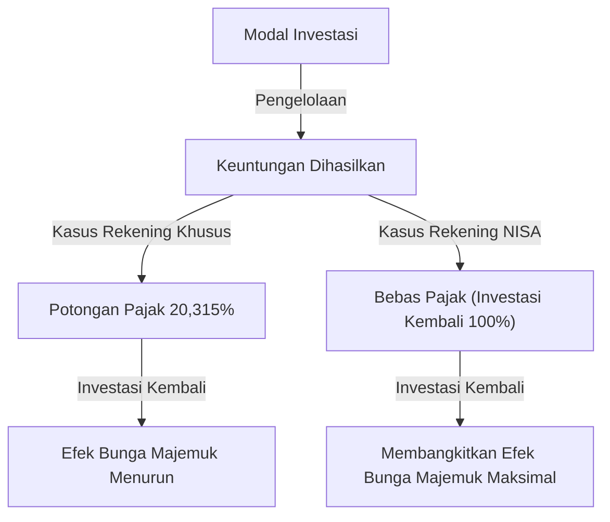

# Pengantar: Mengapa Pemerintah Membebaskan Pajak untuk Investasi?

Dalam masyarakat modern, pembentukan aset pribadi telah menjadi isu yang lebih penting dari sebelumnya. Di Jepang, karena kekhawatiran tentang suku bunga rendah yang berkepanjangan dan inflasi, serta kecemasan tentang sistem pensiun akibat penurunan angka kelahiran dan populasi yang menua, slogan "Dari Tabungan ke Investasi" sangat didorong oleh pemerintah. Inti dari sistem ini adalah "NISA (Sistem Pengecualian Pajak Investasi Jumlah Kecil)".

Dalam investasi biasa, keuntungan dari penjualan saham dan reksa dana (capital gain) serta dividen (income gain) dikenakan pajak sekitar 20% (tepatnya 20,315%). Namun, semua keuntungan yang diperoleh melalui rekening NISA "bebas pajak". Alasan mengapa pemerintah mempromosikan sistem ini meskipun harus melepaskan pendapatan pajaknya yang berharga adalah untuk mendorong setiap warga negara membangun aset secara mandiri, sehingga mereka dapat memastikan stabilitas ekonomi di masa depan pada tingkat individu.

Dalam artikel ini, kita akan menggali lebih dalam arti sebenarnya dari pembebasan pajak sekitar 20% ini, struktur NISA yang baru, dan mekanisme peningkatan aset yang luar biasa yang dibawa oleh efek bunga majemuk, dengan menggunakan pendekatan matematis.

---

# Bab 1: Dinding Pajak Investasi Biasa (Sekitar 20%)

Pertama, untuk memahami manfaat bebas pajak, mari kita uraikan pajak seperti apa yang dikenakan jika Anda berinvestasi di rekening kena pajak biasa (rekening khusus atau rekening umum).

Keuntungan dari investasi secara garis besar dapat dibagi menjadi dua:

1. **Capital Gain (Keuntungan Pengalihan)**: Keuntungan yang diperoleh saat Anda menjual saham, reksa dana, dll. dengan harga lebih tinggi daripada saat Anda membelinya.
2. **Income Gain (Dividen/Distribusi)**: Dividen yang dibayarkan oleh perusahaan karena memegang saham, atau distribusi yang dibayarkan secara berkala dari reksa dana.

Dalam sistem perpajakan Jepang, keuntungan ini dikenakan pajak sebesar **20,315% (Pajak Penghasilan 15,315% + Pajak Penduduk 5%)**.

## Contoh Spesifik: Jika Menghasilkan Keuntungan 1 Juta Yen

Misalkan Anda menghasilkan keuntungan 1 juta yen dari investasi. Jika ini adalah rekening biasa, pajak akan dipotong sebagai berikut:

- Keuntungan: 1.000.000 yen
- Pajak: 1.000.000 yen × 20,315% = 203.150 yen
- Pendapatan bersih: **796.850 yen**

Lebih dari 200 ribu yen disetorkan ke negara sebagai pajak. Ini mungkin bisa dimaklumi jika itu adalah keuntungan sekali saja, tetapi ketika menginvestasikan kembali aset dalam jangka panjang, pajak 20% ini secara signifikan mengurangi "kekuatan bunga majemuk".

---

# Bab 2: Mekanisme Matematis Efek Bunga Majemuk dan Kekuatan Bebas Pajak

"Bunga Majemuk (Compound Interest)", yang disebut oleh Einstein sebagai "penemuan terbesar umat manusia". Bunga majemuk adalah sistem di mana bunga yang diperoleh dari pokok pinjaman ditambahkan kembali ke pokok pinjaman, dan bunga kemudian dikenakan pada jumlah total tersebut. Seiring berjalannya waktu, aset membengkak seperti bola salju.

## Rumus Bunga Majemuk

Nilai aset masa depan $A$ akibat bunga majemuk dinyatakan dengan rumus berikut:

$$ A = P \times (1 + r)^n $$

- $P$: Pokok (Jumlah investasi awal)
- $r$: Tingkat pengembalian tahunan (Return)
- $n$: Periode investasi (Tahun)

Misalnya, jika Anda menginvestasikan 1 juta yen ($P$) dengan bunga tahunan 5% ($r=0,05$) selama 30 tahun ($n=30$), hasilnya adalah sebagai berikut:

$$ A = 1.000.000 \times (1 + 0,05)^{30} \approx 4.321.942 \text{ yen} $$

Aset meningkat sekitar 4,3 kali lipat. Inilah kekuatan bunga majemuk.

## Dampak Merusak Pajak pada Bunga Majemuk

Namun, kenyataannya tidak semanis itu. Saat menginvestasikan kembali dividen, atau menyeimbangkan kembali (rebalancing) di tengah jalan, pajak sekitar 20% dikurangkan setiap saat dari keuntungan. Artinya, tingkat pengembalian efektif menurun.

Tingkat pengembalian efektif setelah pajak $r'$ dihitung sebagai berikut:

$$ r' = r \times (1 - 0,20315) $$

Dengan bunga tahunan 5%, tingkat pengembalian efektif turun menjadi sekitar 3,98%.
Jika Anda berinvestasi dengan tingkat pengembalian setelah pajak ini selama 30 tahun, jumlah aset akan menjadi:

$$ A = 1.000.000 \times (1 + 0,0398)^{30} \approx 3.224.933 \text{ yen} $$

**Kasus Bebas Pajak (NISA): Sekitar 4,32 juta yen**
**Kasus Rekening Kena Pajak: Sekitar 3,22 juta yen**

Selisihnya mencapai **sekitar 1,1 juta yen**. Dalam investasi jangka panjang, kuota bebas pajak NISA, yang membebaskan pajak 20%, bukanlah sekadar "penghematan pajak", melainkan alat wajib untuk menggerakkan mesin bunga majemuk secara penuh.

---

# Bab 3: Struktur dan Fitur NISA Baru

"NISA Baru" yang dimulai pada tahun 2024 telah berkembang menjadi alat pembentukan aset yang lebih fleksibel dan kuat, dengan perluasan sistem yang signifikan dari NISA konvensional (NISA Umum / NISA Akumulasi). Fitur utamanya adalah dimungkinkannya penggunaan gabungan "Kuota Investasi Akumulasi (Tsumitate)" dan "Kuota Investasi Pertumbuhan".

## 1. Kuota Investasi Akumulasi (Tsumitate)

Kuota investasi akumulasi menargetkan reksa dana (seperti reksa dana indeks) yang memenuhi persyaratan tertentu yang cocok untuk investasi jangka panjang, akumulasi, dan diversifikasi.

- **Batas Investasi Tahunan**: 1,2 juta yen
- **Target Investasi**: Reksa dana yang ditentukan oleh Badan Layanan Keuangan, memiliki biaya rendah dan cocok untuk investasi jangka panjang
- **Kelebihan**: Aset dapat diakumulasi secara mekanis tanpa terpengaruh oleh emosi. Sangat ideal untuk pemula.

## 2. Kuota Investasi Pertumbuhan

Kuota investasi pertumbuhan adalah kuota yang memungkinkan Anda berinvestasi dalam rentang produk yang lebih luas daripada kuota investasi akumulasi.

- **Batas Investasi Tahunan**: 2,4 juta yen
- **Target Investasi**: Saham terdaftar (saham Jepang, saham AS, dll.), ETF, REIT, dan banyak reksa dana
- **Kelebihan**: Investasi strategis dimungkinkan, seperti menargetkan pengembalian tinggi dengan investasi saham individu, atau membangun portofolio saham dividen tinggi untuk mendapatkan income gain bebas pajak.

## Peningkatan Utama NISA Baru

1. **Periode Kepemilikan Bebas Pajak Tanpa Batas Waktu**: Batasan konvensional "5 tahun" atau "20 tahun" telah dihapus, dan sekarang dapat dimiliki bebas pajak seumur hidup.
2. **Perluasan Kuota Investasi Tahunan**: Anda dapat berinvestasi hingga maksimum 3,6 juta yen per tahun (Akumulasi 1,2 juta + Pertumbuhan 2,4 juta).
3. **Pengenalan Batas Bebas Pajak Seumur Hidup (18 juta yen)**: Kuota bebas pajak maksimum sebesar 18 juta yen (di mana kuota investasi pertumbuhan hingga 12 juta yen) diberikan per orang.
4. **Kuota Dapat Digunakan Kembali**: Saat Anda menjual produk, kuota bebas pajak untuk bagian tersebut (berbasis nilai buku) akan dipulihkan pada tahun berikutnya dan seterusnya, dan dapat digunakan kembali.

---

# Bab 4: Kelebihan dan Kekurangan Dollar Cost Averaging (DCA)

Metode investasi yang direkomendasikan di NISA, terutama di kuota investasi akumulasi, adalah "Dollar Cost Averaging (DCA)". Ini adalah metode di mana Anda terus membeli produk investasi yang sama secara teratur dengan jumlah uang yang tetap.

## Kelebihan

1. **Meratakan Harga Beli Rata-Rata**:
   Anda akan membeli dalam jumlah sedikit saat harga tinggi, dan membeli dalam jumlah banyak saat harga rendah. Akibatnya, dalam jangka panjang, efek penekanan harga beli rata-rata per unit dapat diharapkan.
2. **Menghilangkan Emosi**:
   Anda dapat mengatasi kelemahan psikologis manusia seperti penjualan panik selama kehancuran pasar, atau membeli di harga puncak saat terjadi lonjakan. Aturan "terus membeli secara mekanis" melindungi investor dari kesalahan emosional.
3. **Pengurangan Risiko Melalui Diversifikasi Waktu**:
   Dengan tidak memusatkan waktu investasi sekaligus, Anda dapat mengurangi risiko investasi sekaligus pada harga tinggi (risiko menangkap harga puncak).

## Kekurangan dan Hal yang Perlu Diperhatikan

1. **Kehilangan Kesempatan (Terjadinya Biaya Kesempatan)**:
   Di pasar yang terus meningkat, investasi sekaligus di awal (Lump-Sum Investing) cenderung menghasilkan tingkat pengembalian yang lebih tinggi selama keseluruhan periode investasi. Karena uang tunai diinvestasikan sedikit demi sedikit, peluang pertumbuhan untuk bagian uang tunai yang belum diinvestasikan akan terlewatkan.
2. **Beban Mental di Pasar yang Menurun**:
   Jika terjadi kejatuhan besar setelah bertahun-tahun berinvestasi secara akumulasi, kerusakan pada keseluruhan aset akan sangat besar. Penting untuk dicatat bahwa DCA hanyalah "diversifikasi waktu pembelian", dan bukan "diversifikasi kelas aset (diversifikasi portofolio)".

---

# Kesimpulan: Bagaimana Seharusnya NISA Dimanfaatkan

Kuota investasi bebas pajak NISA adalah "alat pembentukan aset terkuat" yang disediakan oleh pemerintah. Dengan pembebasan pajak sekitar 20%, kekuatan bunga majemuk dioptimalkan, dan kurva pertumbuhan aset jangka panjang akan meningkat secara dramatis.

Namun, hanya dengan memanfaatkan sistem ini tidaklah cukup. Yang penting adalah tiga poin berikut:

1. **Memiliki Perspektif Jangka Panjang**: Tidak mudah terpengaruh oleh fluktuasi pasar jangka pendek, dan percaya pada efek bunga majemuk selama beberapa dekade.
2. **Berusaha Melakukan Diversifikasi Investasi**: Mengendalikan risiko dengan tepat menggunakan reksa dana indeks yang mendiversifikasi investasi ke saham di seluruh dunia.
3. **Melanjutkan Investasi**: Memiliki disiplin untuk tidak berhenti di tengah jalan, dan terus berinvestasi dengan tenang bahkan selama kehancuran pasar.

Mari pahami secara mendalam mekanisme NISA baru, manfaatkan sepenuhnya "hak istimewa" kuota bebas pajak ini, dan bangun kebebasan finansial masa depan Anda.
