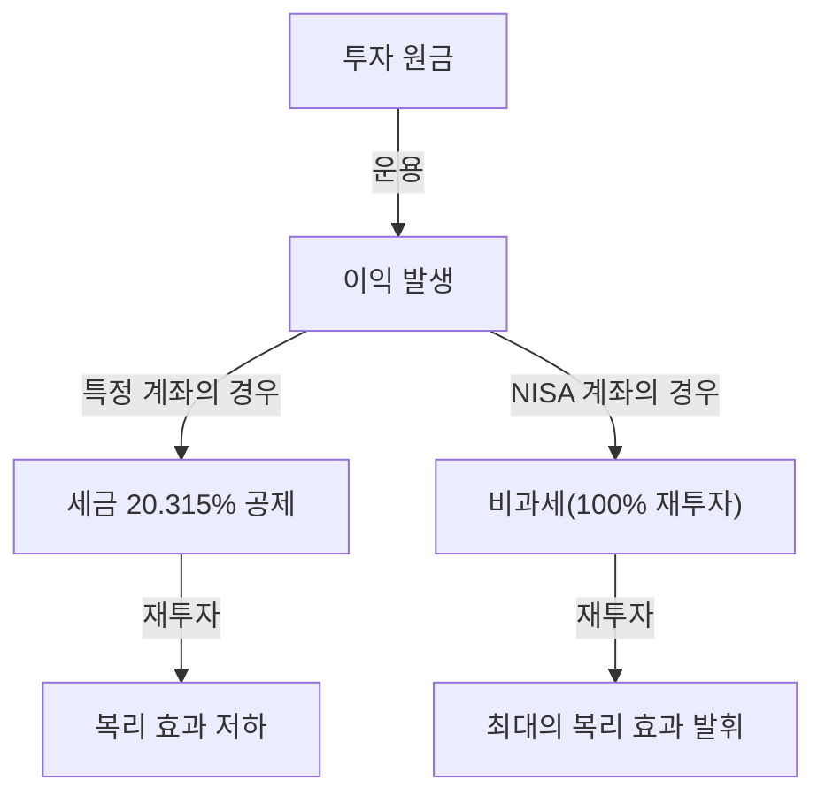

# 도입: 왜 국가는 투자를 비과세로 하는가?

현대 사회에서 개인의 자산 형성은 그 어느 때보다 중요한 과제가 되었습니다. 일본에서는 장기화되는 저금리와 인플레이션 우려, 그리고 저출산 고령화에 따른 연금 제도에 대한 불안감으로 인해 '저축에서 투자로'라는 슬로건이 정부에 의해 강력하게 추진되어 왔습니다. 그 핵심 역할을 담당하는 제도가 'NISA(소액투자 비과세제도)'입니다.

일반적인 투자에서 주식이나 투자신탁의 매각익(자본이득)이나 배당금(소득이득)에는 약 20%(정확히는 20.315%)의 세금이 부과됩니다. 그러나 NISA 계좌를 통해 얻은 이익은 모두 '비과세'가 됩니다. 국가가 자신의 귀중한 세수를 포기하면서까지 이 제도를 추진하는 이유는 국민 한 사람 한 사람에게 자립적인 자산 형성을 촉구하고 미래의 경제적 안정을 개인 수준에서 확보하도록 하기 위해서입니다.

본 기사에서는 이 약 20%의 세금이 면제되는 것의 진정한 의미와 새로운 NISA의 구조, 그리고 복리 효과가 가져오는 압도적인 자산 증대의 메커니즘에 대해 수학적 접근을 곁들여 깊이 파헤쳐 보겠습니다.

---

# 제1장: 일반적인 투자에 부과되는 세금(약 20%)의 장벽

먼저 비과세의 장점을 이해하기 위해 일반적인 과세 계좌(특정 계좌나 일반 계좌)에서 투자를 진행했을 때 어떤 세금이 부과되는지 정리해 봅시다.

투자로 인한 이익은 크게 다음 두 가지로 분류됩니다.

1. **자본이득(양도익)**: 주식이나 투자신탁 등을 샀을 때의 가격보다 비싸게 팔았을 때 얻는 이익.
2. **소득이득(배당금·분배금)**: 주식을 보유함으로써 기업으로부터 지급받는 배당금이나 투자신탁으로부터 정기적으로 지급받는 분배금.

일본의 세제에서는 이러한 이익에 대해 **20.315%(소득세 15.315% + 주민세 5%)** 의 세금이 부과됩니다.

## 구체적인 예: 100만 엔의 이익이 발생한 경우

만약 당신이 투자로 100만 엔의 이익을 냈다고 가정해 봅시다. 일반 계좌라면 다음과 같이 세금이 공제됩니다.

- 이익: 1,000,000엔
- 세금: 1,000,000엔 × 20.315% = 203,150엔
- 실수령액: **796,850엔**

실로 20만 엔 이상이 세금으로 국가에 납부됩니다. 이는 단발성 이익이라면 '어쩔 수 없다'고 넘어갈 수 있겠지만, 장기간에 걸쳐 자산을 재투자해 나갈 경우 이 20%의 세금이 '복리의 힘'을 현저히 약화시키는 원인이 됩니다.

---

# 제2장: 복리 효과의 수학적 메커니즘과 비과세의 위력

아인슈타인이 '인류 최대의 발견'이라고 불렀다고 전해지는 '복리(Compound Interest)'. 복리란 원금에 붙은 이자를 다시 원금에 포함시켜 그 총액에 대해 또 이자가 붙는 구조입니다. 시간이 지날수록 눈덩이처럼 자산이 불어납니다.

## 복리의 계산식

복리에 의한 미래의 자산액 $A$는 다음 수식으로 표현됩니다.

$$ A = P \times (1 + r)^n $$

- $P$: 원금(초기 투자액)
- $r$: 연수익률(리턴)
- $n$: 투자 기간(년)

예를 들어 100만 엔($P$)을 연이율 5%($r=0.05$)로 30년간($n=30$) 운용했을 경우 다음과 같습니다.

$$ A = 1,000,000 \times (1 + 0.05)^{30} \approx 4,321,942 \text{엔} $$

약 4.3배로 자산이 증가합니다. 이것이 복리의 힘입니다.

## 과세가 복리에 미치는 파괴적인 영향

그러나 현실은 그렇게 만만하지 않습니다. 배당금을 재투자할 경우나 도중에 리밸런싱을 할 경우, 이익에 대해 매번 약 20%의 세금이 차감됩니다. 즉 실질적인 수익률이 저하되는 것입니다.

세후 실질 수익률 $r'$는 다음과 같이 계산됩니다.

$$ r' = r \times (1 - 0.20315) $$

연이율 5%의 경우 실질 수익률은 약 3.98%로 떨어집니다.
이 세후 수익률로 30년간 운용했을 경우의 자산액은 다음과 같습니다.

$$ A = 1,000,000 \times (1 + 0.0398)^{30} \approx 3,224,933 \text{엔} $$

**비과세(NISA)의 경우: 약 432만 엔**
**과세 계좌의 경우: 약 322만 엔**

그 차이는 무려 **약 110만 엔**에 달합니다. 장기 투자에 있어 20%의 세금이 면제되는 NISA의 비과세 한도는 단순한 '절세'가 아니라 복리 엔진을 풀가동하기 위한 필수 도구라고 할 수 있습니다.

---

# 제3장: 새로운 NISA의 구조와 특징

2024년에 시작된 '새로운 NISA'는 기존의 NISA(일반 NISA・적립형 NISA)에서 제도가 대폭 확충되어 보다 유연하고 강력한 자산 형성 도구로 진화했습니다. 가장 큰 특징은 '적립 투자 한도'와 '성장 투자 한도'의 병용이 가능해졌다는 점입니다.

## 1. 적립 투자 한도

적립 투자 한도는 장기・적립・분산 투자에 적합한 일정 요건을 충족하는 투자신탁(인덱스 펀드 등)을 대상으로 합니다.

- **연간 투자 한도**: 120만 엔
- **투자 대상**: 금융청이 정한 수수료가 낮고 장기 투자에 적합한 투자신탁
- **장점**: 감정에 휘둘리지 않고 기계적으로 자산을 쌓아갈 수 있다. 초보자에게도 최적.

## 2. 성장 투자 한도

성장 투자 한도는 적립 투자 한도보다 더 폭넓은 상품에 투자할 수 있는 한도입니다.

- **연간 투자 한도**: 240만 엔
- **투자 대상**: 상장 주식(일본 주식・미국 주식 등), ETF, REIT, 다수의 투자신탁
- **장점**: 개별 주식 투자로 높은 수익을 노리거나 고배당 주식 포트폴리오를 구축해 비과세 소득이득을 얻는 등 전략적인 투자가 가능.

## 신 NISA의 주요 개선점

1. **비과세 보유 기간의 무기한화**: 기존의 '5년'이나 '20년'이라는 제한이 철폐되어 평생 비과세로 보유할 수 있게 되었습니다.
2. **연간 투자 한도 확대**: 최대 연간 360만 엔(적립 120만 + 성장 240만)까지 투자 가능하게 됨.
3. **생애 비과세 한도액(1,800만 엔) 도입**: 1인당 최대 1,800만 엔(그 중 성장 투자 한도는 1,200만 엔까지)의 비과세 한도가 부여됩니다.
4. **한도 재사용 가능**: 상품을 매각할 경우 다음 해 이후에 그만큼의 비과세 한도(장부가 기준)가 부활하여 재사용할 수 있게 되었습니다.

---

# 제4장: 적립식 투자(DCA)의 장단점

NISA, 특히 적립 투자 한도에서 권장되는 투자 기법이 '적립식 투자(Dollar Cost Averaging: DCA)'입니다. 이는 정기적으로 일정한 금액으로 같은 투자 상품을 계속 사는 기법입니다.

## 장점

1. **평균 매입 단가의 평준화**:
   가격이 높을 때는 적은 수량을, 가격이 낮을 때는 많은 수량을 구매하게 됩니다. 결과적으로 장기적으로 보면 1좌당 평균 매입 단가를 낮게 억제하는 효과를 기대할 수 있습니다.
2. **감정의 배제**:
   시장 폭락 시에 패닉 셀링을 하거나 폭등 시에 고점에서 물리는 인간의 심리적 약점을 극복할 수 있습니다. '기계적으로 계속 산다'는 규칙이 투자자를 감정적인 실수로부터 지켜줍니다.
3. **시간 분산의 리스크 저감**:
   투자 타이밍을 한 번에 집중시키지 않음으로써 고점에서 일괄 투자해버릴 리스크(고점 매수 리스크)를 줄일 수 있습니다.

## 단점과 주의점

1. **기회 손실(기회 비용의 발생)**:
   우상향하는 시장에서는 처음에 일괄 투자(Lump-Sum Investing)를 하는 편이 투자 기간 전체의 수익률이 높아지는 경향이 있습니다. 현금을 조금씩 투자로 돌리기 때문에 투자되지 않은 현금 부분의 성장 기회를 놓치게 됩니다.
2. **하락장에서의 정신적 부담**:
   수년간 적립을 계속한 후에 대폭락이 일어날 경우 자산 전체의 타격은 커집니다. DCA는 어디까지나 '구매 타이밍의 분산'일 뿐 '자산 클래스의 분산(포트폴리오의 분산)'이 아니라는 점에 주의가 필요합니다.

---

# 결론: NISA를 어떻게 활용해야 하는가

NISA의 비과세 투자 한도는 국가가 마련한 '최강의 자산 형성 도구'입니다. 약 20%의 세금이 면제됨으로써 복리의 힘이 최대한 발휘되어 장기적인 자산의 성장 곡선은 극적으로 상승합니다.

그러나 제도를 활용하는 것만으로는 충분하지 않습니다. 중요한 것은 다음 세 가지입니다.

1. **장기적인 시야를 가질 것**: 시장의 단기적인 변동에 일희일비하지 않고 수십 년 단위의 복리 효과를 믿는 것.
2. **분산 투자를 명심할 것**: 전 세계의 주식에 분산 투자하는 인덱스 펀드 등을 활용하여 리스크를 적절히 통제하는 것.
3. **투자를 계속할 것**: 도중에 그만두지 않고 폭락 시에도 담담하게 적립을 계속하는 규율을 가지는 것.

새로운 NISA의 구조를 깊이 이해하고 이 비과세 한도라는 '특권'을 최대한 활용하여 당신의 미래의 경제적 자유를 구축해 나갑시다.
