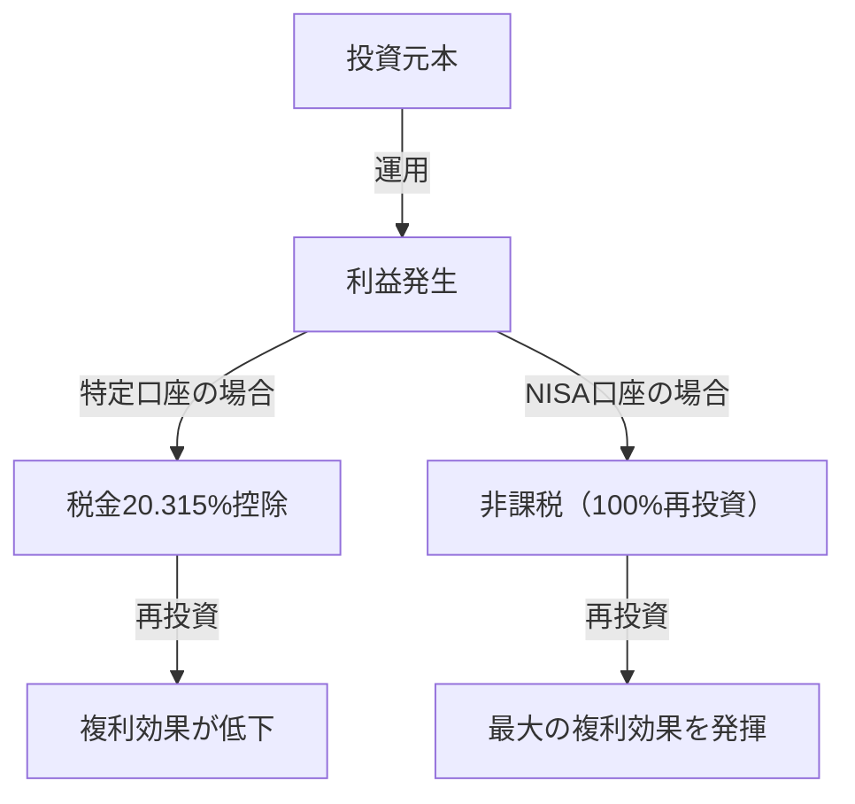

# はじめに：なぜ国は投資を非課税にするのか？

現代社会において、個人の資産形成はかつてないほど重要な課題となっています。日本においては、長引く低金利やインフレーションの懸念、そして少子高齢化に伴う年金制度への不安から、「貯蓄から投資へ」というスローガンが政府によって強力に推し進められてきました。その中核を担う制度が「NISA（少額投資非課税制度）」です。

通常の投資において、株式や投資信託の売却益（キャピタルゲイン）や配当金（インカムゲイン）には、約20%（正確には20.315%）の税金がかかります。しかし、NISA口座を通じて得た利益はすべて「非課税」となります。国が自らの貴重な税収を手放してまでこの制度を推進する理由は、国民一人ひとりに自立的な資産形成を促し、将来の経済的安定を個人レベルで確保してもらうためです。

本記事では、この約20%の税金が免除されることの真の意味と、新しいNISAの構造、そして複利効果がもたらす圧倒的な資産増大のメカニズムについて、数学的アプローチを交えながら深く掘り下げていきます。

---

# 第1章：通常の投資にかかる税金（約20%）の壁

まず、非課税のメリットを理解するために、通常の課税口座（特定口座や一般口座）で投資を行った場合にどのような税金がかかるのかを整理しましょう。

投資による利益は、大きく分けて以下の2つに分類されます。

1. **キャピタルゲイン（譲渡益）**：株式や投資信託などを買った時の価格よりも、高く売った時に得られる利益。
2. **インカムゲイン（配当金・分配金）**：株式を保有していることで企業から支払われる配当金や、投資信託から定期的に支払われる分配金。

日本の税制では、これらの利益に対して **20.315%（所得税15.315% ＋ 住民税5%）** の税金が課せられます。

## 具体例：100万円の利益が出た場合

もしあなたが投資で100万円の利益を出したとします。通常の口座であれば、以下のように税金が差し引かれます。

- 利益：1,000,000円
- 税金：1,000,000円 × 20.315% = 203,150円
- 手取り：**796,850円**

実に20万円以上が税金として国に納められます。これは単発の利益であれば「仕方がない」で済むかもしれませんが、長期にわたって資産を再投資していく場合、この20%の税金が「複利の力」を著しく削ぐ原因となります。

---

# 第2章：複利効果の数学的メカニズムと非課税の威力

アインシュタインが「人類最大の発見」と呼んだとされる「複利（Compound Interest）」。複利とは、元本についた利子を再び元本に組み入れ、その合計額に対してさらに利子がつくという仕組みです。時間が経てば経つほど、雪だるま式に資産が膨れ上がります。

## 複利の計算式

複利による将来の資産額 $A$ は、以下の数式で表されます。

$$ A = P \times (1 + r)^n $$

- $P$：元本（初期投資額）
- $r$：年利回り（リターン）
- $n$：投資期間（年）

例えば、100万円（$P$）を年利5%（$r=0.05$）で30年間（$n=30$）運用した場合、以下のようになります。

$$ A = 1,000,000 \times (1 + 0.05)^{30} \approx 4,321,942 \text{円} $$

約4.3倍に資産が増加します。これが複利の力です。

## 課税が複利に与える破壊的な影響

しかし、現実はそう甘くありません。配当金を再投資する場合や、途中でリバランスを行う場合、利益に対して約20%の税金が毎回引かれます。つまり、実質的な利回りが低下するのです。

税引き後の実質利回り $r'$ は、以下のように計算されます。

$$ r' = r \times (1 - 0.20315) $$

年利5%の場合、実質利回りは約3.98%に低下します。
この税引き後の利回りで30年間運用した場合の資産額は以下のようになります。

$$ A = 1,000,000 \times (1 + 0.0398)^{30} \approx 3,224,933 \text{円} $$

**非課税（NISA）の場合：約432万円**
**課税口座の場合：約322万円**

その差はなんと**約110万円**にも上ります。長期投資において、20%の税金が免除されるNISAの非課税枠は、単なる「節税」ではなく、複利エンジンをフル稼働させるための必須ツールと言えます。

---

# 第3章：新しいNISAの構造と特徴

2024年にスタートした「新しいNISA」は、従来のNISA（一般NISA・つみたてNISA）から大幅に制度が拡充され、より柔軟かつ強力な資産形成ツールへと進化しました。最大の特徴は、「つみたて投資枠」と「成長投資枠」の併用が可能になった点です。

## 1. つみたて投資枠

つみたて投資枠は、長期・積立・分散投資に適した一定の要件を満たす投資信託（インデックスファンドなど）を対象としています。

- **年間投資枠**：120万円
- **投資対象**：金融庁が定めた、手数料が低く長期投資に向く投資信託
- **メリット**：感情に左右されず、機械的に資産を積み上げることができる。初心者にも最適。

## 2. 成長投資枠

成長投資枠は、つみたて投資枠よりも幅広い商品に投資できる枠です。

- **年間投資枠**：240万円
- **投資対象**：上場株式（日本株・米国株など）、ETF、REIT、多くの投資信託
- **メリット**：個別株投資で高いリターンを狙ったり、高配当株ポートフォリオを構築して非課税のインカムゲインを得たりするなど、戦略的な投資が可能。

## 新NISAの主な改良点

1. **非課税保有期間の無期限化**：従来の「5年」や「20年」という制限が撤廃され、一生涯非課税で保有できるようになりました。
2. **年間投資枠の拡大**：最大で年間360万円（つみたて120万＋成長240万）まで投資可能に。
3. **生涯非課税限度額（1,800万円）の導入**：一人あたり最大1,800万円（うち成長投資枠は1,200万円まで）の非課税枠が付与されます。
4. **枠の再利用が可能に**：商品を売却した場合、翌年以降にその分の非課税枠（簿価ベース）が復活し、再利用できるようになりました。

---

# 第4章：ドルコスト平均法（DCA）のメリットとデメリット

NISA、特につみたて投資枠で推奨される投資手法が「ドルコスト平均法（Dollar Cost Averaging: DCA）」です。これは、定期的に一定の金額で同じ投資商品を買い続ける手法です。

## メリット

1. **平均取得単価の平準化**：
   価格が高い時には少ない数量を、価格が低い時には多くの数量を購入することになります。結果として、長期的に見れば1口あたりの平均取得単価を低く抑える効果が期待できます。
2. **感情の排除**：
   相場の暴落時にパニック売りをしたり、暴騰時に高値掴みをしたりする人間の心理的弱点を克服できます。「機械的に買い続ける」というルールが、投資家を感情的なミスから守ります。
3. **時間分散のリスク低減**：
   投資タイミングを一度に集中させないことで、高値で一括投資してしまうリスク（高値掴みリスク）を減らすことができます。

## デメリットと注意点

1. **機会損失（機会費用の発生）**：
   右肩上がりの相場においては、最初に一括投資（Lump-Sum Investing）をした方が、投資期間全体でのリターンが高くなる傾向があります。現金を少しずつ投資に回すため、投資されていない現金部分の成長機会を逃すことになります。
2. **下落相場での精神的負担**：
   何年も積み立てを続けた後に大暴落が起きた場合、資産全体のダメージは大きくなります。DCAはあくまで「購入タイミングの分散」であり、「資産クラスの分散（ポートフォリオの分散）」ではない点に注意が必要です。

---

# 結論：NISAをどう活用すべきか

NISAの非課税投資枠は、国が用意した「最強の資産形成ツール」です。約20%の税金が免除されることで、複利の力が最大限に発揮され、長期的な資産の成長曲線は劇的に上向きます。

しかし、制度を活用するだけでは十分ではありません。重要なのは以下の3点です。

1. **長期的な視点を持つこと**：市場の短期的な変動に一喜一憂せず、数十年単位での複利効果を信じること。
2. **分散投資を心掛けること**：全世界の株式に分散投資するインデックスファンドなどを活用し、リスクを適切にコントロールすること。
3. **投資を続けること**：途中でやめず、暴落時でも淡々と積み立てを継続する規律を持つこと。

新しいNISAの仕組みを深く理解し、この非課税枠という「特権」をフル活用して、あなたの未来の経済的自由を構築していきましょう。
