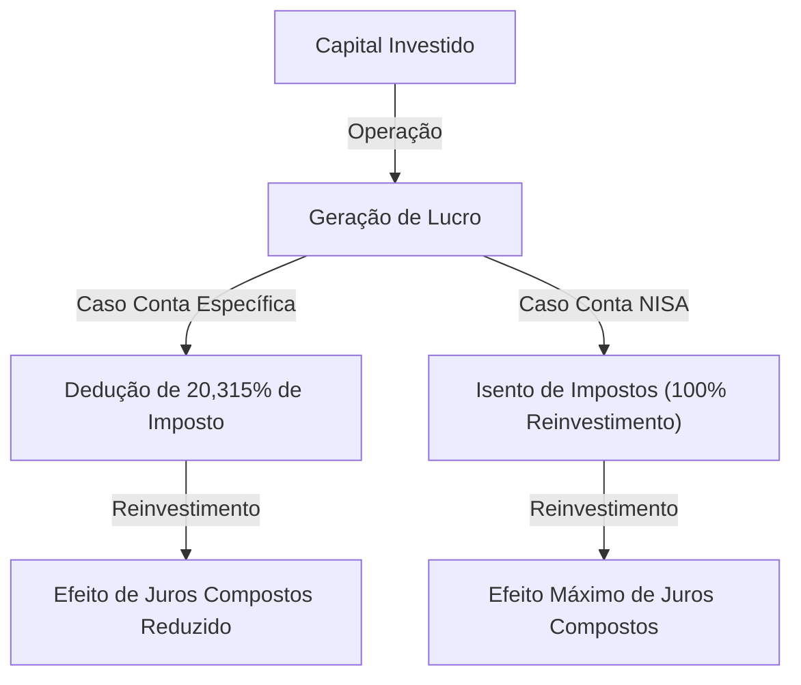

# Introdução: Por que o governo isenta os investimentos de impostos?

Na sociedade moderna, a formação de patrimônio pessoal tornou-se uma questão mais importante do que nunca. No Japão, devido às preocupações com as baixas taxas de juros prolongadas, a inflação e a ansiedade em relação ao sistema de pensões associada ao envelhecimento da população e à baixa taxa de natalidade, o governo tem promovido fortemente o slogan "da poupança para o investimento". O sistema central para isso é o "NISA (Nippon Individual Savings Account - Sistema de Isenção de Impostos para Pequenos Investimentos)".

Em investimentos normais, os ganhos de capital (lucro na venda) e de rendimentos (dividendos) de ações e fundos de investimento são tributados em cerca de 20% (mais precisamente 20,315%). No entanto, todos os lucros obtidos através de uma conta NISA são "isentos de impostos". A razão pela qual o governo promove este sistema, mesmo abrindo mão de suas próprias e valiosas receitas fiscais, é incentivar cada cidadão a formar seu patrimônio de forma autônoma e garantir a estabilidade financeira futura em nível pessoal.

Neste artigo, aprofundaremos o verdadeiro significado da isenção deste imposto de cerca de 20%, a estrutura do novo NISA e o mecanismo de aumento expressivo de patrimônio proporcionado pelo efeito dos juros compostos, utilizando uma abordagem matemática.

---

# Capítulo 1: A barreira dos impostos (cerca de 20%) nos investimentos normais

Primeiramente, para entender os benefícios da isenção fiscal, vamos organizar quais impostos são aplicados quando se investe em uma conta tributável normal (conta específica ou conta geral).

Os lucros provenientes de investimentos são classificados em duas grandes categorias:

1. **Ganhos de capital (lucro de alienação)**: O lucro obtido ao vender ações, fundos de investimento, etc., por um preço superior ao de compra.
2. **Ganhos de rendimentos (dividendos/distribuições)**: Dividendos pagos pelas empresas por se deter ações, ou distribuições pagas regularmente por fundos de investimento.

No sistema tributário japonês, um imposto de **20,315% (15,315% de imposto de renda + 5% de imposto residencial)** é cobrado sobre esses lucros.

## Exemplo prático: Em caso de lucro de 1 milhão de ienes

Suponha que você tenha obtido um lucro de 1 milhão de ienes com investimentos. Em uma conta normal, os impostos seriam deduzidos da seguinte forma:

- Lucro: 1.000.000 ienes
- Impostos: 1.000.000 ienes × 20,315% = 203.150 ienes
- Valor líquido: **796.850 ienes**

Na verdade, mais de 200 mil ienes são pagos ao governo como impostos. Isso pode ser aceitável com um "não há o que fazer" para um lucro único, mas ao reinvestir os ativos a longo prazo, este imposto de 20% torna-se a causa da redução drástica do "poder dos juros compostos".

---

# Capítulo 2: O mecanismo matemático do efeito dos juros compostos e o poder da isenção fiscal

Os "Juros compostos (Compound Interest)" foram supostamente chamados por Einstein de a "maior descoberta da humanidade". Os juros compostos são um mecanismo onde os juros ganhos sobre o capital principal são incorporados novamente ao principal, e os juros continuam a ser aplicados sobre esse valor total. Quanto mais o tempo passa, mais o patrimônio cresce como uma bola de neve.

## Fórmula de cálculo dos juros compostos

O valor futuro do patrimônio $A$ através dos juros compostos é expresso pela seguinte fórmula matemática.

$$ A = P \times (1 + r)^n $$

- $P$: Principal (valor inicial do investimento)
- $r$: Taxa de retorno anual (rendimento)
- $n$: Período de investimento (anos)

Por exemplo, ao investir 1 milhão de ienes ($P$) com um rendimento anual de 5% ($r=0.05$) durante 30 anos ($n=30$), teríamos o seguinte:

$$ A = 1.000.000 \times (1 + 0.05)^{30} \approx 4.321.942 \text{ ienes} $$

Os ativos aumentam cerca de 4,3 vezes. Este é o poder dos juros compostos.

## O impacto destrutivo da tributação sobre os juros compostos

No entanto, a realidade não é tão doce. Ao reinvestir dividendos ou realizar rebalanceamentos no meio do caminho, cerca de 20% de impostos são deduzidos dos lucros a cada vez. Ou seja, o rendimento real diminui.

O rendimento real após os impostos $r'$ é calculado da seguinte forma:

$$ r' = r \times (1 - 0.20315) $$

Com uma taxa anual de 5%, o rendimento real cai para cerca de 3,98%.
O valor do patrimônio ao investir com este rendimento após impostos durante 30 anos será o seguinte:

$$ A = 1.000.000 \times (1 + 0.0398)^{30} \approx 3.224.933 \text{ ienes} $$

**No caso de isenção fiscal (NISA): cerca de 4,32 milhões de ienes**
**No caso de conta tributável: cerca de 3,22 milhões de ienes**

A diferença chega à impressionante marca de **cerca de 1,1 milhão de ienes**. Em investimentos de longo prazo, a cota de isenção fiscal do NISA, que isenta o imposto de 20%, não é apenas uma "economia de impostos", mas sim uma ferramenta essencial para colocar o motor dos juros compostos em potência máxima.

---

# Capítulo 3: A estrutura e características do novo NISA

O "novo NISA" iniciado em 2024 é uma expansão significativa do sistema NISA tradicional (NISA geral / NISA de acumulação), evoluindo para uma ferramenta de formação de patrimônio mais flexível e poderosa. A maior característica é a possibilidade de uso conjunto da "Cota de Investimento de Acumulação" e da "Cota de Investimento de Crescimento".

## 1. Cota de Investimento de Acumulação

A Cota de Investimento de Acumulação destina-se a fundos de investimento (como fundos de índice) que atendem a certos requisitos adequados para investimentos de longo prazo, de acumulação e diversificados.

- **Cota de investimento anual**: 1,2 milhão de ienes
- **Alvos de investimento**: Fundos de investimento determinados pela Agência de Serviços Financeiros, com baixas taxas e adequados para investimentos de longo prazo
- **Vantagens**: Permite acumular ativos de forma mecânica, sem se deixar influenciar pelas emoções. Ideal também para iniciantes.

## 2. Cota de Investimento de Crescimento

A Cota de Investimento de Crescimento é uma cota que permite investir em uma gama mais ampla de produtos do que a Cota de Investimento de Acumulação.

- **Cota de investimento anual**: 2,4 milhões de ienes
- **Alvos de investimento**: Ações listadas (ações japonesas, ações dos EUA, etc.), ETFs, REITs, e muitos fundos de investimento
- **Vantagens**: Permite investimentos estratégicos, como buscar altos retornos investindo em ações individuais ou construir um portfólio de ações com altos dividendos para obter ganhos de rendimentos isentos de impostos.

## Principais melhorias do Novo NISA

1. **Período de posse isento de impostos por tempo indeterminado**: As restrições anteriores de "5 anos" e "20 anos" foram abolidas, permitindo a posse com isenção de impostos por toda a vida.
2. **Expansão da cota de investimento anual**: É possível investir até 3,6 milhões de ienes por ano (1,2 milhão de acumulação + 2,4 milhões de crescimento).
3. **Introdução de um limite de isenção fiscal vitalício (18 milhões de ienes)**: Cada indivíduo recebe uma cota de isenção fiscal de até 18 milhões de ienes (dos quais a cota de investimento de crescimento é de até 12 milhões de ienes).
4. **Possibilidade de reutilização da cota**: Ao vender um produto, a cota de isenção de impostos correspondente (com base no valor contábil) é restaurada a partir do ano seguinte, podendo ser reutilizada.

---

# Capítulo 4: Vantagens e desvantagens do Método do Preço Médio (DCA)

Um método de investimento recomendado para o NISA, especialmente na Cota de Investimento de Acumulação, é o "Método do Preço Médio" (Dollar Cost Averaging: DCA). Este é um método em que você continua comprando o mesmo produto de investimento com um valor fixo em intervalos regulares.

## Vantagens

1. **Nivelamento do preço médio de aquisição**:
   Isso significa que você comprará uma quantidade menor quando os preços estiverem altos e uma quantidade maior quando os preços estiverem baixos. Como resultado, a longo prazo, espera-se que mantenha baixo o preço médio de aquisição por cota.
2. **Eliminação das emoções**:
   Permite superar as fraquezas psicológicas humanas, como a venda por pânico durante as quedas do mercado ou a compra na alta durante as altas. A regra de "continuar comprando mecanicamente" protege os investidores de erros emocionais.
3. **Redução do risco através da diversificação do tempo**:
   Ao não concentrar o momento do investimento de uma só vez, você pode reduzir o risco de investir um montante total com preços altos (risco de comprar na alta).

## Desvantagens e pontos de atenção

1. **Custo de oportunidade (geração de custos de oportunidade)**:
   Em um mercado em tendência de alta, um investimento único (Lump-Sum Investing) no início tende a ter um retorno maior durante todo o período de investimento. Como o dinheiro é gradualmente direcionado para o investimento, perdem-se oportunidades de crescimento para a parte do dinheiro que ainda não foi investida.
2. **Carga mental em um mercado em queda**:
   Se ocorrer uma grande queda após continuar acumulando por muitos anos, os danos aos ativos como um todo serão grandes. É necessário notar que o DCA é apenas uma "diversificação do momento de compra" e não uma "diversificação de classes de ativos (diversificação de portfólio)".

---

# Conclusão: Como utilizar o NISA

A cota de investimento isenta de impostos do NISA é a "ferramenta definitiva de formação de patrimônio" fornecida pelo governo. Com a isenção de cerca de 20% de impostos, o poder dos juros compostos é maximizado, e a curva de crescimento dos ativos a longo prazo sobe drasticamente.

No entanto, apenas utilizar o sistema não é suficiente. O que é importante são os três pontos a seguir:

1. **Ter uma perspectiva de longo prazo**: Não se deixar levar pelas flutuações de curto prazo do mercado, mas acreditar no efeito dos juros compostos ao longo de décadas.
2. **Focar na diversificação dos investimentos**: Utilizar fundos de índice que investem de forma diversificada em ações ao redor do mundo, controlando o risco adequadamente.
3. **Continuar investindo**: Ter a disciplina de não desistir no meio do caminho e continuar acumulando calmamente mesmo durante quedas do mercado.

Entenda profundamente o mecanismo do novo NISA e utilize totalmente o "privilégio" desta cota de isenção de impostos para construir o seu futuro de liberdade financeira.
