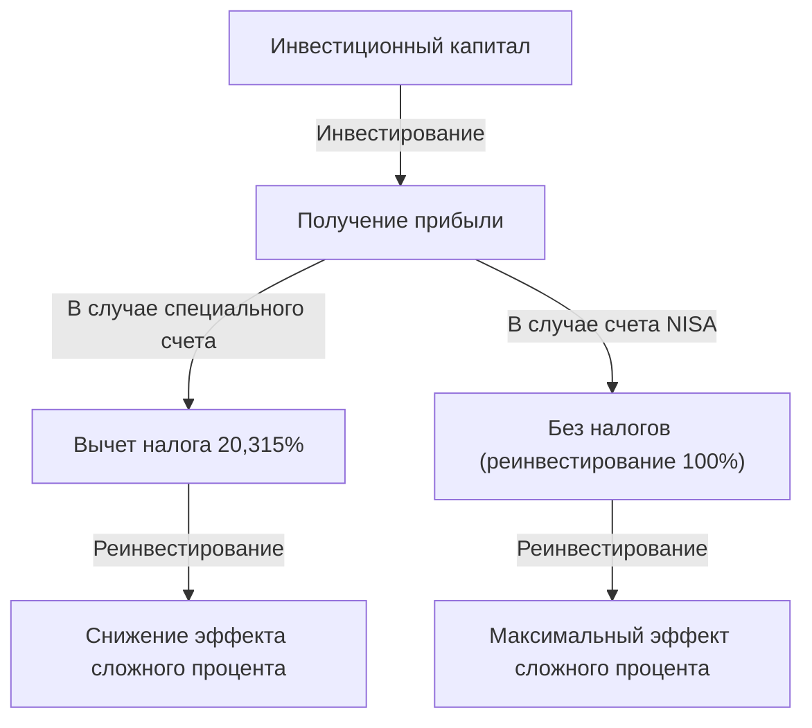

# Введение: Почему государство освобождает инвестиции от налогов?

В современном обществе формирование личного капитала является как никогда важной задачей. В Японии правительство активно продвигает лозунг "От сбережений к инвестициям" из-за затянувшихся низких процентных ставок, опасений инфляции и беспокойства по поводу пенсионной системы на фоне старения населения и снижения рождаемости. Центральным элементом этой системы является "NISA (Nippon Individual Savings Account - необлагаемая налогом система для небольших инвестиций)".

При обычных инвестициях прирост капитала (от продажи акций или инвестиционных фондов) и доход от дивидендов облагаются налогом в размере около 20% (точнее, 20,315%). Однако вся прибыль, полученная через счет NISA, "не облагается налогом". Причина, по которой государство продвигает эту систему, даже отказываясь от ценных налоговых поступлений, заключается в том, чтобы побудить каждого гражданина к самостоятельному формированию капитала и обеспечить финансовую стабильность в будущем на индивидуальном уровне.

В этой статье мы подробно рассмотрим истинный смысл освобождения от этого налога в размере около 20%, структуру новой NISA и механизм колоссального увеличения активов, который приносит эффект сложного процента, используя математический подход.

---

# Глава 1: Барьер обычного налога на инвестиции (около 20%)

Прежде всего, чтобы понять преимущества освобождения от налогов, давайте разберемся, какие налоги взимаются при инвестировании через обычный налогооблагаемый счет (специальный или общий счет).

Прибыль от инвестиций в целом делится на две следующие категории:

1. **Прирост капитала (доход от передачи имущества)**: Прибыль, получаемая при продаже акций, инвестиционных фондов и т.д. по цене, превышающей цену покупки.
2. **Доходный прирост (дивиденды и распределяемая прибыль)**: Дивиденды, выплачиваемые компаниями за владение акциями, и регулярно выплачиваемая распределяемая прибыль от инвестиционных фондов.

Согласно японской налоговой системе, эта прибыль облагается налогом по ставке **20,315% (подоходный налог 15,315% + местный налог 5%)**.

## Конкретный пример: В случае получения прибыли в 1 миллион иен

Предположим, вы получили прибыль от инвестиций в размере 1 миллиона иен. На обычном счете налог будет вычтен следующим образом:

- Прибыль: 1 000 000 иен
- Налог: 1 000 000 иен × 20,315% = 203 150 иен
- Чистый доход: **796 850 иен**

Более 200 тысяч иен уходит государству в виде налогов. Если это разовая прибыль, можно сказать "ничего не поделаешь", но если вы реинвестируете активы в течение длительного периода времени, этот 20-процентный налог становится причиной значительного ослабления "силы сложного процента".

---

# Глава 2: Математический механизм эффекта сложного процента и сила освобождения от налогов

"Сложный процент (Compound Interest)", который Эйнштейн якобы назвал "величайшим открытием человечества". Сложный процент — это механизм, при котором проценты, начисленные на основную сумму, снова добавляются к ней, и на эту общую сумму начисляются новые проценты. Чем больше проходит времени, тем больше активы растут как снежный ком.

## Формула сложного процента

Будущая сумма активов $A$ благодаря сложному проценту выражается следующей математической формулой:

$$ A = P \times (1 + r)^n $$

- $P$: Основная сумма (начальная сумма инвестиций)
- $r$: Годовая доходность
- $n$: Период инвестирования (в годах)

Например, если инвестировать 1 миллион иен ($P$) под 5% годовых ($r=0.05$) на 30 лет ($n=30$), получится следующее:

$$ A = 1 000 000 \times (1 + 0.05)^{30} \approx 4 321 942 \text{ иен} $$

Активы увеличиваются примерно в 4,3 раза. В этом и заключается сила сложного процента.

## Разрушительное влияние налогообложения на сложный процент

Однако реальность не так проста. При реинвестировании дивидендов или ребалансировке портфеля с прибыли каждый раз удерживается налог в размере около 20%. То есть фактическая доходность снижается.

Фактическая доходность после уплаты налогов $r'$ рассчитывается следующим образом:

$$ r' = r \times (1 - 0.20315) $$

При доходности 5% годовых фактическая доходность снижается примерно до 3,98%.
Сумма активов при инвестировании с этой доходностью после уплаты налогов в течение 30 лет будет следующей:

$$ A = 1 000 000 \times (1 + 0.0398)^{30} \approx 3 224 933 \text{ иен} $$

**В случае освобождения от налогов (NISA): около 4,32 млн иен**
**В случае налогооблагаемого счета: около 3,22 млн иен**

Разница составляет целых **около 1,1 миллиона иен**. При долгосрочном инвестировании не облагаемый налогом лимит NISA, который освобождает от 20% налога, — это не просто "экономия на налогах", а важнейший инструмент для запуска двигателя сложного процента на полную мощность.

---

# Глава 3: Структура и особенности новой NISA

"Новая NISA", стартовавшая в 2024 году, была значительно расширена по сравнению с предыдущей NISA (обычная NISA и накопительная NISA), превратившись в более гибкий и мощный инструмент для формирования капитала. Главной особенностью является возможность одновременного использования "Накопительного инвестиционного лимита" и "Лимита инвестиций роста".

## 1. Накопительный инвестиционный лимит

Этот лимит предназначен для инвестиционных фондов (таких как индексные фонды), которые соответствуют определенным требованиям и подходят для долгосрочных, регулярных и диверсифицированных инвестиций.

- **Годовой инвестиционный лимит**: 1,2 миллиона иен
- **Объекты инвестирования**: Инвестиционные фонды, определенные Агентством финансовых услуг, с низкими комиссиями и подходящие для долгосрочных инвестиций.
- **Преимущества**: Позволяет механически накапливать активы, не поддаваясь эмоциям. Идеально подходит для новичков.

## 2. Лимит инвестиций роста

Этот лимит позволяет инвестировать в более широкий спектр продуктов, чем накопительный инвестиционный лимит.

- **Годовой инвестиционный лимит**: 2,4 миллиона иен
- **Объекты инвестирования**: Котируемые акции (японские, американские и т.д.), ETF, REIT, большинство инвестиционных фондов.
- **Преимущества**: Возможность стратегического инвестирования, например, стремление к высокой доходности за счет инвестиций в отдельные акции или создание портфеля акций с высокими дивидендами для получения не облагаемого налогом дохода.

## Основные улучшения новой NISA

1. **Бессрочный период безналогового владения**: Прежние ограничения в "5 лет" или "20 лет" были отменены, и теперь активами можно владеть без налогов всю жизнь.
2. **Увеличение годового инвестиционного лимита**: Теперь можно инвестировать до 3,6 млн иен в год (1,2 млн на накопительный + 2,4 млн на рост).
3. **Введение пожизненного безналогового лимита (18 млн иен)**: На каждого человека предоставляется не облагаемый налогом лимит в размере до 18 миллионов иен (из которых до 12 миллионов иен можно использовать в рамках лимита инвестиций роста).
4. **Возможность повторного использования лимита**: Если вы продаете продукты, освобожденный от налогов лимит на эту сумму (на основе балансовой стоимости) восстанавливается со следующего года и может быть использован повторно.

---

# Глава 4: Преимущества и недостатки метода усреднения долларовой стоимости (DCA)

Метод инвестирования, рекомендуемый для NISA, особенно для накопительного инвестиционного лимита, — это "Метод усреднения долларовой стоимости (Dollar Cost Averaging: DCA)". Это метод регулярной покупки одних и тех же инвестиционных продуктов на фиксированную сумму.

## Преимущества

1. **Усреднение средней цены покупки**:
   Когда цены высоки, вы покупаете меньшее количество, а когда цены низкие — большее количество. В результате в долгосрочной перспективе можно ожидать эффекта снижения средней цены покупки за единицу.
2. **Исключение эмоций**:
   Позволяет преодолеть психологические слабости человека, такие как панические продажи во время обвала рынка или покупка на пике во время резкого роста. Правило "механически продолжать покупать" защищает инвесторов от эмоциональных ошибок.
3. **Снижение риска за счет диверсификации во времени**:
   Избегая концентрации времени инвестирования, можно снизить риск единовременного вложения всех средств по высокой цене (риск покупки на пике).

## Недостатки и предостережения

1. **Упущенная выгода (возникновение альтернативных издержек)**:
   На растущем рынке единовременное инвестирование (Lump-Sum Investing) в самом начале обычно приносит более высокую общую доходность за весь период. Поскольку наличные инвестируются постепенно, вы теряете возможности для роста той части средств, которая еще не инвестирована.
2. **Психологическая нагрузка на падающем рынке**:
   Если после многих лет накоплений произойдет масштабный обвал, общий ущерб для активов будет значительным. Важно отметить, что DCA — это лишь "диверсификация времени покупки", а не "диверсификация классов активов (диверсификация портфеля)".

---

# Заключение: Как следует использовать NISA

Не облагаемый налогом инвестиционный лимит NISA — это "мощнейший инструмент для формирования капитала", предоставленный государством. Благодаря освобождению от налога в размере около 20% сила сложного процента проявляется в полной мере, а кривая долгосрочного роста активов резко идет вверх.

Однако простого использования этой системы недостаточно. Важны следующие три момента:

1. **Иметь долгосрочную перспективу**: Не поддаваться эмоциям из-за краткосрочных колебаний рынка и верить в эффект сложного процента в масштабе десятилетий.
2. **Стремиться к диверсификации инвестиций**: Использовать индексные фонды, которые инвестируют в акции по всему миру, для надлежащего контроля рисков.
3. **Продолжать инвестировать**: Иметь дисциплину, чтобы не останавливаться на полпути и продолжать регулярные инвестиции даже во время обвалов.

Глубоко поняв механизм новой NISA и в полной мере используя эту "привилегию" не облагаемого налогом лимита, давайте строить свою будущую финансовую свободу.
