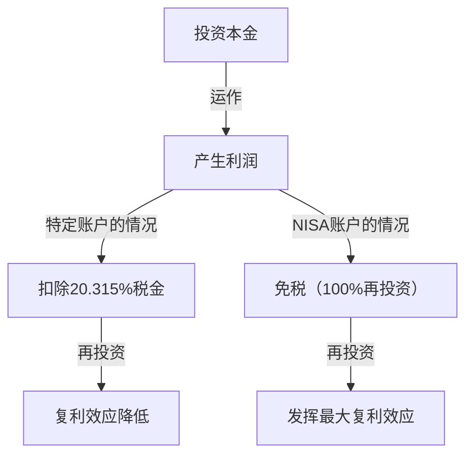

# 前言：为什么国家要对投资免税？

在现代社会，个人资产积累已成为前所未有的重要课题。在日本，由于长期的低利率、对通货膨胀的担忧，以及伴随少子老龄化而来的对养老金制度的不安，政府大力推行了“从储蓄走向投资”的口号。其核心制度就是“NISA（小额投资免税制度）”。

在常规投资中，股票或投资信托的资本利得（买卖差价利润）和股息收益（分红利润）通常需要缴纳约20%（准确地说是20.315%）的税金。然而，通过NISA账户获得的利润全额“免税”。国家甚至不惜放弃自身宝贵的税收也要推进这一制度，原因是希望促使每位国民进行自主的资产积累，以在个人层面上确保未来的经济稳定。

本文将结合数学方法，深入探讨免除这约20%税金的真正意义、新NISA的结构，以及复利效应带来的压倒性资产增长机制。

---

# 第1章：常规投资面临的税金（约20%）壁垒

首先，为了理解免税的优势，我们先来整理一下在常规的纳税账户（特定账户或一般账户）中进行投资时会产生怎样的税金。

投资带来的利润，大致可以分为以下两类。

1. **资本利得（转让收益）**：以高于购买股票或投资信托等时的价格卖出所获得的利润。
2. **股息收益（分红・分配金）**：因持有股票而从企业获得的分红，或从投资信托中定期获得的分配金。

在日本的税制下，这些利润将被征收 **20.315%（所得税15.315% ＋ 居民税5%）** 的税金。

## 具体案例：产生100万日元利润的情况

假设你在投资中获得了100万日元的利润。如果是常规账户，税金将被如下扣除。

- 利润：1,000,000日元
- 税金：1,000,000日元 × 20.315% = 203,150日元
- 净收入：**796,850日元**

实际上有超过20万日元作为税金上交给了国家。如果是单次利润，或许还能用“没办法”来宽慰自己，但在长期进行资产再投资的情况下，这20%的税金会成为显著削弱“复利力量”的原因。

---

# 第2章：复利效应的数学机制与免税的威力

爱因斯坦曾称之为“人类最大发现”的“复利（Compound Interest）”。所谓复利，就是将本金产生的利息重新计入本金，并以该总额为基础继续产生利息的机制。随着时间的推移，资产会像滚雪球一样不断膨胀。

## 复利的计算公式

复利产生的未来资产额 $A$，由以下数学公式表示。

$$ A = P \times (1 + r)^n $$

- $P$：本金（初期投资额）
- $r$：年化收益率（回报）
- $n$：投资期间（年）

例如，如果将100万日元（$P$）以5%的年化收益率（$r=0.05$）运作30年（$n=30$），结果如下。

$$ A = 1,000,000 \times (1 + 0.05)^{30} \approx 4,321,942 \text{日元} $$

资产增加了约4.3倍。这就是复利的力量。

## 征税对复利造成的破坏性影响

然而，现实并没有那么美好。在对分红进行再投资，或在途中进行资产再平衡时，每次都会从利润中扣除约20%的税金。也就是说，实际收益率会下降。

税后的实际收益率 $r'$ 计算如下。

$$ r' = r \times (1 - 0.20315) $$

在年化收益率为5%的情况下，实际收益率将下降至约3.98%。
如果以这个税后收益率运作30年，资产额将如下所示。

$$ A = 1,000,000 \times (1 + 0.0398)^{30} \approx 3,224,933 \text{日元} $$

**免税（NISA）的情况：约432万日元**
**纳税账户的情况：约322万日元**

两者的差距竟然高达**约110万日元**。在长期投资中，免除20%税金的NISA免税额度不仅仅是“节税”，可以说是让复利引擎全功率运转的必备工具。

---

# 第3章：新NISA的结构与特点

2024年启动的“新NISA”，在以往的NISA（一般NISA・定投NISA）基础上进行了大幅的制度扩充，进化成为了更灵活且强大的资产积累工具。其最大的特点是，“定投投资额度”和“成长投资额度”可以并用。

## 1. 定投投资额度

定投投资额度是以符合长期、定期定额、分散投资等特定要求的投资信托（如指数基金等）为对象。

- **年度投资额度**：120万日元
- **投资对象**：金融厅规定的、手续费低且适合长期投资的投资信托
- **优势**：不受情绪影响，能够机械化地积累资产。非常适合初学者。

## 2. 成长投资额度

成长投资额度是比定投投资额度可以投资更广泛商品的额度。

- **年度投资额度**：240万日元
- **投资对象**：上市股票（日本股票・美国股票等）、ETF、REIT、以及许多投资信托
- **优势**：可以通过投资个股追求高回报，或者构建高股息股票投资组合以获得免税的股息收益等，实现更具策略性的投资。

## 新NISA的主要改进点

1. **免税持有期限无期限化**：取消了以往“5年”或“20年”的限制，可以终身免税持有。
2. **年度投资额度扩大**：每年最多可投资360万日元（定投120万＋成长240万）。
3. **引入终身免税限额（1,800万日元）**：每人最高被赋予1,800万日元（其中成长投资额度最多为1,200万日元）的免税额度。
4. **额度可再利用**：如果卖出商品，第二年及以后该部分的免税额度（基于账面价值）将恢复，变得可以再次利用。

---

# 第4章：定投平均法（DCA）的优缺点

在NISA，特别是定投投资额度中被推荐的投资手法是“定投平均法（Dollar Cost Averaging: DCA）”。这是一种定期以固定金额持续购买相同投资商品的手法。

## 优点

1. **平均购买单价平摊化**：
   在价格较高时购买较少的数量，而在价格较低时购买较多的数量。结果是，从长期来看，可以期待达到压低每份平均购买单价的效果。
2. **排除情绪干扰**：
   能够克服在市场暴跌时恐慌性抛售，或在暴涨时高位接盘的人类心理弱点。“机械性地持续买入”这一规则，可以保护投资者免受情绪化错误的影响。
3. **时间分散带来的风险降低**：
   通过不将投资时机集中在一次，可以减少在高位一次性全额投资的风险（高位接盘风险）。

## 缺点与注意事项

1. **机会损失（产生机会成本）**：
   在整体呈现上升趋势的市场中，起初进行一次性投资（Lump-Sum Investing）往往能在整个投资期内获得更高的回报。因为是将现金一点一点地投入投资，所以会错失未被投资现金部分的增长机会。
2. **下跌市场中的精神负担**：
   如果在持续定投多年后发生大暴跌，整体资产受到的打击会很大。需要注意的是，DCA终究只是“购买时机的分散”，而不是“资产类别的分散（投资组合的分散）”。

---

# 结论：应该如何活用NISA

NISA的免税投资额度是国家准备的“最强资产积累工具”。通过免除约20%的税金，复利的力量能够得到最大程度的发挥，长期的资产增长曲线也将急剧上扬。

然而，仅仅利用这项制度是不够的。以下3点至关重要。

1. **保持长期视角**：不要因为市场的短期波动而患得患失，要相信以数十年为单位的复利效应。
2. **留心分散投资**：利用分散投资于全世界股票的指数基金等，适当地控制风险。
3. **持续投资**：不要半途而废，拥有即使在暴跌时也能淡定持续定投的纪律。

深入理解新NISA的机制，充分活用这项免税额度“特权”，去构建你未来的财务自由吧。
