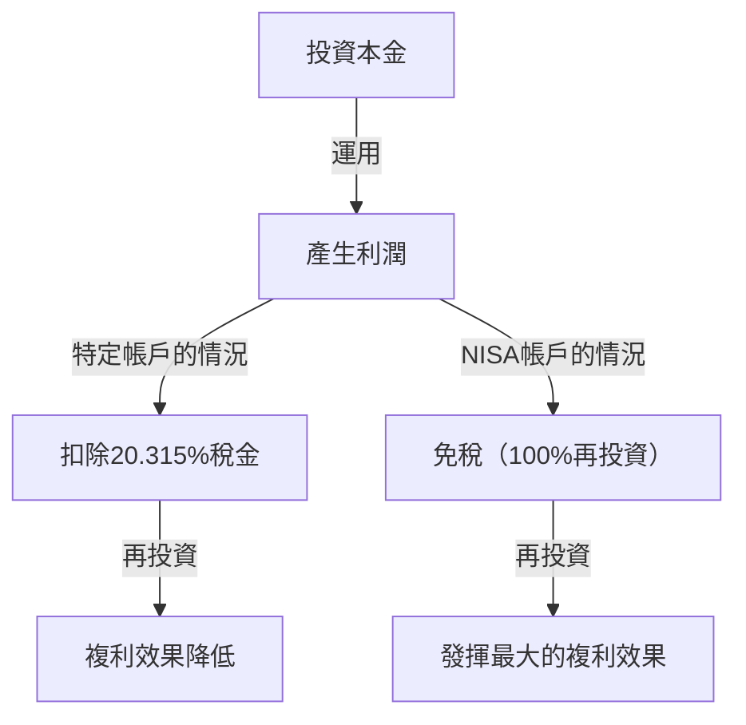

# 前言：為什麼國家要讓投資免稅？

在現代社會中，個人的資產建立已經成為前所未有的重要課題。在日本，由於長期的低利率、對通貨膨脹的擔憂，以及伴隨少子高齡化而來的對年金制度的不安，政府強力推行「從儲蓄到投資」的口號。而擔綱此政策核心的制度便是「NISA（小額投資免稅制度）」。

在一般的投資中，股票或投資信託的資本利得（出售利潤）和收益利得（股息），會被徵收約20%（準確來說是20.315%）的稅金。然而，透過NISA帳戶獲得的利潤將全部「免稅」。國家甚至不惜放棄珍貴的稅收來推動這項制度，其原因在於鼓勵每位國民進行自主性的資產建立，讓個人層面能夠確保未來的經濟穩定。

本文將結合數學方法，深入探討免除這約20%稅金的真正意義、新NISA的結構，以及複利效果帶來壓倒性資產增長的機制。

---

# 第1章：一般投資中約20%稅金的壁壘

首先，為了理解免稅的優勢，我們來整理一下，如果在使用一般課稅帳戶（特定帳戶或一般帳戶）進行投資時，會被徵收什麼樣的稅金。

投資帶來的利潤，大致可以分為以下兩種：

1. **資本利得（轉讓收益）**：以高於購買時的價格賣出股票或投資信託等所獲得的利潤。
2. **收益利得（股息、分配金）**：因持有股票而由企業支付的股息，或由投資信託定期支付的分配金。

在日本的稅制中，這些利潤會被課徵 **20.315%（所得稅15.315% ＋ 住民稅5%）** 的稅金。

## 具體範例：產生了100萬日圓利潤的情況

假設您在投資中獲得了100萬日圓的利潤。如果是一般的帳戶，稅金將會如下扣除：

- 利潤：1,000,000日圓
- 稅金：1,000,000日圓 × 20.315% = 203,150日圓
- 實拿：**796,850日圓**

實際上，有20萬日圓以上會作為稅金繳納給國家。如果是單次的利潤，或許還能用「無可奈何」來帶過，但如果是在長期中將資產進行再投資，這20%的稅金將成為顯著削弱「複利力量」的原因。

---

# 第2章：複利效果的數學機制與免稅的威力

被愛因斯坦稱為「人類最大發現」的「複利（Compound Interest）」。所謂複利，是將本金產生的利息再次併入本金，並針對其總額進一步產生利息的機制。隨著時間的推移，資產會像滾雪球般膨脹。

## 複利的計算公式

透過複利所產生的未來資產額 $A$，可以用以下數學公式表示：

$$ A = P \times (1 + r)^n $$

- $P$：本金（初期投資額）
- $r$：年報酬率（回報）
- $n$：投資期間（年）

例如，將100萬日圓（$P$）以年利率5%（$r=0.05$）運用30年（$n=30$）的情況下，結果如下：

$$ A = 1,000,000 \times (1 + 0.05)^{30} \approx 4,321,942 \text{日圓} $$

資產增加了約4.3倍。這就是複利的力量。

## 課稅對複利造成的破壞性影響

然而，現實並沒有那麼簡單。當您將股息再投資，或是中途進行投資組合再平衡時，每次都會從利潤中被扣除約20%的稅金。也就是說，實質的回報率會下降。

稅後的實質報酬率 $r'$，計算如下：

$$ r' = r \times (1 - 0.20315) $$

在年利率5%的情況下，實質報酬率會降至約3.98%。
以這個稅後報酬率運用30年，其資產額將如下所示：

$$ A = 1,000,000 \times (1 + 0.0398)^{30} \approx 3,224,933 \text{日圓} $$

**免稅（NISA）的情況：約432萬日圓**
**課稅帳戶的情況：約322萬日圓**

兩者的差距竟然高達**約110萬日圓**。在長期投資中，免除20%稅金的NISA免稅額度，不能僅僅說是「節稅」，更可以說是讓複利引擎全速運轉的必備工具。

---

# 第3章：新NISA的結構與特徵

於2024年啟動的「新NISA」，較傳統的NISA（一般NISA、積立NISA）在制度上大幅擴充，進化為更具彈性且強大的資產建立工具。最大的特徵在於可以同時併用「積立投資額度」與「成長投資額度」。

## 1. 積立投資額度

積立投資額度是以符合一定條件、適合長期・定期定額・分散投資的投資信託（如指數型基金等）為對象。

- **年度投資額度**：120萬日圓
- **投資對象**：由金融廳規定，手續費低且適合長期投資的投資信託
- **優勢**：不受情緒影響，可以機械式地累積資產。也非常適合初學者。

## 2. 成長投資額度

成長投資額度是比積立投資額度能投資更廣泛商品的額度。

- **年度投資額度**：240萬日圓
- **投資對象**：上市股票（日本股、美國股等）、ETF、REIT，以及許多投資信託
- **優勢**：可以進行戰略性投資，例如透過個別股票投資追求高回報，或是建立高股息股票的投資組合以獲取免稅的收益利得。

## 新NISA的主要改良點

1. **免稅持有期間無限期化**：廢除了以往「5年」或「20年」的限制，現在可以終生免稅持有。
2. **年度投資額度擴大**：每年最多可投資360萬日圓（積立120萬＋成長240萬）。
3. **終生免稅限額（1,800萬日圓）的導入**：每人將獲得最高1,800萬日圓（其中成長投資額度最高1,200萬日圓）的免稅額度。
4. **額度可再利用**：當出售商品時，隔年以後該部分的免稅額度（以帳面價值為準）將會恢復並可再次使用。

---

# 第4章：定期定額投資法（DCA）的優勢與劣勢

在NISA中，特別是在積立投資額度中被推薦的投資手法是「定期定額投資法（Dollar Cost Averaging: DCA）」。這是一種定期以固定金額持續購買相同投資商品的手法。

## 優勢

1. **平均取得單價的平準化**：
   在價格高時會購買較少的數量，而在價格低時會購買較多的數量。結果就是，從長期來看，可以期待將每單位的平均取得單價壓低的效果。
2. **排除情緒**：
   可以克服人類的心理弱點，例如在市場暴跌時恐慌拋售，或在暴漲時高點買入。「機械式持續購買」的規則，能保護投資者免於情緒化的錯誤。
3. **時間分散的風險降低**：
   藉由不將投資時機集中在一次，可以減少在高點一次性投資的風險（套牢風險）。

## 劣勢與注意事項

1. **機會損失（機會成本的產生）**：
   在持續上漲的市場中，一開始就進行單筆投資（Lump-Sum Investing）通常在整個投資期間內會有較高的回報。由於是將現金一點一點地投入，因此會錯失未投資現金部分的增長機會。
2. **下跌市場中的精神負擔**：
   如果在持續定額投資多年後發生大暴跌，整體資產受到的打擊會很大。必須注意的是，DCA終究只是「購買時機的分散」，而不是「資產類別的分散（投資組合的分散）」。

---

# 結論：該如何活用NISA

NISA的免稅投資額度，是國家準備的「最強資產建立工具」。透過免除約20%的稅金，複利的力量能發揮到最大，長期的資產增長曲線將會戲劇性地向上攀升。

然而，僅僅活用制度是不夠的。以下三點才是關鍵：

1. **具備長遠的眼光**：不要因為市場的短期波動而患得患失，要相信以數十年為單位的複利效果。
2. **用心進行分散投資**：活用分散投資於全世界股票的指數型基金等，適當地控制風險。
3. **持續投資**：具備紀律，不半途而廢，即使在暴跌時也能淡定地持續定額投資。

深入理解新NISA的機制，並充分活用這項免稅額度的「特權」，來建立您未來的財務自由吧。
