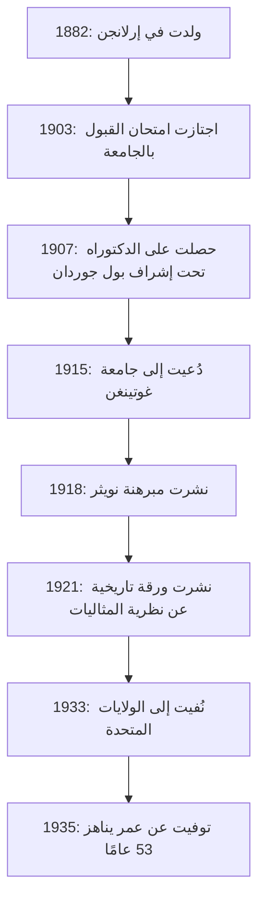
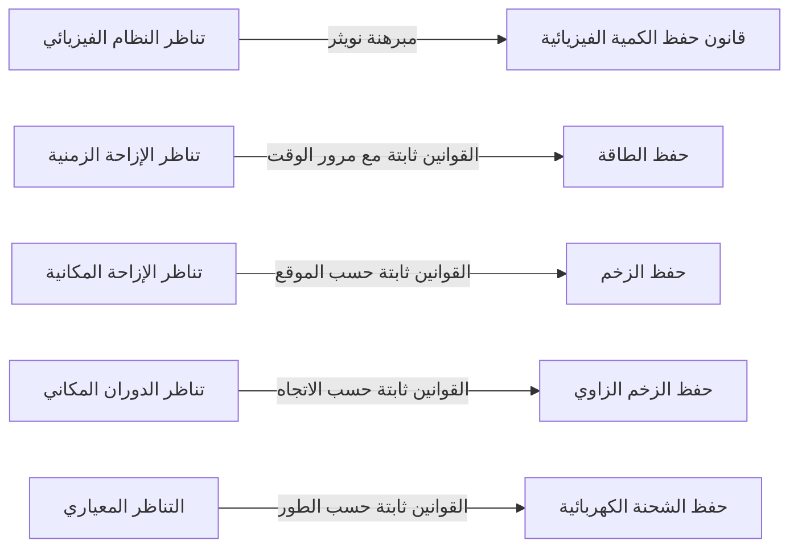
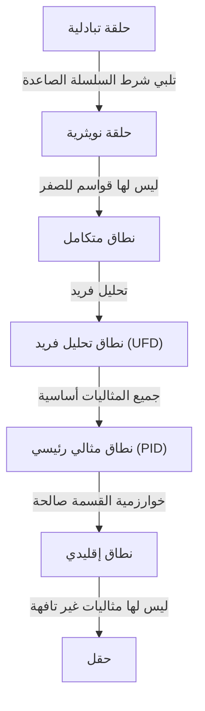

في تاريخ الرياضيات والفيزياء، يوجد عبقري قدم بعضًا من أهم المساهمات، ومع ذلك فإن اسمه ليس معروفًا على نطاق واسع لعامة الناس. هذا الشخص هو عالمة الرياضيات ألمانية المولد **إيمي نويثر** (1882-1935). غالبًا ما تُوصف بأنها "أم الجبر الحديث"، وقد غيرت مجال الجبر المجرد تمامًا. علاوة على ذلك، في الفيزياء، أثبتت **مبرهنة نويثر**، التي تربط بأناقة بين التناظر وقوانين الحفظ، مما وضع الأساس لنظرية النسبية العامة لأينشتاين وفيزياء الجسيمات الحديثة.

عند وفاتها، كتب ألبرت أينشتاين تأبينًا في صحيفة نيويورك تايمز جاء فيه: "في حكم أمهر علماء الرياضيات الأحياء، كانت الآنسة نويثر أهم عبقرية رياضية إبداعية ظهرت منذ بدء التعليم العالي للنساء." في هذا المقال، سوف نستكشف بدقة حياة إيمي نويثر، التي تغلبت على العديد من الصعوبات وحافظت على شغف نقي بالعلم، والإرث الهائل الذي تركته وراءها.

## 1. الحياة المبكرة والصعوبات الأولية

ولدت أمالي إيمي نويثر في 23 مارس 1882 في إرلانجن، بافاريا، ألمانيا. كان والدها، ماكس نويثر، أيضًا عالم رياضيات بارزًا قدم مساهمات كبيرة في الهندسة الجبرية. كانت عائلة نويثر من أصل يهودي، ونشأت هي في بيئة منزلية تقدر السعي الأكاديمي بشدة.

ومع ذلك، في المجتمع الألماني في ذلك الوقت، كان من الصعب للغاية على النساء متابعة الأوساط الأكاديمية. لم يُسمح للنساء بالتسجيل كطالبات نظاميات في الجامعات، وحتى حضور المحاضرات كمستمعات كان يتطلب إذنًا خاصًا من الأساتذة. تميزت إيمي الشابة في اللغات وحصلت في البداية على مؤهلات لتصبح معلمة للغة الفرنسية والإنجليزية، لكن قلبها أصبح مفتونًا بالرياضيات تدريجيًا.

في عام 1900، بدأت في حضور محاضرات الرياضيات في جامعة إرلانجن كمستمعة. من بين مئات الطلاب، لم يكن هناك سوى امرأتين، هي من ضمنهما. أظهرت موهبة رياضية استثنائية واجتازت امتحان التأهيل لدخول الجامعة (أبيتور) في نورمبرغ في عام 1903. بعد ذلك، درست كمستمعة في جامعة غوتينغن، حيث حضرت محاضرات لبعض أعظم علماء الرياضيات والفيزياء في ذلك العصر، مثل كارل شوارزشيلد، وهيرمان مينكوفسكي، وفيليكس كلاين، وديفيد هيلبرت.

## 2. الحصول على الدكتوراه والسنوات غير المجزية

في عام 1904، سمحت جامعة إرلانجن أخيرًا بالتسجيل النظامي للنساء، وسجلت نويثر على الفور في برنامج درجة الرياضيات. قدمت أبحاثها تحت إشراف بول جوردان، وهو مرجع في نظرية اللامتغيرات، وفي عام 1907 حصلت على درجة الدكتوراه مع مرتبة الشرف الأولى لأطروحتها بعنوان "حول الأنظمة الكاملة من اللامتغيرات للأشكال الثنائية التربيعية الثلاثية". في هذه الورقة، أظهرت قمة القوة الحسابية والصبر من خلال الحساب الشامل لـ 331 لامتغيرًا محددًا.

على الرغم من حصولها على الدكتوراه، لم يكن هناك منصب جامعي متاح لها لمجرد أنها امرأة. واصلت أبحاثها في جامعة إرلانجن بدون أجر، وكانت في بعض الأحيان تحل محل والدها المريض لإلقاء المحاضرات. خلال هذه الفترة، تحول أسلوب بحثها بشكل كبير من الأساليب البنائية التي تؤكد على الحسابات الملموسة، مثل أساليب جوردان، إلى الأساليب الأكثر تجريدية ومفاهيمية التي ابتكرها ديفيد هيلبرت. وتأثرت أيضًا بإرنست فيشر، فبدأت تفتح الباب أمام الجبر المجرد الحديث.

## 3. دعوة إلى غوتينغن و"مبرهنة نويثر"

في عام 1915، دعا ديفيد هيلبرت وفيليكس كلاين من جامعة غوتينغن نويثر إلى غوتينغن للمساعدة في حل المسائل الرياضية المتعلقة بحفظ الطاقة في نظرية النسبية العامة لألبرت أينشتاين. اعتُبرت معرفتها العميقة بنظرية اللامتغيرات لا غنى عنها.

ومع ذلك، واجه تعيينها المحتمل كعضو هيئة تدريس نظامي (محاضر خاص) معارضة شرسة من أساتذة في تخصصات أخرى داخل كلية الفلسفة، مرة أخرى لمجرد أنها كانت "امرأة". جادلوا قائلين: "ماذا سيفكر جنودنا عندما يعودون إلى الجامعة ويجدون أنهم مطالبون بالتعلم عند قدمي امرأة؟" وردًا على ذلك، قال هيلبرت مقولته الشهيرة:

> "لا أرى أن جنس المرشحة يمثل حجة ضد قبولها كمحاضر خاص. بعد كل شيء، نحن جامعة، ولسنا حمامًا عامًا."

في النهاية، وخلال سنواتها القليلة الأولى، أُجبرت على إلقاء المحاضرات تحت اسم هيلبرت بصفتها "مساعدة هيلبرت" بدون أجر. ومع ذلك، أنتجت أبحاثها إنجازًا هائلاً من شأنه أن يهز تاريخ الفيزياء. كان هذا هو **مبرهنة نويثر**، الذي نُشر في عام 1918.

### التعبير الرياضي لمبرهنة نويثر

أثبتت مبرهنة نويثر رياضيًا حقيقة عالمية للغاية: "إذا كان النظام الفيزيائي يتمتع بتناظر مستمر، فمن الضروري وجود قانون حفظ مقابل." لنأخذ في الاعتبار تكامل الفعل $S$ بناءً على لاغرانجيان $L$.

$$
S = \int_{t_1}^{t_2} L(q_i, \dot{q}_i, t) dt
$$

إذا كان النظام ثابتًا (متناظرًا) في ظل تحول مستمر متناهي الصغر معين، فإن تباين تكامل الفعل $\delta S$ يكون صفرًا.

$$
\delta S = 0 \quad \text{(شرط بسبب التناظر)}
$$

وفقًا لمبرهنة نويثر، توجد إذن كمية محفوظة $Q$ وتبقى ثابتة (محفوظة) بمرور الوقت.

$$
\frac{dQ}{dt} = 0
$$

التطبيقات المحددة في الفيزياء هي كما يلي:

بفضل هذه المبرهنة، لم يتمكن الفيزيائيون فقط من حساب الظواهر الفردية بشكل منفصل ولكنهم تمكنوا أيضًا من استنتاج قوانين الحفظ الأساسية من خلال اكتشاف "التناظرات الموجودة". النموذج القياسي لفيزياء الجسيمات الحديثة ونظرية المجال الكمي مبنيان بشكل أساسي على امتدادات لمبرهنة نويثر.

## 4. تأسيس الجبر المجرد وحلقات نويثر

بعد أن تركت بصمتها الرائدة في الفيزياء، أعادت نويثر تركيزها على الرياضيات، وتحديدًا **الجبر المجرد**. في عشرينيات القرن العشرين، أرست بمفردها أسس نظرية الحلقات ونظرية المثاليات التي يدرسها علماء الرياضيات المعاصرون.

تُعتبر ورقتها البحثية لعام 1921 "نظرية المثاليات في نطاقات الحلقات" (Idealtheorie in Ringbereichen) واحدة من أهم الأوراق البحثية في تاريخ الرياضيات. حيث صاغت فيها مفهوم "شرط السلسلة الصاعدة" (ACC).

### شرط السلسلة الصاعدة وتعريف حلقات نويثر

افترض أن سلسلة من المثاليات في حلقة $R$ لها علاقة التضمين التالية:

$$
I_1 \subseteq I_2 \subseteq I_3 \subseteq \cdots \subseteq I_n \subseteq \cdots
$$

إذا كان هناك عدد صحيح موجب $N$ بحيث أنه لجميع $n \ge N$،

$$
I_n = I_N \quad \text{(المثالي لم يعد ينمو أكثر)}
$$

صحيحًا، فإن هذه الحلقة $R$ تُسمى **حلقة نويثرية**.

باستخدام هذا الشرط البسيط والمجرد بشكل ملحوظ فقط، أثبتت نويثر ببراعة العديد من النظريات المعقدة في نظرية الأعداد والهندسة الجبرية (مثل التحلل الأولي للمثاليات عبر نظرية لاسكر-نويثر). أحدث أسلوبها في استخراج الخصائص المتأصلة للهياكل من أجل الإثباتات، بدلاً من الاعتماد على حسابات ملموسة، تحولاً جذريًا في الرياضيات.

تم تجميع هذا النهج لاحقًا في التحفة الفنية "الجبر الحديث" (Moderne Algebra) من قبل بي. إل. فان دير فيردين، والذي غيّر تعليم الرياضيات بالكامل في الجامعات حول العالم.

## 5. "أولاد نويثر" ووجهها الحقيقي كمعلمة

لم تكن نويثر مجرد باحثة متميزة فحسب، بل كانت أيضًا معلمة غير عادية. لم تكن محاضراتها تدور حول نسخ النظريات المكتملة على سبورة سوداء، بل كانت بالأحرى عملية ديناميكية للغاية لاستكشاف المشكلات التي لم يتم حلها في نقاش مع طلابها.

تجمع علماء الرياضيات الشباب اللامعون حولها باستمرار، وأصبحوا يُعرفون باسم **"أولاد نويثر"** (Noether-Knaben). تعلم العديد من المواهب الذين قادوا لاحقًا عالم الرياضيات، مثل ماكس ديورينج، وياكوب ليفيتسكي، وإميل أرتين، تحت توجيهها.

احترمت أفكار طلابها، وفي بعض الأحيان قدمت لهم بسخاء أفكارها غير المنشورة لنشرها بأسمائهم. غير مقيدة بالإجراءات الشكلية، أحبت الانخراط في نقاشات رياضية عاطفية أثناء المشي في شوارع غوتينغن أو تناول الكعك في مقهى. كانت شخصيتها الدافئة والسخية محبوبة ومحترمة للغاية من قبل العديد من طلابها.

## 6. صعود النازيين والمنفى إلى أمريكا

مع دخول الثلاثينيات من القرن العشرين، تقدمت أبحاث نويثر في الجبر غير التبادلي ونظرية التمثيل، ووصلت إلى آفاق أعلى. في عام 1932، ألقت كلمة عامة في المؤتمر الدولي لعلماء الرياضيات في زيورخ، وأصبحت شهرتها عالمية لا تتزعزع.

ومع ذلك، عندما استولى الحزب النازي بقيادة أدولف هتلر على السلطة في ألمانيا في عام 1933، تغير الوضع بشكل جذري. تم سن "قانون استعادة الخدمة المدنية المهنية"، مما أدى إلى الفصل الفوري لموظفي الخدمة المدنية وأعضاء هيئة التدريس بالجامعات من أصل يهودي. طُردت نويثر من جامعة غوتينغن وحُرمت من مكان بحثها.

بذل علماء من جميع أنحاء العالم، بما في ذلك هيرمان فايل وألبرت أينشتاين، جهودًا مضنية لإنقاذها. ونتيجة لذلك، حصلت على منصب كأستاذة زائرة في كلية برين ماور، وهي كلية نسائية في بنسلفانيا، الولايات المتحدة الأمريكية، وذهبت إلى المنفى. كما حاضرت في معهد الدراسات المتقدمة في برينستون، مما وفر إلهامًا هائلاً لعلماء الرياضيات الشباب في موطنها الجديد، أمريكا. في الولايات المتحدة، حصلت أخيرًا على التقدير الشرعي والاحترام الذي تستحقه كباحثة.

## 7. المأساة المفاجئة والإرث الأبدي

في أبريل 1935، وبينما كانت تبدأ حياة بحثية مرضية في أمريكا، خضعت نويثر لعملية جراحية لإزالة ورم في الحوض. بدت الجراحة ناجحة، لكنها أصيبت بمضاعفات بعد بضعة أيام وتوفيت في 14 أبريل عن عمر يناهز 53 عامًا. كانت وفاتها مفاجئة بشكل لا يُصدق وجلبت حزنًا عميقًا للمجتمع الأكاديمي العالمي.

دُفن رُفاتها تحت ممشى مكتبة كلية برين ماور.

علّق عالم الرياضيات نوربرت فينر عليها قائلاً: "الآنسة نويثر هي... أعظم عالمة رياضيات عاشت على الإطلاق؛ وأعظم عالمة من أي نوع تعيش الآن، وباحثة على الأقل في مستوى السيدة كوري."

تستمر مفاهيم الجبر المجرد التي ابتكرتها إيمي نويثر في التدفق في أسس التشفير، وعلوم الكمبيوتر، والهندسة الجبرية اليوم. علاوة على ذلك، تعيش مبرهنتها المتعلقة بالتناظر وقوانين الحفظ كلغة لا غنى عنها في الفيزياء المتطورة، مثل اكتشاف بوزون هيغز ودراسة الثقوب السوداء.

في مواجهة التمييز الجنسي، أحبت إيمي نويثر ببساطة الرياضيات بشكل نقي واستمرت في السعي وراء الحقيقة. تستمر روحها التي لا تُقهر وفكرها الساحق في منحنا إلهامًا لا نهائيًا عبر العصور.

---

*(كُتب هذا المقال لتكريم إنجازات إيمي نويثر، وهو موجه للمهتمين بتاريخ الرياضيات وأسس الفيزياء.)*
