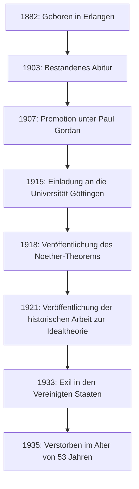
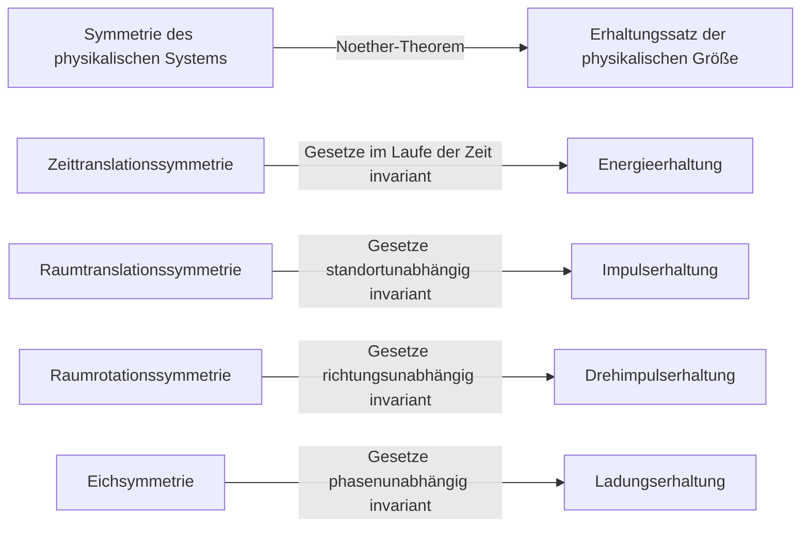
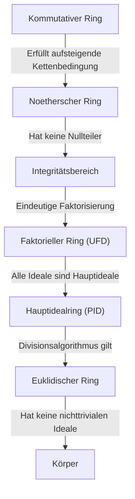

In der Geschichte der Mathematik und Physik gibt es ein Genie, das einige der wichtigsten Beiträge geleistet hat, dessen Name jedoch der breiten Öffentlichkeit nicht allgemein bekannt ist. Diese Person ist die in Deutschland geborene Mathematikerin **[Emmy Noether](https://kenji.blog/de/p/noether/)** (1882–1935). Sie wird oft als die "Mutter der modernen Algebra" bezeichnet und hat das Gebiet der abstrakten Algebra von Grund auf umgestaltet. Darüber hinaus bewies sie in der Physik das **Noether-Theorem**, das Symmetrie und Erhaltungssätze elegant miteinander verbindet und den Grundstein für Einsteins allgemeine Relativitätstheorie und die moderne Teilchenphysik legte.

Bei ihrem Tod verfasste Albert Einstein einen Nachruf in der New York Times: "Nach dem Urteil der kompetentesten lebenden Mathematiker war Fräulein Noether das bedeutendste kreative mathematische Genie, das bisher seit dem Beginn der Hochschulbildung von Frauen hervorgebracht wurde." In diesem Artikel werden wir das Leben von [Emmy Noether](https://kenji.blog/de/p/noether/), die zahlreiche Härten überwand und eine reine Leidenschaft für die Wissenschaft bewahrte, sowie das enorme Erbe, das sie hinterlassen hat, ausführlich beleuchten.

## 1. Frühes Leben und anfängliche Härten

Amalie [Emmy Noether](https://kenji.blog/de/p/noether/) wurde am 23. März 1882 im bayerischen Erlangen geboren. Ihr Vater, Max Noether, war ebenfalls ein prominenter Mathematiker, der bedeutende Beiträge zur algebraischen Geometrie leistete. Die Familie Noether war jüdischer Abstammung, und sie wuchs in einem häuslichen Umfeld auf, in dem akademisches Streben sehr geschätzt wurde.

In der damaligen deutschen Gesellschaft war es für Frauen jedoch äußerst schwierig, eine akademische Laufbahn einzuschlagen. Frauen durften sich nicht als reguläre Studentinnen an Universitäten einschreiben, und selbst der Besuch von Vorlesungen als Gasthörerin bedurfte einer besonderen Erlaubnis der Professoren. Die junge Emmy war sprachbegabt und erwarb zunächst die Qualifikationen zur Französisch- und Englischlehrerin, aber ihr Herz wurde allmählich von der Mathematik gefangen genommen.

Im Jahr 1900 begann sie als Gasthörerin mathematische Vorlesungen an der Universität Erlangen zu besuchen. Unter Hunderten von Studenten gab es außer ihr nur noch eine weitere Frau. Sie bewies außergewöhnliches mathematisches Talent und bestand 1903 in Nürnberg das Abitur. Anschließend studierte sie als Gasthörerin an der Universität Göttingen und besuchte Vorlesungen der größten Mathematiker und Physiker der Epoche wie Karl Schwarzschild, Hermann Minkowski, Felix Klein und [David Hilbert](https://kenji.blog/de/p/hilbert/).

## 2. Die Promotion und die unbelohnten Jahre

Im Jahr 1904 erlaubte die Universität Erlangen schließlich die reguläre Einschreibung von Frauen, und Noether schrieb sich sofort für den Studiengang Mathematik ein. Sie trieb ihre Forschung unter der Leitung von Paul Gordan, einer Autorität auf dem Gebiet der Invariantentheorie, voran und promovierte 1907 mit höchster Auszeichnung mit ihrer Dissertation zum Thema "Über die Bildung des Formensystems der ternären biquadratischen Form". In dieser Arbeit bewies sie den Gipfel an Rechenleistung und Geduld, indem sie 331 spezifische Invarianten vollständig berechnete.

Trotz der Promotion gab es an der Universität keine Stelle für sie, ganz einfach, weil sie eine Frau war. Sie setzte ihre Forschungen an der Universität Erlangen unbezahlt fort und vertrat gelegentlich ihren kranken Vater in Vorlesungen. In dieser Zeit wandelte sich ihr Forschungsstil erheblich von den konstruktiven Methoden Gordans, die konkrete Berechnungen betonten, zu den abstrakteren und konzeptionelleren Methoden, die von [David Hilbert](https://kenji.blog/de/p/hilbert/) geprägt wurden. Auch unter dem Einfluss von Ernst Fischer begann sie, die Tür zur modernen abstrakten Algebra zu öffnen.

## 3. Einladung nach Göttingen und das "Noether-Theorem"

1915 luden [David Hilbert](https://kenji.blog/de/p/hilbert/) und Felix Klein von der Universität Göttingen Noether nach Göttingen ein, um bei der Lösung mathematischer Probleme bezüglich der Energieerhaltung in Albert Einsteins allgemeiner Relativitätstheorie zu helfen. Ihr tiefes Wissen in der Invariantentheorie wurde als unverzichtbar erachtet.

Doch auch hier stieß ihre mögliche Ernennung zur regulären Dozentin (Privatdozentin) auf heftigen Widerstand von Professoren anderer Disziplinen der Philosophischen Fakultät, wiederum einfach deshalb, weil sie eine "Frau" war. Sie argumentierten: "Was werden unsere Soldaten denken, wenn sie an die Universität zurückkehren und feststellen, dass sie zu Füßen einer Frau lernen sollen?" Darauf soll Hilbert berühmt geantwortet haben:

> "Ich sehe nicht, dass das Geschlecht der Kandidatin ein Argument gegen ihre Zulassung als Privatdozentin ist. Schließlich sind wir eine Universität, keine Badeanstalt."

Letztendlich war sie in den ersten Jahren gezwungen, unbezahlt als "Hilberts Assistentin" unter Hilberts Namen Vorlesungen zu halten. Dennoch brachte ihre Forschung eine monumentale Leistung hervor, die die Geschichte der Physik erschüttern sollte. Dies war das 1918 veröffentlichte **Noether-Theorem**.

### Mathematischer Ausdruck des Noether-Theorems

Das Noether-Theorem hat eine höchst universelle Wahrheit mathematisch bewiesen: "Wenn ein physikalisches System eine kontinuierliche Symmetrie aufweist, gibt es zwangsläufig einen entsprechenden Erhaltungssatz." Betrachten wir das Wirkungsintegral $S$ basierend auf der Lagrange-Funktion $L$.

$$
S = \int_{t_1}^{t_2} L(q_i, \dot{q}_i, t) dt
$$

Wenn das System unter einer bestimmten infinitesimalen kontinuierlichen Transformation invariant (symmetrisch) ist, ist die Variation des Wirkungsintegrals $\delta S$ null.

$$
\delta S = 0 \quad \text{(Bedingung aus der Symmetrie)}
$$

Nach dem Noether-Theorem existiert dann eine Erhaltungsgröße $Q$, die im Laufe der Zeit invariant (erhalten) bleibt.

$$
\frac{dQ}{dt} = 0
$$

Die spezifischen Anwendungen in der Physik sind wie folgt:

Dank dieses Theorems konnten Physiker nicht nur einzelne Phänomene separat berechnen, sondern auch die zugrunde liegenden Erhaltungssätze ableiten, indem sie herausfanden, "welche Symmetrien existieren". Das Standardmodell der modernen Teilchenphysik und die Quantenfeldtheorie bauen im Wesentlichen auf Erweiterungen des Noether-Theorems auf.

## 4. Etablierung der abstrakten Algebra und Noethersche Ringe

Nachdem sie in der Physik bahnbrechende Spuren hinterlassen hatte, konzentrierte sich Noether wieder auf die Mathematik, insbesondere auf die **abstrakte Algebra**. In den 1920er Jahren legte sie im Alleingang die Grundlagen der Ringtheorie und der Idealtheorie, die von modernen Mathematikern studiert werden.

Ihre Arbeit "Idealtheorie in Ringbereichen" aus dem Jahr 1921 gilt als eine der wichtigsten Schriften in der Geschichte der Mathematik. Darin formulierte sie das Konzept der "aufsteigenden Kettenbedingung" (Ascending Chain Condition, ACC).

### Aufsteigende Kettenbedingung und die Definition Noetherscher Ringe

Angenommen, eine Folge von Idealen in einem Ring $R$ hat folgende Inklusionsbeziehung:

$$
I_1 \subseteq I_2 \subseteq I_3 \subseteq \cdots \subseteq I_n \subseteq \cdots
$$

Wenn es eine positive ganze Zahl $N$ gibt, so dass für alle $n \ge N$ gilt,

$$
I_n = I_N \quad \text{(Das Ideal wird nicht mehr echt größer)}
$$

dann wird dieser Ring $R$ als **Noetherscher Ring** bezeichnet.

Allein mit dieser bemerkenswert einfachen und abstrakten Bedingung bewies Noether auf brillante Weise zahlreiche komplexe Theoreme der Zahlentheorie und der algebraischen Geometrie (wie die Primärzerlegung von Idealen durch den Satz von Lasker-Noether). Ihre Methode, die inhärenten Eigenschaften von Strukturen für Beweise zu extrahieren, anstatt sich auf konkrete Berechnungen zu verlassen, löste in der Mathematik einen Paradigmenwechsel aus.

Dieser Ansatz wurde später in dem Meisterwerk "Moderne Algebra" von B.L. van der Waerden zusammengefasst, das die Mathematikausbildung an Universitäten weltweit völlig veränderte.

## 5. "Noether-Knaben" und ihr wahres Gesicht als Pädagogin

Noether war nicht nur eine herausragende Forscherin, sondern auch eine außergewöhnliche Pädagogin. Ihre Vorlesungen bestanden nicht darin, fertige Theorien an eine Tafel zu schreiben, sondern stellten einen äußerst dynamischen Prozess dar, in dem ungelöste Probleme im Gespräch mit ihren Studenten untersucht wurden.

Ständig scharten sich brillante junge Mathematiker um sie, die als **"Noether-Knaben"** bekannt wurden. Viele Talente, die später die mathematische Welt anführen sollten, wie Max Deuring, Jacob Levitzki und Emil Artin, lernten unter ihrer Anleitung.

Sie respektierte die Ideen ihrer Studenten und bot ihnen manchmal großzügig ihre eigenen, unveröffentlichten Ideen an, damit sie diese unter ihrem eigenen Namen veröffentlichen konnten. Ungebunden von Formalitäten liebte sie es, leidenschaftliche mathematische Diskussionen zu führen, während sie durch die Straßen von Göttingen spazierte oder Kuchen in einem Café aß. Ihre warme und großzügige Persönlichkeit wurde von vielen ihrer Studenten zutiefst geliebt und respektiert.

## 6. Der Aufstieg der Nazis und das Exil nach Amerika

Zu Beginn der 1930er Jahre entwickelte sich Noethers Forschung zur nichtkommutativen Algebra und Darstellungstheorie weiter und erreichte noch größere Höhen. 1932 hielt sie einen Plenarvortrag auf dem Internationalen Mathematikerkongress in Zürich, und ihr Ruhm wurde weltweit unerschütterlich.

Doch als die von Adolf Hitler geführte NSDAP 1933 in Deutschland die Macht ergriff, änderte sich die Situation drastisch. Das "Gesetz zur Wiederherstellung des Berufsbeamtentums" wurde erlassen, was zur sofortigen Entlassung von Beamten und Hochschullehrern jüdischer Abstammung führte. Noether wurde von der Universität Göttingen vertrieben und ihres Forschungsplatzes beraubt.

Wissenschaftler aus der ganzen Welt, darunter Hermann Weyl und Albert Einstein, bemühten sich intensiv, sie zu retten. Infolgedessen sicherte sie sich eine Stelle als Gastprofessorin am Bryn Mawr College, einer Frauenuniversität in Pennsylvania, USA, und ging ins Exil. Sie lehrte auch am Institute for Advanced Study in Princeton und gab jungen Mathematikern in ihrer neuen Heimat Amerika enorme Inspiration. In den Vereinigten Staaten erhielt sie endlich die verdiente Anerkennung und den Respekt als Forscherin.

## 7. Plötzliche Tragödie und ewiges Vermächtnis

Im April 1935, gerade als sie ein erfülltes Forschungsleben in Amerika begann, unterzog sich Noether einer Operation zur Entfernung eines Beckentumors. Die Operation schien erfolgreich zu sein, aber wenige Tage später traten Komplikationen auf, und sie verstarb am 14. April im jungen Alter von 53 Jahren. Ihr Tod kam unglaublich plötzlich und brachte der weltweiten akademischen Gemeinschaft tiefe Trauer.

Ihre sterblichen Überreste sind unter dem Kreuzgang der Bibliothek des Bryn Mawr College beigesetzt.

Der Mathematiker Norbert Wiener bemerkte über sie: "Fräulein Noether ist ... die größte Mathematikerin, die je gelebt hat; und die größte Wissenschaftlerin jeglicher Art, die derzeit lebt, und eine Gelehrte, die mindestens auf einer Stufe mit Madame Curie steht."

Die von [Emmy Noether](https://kenji.blog/de/p/noether/) begründeten Konzepte der abstrakten Algebra fließen weiterhin in die Grundlagen der heutigen Kryptographie, Informatik und algebraischen Geometrie ein. Darüber hinaus lebt ihr Theorem über Symmetrie und Erhaltungssätze als unverzichtbare Sprache in der Spitzenphysik weiter, wie etwa bei der Entdeckung des Higgs-Bosons und der Untersuchung von Schwarzen Löchern.

Trotz der Geschlechterdiskriminierung liebte [Emmy Noether](https://kenji.blog/de/p/noether/) einfach die Mathematik rein und verfolgte weiterhin die Wahrheit. Ihr unbezwingbarer Geist und ihr überwältigender Intellekt inspirieren uns über alle Zeitalter hinweg grenzenlos.

---

*(Dieser Artikel wurde geschrieben, um die Errungenschaften von [Emmy Noether](https://kenji.blog/de/p/noether/) zu ehren, und richtet sich an diejenigen, die sich für die Geschichte der Mathematik und die Grundlagen der Physik interessieren.)*
