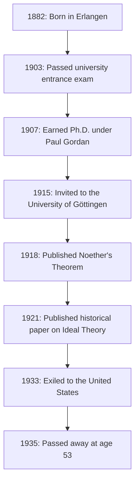
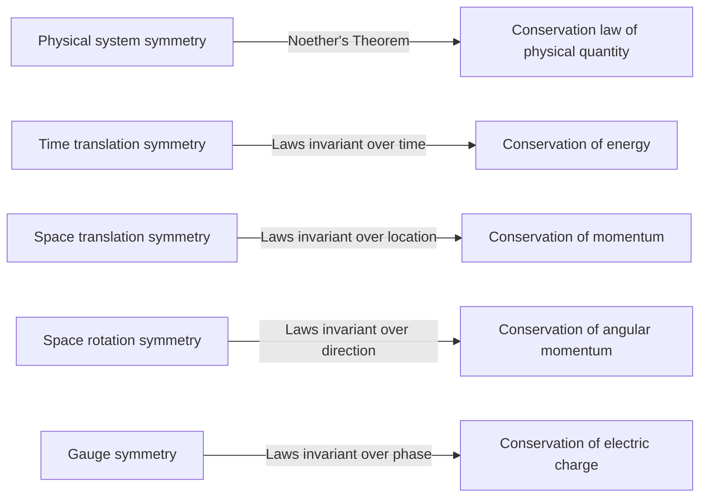
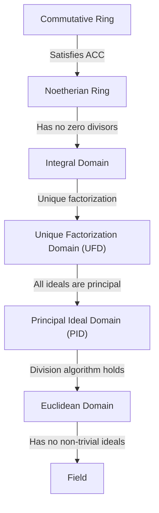

In the history of mathematics and physics, there exists a genius who made some of the most significant contributions, yet whose name is not widely known to the general public. That person is the German-born mathematician **[Emmy Noether](https://kenji.blog/en/p/noether/)** (1882–1935). Often hailed as the "Mother of Modern Algebra," she completely transformed the field of abstract algebra. Furthermore, in physics, she proved **Noether's Theorem**, which elegantly connects symmetry with conservation laws, laying the foundation for Einstein's general theory of relativity and modern particle physics.

Upon her death, Albert Einstein wrote a tribute in The New York Times stating: "In the judgment of the most competent living mathematicians, Fräulein Noether was the most significant creative mathematical genius thus far produced since the higher education of women began." In this article, we will thoroughly explore the life of [Emmy Noether](https://kenji.blog/en/p/noether/), who overcame numerous hardships and maintained a pure passion for scholarship, and the tremendous legacy she left behind.

## 1. Early Life and Initial Hardships

Amalie [Emmy Noether](https://kenji.blog/en/p/noether/) was born on March 23, 1882, in Erlangen, Bavaria, Germany. Her father, Max Noether, was also a prominent mathematician who made significant contributions to algebraic geometry. The Noether family was of Jewish descent, and she grew up in a home environment that highly valued academic pursuit.

However, in German society at the time, it was extremely difficult for women to pursue academia. Women were not permitted to enroll as regular students in universities, and even auditing lectures required special permission from the professors. Young Emmy excelled in languages and initially obtained qualifications to become a French and English teacher, but her heart gradually became captivated by mathematics.

In 1900, she began taking mathematics lectures at the University of Erlangen as an auditor. Among hundreds of students, there were only two women, including herself. She demonstrated exceptional mathematical talent and passed the university entrance qualification exam (Abitur) in Nuremberg in 1903. Subsequently, she studied as an auditor at the University of Göttingen, attending lectures by some of the greatest mathematicians and physicists of the era, such as Karl Schwarzschild, Hermann Minkowski, Felix Klein, and [David Hilbert](https://kenji.blog/en/p/hilbert/).

## 2. Earning Her Ph.D. and the Unrewarded Years

In 1904, the University of Erlangen finally permitted the regular enrollment of women, and Noether immediately registered for the mathematics degree program. She advanced her research under the guidance of Paul Gordan, an authority on invariant theory, and in 1907 she earned her Ph.D. with highest honors for her dissertation titled "On Complete Systems of Invariants for Ternary Biquadratic Forms." In this paper, she demonstrated the pinnacle of computational power and patience by exhaustively calculating 331 specific invariants.

Despite earning her doctorate, there was no university position available for her simply because she was a woman. She continued her research at the University of Erlangen without pay, sometimes substituting for her sickly father to give lectures. During this period, her research style shifted significantly from the constructive methods emphasizing concrete calculations, like Gordan's, to the more abstract and conceptual methods pioneered by [David Hilbert](https://kenji.blog/en/p/hilbert/). Influenced also by Ernst Fischer, she began to open the door to modern abstract algebra.

## 3. Invitation to Göttingen and "Noether's Theorem"

In 1915, [David Hilbert](https://kenji.blog/en/p/hilbert/) and Felix Klein of the University of Göttingen invited Noether to Göttingen to help resolve mathematical problems concerning the conservation of energy in Albert Einstein's general theory of relativity. Her deep knowledge of invariant theory was considered indispensable.

However, her potential appointment as a regular faculty member (Privatdozent) was met with fierce opposition from professors in other disciplines within the Faculty of Philosophy, again simply because she was a "woman." They argued, "What will our soldiers think when they return to the university and find that they are required to learn at the feet of a woman?" To this, [Hilbert](https://kenji.blog/en/p/hilbert/) famously retorted:

> "I do not see that the sex of the candidate is an argument against her admission as Privatdozent. After all, we are a university, not a bathhouse."

Ultimately, for her first few years, she was forced to lecture under [Hilbert](https://kenji.blog/en/p/hilbert/)'s name as "[Hilbert](https://kenji.blog/en/p/hilbert/)'s assistant" without pay. Yet, her research produced a monumental achievement that would shake the history of physics. This was **Noether's Theorem**, published in 1918.

### Mathematical Expression of Noether's Theorem

Noether's Theorem mathematically proved a highly universal truth: "If a physical system has a continuous symmetry, there is necessarily a corresponding conservation law." Consider the action integral $S$ based on the Lagrangian $L$.

$$
S = \int_{t_1}^{t_2} L(q_i, \dot{q}_i, t) dt
$$

If the system is invariant (symmetric) under a certain infinitesimal continuous transformation, the variation of the action integral $\delta S$ is zero.

$$
\delta S = 0 \quad \text{(Condition from symmetry)}
$$

According to Noether's Theorem, a conserved quantity $Q$ then exists and remains invariant (conserved) over time.

$$
\frac{dQ}{dt} = 0
$$

The specific applications to physics are as follows:

Thanks to this theorem, physicists could not only calculate individual phenomena separately but also deduce the underlying conservation laws by finding "what symmetries exist." The Standard Model of modern particle physics and quantum field theory are essentially built upon extensions of Noether's Theorem.

## 4. Establishment of Abstract Algebra and Noetherian Rings

After leaving her groundbreaking mark in physics, Noether refocused on mathematics, specifically **abstract algebra**. In the 1920s, she single-handedly laid the foundations of ring theory and ideal theory studied by modern mathematicians.

Her 1921 paper "Ideal Theory in Ring Domains" (Idealtheorie in Ringbereichen) is considered one of the most important papers in the history of mathematics. In it, she formulated the concept of the "Ascending Chain Condition" (ACC).

### Ascending Chain Condition and the Definition of Noetherian Rings

Suppose a sequence of ideals in a ring $R$ has the following inclusion relation:

$$
I_1 \subseteq I_2 \subseteq I_3 \subseteq \cdots \subseteq I_n \subseteq \cdots
$$

If there exists a positive integer $N$ such that for all $n \ge N$,

$$
I_n = I_N \quad \text{(The ideal grows no larger)}
$$

holds true, then this ring $R$ is called a **Noetherian ring**.

Using only this remarkably simple and abstract condition, Noether brilliantly proved numerous complex theorems in number theory and algebraic geometry (such as the primary decomposition of ideals via the Lasker-Noether theorem). Her method of extracting the inherent properties of structures for proofs, rather than relying on concrete calculations, triggered a paradigm shift in mathematics.

This approach was later compiled into the masterpiece "Modern Algebra" (Moderne Algebra) by B.L. van der Waerden, which completely transformed mathematics education in universities worldwide.

## 5. "Noether's Boys" and Her True Face as an Educator

Noether was not only an outstanding researcher but also an extraordinary educator. Her lectures were not about copying completed theories onto a blackboard, but rather a highly dynamic process of exploring unsolved problems in discussion with her students.

Brilliant young mathematicians constantly gathered around her, and they became known as **"Noether's Boys"** (Noether-Knaben). Many talents who would later lead the mathematical world, such as Max Deuring, Jacob Levitzki, and Emil Artin, learned under her guidance.

She respected her students' ideas, sometimes generously offering them her own unpublished ideas to publish under their names. Unbound by formality, she loved engaging in passionate mathematical discussions while walking the streets of Göttingen or eating cake in a café. Her warm and generous personality was deeply beloved and respected by many of her students.

## 6. The Rise of the Nazis and Exile to America

Entering the 1930s, Noether's research progressed into non-commutative algebra and representation theory, reaching even greater heights. In 1932, she gave a plenary address at the International Congress of Mathematicians in Zurich, and her fame became globally unshakable.

However, when the Nazi Party led by Adolf Hitler seized power in Germany in 1933, the situation changed drastically. The "Law for the Restoration of the Professional Civil [Service](https://kenji.blog/en/p/kubernetes-k8s-architecture-pod-service-ingress/)" was enacted, leading to the immediate dismissal of civil servants and university faculty of Jewish descent. Noether was expelled from the University of Göttingen and deprived of her place of research.

Scientists from all over the world, including Hermann Weyl and Albert Einstein, made strenuous efforts to save her. As a result, she secured a position as a visiting professor at Bryn Mawr College, a women's college in Pennsylvania, USA, and went into exile. She also lectured at the Institute for Advanced Study in Princeton, providing tremendous inspiration to young mathematicians in her new home, America. In the United States, she finally received the rightful recognition and respect she deserved as a female researcher.

## 7. Sudden Tragedy and Eternal Legacy

In April 1935, just as she was starting a fulfilling research life in America, Noether underwent surgery to remove a pelvic tumor. The surgery appeared successful, but she developed complications a few days later and passed away on April 14 at the young age of 53. Her death was incredibly sudden and brought deep sorrow to the global academic community.

Her remains are buried under the walkway of the library at Bryn Mawr College.

Mathematician Norbert Wiener remarked on her: "Miss Noether is... the greatest woman mathematician who has ever lived; and the greatest woman scientist of any sort now living, and a scholar at least on the plane of Madame Curie."

The concepts of abstract algebra pioneered by [Emmy Noether](https://kenji.blog/en/p/noether/) continue to flow at the foundations of today's cryptography, computer science, and algebraic geometry. Furthermore, her theorem regarding symmetry and conservation laws lives on as an indispensable language in cutting-edge physics, such as the discovery of the Higgs boson and the study of black holes.

Facing gender discrimination, [Emmy Noether](https://kenji.blog/en/p/noether/) simply loved mathematics purely and continued to pursue the truth. Her indomitable spirit and overwhelming intellect continue to give us infinite inspiration across the ages.

---

*(This article was written to honor the achievements of [Emmy Noether](https://kenji.blog/en/p/noether/), aimed at those interested in the history of mathematics and the foundations of physics.)*
