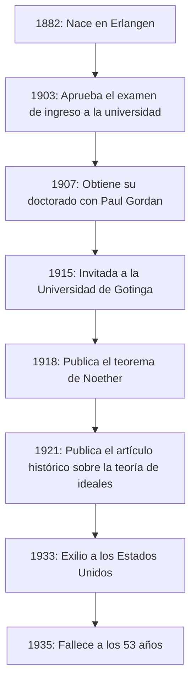
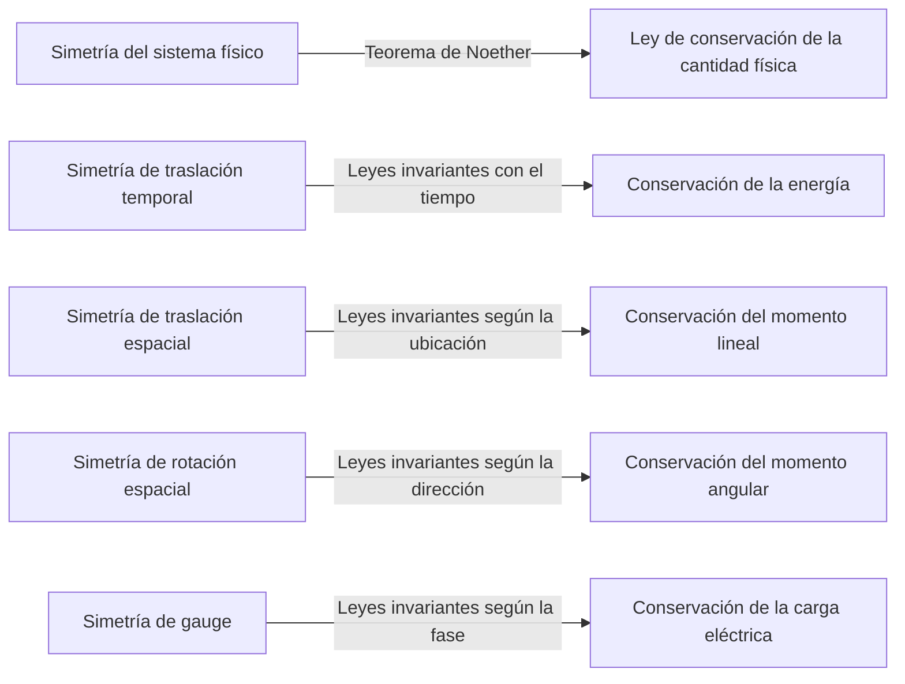
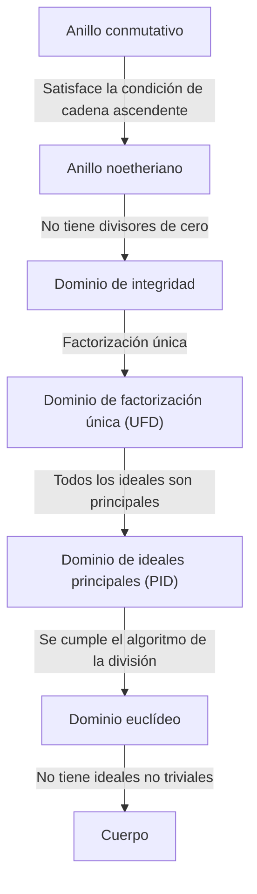

En la historia de las matemáticas y la física, existe una genio que hizo algunas de las contribuciones más significativas, pero cuyo nombre no es ampliamente conocido por el público en general. Esa persona es la matemática de origen alemán **Emmy Noether** (1882–1935). A menudo aclamada como la "Madre del álgebra moderna", transformó por completo el campo del álgebra abstracta. Además, en física, demostró el **teorema de Noether**, que conecta elegantemente la simetría con las leyes de conservación, sentando las bases para la teoría de la relatividad general de Einstein y la física de partículas moderna.

Tras su muerte, Albert Einstein escribió un tributo en The New York Times afirmando: "A juicio de los matemáticos vivos más competentes, la señorita Noether fue la genio matemática creativa más importante que se haya producido hasta ahora desde que comenzó la educación superior de las mujeres". En este artículo, exploraremos a fondo la vida de Emmy Noether, quien superó numerosas dificultades y mantuvo una pasión pura por el conocimiento, y el tremendo legado que dejó.

## 1. Primeros años y dificultades iniciales

Amalie Emmy Noether nació el 23 de marzo de 1882 en Erlangen, Baviera, Alemania. Su padre, Max Noether, también fue un destacado matemático que hizo importantes contribuciones a la geometría algebraica. La familia Noether era de ascendencia judía, y ella creció en un ambiente familiar que valoraba mucho la búsqueda académica.

Sin embargo, en la sociedad alemana de la época, era extremadamente difícil para las mujeres seguir una carrera académica. A las mujeres no se les permitía inscribirse como estudiantes regulares en las universidades, e incluso asistir a conferencias como oyentes requería un permiso especial de los profesores. La joven Emmy se destacaba en los idiomas e inicialmente obtuvo calificaciones para convertirse en profesora de francés e inglés, pero su corazón quedó gradualmente cautivado por las matemáticas.

En 1900, comenzó a tomar clases de matemáticas en la Universidad de Erlangen como oyente. Entre cientos de estudiantes, solo había dos mujeres, incluida ella. Demostró un talento matemático excepcional y aprobó el examen de calificación de ingreso a la universidad (Abitur) en Núremberg en 1903. Posteriormente, estudió como oyente en la Universidad de Gotinga, asistiendo a las conferencias de algunos de los más grandes matemáticos y físicos de la época, como Karl Schwarzschild, Hermann Minkowski, Felix Klein y David Hilbert.

## 2. La obtención de su doctorado y los años sin recompensa

En 1904, la Universidad de Erlangen finalmente permitió la inscripción regular de mujeres, y Noether se inscribió de inmediato en el programa de grado en matemáticas. Avanzó en su investigación bajo la dirección de Paul Gordan, una autoridad en la teoría de invariantes, y en 1907 obtuvo su doctorado (Ph.D.) con los más altos honores por su disertación titulada "Sobre los sistemas completos de invariantes para formas bicuadráticas ternarias". En este artículo, demostró el pináculo del poder de cálculo y la paciencia calculando exhaustivamente 331 invariantes específicos.

A pesar de haber obtenido su doctorado, no había ningún puesto universitario disponible para ella simplemente porque era mujer. Continuó su investigación en la Universidad de Erlangen sin recibir pago, a veces sustituyendo a su padre enfermo para dar clases. Durante este período, su estilo de investigación cambió significativamente de los métodos constructivos que enfatizaban los cálculos concretos, como los de Gordan, a los métodos más abstractos y conceptuales iniciados por David Hilbert. Influenciada también por Ernst Fischer, comenzó a abrir la puerta al álgebra abstracta moderna.

## 3. Invitación a Gotinga y el "Teorema de Noether"

En 1915, David Hilbert y Felix Klein de la Universidad de Gotinga invitaron a Noether a Gotinga para ayudar a resolver problemas matemáticos relacionados con la conservación de la energía en la teoría de la relatividad general de Albert Einstein. Su profundo conocimiento de la teoría de invariantes se consideraba indispensable.

Sin embargo, su posible nombramiento como miembro regular de la facultad (Privatdozent) se encontró con una feroz oposición por parte de profesores de otras disciplinas dentro de la Facultad de Filosofía, de nuevo simplemente porque era una "mujer". Argumentaban: "¿Qué pensarán nuestros soldados cuando regresen a la universidad y descubran que deben aprender a los pies de una mujer?" A esto, Hilbert replicó famosamente:

> "No veo que el sexo de la candidata sea un argumento en contra de su admisión como Privatdozent. Después de todo, somos una universidad, no una casa de baños públicos".

En última instancia, durante sus primeros años, se vio obligada a dar clases bajo el nombre de Hilbert como "asistente de Hilbert" sin sueldo. Sin embargo, su investigación produjo un logro monumental que sacudiría la historia de la física. Este fue el **teorema de Noether**, publicado en 1918.

### Expresión matemática del teorema de Noether

El teorema de Noether demostró matemáticamente una verdad muy universal: "Si un sistema físico tiene una simetría continua, necesariamente existe una ley de conservación correspondiente". Consideremos la integral de acción $S$ basada en el lagrangiano $L$.

$$
S = \int_{t_1}^{t_2} L(q_i, \dot{q}_i, t) dt
$$

Si el sistema es invariante (simétrico) bajo una cierta transformación continua infinitesimal, la variación de la integral de acción $\delta S$ es cero.

$$
\delta S = 0 \quad \text{(Condición debida a la simetría)}
$$

Según el teorema de Noether, entonces existe una cantidad conservada $Q$ y permanece invariante (conservada) a lo largo del tiempo.

$$
\frac{dQ}{dt} = 0
$$

Las aplicaciones específicas a la física son las siguientes:

Gracias a este teorema, los físicos no solo podían calcular fenómenos individuales por separado, sino también deducir las leyes de conservación subyacentes al encontrar "qué simetrías existen". El Modelo Estándar de la física de partículas moderna y la teoría cuántica de campos se basan esencialmente en extensiones del teorema de Noether.

## 4. Establecimiento del álgebra abstracta y anillos noetherianos

Después de dejar su marca pionera en la física, Noether volvió a centrarse en las matemáticas, específicamente en el **álgebra abstracta**. En la década de 1920, sentó por sí sola las bases de la teoría de anillos y la teoría de ideales que estudian los matemáticos modernos.

Su artículo de 1921 "Teoría de ideales en dominios de anillos" (Idealtheorie in Ringbereichen) se considera uno de los artículos más importantes en la historia de las matemáticas. En él, formuló el concepto de "Condición de cadena ascendente" (ACC).

### Condición de cadena ascendente y definición de anillos noetherianos

Supongamos que una secuencia de ideales en un anillo $R$ tiene la siguiente relación de inclusión:

$$
I_1 \subseteq I_2 \subseteq I_3 \subseteq \cdots \subseteq I_n \subseteq \cdots
$$

Si existe un entero positivo $N$ tal que para todo $n \ge N$,

$$
I_n = I_N \quad \text{(El ideal ya no crece)}
$$

se cumple, entonces este anillo $R$ se llama **anillo noetheriano**.

Utilizando solo esta condición notablemente simple y abstracta, Noether demostró brillantemente numerosos teoremas complejos en teoría de números y geometría algebraica (como la descomposición primaria de ideales a través del teorema de Lasker-Noether). Su método de extraer las propiedades inherentes de las estructuras para las demostraciones, en lugar de depender de cálculos concretos, desencadenó un cambio de paradigma en las matemáticas.

Este enfoque fue posteriormente compilado en la obra maestra "Álgebra moderna" (Moderne Algebra) por B.L. van der Waerden, que transformó por completo la educación matemática en universidades de todo el mundo.

## 5. Los "chicos de Noether" y su verdadera cara como educadora

Noether no solo fue una investigadora destacada, sino también una educadora extraordinaria. Sus clases no consistían en copiar teorías terminadas en una pizarra, sino más bien en un proceso altamente dinámico de exploración de problemas no resueltos en discusión con sus estudiantes.

Jóvenes matemáticos brillantes se reunían constantemente a su alrededor, y se hicieron conocidos como **"los chicos de Noether"** (Noether-Knaben). Muchos talentos que más tarde liderarían el mundo matemático, como Max Deuring, Jacob Levitzki y Emil Artin, aprendieron bajo su guía.

Respetaba las ideas de sus estudiantes, a veces ofreciéndoles generosamente sus propias ideas inéditas para que las publicaran con sus nombres. Sin ataduras a las formalidades, le encantaba participar en apasionados debates matemáticos mientras paseaba por las calles de Gotinga o comía pasteles en un café. Su personalidad cálida y generosa era profundamente amada y respetada por muchos de sus estudiantes.

## 6. El ascenso de los nazis y el exilio a América

Al entrar en la década de 1930, la investigación de Noether progresó hacia el álgebra no conmutativa y la teoría de representaciones, alcanzando cotas aún mayores. En 1932, pronunció un discurso plenario en el Congreso Internacional de Matemáticos en Zúrich, y su fama se volvió inquebrantable a nivel mundial.

Sin embargo, cuando el Partido Nazi liderado por Adolf Hitler tomó el poder en Alemania en 1933, la situación cambió drásticamente. Se promulgó la "Ley para la Restauración de la Función Pública Profesional", lo que llevó al despido inmediato de funcionarios y profesores universitarios de ascendencia judía. Noether fue expulsada de la Universidad de Gotinga y privada de su lugar de investigación.

Científicos de todo el mundo, incluidos Hermann Weyl y Albert Einstein, hicieron grandes esfuerzos para salvarla. Como resultado, consiguió un puesto como profesora visitante en el Bryn Mawr College, una universidad para mujeres en Pensilvania, EE. UU., y se exilió. También dio clases en el Instituto de Estudios Avanzados de Princeton, proporcionando una tremenda inspiración a los jóvenes matemáticos en su nuevo hogar, Estados Unidos. En los Estados Unidos, finalmente recibió el reconocimiento y el respeto legítimos que merecía como investigadora.

## 7. Tragedia repentina y legado eterno

En abril de 1935, justo cuando comenzaba una vida de investigación satisfactoria en Estados Unidos, Noether se sometió a una cirugía para extirpar un tumor pélvico. La cirugía pareció exitosa, pero desarrolló complicaciones unos días después y falleció el 14 de abril a la temprana edad de 53 años. Su muerte fue increíblemente repentina y trajo un profundo pesar a la comunidad académica mundial.

Sus restos están enterrados bajo el pasillo de la biblioteca en el Bryn Mawr College.

El matemático Norbert Wiener comentó sobre ella: "La señorita Noether es... la matemática más grande que jamás haya existido; y la mujer científica más grande de cualquier tipo que vive ahora, y una erudita al menos en el plano de Madame Curie".

Los conceptos de álgebra abstracta iniciados por Emmy Noether continúan fluyendo en los cimientos de la criptografía actual, la informática y la geometría algebraica. Además, su teorema sobre la simetría y las leyes de conservación perdura como un lenguaje indispensable en la física de vanguardia, como el descubrimiento del bosón de Higgs y el estudio de los agujeros negros.

Frente a la discriminación de género, Emmy Noether simplemente amaba las matemáticas de manera pura y continuó buscando la verdad. Su espíritu indomable y su abrumador intelecto continúan brindándonos una inspiración infinita a través de los tiempos.

---

*(Este artículo fue escrito para honrar los logros de Emmy Noether, dirigido a aquellos interesados en la historia de las matemáticas y los fundamentos de la física).*
